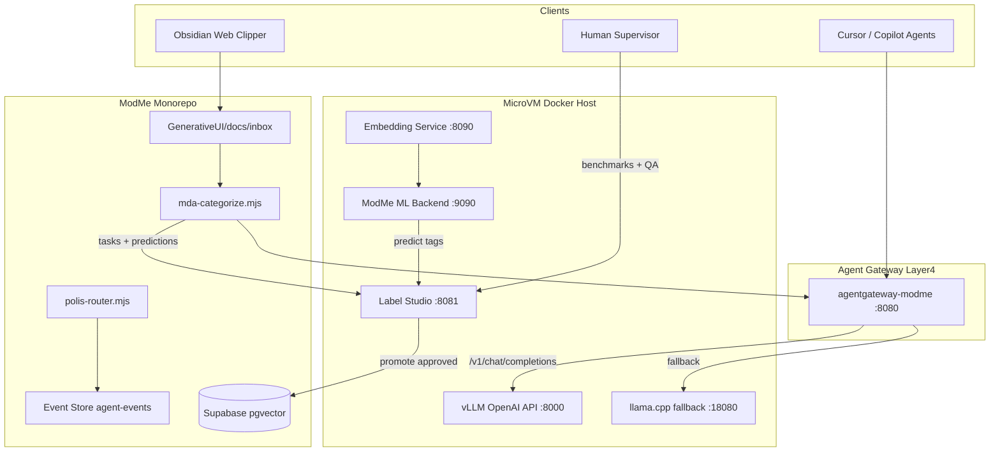

# Agent Gateway + vLLM + Label Studio Full Loop

> **For agentic workers:** REQUIRED SUB-SKILL: Use superpowers:subagent-driven-development (recommended) or superpowers:executing-plans to implement task-by-task. Steps use checkbox syntax.

**Goal:** Serve `yuxinlu1/gemma-4-12B-agentic-fable5-composer2.5-v2-3.5x-tau2-GGUF` via **vLLM** in a **MicroVM Docker** host, expose an OpenAI-compatible endpoint through **Agent Gateway** (resource/network/buffering), and run a **fully agent-driven** Inbox→Label Studio→Knowledge promotion loop where humans supervise benchmarks and outcomes.

**Architecture:** Layer 4 Agent Gateway ([ADR-0012](docs/architecture/decisions/0012-agent-gateway-mcp-routing.md)) terminates LLM/MCP traffic; vLLM runs inside an isolated MicroVM with GPU passthrough. Obsidian Web Clipper + existing inbox pipeline feed Label Studio as the **visualization/control plane**; ML backends and embedding models auto-predict tags; human operators review dashboards and benchmark scores. Terminal orchestration gains event-sourced task registry + polis-router promotion, aligned with Gas City supervisor patterns and Hydra-style CI gates.

**Tech Stack:** vLLM (+ `vllm-gguf-plugin`), llama.cpp (fallback), Agent Gateway (`Ditto190/agentgateway-modme`), Label Studio + ML Backend SDK, Supabase pgvector, `mda-categorize.mjs`, Obsidian MCP/REST, devbox/direnv/mise, beads, polis-router, mprocs.

---

## Critical constraints (from research)

| Constraint                                | Implication                                                                                                                                                                     |
| ----------------------------------------- | ------------------------------------------------------------------------------------------------------------------------------------------------------------------------------- |
| Target model is **GGUF**                  | vLLM requires `vllm-gguf-plugin` + base tokenizer `google/gemma-4-12B-it` ([vLLM GGUF docs](https://github.com/vllm-project/vllm/blob/main/docs/features/quantization/gguf.md)) |
| Gemma4 tool-use needs `--jinja` + rep_pen | Gateway must preserve OpenAI `tools` field; document sampling: `temp 1.0`, `rep_pen 1.1`, `top_p 0.95`, `top_k 64` (model README)                                               |
| **Port 8080 collision**                   | Label Studio default `:8080` conflicts with [routes.example.yaml](config/agentgateway/routes.example.yaml) — reassign: Gateway `:8080`, Label Studio `:8081`, vLLM `:8000`      |
| ADR-0012 Phase 1 = stub only              | This plan extends to Phase 2 deploy in MicroVM; keep lean-ctx direct for repo I/O                                                                                               |
| `polis-router.mjs`                       | Already at root `scripts/lib/polis-router.mjs` — add citizen card only (do not re-promote)                                                                              |
| Task registry is mutable JSON             | Event-sourcing refactor required per your orchestration goals                                                                                                                   |

**Recommended quant:** `gemma4-v2-Q4_K_M.gguf` (7.4 GB) — minimum ~8 GB VRAM in MicroVM.

---

## System diagram



---

## Deliverable documents (create before code)

### Spec (spec-driven-development)

Save to `[docs/specs/2026-07-12-agent-gateway-llm-label-studio.spec.md](docs/specs/2026-07-12-agent-gateway-llm-label-studio.spec.md)`:

- **Objective:** End-to-end agent-driven knowledge intake with human-supervised benchmarks
- **Commands:** `hf download`, `vllm serve`, `devbox run`, `yarn intake:orchestrate`, Label Studio SDK calls
- **Boundaries:** Never commit HF tokens; never proxy lean-ctx through gateway Phase 1; human approves promotion to knowledge graph
- **Success criteria:** Clip → auto-tag → LS task visible → prediction score ≥ threshold → promote → Supabase row with tags

### ADRs (documentation-and-adrs)

| ADR                                                                                               | Status          | Purpose                                                                                                        |
| ------------------------------------------------------------------------------------------------- | --------------- | -------------------------------------------------------------------------------------------------------------- |
| **ADR-0016** `docs/adr/0016-vllm-microvm-agent-gateway.md`                                           | Proposed        | vLLM primary, llama.cpp fallback, MicroVM Docker topology, gateway buffering/resource policies                 |
| **ADR-0017** `docs/adr/0017-label-studio-ai-annotation-loop.md`                                      | Accepted        | Option C full loop; LS as visualization; agent+embedding driven; human supervises                              |
| **TODO-0018** `docs/adr/TODO-0018-obsidian-first-auto-tagging-option-a.md`                           | TODO / Deferred | Option A deferred; beads `modme-55b`; extend existing unique-note pack                                         |

### Implementation plan (writing-plans)

Save full task breakdown to `[docs/superpowers/plans/2026-07-12-agent-gateway-llm-label-studio.md](docs/superpowers/plans/2026-07-12-agent-gateway-llm-label-studio.md)` (this document expanded with step-level code).

### README update

Add section to `[docs/codebase/STACK.md](docs/codebase/STACK.md)` or new `[docs/local-llm/vllm-microvm.md](docs/local-llm/vllm-microvm.md)`:

- Model ID, quant table, vLLM serve command, gateway route, llama.cpp fallback one-liner
- MicroVM prerequisites (GPU passthrough, Docker, network isolation)
- HF CLI: `hf download yuxinlu1/gemma-4-12B-agentic-fable5-composer2.5-v2-3.5x-tau2-GGUF --include "gemma4-v2-Q4_K_M.gguf"`

---

## Stream A: vLLM + MicroVM Docker + Agent Gateway

### Files to create/modify

- Create: `[config/vllm/docker-compose.microvm.yml](config/vllm/docker-compose.microvm.yml)`
- Create: `[config/vllm/serve-gemma4.sh](config/vllm/serve-gemma4.sh)`
- Create: `[config/vllm/llama-cpp-fallback.sh](config/vllm/llama-cpp-fallback.sh)` (installed, documented, not primary)
- Modify: `[config/agentgateway/routes.example.yaml](config/agentgateway/routes.example.yaml)` — add `local-llm` route
- Create: `[config/agentgateway/policies/resource-management.yaml](config/agentgateway/policies/resource-management.yaml)` — max_parallel, token budget, queue depth, timeout buffering

### vLLM serve command (primary)

```bash
# Inside MicroVM Docker (GPU passthrough)
pip install vllm vllm-gguf-plugin
hf download yuxinlu1/gemma-4-12B-agentic-fable5-composer2.5-v2-3.5x-tau2-GGUF \
  --include "gemma4-v2-Q4_K_M.gguf" --local-dir /models/gemma4-v2

vllm serve /models/gemma4-v2/gemma4-v2-Q4_K_M.gguf \
  --tokenizer google/gemma-4-12B-it \
  --host 0.0.0.0 --port 8000 \
  --max-model-len 16384 \
  --enable-auto-tool-choice \
  --tool-call-parser hermes \
  --gpu-memory-utilization 0.90
```

> **Note:** Gemma4 tool parser may need validation against vLLM version; fallback to `--chat-template` jinja from model card if parser mismatch. Track in ADR-0013.

### Agent Gateway route addition

```yaml
- name: local-llm-gemma4
  match:
    path_prefix: /v1
    header: x-modme-gateway-namespace
    value: local-llm
  upstream:
    openai_compatible: http://vllm:8000/v1
  policies:
    max_inflight: 4 # aligns with max_parallel_agents
    queue_depth: 32 # buffering
    request_timeout_ms: 120000
    rate_limit_rpm: 60
```

### llama.cpp fallback (installed, secondary)

Include in same compose profile `fallback`:

```bash
llama-server -m /models/gemma4-v2/gemma4-v2-Q4_K_M.gguf \
  --ctx-size 16384 --n-gpu-layers 99 --jinja \
  --temp 1.0 --host 0.0.0.0 --port 18080
```

Gateway health-check fails over to `:18080` when vLLM unhealthy.

---

## Stream B: Label Studio full AI loop (Option C)

### Pipeline stages

1. **Capture** — Obsidian clipper templates (`[templates/obsidian-clipper/agent-gateway-research.json](templates/obsidian-clipper/agent-gateway-research.json)`) + new `inbox-annotation.json` template with Interpreter prompt variables for structured JSON tags
2. **Embed + auto-tag** — existing `[scripts/mda-categorize.mjs](scripts/mda-categorize.mjs)` `--team taxonomy` (agent-server @ localhost:8000 today — re-point to gateway `/v1` namespace `local-llm`)
3. **Import to Label Studio** — new `scripts/label-studio/sync-inbox-tasks.mjs`:

- `POST /api/projects/{id}/import` with task `data.text`, `meta.embedding`, `meta.inbox_id`
- `POST /api/predictions/` with tag/severity/category predictions + confidence scores

4. **Visualize** — human supervisor uses LS Data Manager filters (low-confidence queue first)
5. **Promote** — webhook or polling job `scripts/label-studio/promote-approved.mjs` → Supabase knowledge tables (existing intake promote path)

### Label Studio labeling config (text classification)

Create project template for inbox entries:

```xml
<View>
  <Text name="text" value="$text"/>
  <Header value="Auto predictions"/>
  <Choices name="category" toName="text" choice="multiple">
    <Choice value="architecture"/><Choice value="snippet"/>
    <Choice value="research"/><Choice value="component"/>
  </Choices>
  <Choices name="severity" toName="text"><Choice value="low"/><Choice value="medium"/><Choice value="high"/></Choices>
  <TextArea name="tags" toName="text" placeholder="comma-separated tags"/>
</View>
```

### ML Backend (agent-driven)

Create: `[services/label-studio-ml/modme_inbox_backend/model.py](services/label-studio-ml/modme_inbox_backend/model.py)`

- `predict(tasks, context)` → calls Agent Gateway `/v1/chat/completions` with taxonomy prompt + embedding similarity from pgvector
- `model_version` tracked for benchmark comparison
- Connect via LS Settings → Machine Learning → `http://ml-backend:9090`

### Obsidian integration (immediate)

- Extend clipper templates with Interpreter JSON output: `{ "tags": [], "category": "", "severity": "", "summary": "" }`
- Optional: Obsidian MCP REST ([inbox clipper doc](GenerativeUI_monorepo/docs/inbox/web-clipper/obsidian-plugin-mcp-RESTAPI.md)) for vault write-back of promoted tags

### Benchmarks (human-supervised)

- Track prediction acceptance rate in LS (approved vs corrected tags)
- Reuse tau2-bench / fabrication-probe methodology from model README for agent routing citizens
- Store benchmark runs in `logs/agent-orchestrator/benchmarks/` + LS `model_version` field

---

## Stream C: Gas City / Polis Router / Agent Gateway alignment

Gas City ([inbox gascity.md](GenerativeUI_monorepo/docs/inbox/web-clipper/gascity.md)) provides supervisor-loop + beads routing; ModMe already has `[polis-router.mjs](.worktrees/dev/scripts/lib/polis-router.mjs)` + `[data/agent-citizens/*.yaml](data/agent-citizens/)`.

**Actions:**

- Promote `polis-router.mjs` + `path-filter.mjs` to root `scripts/lib/`
- Add citizen card `label-studio-annotator.yaml` with triggers: `paths_any: ["GenerativeUI_monorepo/docs/inbox/**"]`, skills: `label-studio`, `inbox-pipeline`
- Wire `routeContract()` output into agent-session-start to select verify commands
- Map Gas City concepts → ModMe equivalents in ADR-0014 appendix (city.toml ≈ launch-manifest + mprocs; beads ≈ bd; supervisor ≈ agent-session envelope)

---

## Stream D: Agent Terminal Orchestration skill upgrade

Target: `[.worktrees/dev-agent-cursor-serena-mcp-adr/.cursor/skills/agent-terminal-orchestration/SKILL.md](.worktrees/dev-agent-cursor-serena-mcp-adr/.cursor/skills/agent-terminal-orchestration/SKILL.md)` (promote to root `.cursor/skills/` after validation)

### Environment unification (mise + direnv + devbox)

Current: `[.envrc](.envrc)` → devbox only; mise.toml exists in some worktrees only.

Add root `[mise.toml](mise.toml)`:

```toml
[tools]
node = "20"
bun = "1.3.10"
python = "3.12.7"

[env]
_.file = ".envrc"  # devbox shellenv chain
```

Update `.envrc`:

```bash
use mise
use devbox  # via eval "$(devbox shellenv)"
watch_file mise.toml devbox.json
```

### Event-sourced task registry (event-sourcing-architect)

Replace mutable `[scripts/lib/agent-task-registry.mjs](scripts/lib/agent-task-registry.mjs)` with:

- **Event log:** `data/agent-events.jsonl` (append-only: `TaskRegistered`, `PathsClaimed`, `PathsReleased`, `TaskCompleted`)
- **Projection:** `data/agent-registry.json` rebuilt from log on read (or cached snapshot)
- **Cross-worktree:** symlink or shared `MODME_AGENT_EVENT_STORE` env pointing to main checkout `data/` (document in skill)

Hydra pattern ([inbox Hydra doc](GenerativeUI_monorepo/docs/inbox/web-clipper/2026-07-11T22-27-34_snippet_researcher_NixOShydra Hydra, the Nix-based continuous build system maintainers=@dasj,@Ericson2314.md)): map to `yarn verify:forge` / `pre-push-checks.mjs` as jobset gates triggered by polis-router `pipelineSuccess`.

### Skill sections to add

- MicroVM + vLLM health: `yarn launch:health` checks gateway + vLLM `/health`
- Label Studio sync: `yarn label-studio:sync-inbox`
- Polis routing: `node scripts/lib/polis-router.mjs --labels inbox,label-studio`
- Event store: `yarn agent:registry:replay`

---

## Research phase (infinite-gratitude / read-only agents)

Before implementation, dispatch parallel read-only agents:

| Agent               | Scope                                                                   | Output                          |
| ------------------- | ----------------------------------------------------------------------- | ------------------------------- |
| HF Model Agent      | Model card, GGUF files, vLLM GGUF plugin compat, tool-call format       | Requirements matrix in ADR-0013 |
| Label Studio Agent  | ML backend SDK, webhooks, text-classification templates, prediction API | Stream B task list              |
| Gateway Agent       | agentgateway-modme fork, buffering/rate-limit config, OpenAI proxy      | Route YAML draft                |
| Gas City Agent      | city.toml, supervisor loop, beads integration                           | Mapping table in ADR-0014       |
| Orchestration Agent | mise+direnv+devbox chain, Hydra CI gates, event store design            | Stream D task list              |

Parent synthesizes into spec + ADRs; no code until spec approved.

---

## Phased implementation order

### Phase 0 — Docs + ADRs (this plan)

- Write spec, ADR-0016, ADR-0017, TODO-0018 (Phase 0 done; beads `modme-55b`)
- Create beads issue for Option A deferred path (`modme-55b`)
- Expand superpowers plan with TDD steps

### Phase 1 — MicroVM vLLM + Gateway (MVP inference)

- Docker compose, model download, gateway route, README
- Verify: `curl gateway:8080/v1/models` with namespace header

### Phase 2 — Label Studio platform

- LS + ML backend compose, labeling project, sync-inbox script
- Verify: inbox file → LS task with predictions visible

### Phase 3 — Full loop + promote

- promote-approved.mjs, mda-categorize gateway re-point, Obsidian template
- Verify: end-to-end clip → knowledge row in Supabase

### Phase 4 — Orchestration hardening

- polis-router promotion, event store, skill update, Hydra-style verify gates
- Verify: two worktrees, no path conflict, registry replay consistent

---

## Port allocation (avoid conflicts)

| Service            | Port  | Notes                   |
| ------------------ | ----- | ----------------------- |
| Agent Gateway      | 8080  | Existing ADR-0012       |
| Label Studio       | 8081  | Moved from default 8080 |
| vLLM OpenAI        | 8000  | Inside MicroVM          |
| llama.cpp fallback | 18080 | Model README default    |
| ML Backend         | 9090  | Label Studio standard   |
| Embedding service  | 8090  | pgvector / local model  |
| Obsidian MCP REST  | 27124 | Existing; no conflict   |

Worktree slots: load via `. .\scripts\load-worktree-ports.ps1` — offset gateway/LS ports per slot (+10).

---

## Open questions (resolved)

- **Q1 LLM serving:** vLLM primary in MicroVM Docker; llama.cpp installed as fallback; Agent Gateway wraps OpenAI API with resource/network/buffering — **confirmed**
- **Q2 Label Studio:** Option C full loop, AI-agent+embedding driven, human supervises benchmarks, LS visualizes pipeline — **confirmed**
- **Option A ADR:** Document as ADR-TODO-0015 + beads issue — **confirmed**

## Remaining validation (during Phase 1)

- Confirm Gemma4 GGUF loads in target vLLM version with `vllm-gguf-plugin`
- Confirm Gemma4 `--tool-call-parser` setting (may need custom jinja template)
- Confirm MicroVM GPU passthrough on Windows host (WSL2/Hyper-V)
