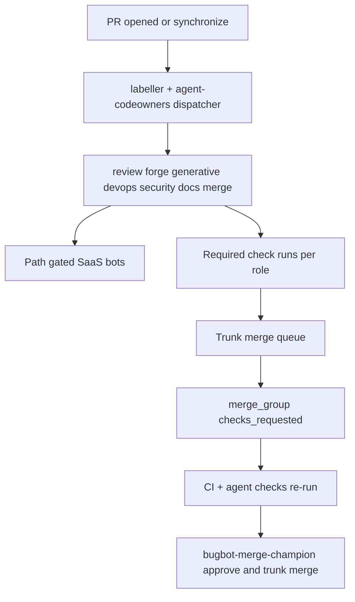

# Agent Codeowners Review Routing Implementation Plan

> **For agentic workers:** REQUIRED SUB-SKILL: Use superpowers:executing-plans or subagent-driven-development task-by-task. Steps use checkbox syntax for tracking.

**Goal:** Stop every cloud reviewer from reviewing every PR; route and provision agents by path/role like GitLab [multiple approval rules](https://docs.gitlab.com/user/project/merge_requests/approvals/rules/#multiple-approval-rules), with agents as the approvers and Trunk/`merge_group` as the merge gate.

**Architecture:** Single source of truth `[.github/agent-codeowners.yml](.github/agent-codeowners.yml)` (GitLab sections → globs → agent roles → required check names). On `pull_request` / `merge_group`, a dispatcher applies `review:`\* labels and runs only matching agent jobs that publish **required status checks**. SaaS bots (CodeRabbit, Cubic, Copilot, Gemini) are path/label-gated. Merge Champion (`[.cursor/bugbot/MERGE-CHAMPION.md](.cursor/bugbot/MERGE-CHAMPION.md)`) is the only agent allowed to approve+enqueue Trunk merge when policy allows. Humans are **not** required CODEOWNERS.

**Tech Stack:** GitHub Actions (`pull_request`, `merge_group`, `workflow_call`), existing `dorny/paths-filter` + `[scripts/lib/polis-router.mjs](scripts/lib/polis-router.mjs)` + `[scripts/quality-orchestrator.mjs](scripts/quality-orchestrator.mjs)`, Trunk merge queue (already on PRs), CodeRabbit/Cubic configs, mise for agent CLI tooling, Copilot workspace env scripts.

---

## Discovery (validated)

Live bots on `Ditto190/modme-ui-01` PRs #96 / #101:

| Bot                                  | Role today                                     | Problem                                      |
| ------------------------------------ | ---------------------------------------------- | -------------------------------------------- |
| `coderabbitai[bot]`                  | Full PR review (org UI ASSERTIVE)              | Fires broadly; no in-repo `.coderabbit.yaml` |
| `cubic-dev-ai[bot]`                  | Multiple review passes                         | Overlaps CodeRabbit/Copilot                  |
| `gemini-code-assist[bot]`            | Code review                                    | **Sunset Jul 17 2026** — migrate off         |
| `copilot-pull-request-reviewer[bot]` | Copilot PR review                              | Always-on; fails on huge diffs               |
| `cursor[bot]`                        | Autofix review comments                        | Fine as fix agent, not primary reviewer      |
| `trunk-io[bot]`                      | Merge queue to `dev`                           | Keep; wire `merge_group` into CI             |
| `changeset-bot[bot]`                 | Changeset nag                                  | Keep (non-review)                            |
| In-repo Copilot gh-aw                | `pr-preflight-review`, triage, pre-review gate | Always-on; duplicates SaaS noise             |

Also: active ruleset `**CodeReview_Ruleset**` (id `11504025`); `[data/agent-citizens/](data/agent-citizens/)` **missing**; `[scripts/lib/worktree-bootstrap.ps1](scripts/lib/worktree-bootstrap.ps1)` **missing** (breaks Copilot `session.create`); `[.github/dependabot.yml](.github/dependabot.yml)` empty ecosystem.



---

## Decision log (multi-agent brainstorm — APPROVED)

| Decision      | Alternatives                                           | Resolution                                                                                           |
| ------------- | ------------------------------------------------------ | ---------------------------------------------------------------------------------------------------- |
| Approvers     | Human CODEOWNERS vs agent status checks                | **Agents only** via required checks + Merge Champion bot APPROVE (user mandate)                      |
| Control plane | New parallel system vs extend polis/quality            | **Extend** `agent-codeowners.yml` + citizens + quality-orchestrator                                  |
| Merge queue   | GitHub native vs Trunk                                 | **Keep Trunk** (already live); add `merge_group` to workflows for GitHub-native compatibility        |
| Gemini        | Keep vs remove                                         | **Remove/disable** before sunset; replace with path-scoped Copilot/Bugbot                            |
| Env tooling   | New root `devbox.json` vs mise + fix copilot-workspace | **mise.toml** for CLIs; **fix** copilot-workspace bootstrap (no new Nix root unless later requested) |
| Dependabot    | Leave placeholder vs multi-ecosystem                   | **Configure** yarn root + GenerativeUI yarn + next-forge bun + github-actions                        |

**Arbiter disposition: APPROVED** — proceed with agent-as-approver routing.

---

## File map (create / modify)

**Create**

- `[.github/agent-codeowners.yml](.github/agent-codeowners.yml)` — SoT sections/roles/checks
- `[.github/workflows/agent-review-dispatch.yml](.github/workflows/agent-review-dispatch.yml)` — label + matrix dispatch
- `[.github/workflows/_agent-role-review.yml](.github/workflows/_agent-role-review.yml)` — reusable role review (`workflow_call`)
- `[.coderabbit.yaml](.coderabbit.yaml)` — path/label gates
- `[.cubic.yml](.cubic.yml)` or Cubic path config (confirm Cubic schema during impl)
- `[data/agent-citizens/*.yaml](data/agent-citizens/)` — 6 citizens
- `[scripts/lib/agent-codeowners.mjs](scripts/lib/agent-codeowners.mjs)` — parse + match changed paths → roles
- `[scripts/__tests__/agent-codeowners.test.mjs](scripts/__tests__/agent-codeowners.test.mjs)`
- `[docs/plans/2026-07-11-agent-review-routing.md](docs/plans/2026-07-11-agent-review-routing.md)` — this plan copy for executing-plans
- `[docs/devops/agent-review-routing.md](docs/devops/agent-review-routing.md)` — operator runbook
- `[mise.toml](mise.toml)` — `node`, `bun`, `gh` pins for agent/CI parity
- `[scripts/lib/worktree-bootstrap.ps1](scripts/lib/worktree-bootstrap.ps1)` — restore missing SharedDeps

**Modify**

- `[.github/labeler.yml](.github/labeler.yml)` — add `review:*` labels
- `[.github/workflows/ci.yml](.github/workflows/ci.yml)` — add `merge_group` + `dev` branch; path-filter already good
- `[.github/workflows/pr-preflight-review.md](.github/workflows/pr-preflight-review.md)` / triage — gate on `review:*` labels
- `[.github/workflows/copilot-setup-steps.yml](.github/workflows/copilot-setup-steps.yml)` — real env/preflight
- `[.github/dependabot.yml](.github/dependabot.yml)` — multi-ecosystem
- `[.github/github-app.yml](.github/github-app.yml)` — review session role hooks
- `[scripts/quality-orchestrator.manifest.json](scripts/quality-orchestrator.manifest.json)` — map roles → agents
- `[scripts/lib/polis-router.mjs](scripts/lib/polis-router.mjs)` — multi-role return (all matching citizens, not single winner) for approval-rule parity
- `[.cursor/bugbot/MERGE-CHAMPION.md](.cursor/bugbot/MERGE-CHAMPION.md)` — wire to dispatcher checks
- `[.cursor/bugbot/LABELS.md](.cursor/bugbot/LABELS.md)` — document `review:*`

---

## Role taxonomy (agent approval rules)

| Role / check name                              | Paths                                      | Primary agent                        | Gate                       |
| ---------------------------------------------- | ------------------------------------------ | ------------------------------------ | -------------------------- |
| `review:forge` → check `modme/agent-forge`     | `next-forge/**`                            | Bugbot / Cursor forge-reviewer       | Required when paths match  |
| `review:generative` → `modme/agent-generative` | `GenerativeUI_monorepo/**`                 | generative-reviewer                  | Required when match        |
| `review:devops` → `modme/agent-devops`         | `.github/**`, `scripts/**`, `.githooks/**` | devops-ci-champion + Cubic (CI YAML) | Required when match        |
| `review:security` → `modme/agent-security`     | auth, supabase, secrets, lockfiles         | security-review subagent             | Required when match        |
| `review:docs` → `modme/agent-docs`             | `docs/**`, `**/AGENTS.md`                  | CodeRabbit (docs profile) or skip    | Advisory (neutral skip OK) |
| `review:merge` → `modme/agent-merge`           | always after others green                  | bugbot-merge-champion                | Required to enqueue Trunk  |

Unmatched roles publish **success/neutral skip** so rulesets never block forever ([GitHub path-filter pitfall](https://docs.github.com/en/actions)).

---

### Task 1: Agent-codeowners parser (TDD)

**Files:** Create `scripts/lib/agent-codeowners.mjs`, `scripts/__tests__/agent-codeowners.test.mjs`, `.github/agent-codeowners.yml`

- [ ] Write failing tests for path→roles matching (forge-only, multi-stack, security override, docs-only)
- [ ] Implement minimal YAML parse (reuse polis `parseSimpleYaml` pattern or shared helper)
- [ ] Add SoT YAML with sections above
- [ ] Commit: `feat(review): add agent-codeowners matcher`

### Task 2: Citizens + multi-role polis

**Files:** Create `data/agent-citizens/{forge-reviewer,generative-reviewer,devops-ci-champion,security-reviewer,docs-reviewer,bugbot-merge-champion}.yaml`; modify `polis-router.mjs` + tests

- [ ] Extend `routeContract` → `routeContracts` returning **all** matching citizens (GitLab multi-rule)
- [ ] Keep `routeContract` as best-score wrapper for session start
- [ ] Commit: `feat(polis): multi-role citizen routing for approval rules`

### Task 3: Dispatcher + reusable role workflow

**Files:** Create `agent-review-dispatch.yml`, `_agent-role-review.yml`; modify `labeler.yml`

Pattern (SHA-pin actions on implement):

```yaml
on:
  pull_request:
    types: [opened, synchronize, reopened, ready_for_review]
  merge_group:
    types: [checks_requested]

permissions:
  contents: read
  pull-requests: write
  checks: write

jobs:
  resolve:
    outputs:
      roles: ${{ steps.match.outputs.roles }}
    steps:
      - uses: actions/checkout@...
      - id: match
        run: node scripts/lib/agent-codeowners.mjs --event paths --format json >> $GITHUB_OUTPUT
  review:
    needs: resolve
    strategy:
      matrix:
        role: ${{ fromJson(needs.resolve.outputs.roles) }}
    uses: ./.github/workflows/_agent-role-review.yml
    with:
      role: ${{ matrix.role }}
```

- [ ] Reusable workflow: provision env (`generate-env.mjs`), run role skill/subagent prompt artifact, post check `modme/agent-${role}`
- [ ] Skip matrix empty → single job reporting all checks skipped success
- [ ] Commit: `feat(ci): path-routed agent review dispatch`

### Task 4: Gate SaaS bots

**Files:** `.coderabbit.yaml`, Cubic config, disable Gemini org install (ops checklist), Copilot auto-review settings doc

- [ ] CodeRabbit: `reviews.auto_review.base_branches: [dev, main]`; path filters; `request_changes_workflow` only when `review:*` matches; disable noise on docs-only
- [ ] Cubic: restrict to `.github/**` + `scripts/**` (devops lane)
- [ ] Document: turn off Gemini Code Assist before Jul 17
- [ ] Copilot PR reviewer: prefer label/`@copilot` on-demand; keep gh-aw only when `review:orchestration` or preflight failed
- [ ] Commit: `chore(review): path-gate CodeRabbit and Cubic`

### Task 5: Ruleset + Trunk + merge_group

**Files:** Modify `ci.yml`, `preflight-ci.yml`; docs for updating `CodeReview_Ruleset`

- [ ] Add `on.merge_group.types: [checks_requested]` and `dev` to PR/push branches in CI/preflight
- [ ] Ruleset required checks: `modme/agent-forge|generative|devops|security|merge` (with skip-success pattern) + existing CI
- [ ] Document Trunk `/trunk merge` only after `modme/agent-merge` green
- [ ] Auto-delete head branches: enable in repo settings (ops); document in runbook
- [ ] Commit: `feat(ci): merge_group support for Trunk queue`

### Task 6: Cloud env provisioning for review agents

**Files:** Restore `worktree-bootstrap.ps1`; expand `copilot-setup-steps.yml`; update `github-app.yml` + `session-start` for `-AgentRole review`

- [ ] Fix broken SharedDeps so `session.create` works
- [ ] Setup steps: `generate-env.mjs` → `yarn lean-ctx:ensure` → `yarn preflight:env`
- [ ] When PR has `review:*`, start Copilot/Cursor session as `review` (catalog role) with skills from citizen card
- [ ] Wire secrets via `.worktreeinclude` only (no new long-lived secrets in workflows)
- [ ] Commit: `fix(copilot): restore bootstrap and review-role sessions`

### Task 7: Dependabot monorepo (brainstorm → ship)

**Files:** `.github/dependabot.yml`

```yaml
version: 2
updates:
  - package-ecosystem: npm
    directories: ["/", "/GenerativeUI_monorepo"]
    schedule: { interval: weekly, day: monday }
    groups: { npm_and_yarn: { patterns: ["*"] } }
    labels: [dependencies, stack:orchestration]
  - package-ecosystem: bun
    directory: /next-forge
    schedule: { interval: weekly }
    labels: [dependencies, stack:forge]
  - package-ecosystem: github-actions
    directory: /
    schedule: { interval: weekly }
    labels: [dependencies, ci-cd]
```

- [ ] Validate bun ecosystem support for this repo’s lockfile name
- [ ] Group PRs; open-pull-requests-limit sane
- [ ] Commit: `chore(deps): configure dependabot for dual monorepo`

### Task 8: mise + observability

**Files:** `mise.toml`; optional thin note that root `devbox.json` is out of scope; agenttrace hooks in review workflow

- [ ] Pin `node=20`, `bun` from next-forge, `gh`
- [ ] Review workflow uploads `agent-review-trace` artifact (role, paths, check conclusion, duration) for later idea-os/issue-creator improvement
- [ ] Commit: `chore(tooling): mise pins for agent review CI`

### Task 9: Docs + issue template + verification

**Files:** `docs/devops/agent-review-routing.md`, update `quality-loop.md`, `POLIS-ROUTING.md`, issue template for review-routing failures

- [ ] Runbook: how to add a role, how to force `@coderabbitai review`, Trunk merge evidence block
- [ ] Smoke: open draft PR touching only `docs/` → only docs/advisory; touching `next-forge/` → forge check only
- [ ] Commit: `docs(review): agent routing runbook`

---

## Security constraints (non-negotiable)

- Default `permissions: contents: read`; escalate per job
- No `pull_request_target` for agent dispatch
- Pin third-party actions to full SHAs
- Never echo secrets; mask dynamic tokens
- Fork PRs: read-only checks only; no merge champion auto-approve

---

## Success criteria

- A typical PR triggers **≤1 primary SaaS reviewer per matched role**, not 3–4 overlapping full reviews
- Required checks appear only for matched paths; others skip-success
- Trunk merge blocked until `modme/agent-merge` + stack checks green
- Copilot cloud `session.create` succeeds (bootstrap restored)
- Dependabot opens grouped PRs per ecosystem
- Gemini removed from active review path before sunset
