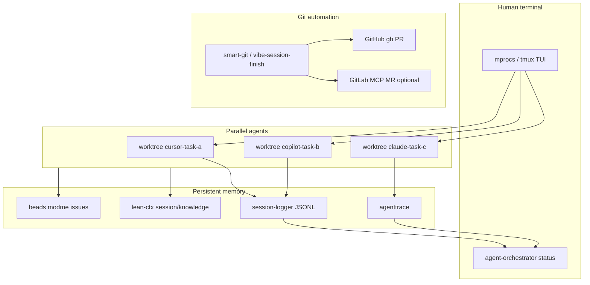

# Agent Terminal Orchestration Layer (ModMe)

## Decision (based on your feedback)

**Skip Nx.** This repo already has the right split: [Turbo in `next-forge/`](next-forge/turbo.json) and [`GenerativeUI_monorepo/`](GenerativeUI_monorepo/turbo.json), plus mature [**worktree isolation**](docs/multi-agent-worktrees.md). What is missing is a **terminal-level control plane** that:

- Launches and monitors parallel agent workspaces
- Correlates every session with **beads issues**, **git branch/worktree**, and **trace IDs**
- Feeds humans a single TUI/dashboard for health, ports, and QA gates



---

## Phase 1 — Terminal control plane (TUI)

### 1.1 Adopt **mprocs** as primary cross-platform TUI (Windows-friendly)

- Add [`mprocs.yaml`](mprocs.yaml) at repo root, **generated from** existing [`scripts/launch-manifest.json`](scripts/launch-manifest.json) + [`.worktree-ports.env`](.worktree-ports.env) (worktree slot offsets from [docs/multi-agent-worktrees.md](docs/multi-agent-worktrees.md)).
- Root scripts in [`package.json`](package.json):
  - `yarn agent:tui` — start mprocs with current worktree ports
  - `yarn agent:status` — non-TUI JSON/text status (for agents/CI)

**Why mprocs over Nx:** process supervisor with live logs, restart, keybindings; works on Windows without WSL. Keeps Turbo/Bun/Yarn untouched inside each stack.

### 1.2 Extend [`scripts/agent-workspace-tmux.sh`](scripts/agent-workspace-tmux.sh) → PowerShell twin

- Add `scripts/agent-workspace-tmux.ps1` (or `agent-orchestrator-tui.ps1`) for users on WSL/tmux:
  - One pane per active worktree under `../Monorepo_ModMe-dev/`
  - Windows: `doctor`, `beads:ready`, `agenttrace --latest`
- Keep bash script; share layout spec in `docs/agent-terminal-orchestration.md` (new).

### 1.3 Worktree bootstrap hook

Extend [`.cursor/setup-worktree-windows.ps1`](.cursor/setup-worktree-windows.ps1) (referenced in worktrees doc) to:

1. Run existing install steps (yarn/bun/poetry, ports, hooks)
2. Call new `scripts/agent-session-start.ps1` (see Phase 2)
3. Print TUI attach command: `yarn agent:tui`

---

## Phase 2 — Multi-agent task orchestrator (beads + registry)

Implement the [**multi-agent-task-orchestrator**](.agents/skills/multi-agent-task-orchestrator/SKILL.md) pattern using **beads as the durable registry** (not ephemeral TodoWrite):

| Concern | Implementation |
|---------|----------------|
| Duplicate detection | `bd list --status in_progress` + title similarity before `new-agent-worktree.ps1` |
| File-level contention | Optional `scripts/lib/agent-task-registry.mjs` (SQLite in `.beads/` or `data/agent-registry.db`, gitignored) storing `task_id → worktree_path → claimed_paths[]` |
| Quality gates | `git diff --stat` + `yarn pre-commit:check` + stack verify (`verify:forge` / `verify:generative`) before `bd close` |
| Handoff format | Reuse JSON envelope from [`.cursor/skills/agent-workbench-orchestration/SKILL.md`](.cursor/skills/agent-workbench-orchestration/SKILL.md) |

**New scripts:**

- [`scripts/agent-session-start.ps1`](scripts/agent-session-start.ps1) — `bd ready` → assign/issue link → `session-logger start` → lean-ctx `ctx_session` marker → emit `AGENT_SESSION_ID`
- [`scripts/agent-session-finish.ps1`](scripts/agent-session-finish.ps1) — thin wrapper calling [`vibe-session-finish.ps1`](scripts/vibe-session-finish.ps1) + `agenttrace --latest` + `bd update/close` + lean-ctx diary

**Beads seed issues** (via [`scripts/init-beads-starter-issues.ps1`](scripts/init-beads-starter-issues.ps1)):

- `chore: agent-terminal-orchestration — mprocs + session envelope`
- `task: e2e — worktree smoke via Playwright`
- `chore: document agent-session-start/finish protocol`

Document protocol in [`docs/beads-workflow.md`](docs/beads-workflow.md) + new [`docs/agent-terminal-orchestration.md`](docs/agent-terminal-orchestration.md).

---

## Phase 3 — Logging, tracing, and human QA gates

### 3.1 Unified session envelope

Every agent run writes a single correlatable record:

```json
{
  "session_id": "uuid",
  "worktree": "dev-agent-cursor-auth-fix",
  "beads_issue": "modme-aqu",
  "branch": "feature/cursor/auth-fix",
  "ports_env": ".worktree-ports.env",
  "trace": { "session_logger": "logs/copilot/session.log", "agenttrace": "..." }
}
```

Wire collectors already sketched in [`docs/evaluation/ARCHITECTURE.md`](docs/evaluation/ARCHITECTURE.md) and [`scripts/agent-eval-collect.mjs`](scripts/agent-eval-collect.mjs).

### 3.2 session-logger + agenttrace

- Re-enable **opt-in** [`.cursor/hooks.json.example`](.cursor/hooks.json.example) hooks (`failClosed: false`) calling [`.github/hooks/session-logger`](.github/hooks/session-logger) — per [hooks README](.cursor/hooks/README.md), security-only by default.
- Session end: `yarn agenttrace --latest` + `agenttrace --overview --fail-under-health 80` (advisory locally; existing [`.github/workflows/agenttrace-ci.yml`](.github/workflows/agenttrace-ci.yml) on `main`).
- Add `yarn agent:audit` → runs agenttrace doctor + overview markdown to `docs/inbox-pipeline/reports/agent-sessions-latest.md`.

### 3.3 Human-in-the-loop QA ([vibecode-production-qa-validator](.agents/skills/vibecode-production-qa-validator/SKILL.md))

Embed a **worktree-safe subset** into `vibe-session-finish.ps1` (not full prod curl):

| Phase | Local command |
|-------|----------------|
| Code | `yarn pre-commit:check` (existing) |
| Build | `yarn verify:forge` or `verify:generative` based on changed paths (same logic as [`.github/workflows/ci.yml`](.github/workflows/ci.yml) `dorny/paths-filter`) |
| Git hygiene | secret scan in diff (already in pre-commit) |
| Smoke | optional Playwright against worktree ports |

Humans run full `qa:full()` only before production promote; agents run the embedded subset.

### 3.4 Error trace posture ([error-debugging-error-trace](.agents/skills/error-debugging-error-trace/SKILL.md))

- Structured stderr in new orchestrator scripts (`[agent-orchestrator] level=error event=...`)
- Append failures to `logs/agent-orchestrator/errors.jsonl` (gitignored)
- lean-ctx `ctx_agent diary` category `blocker` on failed quality gates

---

## Phase 4 — Git automation (smart-git + advanced workflows)

Enhance [`scripts/vibe-session-finish.ps1`](scripts/vibe-session-finish.ps1) per [**smart-git-automation**](.agents/skills/smart-git-automation/SKILL.md):

1. **Group changes** by stack (`next-forge/`, `GenerativeUI_monorepo/`, root scripts) — already partially present; formalize output blocks
2. **Branch naming** `feature/<owner>/<task>` — align with [`new-agent-worktree.ps1`](scripts/new-agent-worktree.ps1)
3. **Pathspec-only staging** — never `git add -A` on beads/dolt artifacts
4. **PR to `dev`** via `gh` (canonical remote per [beads-workflow](docs/beads-workflow.md))

[**git-advanced-workflows**](.agents/skills/git-advanced-workflows/SKILL.md) additions:

- Document `git worktree list` + cherry-pick hotfix path in new orchestration doc
- `vibe-session-finish -DryRun` for agent preview (already exists)

**GitLab** (plugin): optional parallel path in `agent-session-finish.ps1` when `GITLAB_PROJECT_ID` set — use gitlab-assistant MCP for MR creation; GitHub remains default.

---

## Phase 5 — Git hooks automation

Extend [`.githooks/pre-commit`](.githooks/pre-commit) + [`scripts/pre-commit-checks.mjs`](scripts/pre-commit-checks.mjs) per [**git-hooks-automation**](.agents/skills/git-hooks-automation/SKILL.md):

| Hook | Change |
|------|--------|
| `pre-commit` | Keep staged-aware checks; add **block commits on `main`** in worktree guard |
| `commit-msg` | Optional conventional-commit lint via `commitlint` (gradual; start warn-only) |
| `pre-push` | Run stack-specific `verify:*` only when matching paths changed (mirror CI paths-filter) |

Install path unchanged: [`scripts/install-git-hooks.ps1`](scripts/install-git-hooks.ps1) + worktree bootstrap.

---

## Phase 6 — E2E testing patterns + GitHub automation

### E2E ([e2e-testing-patterns](.agents/skills/e2e-testing-patterns/SKILL.md))

- Beads epic: worktree smoke tests with [Playwright MCP](mcps/plugin-playwright-playwright)
- `experiments/micro-agents/evaluation/` or new `e2e/worktree-smoke/` — tests that:
  1. Load worktree ports from `.worktree-ports.env`
  2. Hit `next-forge` app health + GenerativeUI dashboard
  3. Run in CI on `dev` PRs (optional job in `ci.yml`)

### GitHub automation ([github-automation](.agents/skills/github-automation/SKILL.md))

- `gh pr create` from vibe-session-finish (existing `-CreatePr`)
- CI: extend [`pre-commit-check.yml`](.github/workflows/pre-commit-check.yml) with `yarn agent:status --ci` once orchestrator exists
- Issue linking: beads issue ID in PR body footer

---

## Phase 7 — lean-ctx dynamic context profiles

Extend [`.lean-ctx.toml`](.lean-ctx.toml) with **task profiles** consumed by `/user-lean-ctx/context-focus`:

| Task profile | `ctx_read` mode | Priority paths |
|--------------|-----------------|----------------|
| `agent-orchestration` | full | `scripts/agent-*.ps1`, `docs/multi-agent-worktrees.md`, `mprocs.yaml` |
| `forge-work` | signatures | `next-forge/apps/**`, `next-forge/packages/**` |
| `generative-work` | signatures | `GenerativeUI_monorepo/apps/**` |
| `session-audit` | aggressive | `logs/**`, agenttrace exports |

Add to [`scripts/ensure-lean-ctx-config.ps1`](scripts/ensure-lean-ctx-config.ps1) preset keys for orchestration (`tee_mode=failures`, diary on session end).

Update [`docs/lean-ctx-guide.md`](docs/lean-ctx-guide.md) START/END loop to include `yarn agent:session-start` / `agent:session-finish`.

---

## Phase 8 — Documentation and skills

| Artifact | Purpose |
|----------|---------|
| [`docs/agent-terminal-orchestration.md`](docs/agent-terminal-orchestration.md) | Canonical guide (supplements worktrees doc) |
| [`.cursor/skills/agent-terminal-orchestration/SKILL.md`](.cursor/skills/agent-terminal-orchestration/SKILL.md) | Agent discovery: TUI, session envelope, beads, trace |
| [`AGENTS.md`](AGENTS.md) + [`docs/agent-index.md`](docs/agent-index.md) | Link new commands |
| [awesome-cursor-skills](.cursor/skills/awesome-cursor-skills/SKILL.md) | Install `finding-dev-server-url`, `detecting-port-conflicts`, `grinding-until-pass` for verify phase |

Cross-link existing [**multi-agent-worktrees**](docs/multi-agent-worktrees.md) — worktrees remain the **isolation** layer; this plan adds the **observability + coordination** layer on top.

---

## Verification checklist

```powershell
# One-time
yarn beads:init
yarn hooks:install
yarn lean-ctx:ensure

# Per worktree session
.\scripts\new-agent-worktree.ps1 -Name "orchestrator-poc" -Owner cursor
.\scripts\agent-session-start.ps1
yarn agent:tui                    # mprocs dashboard
yarn worktree:doctor
yarn pre-commit:check
.\scripts\vibe-session-finish.ps1 -DryRun

# Trace audit
yarn agenttrace --doctor
yarn agenttrace --overview
yarn agent:audit                  # after implementation
```

---

## Out of scope (explicit)

- Nx installation or Turbo replacement
- Merging `next-forge` and `GenerativeUI_monorepo` workspaces
- Re-enabling blocking Cursor hooks (`failClosed: true`)
- Production deploy QA (`qa:full` curl against prod URL) in agent loops

## Risk notes

- **Windows + tmux**: prefer mprocs; document WSL path for tmux users
- **Beads + git**: ensure `bd sync` does not conflict with smart-git grouping (exclude `.beads/embeddeddolt` from commits unless intentional)
- **Hook performance**: pre-push verify must stay path-filtered to remain under 5s for typical commits
