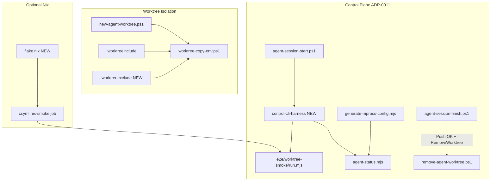

# Logic Fix All — Control CLI + Multi-Agent Workspace Orchestration

## Phase 0 — Consent (required before execution)

**Scope:** `scripts/`, `.cursor/skills/control-cli/`, `.cursor/skills/agent-terminal-orchestration/`, `e2e/worktree-smoke/`, `docs/nix-devshell.md`, `docs/agent-terminal-orchestration.md`, `docs/multi-agent-worktrees.md`, root `flake.nix`, `.worktreeinclude` / new `.worktreeexclude`, `.editorconfig`, `.github/workflows/ci.yml`

**Method:** logic-health → logic-review → fix queue → logic-diff verify → `yarn e2e:worktree-smoke` + `yarn preflight:worktree`

**Cost:** ~15–25 files touched; 1 new worktree; optional Nix install for local validation

**Iteration cap:** 3 Warning/Suggestion rounds (per logic-fix-all default); Criticals loop until clean

**Worktree:** New ephemeral worktree `feature/cursor/control-cli-orchestration` via `[scripts/new-agent-worktree.ps1](scripts/new-agent-worktree.ps1)`; session finish removes worktree + branch after successful push

---

## Logic findings (Premises → Divergence)

| #   | Severity       | Finding                                                                                                                  | Root cause                                  | Fix target                                                                          |
| --- | -------------- | ------------------------------------------------------------------------------------------------------------------------ | ------------------------------------------- | ----------------------------------------------------------------------------------- |
| 1   | **Critical**   | `[docs/nix-devshell.md](docs/nix-devshell.md)` documents `nix develop` but **no `flake.nix` exists**                     | Doc/constraint drift                        | Add `flake.nix` + update doc                                                        |
| 2   | **Critical**   | `[control-cli` SKILL](.cursor/skills/control-cli/SKILL.md) is generic; **no ModMe harness map**                          | Skill not bound to repo orchestration layer | Extend skill + add harness script                                                   |
| 3   | **Warning**    | `[agent-status.mjs](scripts/agent-status.mjs)` human-text default; `--json` opt-in                                       | Violates ai-native-cli O1 (JSON default)    | JSON default + `--human`; update mprocs proc                                        |
| 4   | **Warning**    | `[agent-workspace-tmux.ps1](scripts/agent-workspace-tmux.ps1)` exits help when `$env:MODME_TMUX_SESSION` empty           | Missing default before null check           | Default `modme-agents` before help gate                                             |
| 5   | **Warning**    | `[worktree-copy-env.ps1](scripts/worktree-copy-env.ps1)` hardcodes paths; ignores `[.worktreeinclude](.worktreeinclude)` | Duplicate source of truth                   | Parse `.worktreeinclude`; respect `.worktreeexclude`                                |
| 6   | **Warning**    | Session finish **does not remove worktree** after push                                                                   | Lifecycle gap vs user intent                | `-RemoveWorktree` on `[agent-session-finish.ps1](scripts/agent-session-finish.ps1)` |
| 7   | **Suggestion** | `[generate-mprocs-config.mjs](scripts/generate-mprocs-config.mjs)` `orchestrator_status` runs human `agent-status`       | Agent probe not machine-parseable           | Use `node scripts/agent-status.mjs --json`                                          |
| 8   | **Suggestion** | No `.logic-lens.yaml` for orchestration scope                                                                            | fix-all has no project config               | Add scoped `.logic-lens.yaml`                                                       |



---

## Implementation plan

### 1. Ephemeral worktree + mirror policy (user requirement)

**Add** `[.worktreeexclude](.worktreeexclude)` — complement to `[.worktreeinclude](.worktreeinclude)`:

- **Never copy from main** (git-tracked on `dev`): `.editorconfig`, `.cursor/rules/`\*\*, `AGENTS.md`, `CLAUDE.md`, skill metadata
- **Always copy** (runtime only): keep existing `.worktreeinclude` entries (`.env`, lockfiles, `.worktree-ports.env`)

**Refactor** `[scripts/worktree-copy-env.ps1](scripts/worktree-copy-env.ps1)`:

- Read patterns from `.worktreeinclude` (single source of truth)
- Skip any path matching `.worktreeexclude`
- Add `-ChangedOnly` switch: on session start, copy only if target missing or source newer (idempotent re-entry)

**Wire lifecycle** in `[scripts/agent-session-finish.ps1](scripts/agent-session-finish.ps1)`:

- New flags: `-RemoveWorktree`, `-DeleteBranch` (pass-through to `[scripts/remove-agent-worktree.ps1](scripts/remove-agent-worktree.ps1)`)
- Only run cleanup when `-Push` succeeded (detect via vibe-session-finish exit + `git status` clean/ahead)
- Document in `[docs/multi-agent-worktrees.md](docs/multi-agent-worktrees.md)` § ephemeral sessions

**Session start** `[scripts/agent-session-start.ps1](scripts/agent-session-start.ps1)`: call `worktree-copy-env.ps1 -ChangedOnly` after port allocation

---

### 2. Repo-native control-cli harness

**Add** `[scripts/control-cli-harness.mjs](scripts/control-cli-harness.mjs)` (agent-friendly JSON default per ai-native-cli):

| Probe       | Command                                            | Ready pattern                         |
| ----------- | -------------------------------------------------- | ------------------------------------- |
| status      | `node scripts/agent-status.mjs --json`             | `"repoRoot"` in JSON                  |
| mprocs gen  | `node scripts/generate-mprocs-config.mjs --stdout` | `procs:` in YAML                      |
| smoke       | `node e2e/worktree-smoke/run.mjs`                  | `worktree-smoke: ok`                  |
| tmux status | `bash scripts/agent-workspace-tmux.sh status`      | `git worktree list` (skip if no bash) |

**Add** `[scripts/control-cli-harness.ps1](scripts/control-cli-harness.ps1)` — Windows launcher (PowerShell patterns from powershell-windows skill: parenthesized `-or`, ASCII-only output)

**Add** yarn script: `"harness:control-cli": "node scripts/control-cli-harness.mjs"`

**Extend** `[.cursor/skills/control-cli/SKILL.md](.cursor/skills/control-cli/SKILL.md)`:

- ModMe harness table (above)
- Cross-link `[agent-terminal-orchestration](.cursor/skills/agent-terminal-orchestration/SKILL.md)`
- Windows-first: PowerShell harness → mprocs → WSL tmux fallback
- RSCIT-optimized prompt block (llm-prompt-optimizer): Role, Situation, Constraints, Instructions, Template for harness output

**Extend** `[.cursor/skills/agent-terminal-orchestration/SKILL.md](.cursor/skills/agent-terminal-orchestration/SKILL.md)`:

- `yarn harness:control-cli` in key commands
- Ephemeral worktree lifecycle (`-RemoveWorktree -DeleteBranch`)
- Nix optional path: `nix develop -c yarn harness:control-cli`

---

### 3. ai-native-cli upgrades (orchestration CLIs)

`**[scripts/agent-status.mjs](scripts/agent-status.mjs)**` (breaking but agent-beneficial):

- Default stdout = JSON (`payload` schema stable)
- `--human` for text table (replaces implicit human default)
- Structured errors to stderr: `{ error, code, message, suggestion }`; exit 2 on usage
- Keep `--ci` fast path unchanged

`**[scripts/control-cli-harness.mjs](scripts/control-cli-harness.mjs)**`:

- `--brief`, `--help` JSON self-description
- `--human` for transcript-style output
- Exit codes: 0 ok, 1 probe fail, 2 usage

**Update consumers:**

- `[scripts/generate-mprocs-config.mjs](scripts/generate-mprocs-config.mjs)` line 119: `--json`
- `[e2e/worktree-smoke/run.mjs](e2e/worktree-smoke/run.mjs)`: assert JSON schema from agent-status
- Vitest in `scripts/__tests__/agent-status.test.mjs` (new)

**Optional reference:** `[scripts/telemetry/telemetry-cli.mjs](scripts/telemetry/telemetry-cli.mjs)` `fail()` / `emit()` pattern for error JSON

---

### 4. Nix devShell + CI (Hydra-inspired, not Hydra server)

Per inbox Hydra snippet + `[docs/nix-devshell.md](docs/nix-devshell.md)`:

**Add** root `[flake.nix](flake.nix)`:

```nix
# devShells.default: nodejs_22, corepack yarn@3.3, bun, git, tmux (optional)
# packages.worktree-smoke: nix develop -c node e2e/worktree-smoke/run.mjs
```

**Update** `[docs/nix-devshell.md](docs/nix-devshell.md)`:

- Flake layout, `nix develop -c yarn harness:control-cli`
- Hydra reference section: continuous evaluation pattern (jobset = `worktree-smoke` + path filters) — **GitHub Actions implements this**, not a Hydra server

**Add** CI job in `[.github/workflows/ci.yml](.github/workflows/ci.yml)` (paths-filtered, `continue-on-error: true` like existing `worktree-smoke`):

```yaml
nix-orchestration-smoke:
  runs-on: ubuntu-latest
  steps:
    - uses: actions/checkout@v4
    - uses: DeterminateSystems/nix-installer-action@main
    - run: nix develop -c node e2e/worktree-smoke/run.mjs
```

**POSIX profile:** `[scripts/agent-workspace-tmux.sh](scripts/agent-workspace-tmux.sh)` already POSIX-compliant; add `scripts/bats/agent-workspace-tmux.bats` smoke (extend `yarn test:shell`)

---

### 5. Cursor hooks + editorconfig

**Hooks** (`[.cursor/hooks.json](.cursor/hooks.json)`) — per suggesting-cursor-hooks:

- `afterFileEdit` on `scripts/agent-*.mjs|scripts/*worktree*.ps1`: run `node scripts/control-cli-harness.mjs --probe status` (fast, <5s)
- Optional `stop` hook: advisory `yarn e2e:worktree-smoke` only when orchestration files changed (path-filter check)

`**[.editorconfig](.editorconfig)**` additions:

```editorconfig
[*.nix]
indent_size = 2

[flake.nix]
indent_size = 2

[*.bats]
indent_size = 2
```

Listed in `.worktreeexclude` so worktrees inherit `dev` branch version, not main-copy.

---

### 6. Config + docs + prompt optimization

**Add** `[.logic-lens.yaml](.logic-lens.yaml)`:

```yaml
focus: [orchestration, cli-harness, worktree-lifecycle]
ignore: [.vendor/**, .worktrees/**, next-forge/**, GenerativeUI_monorepo/**]
fix_all:
  max_iterations: 3
```

**Docs sync:**

- `[docs/agent-terminal-orchestration.md](docs/agent-terminal-orchestration.md)` — harness section, ai-native JSON contract, ephemeral cleanup
- `[docs/multi-agent-worktrees.md](docs/multi-agent-worktrees.md)` — `.worktreeexclude` mirror policy
- `[CHANGELOG.md](CHANGELOG.md)` — `[Unreleased]` entry

**Skills catalog:** Document `terminal-control` / `dmux-workflows` from skills.sh as optional complements in `[docs/agent-terminal-orchestration.md](docs/agent-terminal-orchestration.md)` (no install unless you approve)

---

## Verification matrix

| Gate                 | Command                                                                                                  |
| -------------------- | -------------------------------------------------------------------------------------------------------- |
| Harness              | `yarn harness:control-cli`                                                                               |
| E2E                  | `yarn e2e:worktree-smoke`                                                                                |
| Preflight            | `yarn preflight:worktree`                                                                                |
| Shell                | `yarn test:shell` (new bats)                                                                             |
| Orchestration vitest | `yarn test:orchestration`                                                                                |
| Nix (WSL/Linux)      | `nix develop -c yarn e2e:worktree-smoke`                                                                 |
| Session lifecycle    | `agent-session-start` → work → `agent-session-finish -Push -CreatePr -RemoveWorktree -DeleteBranch -Yes` |

---

## Expected Logic Fix Report header

- **Logic Score (before):** ~62/100 (doc/tooling drift, harness gap)
- **Logic Score (after):** target ≥85/100
- **Findings fixed:** 8 (Critical: 2 · Warning: 4 · Suggestion: 2)

## Out of scope (explicit)

- Full Hydra server / NixOS module deployment
- Nx root orchestrator (rejected by ADR-0011)
- Merging `next-forge` / `GenerativeUI` lockfiles
- Editing `UniversalWorkbench-*` copies
