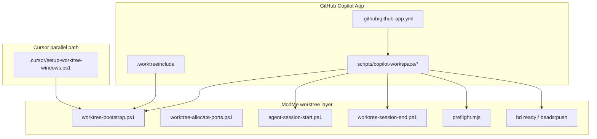

# Copilot Multi-Agent Workspace Orchestration Plan

## Current state vs target

| Artifact | Today | Target |
|----------|-------|--------|
| [`.github/github-app.yml`](.github/github-app.yml) | 2-line `automation` block only | Full repo trust config: branch prefix, lifecycle scripts, package.json run overrides, system-prompt includes |
| `.worktreeinclude` | Missing | Gitignored env/lockfile patterns aligned with [`scripts/worktree-copy-env.ps1`](scripts/worktree-copy-env.ps1) |
| Copilot lifecycle scripts | None | Thin wrappers reusing [`scripts/lib/worktree-bootstrap.ps1`](scripts/lib/worktree-bootstrap.ps1), [`scripts/agent-session-start.ps1`](scripts/agent-session-start.ps1), [`scripts/worktree-session-end.ps1`](scripts/worktree-session-end.ps1) |
| COPILOT_* env | Not wired | Generated `.copilot/workspace.generated.env` from Copilot-injected vars + port slot logic |
| Templates | Handlebars toolsets only ([`templates/toolset-*.md.hbs`](templates/toolset-single.md.hbs)) | + Copilot workspace docs + Obsidian Web Clipper JSON variants |
| Agent Gateway / Expo | Zero repo references | ADR + catalog gateway + research inbox artifacts |

Existing orchestration to **reuse** (do not duplicate):



---

## Phase 1 — GitHub Copilot App repo configuration

### 1.1 Expand `.github/github-app.yml`

Keep existing automation flags; add blocks inferred from [github/app changelog](https://github.com/github/app/blob/main/changelog.md) (v1.0.14+ trust review for scripts, system-prompt, automation):

```yaml
automation:
  auto_issue_session: true
  remote_control: true

branch:
  prefix: feature/copilot/

system-prompt:
  include:
    - AGENTS.md
    - .github/copilot-instructions.md
    - docs/multi-agent-worktrees.md

scripts:
  session.create:
    command: pwsh -NoProfile -ExecutionPolicy Bypass -File scripts/copilot-workspace/lifecycle.ps1
  session.archive:
    command: pwsh -NoProfile -ExecutionPolicy Bypass -File scripts/copilot-workspace/lifecycle.ps1
  run:
    bootstrap:
      command: pwsh -NoProfile -ExecutionPolicy Bypass -File scripts/copilot-workspace/bootstrap.ps1
    preflight:fast:
      command: yarn preflight:fast
    preflight:env:
      command: yarn preflight:env
    dev:forge:core:
      command: yarn dev:forge:core
    dev:forge:docs:
      command: yarn dev:forge:docs
    dev:forge:storybook:
      command: yarn dev:forge:storybook
    agent:status:
      command: yarn agent:status
    workbench:
      command: pwsh -NoProfile -ExecutionPolicy Bypass -File scripts/copilot-workspace/run-workbench.ps1
```

**Note:** Exact YAML keys will be validated in Copilot App → Project Settings → trust review UI (screenshot). Adjust naming if the app expects `session.create` vs nested `lifecycle` keys.

### 1.2 Create `.worktreeinclude` (repo root)

Mirror what [`worktree-copy-env.ps1`](scripts/worktree-copy-env.ps1) already copies — gitignore-syntax, **ignored files only**:

```gitignore
# secrets (by name; never commit)
.env
GenerativeUI_monorepo/apps/agent-server/.env
GenerativeUI_monorepo/apps/web-dashboard/.env.local
next-forge/packages/database/.env

# lockfiles for shared-deps bootstrap
yarn.lock
.yarnrc.yml
.yarn/
next-forge/bun.lock
GenerativeUI_monorepo/apps/agent-server/poetry.lock

# per-worktree runtime
.worktree-ports.env
.copilot/workspace.generated.env
```

Document in [`docs/multi-agent-worktrees.md`](docs/multi-agent-worktrees.md): Copilot App auto-copies via `.worktreeinclude`; Cursor path still uses explicit copy script.

### 1.3 New script package: `scripts/copilot-workspace/`

| Script | Trigger | Behavior |
|--------|---------|----------|
| `lifecycle.ps1` | `COPILOT_SCRIPT_TRIGGER=session.create\|session.archive` | Branch on trigger; log to `logs/copilot/workspace-lifecycle.jsonl` |
| `bootstrap.ps1` | `session.create` or manual Run | Map `COPILOT_ROOT_PATH` → `$SourceRoot`, `COPILOT_WORKSPACE_PATH` → worktree; dot-source [`worktree-bootstrap.ps1`](scripts/lib/worktree-bootstrap.ps1) with `-SharedDeps` |
| `generate-env.ps1` | Called by bootstrap | Write `.copilot/workspace.generated.env`: `MODME_WORKSPACE_NAME`, `MODME_ROOT_PATH`, port offsets from [`worktree-allocate-ports.ps1`](scripts/worktree-allocate-ports.ps1) using workspace folder hash; map `COPILOT_PORT` → primary forge-app bind |
| `session-start.ps1` | `session.create` | `yarn agent:session:start -TaskTitle $env:COPILOT_WORKSPACE_NAME -BootstrapIntelligence -SkipBeads` (beads optional follow-up) |
| `session-archive.ps1` | `session.archive` | `yarn preflight:fast`; optional `worktree-session-end.ps1 -SkipFinish` envelope close |
| `run-workbench.ps1` | Manual Run | Load ports → GenerativeUI web-dashboard + agent-server per [`agent-workbench-orchestration`](.agents/skills/agent-workbench-orchestration/SKILL.md) |

**COPILOT_* → ModMe env mapping** (in `generate-env.ps1`):

| Copilot var | ModMe usage |
|-------------|-------------|
| `COPILOT_SCRIPT_TRIGGER` | lifecycle branch (`session.create` / `session.archive`) |
| `COPILOT_WORKSPACE_NAME` | `-TaskTitle`, log labels |
| `COPILOT_WORKSPACE_PATH` | `$WorktreeRoot` |
| `COPILOT_ROOT_PATH` | `$SourceRoot` for env/lockfile copy |
| `COPILOT_DEFAULT_BRANCH` | PR base hint (`dev` override if differs) |
| `COPILOT_PORT` | Slot seed / primary dev server port |

### 1.4 Complement: Copilot CLI hooks (portable lean-ctx)

Update [`.github/hooks/hooks.json`](.github/hooks/hooks.json):

- Replace hardcoded `C:/Users/dylan/.gemini/.../lean-ctx.exe` with repo-relative resolver: `node scripts/resolve-lean-ctx-hook.mjs` or `yarn lean-ctx:hook rewrite`
- Add `sessionStart` / `sessionEnd` entries delegating to `scripts/copilot-workspace/lifecycle.ps1` (same code path as App)

Align with [GitHub Copilot hooks reference](https://docs.github.com/en/copilot/reference/hooks-configuration).

### 1.5 Cloud agent parity

Extend [`.github/workflows/copilot-setup-steps.yml`](.github/workflows/copilot-setup-steps.yml) job steps:

- `yarn preflight:env`
- `yarn lean-ctx:ensure`
- Optional: `node scripts/copilot-workspace/generate-env.ps1` equivalent shell for Linux (`generate-env.mjs` cross-platform)

---

## Phase 2 — Templates (Handlebars + Obsidian Web Clipper)

Follow [`docs/KNOWLEDGE_QUICKSTART.md`](docs/KNOWLEDGE_QUICKSTART.md) pattern: JSON/tooling source of truth → Handlebars → generated markdown; add parallel Obsidian JSON export.

### 2.1 Directory layout

```
templates/
  copilot-workspace/
    workspace-config.md.hbs          # github-app.yml + worktreeinclude doc
    lifecycle-script.md.hbs
    env-matrix.md.hbs
  obsidian-clipper/
    copilot-workspace-config.json    # Web Clipper import
    agent-gateway-research.json
    expo-cng-research.json
    dolt-cms-catalog-research.json
    multi-agent-orchestration-adr.json
  research/
    agent-gateway-brief.md.hbs
    expo-self-host-brief.md.hbs
scripts/knowledge-management/
  export-obsidian-clipper.mjs        # Handlebars/JSON → clipper JSON validator
```

### 2.2 Obsidian Web Clipper JSON shape

Per [Obsidian Web Clipper templates](https://obsidian.md/help/web-clipper/templates):

- `schemaVersion`, `name`, `description`
- `triggers`: URL regex (e.g. `^https://github\\.com/.+/blob/.+/github-app\\.yml`)
- `noteNameFormat`: `{{title}} — {{date}}`
- `properties`: frontmatter fields (`agent`, `type`, `severity`, `tags`, `branch`)
- `noteContentFormat`: markdown body with `{{selection}}`, `{{url}}`, `{{published}}`

Each variant targets a research domain (Agent Gateway README, Expo Router docs, Dolt CMS blog, Trunk.io, json-render).

Add `yarn docs:clipper:export` to root `package.json` (alongside existing `docs:all`).

### 2.3 Inbox integration

Generated research drops into [`GenerativeUI_monorepo/docs/inbox/`](GenerativeUI_monorepo/docs/inbox/) using existing frontmatter contract from `AGENTS.md` Inbox Capture Protocol.

---

## Phase 3 — Agent Gateway (HIGH PRIORITY)

### 3.1 Research deliverables (lean-ctx routed, low token)

Parallel agent roles per [`ai-team-orchestration`](.agents/skills/ai-team-orchestration/SKILL.md):

| Agent role | Tooling | Output |
|------------|---------|--------|
| **Research (web)** | `firecrawl-research-index` for papers; `firecrawl scrape` for agentgateway.io/README | Inbox note: routing, A2A, MCP termination |
| **Research (docs)** | `context7` via [`lean-ctx-tool-gateway.mjs`](scripts/lean-ctx-tool-gateway.mjs) | Angular components essentials (UI gateway admin) |
| **Codebase map** | `ctx_compose` + awesome-cursor skills | Map ModMe MCP catalog → gateway namespaces |

Sources:

- Upstream: https://github.com/agentgateway/agentgateway
- ModMe fork: https://github.com/Ditto190/agentgateway-modme

### 3.2 In-repo artifacts

- **ADR**: `docs/architecture/ADR-00XX-agent-gateway-mcp-routing.md` — position agentgateway as Layer 4 above existing stack in [`docs/lean-ctx/proxy-and-protocols.md`](docs/lean-ctx/proxy-and-protocols.md):

```
Client → lean-ctx MCP (repo) → agentgateway (A2A/MCP/LLM route) → upstream LLM + external MCP
```

- **Catalog**: extend [`scripts/collections/lean-ctx-agent-catalog.seed.json`](scripts/collections/lean-ctx-agent-catalog.seed.json):

```json
{
  "namespace": "agentgateway",
  "find_hint": "a2a mcp llm routing proxy",
  "mcp_server": "agentgateway-modme"
}
```

- **Config stub**: `config/agentgateway/routes.example.yaml` referencing fork repo layout (no deploy until reviewed)
- **Collection**: `collections/agent-gateway-orchestration.collection.yml` linking ADR, gateway skill, workbench orchestration

### 3.3 Cost controls

- All research agents **must** route repo reads through lean-ctx (`ctx_compose` first; no raw Read/Grep chains)
- Cap: 2 parallel research subagents + 1 synthesis pass
- Web crawl: `firecrawl search/scrape` only; paper search via `search_papers` when academic
- Multiple lean-ctx daemons: document in ADR when `LEAN_CTX_PROFILE=orchestration` vs `forge-dev` split daemons for parallel agents

---

## Phase 4 — Expo / json-render / Dolt CMS research track

Secondary parallel research (same lean-ctx + clipper template pipeline):

| Topic | Key URLs | ModMe relevance |
|-------|----------|-----------------|
| **Expo self-host** | docs.expo.dev, Expo Router, CNG/prebuild | Local OSS alternative to Vercel/Base44 for mobile + file-router lazy pages |
| **json-render** | github.com/vercel-labs/json-render | Generative UI JSON → component pipeline (align with toolsets in KNOWLEDGE_QUICKSTART) |
| **Dolt CMS catalog** | dolthub blog CMS use case | Content-management-for-a-catalog pattern for inbox/knowledge promotion |
| **Trunk.io** | docs.trunk.io | CI/merge queue complement to Copilot agent-merge |

Deliverable: inbox research bundle + Obsidian clipper templates + optional ADR sketch (`ADR-00XX-expo-self-host-stack.md`).

Semantic extraction for Dolt CMS: research agent uses `ctx_semantic_search` on inbox pipeline docs + `firecrawl read_paper`/scrape for catalog CMS constraints.

---

## Phase 5 — Documentation and verification

### 5.1 Docs to add/update

| File | Content |
|------|---------|
| [`docs/copilot-workspace-orchestration.md`](docs/copilot-workspace-orchestration.md) | **New** canonical guide: github-app.yml, COPILOT_* table, Run scripts menu, Cursor vs Copilot paths |
| [`docs/multi-agent-worktrees.md`](docs/multi-agent-worktrees.md) | Add Copilot App section + `.worktreeinclude` |
| [`AGENTS.md`](AGENTS.md) | Copilot workspace quick commands |
| [`CHANGELOG.md`](CHANGELOG.md) | Unreleased entry |

### 5.2 Preflight + tests

Extend [`scripts/preflight.manifest.json`](scripts/preflight.manifest.json) profile `copilot-workspace`:

- Validate `.github/github-app.yml` parses
- `.worktreeinclude` patterns non-empty
- `scripts/copilot-workspace/*.ps1` exist
- Smoke: `node scripts/__tests__/copilot-workspace-config.test.mjs`

Run matrix:

```powershell
yarn preflight:env
yarn preflight:worktree
yarn preflight:fast
# Manual: trust + session.create in Copilot App UI
```

### 5.3 Beads tracking

Create beads issues (prefix `modme`):

1. `copilot-workspace-config` — Phase 1
2. `obsidian-clipper-templates` — Phase 2
3. `agentgateway-adr-research` — Phase 3 (HIGH)
4. `expo-cms-research` — Phase 4

---

## Implementation order

1. **`.worktreeinclude` + `scripts/copilot-workspace/`** — unblocks Copilot App worktrees immediately
2. **Expand `github-app.yml`** — trust review in App UI
3. **Fix portable hooks + generate-env** — CLI/Cursor parity
4. **Handlebars + Obsidian clipper templates** — parallel with config work
5. **Agent Gateway ADR + catalog** — HIGH priority research synthesis
6. **Expo/CMS research + docs** — secondary
7. **Preflight profile + tests + beads close**

---

## Worktree policy

All implementation in an agent worktree (not main checkout):

```powershell
.\scripts\new-agent-worktree.ps1 -Name "copilot-workspace-orchestration" -Owner cursor
yarn workspace:bootstrap:shared
```

PR target: `dev`.

---

## Risks and mitigations

| Risk | Mitigation |
|------|------------|
| `github-app.yml` schema undocumented publicly | Validate via Copilot App trust UI; keep scripts idempotent |
| Windows cmd vs pwsh (changelog v1.0.14) | Explicit `pwsh -NoProfile` in all script commands |
| Duplicate bootstrap (Cursor + Copilot) | Shared `worktree-bootstrap.ps1`; detect `ROOT_WORKTREE_PATH` / `COPILOT_ROOT_PATH` |
| Secrets in worktree copy | `.worktreeinclude` copies by name only; never commit `.env` |
| Agent Gateway scope creep | Phase 3 stops at ADR + config stub unless fork is ready |
