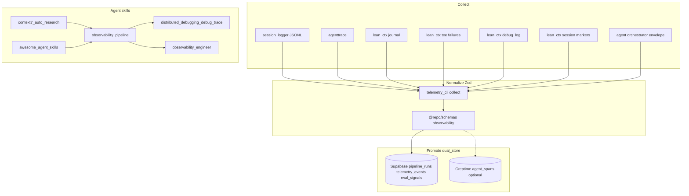

# Distributed Observability + lean-ctx Integration Plan

## Current state (what we build on)

ModMe already has **~70% of the plumbing**; this plan connects the gaps rather than greenfield.

| Layer              | Exists                                                                                                                                                                                                                          | Gap                                                          |
| ------------------ | ------------------------------------------------------------------------------------------------------------------------------------------------------------------------------------------------------------------------------- | ------------------------------------------------------------ |
| Session logs       | [`.github/hooks/session-logger/session-logger.ps1`](.github/hooks/session-logger/session-logger.ps1) → `logs/copilot/*.log`                                                                                                     | Not correlated with lean-ctx                                 |
| Agent audit        | `agenttrace` + [`scripts/agent-audit.mjs`](scripts/agent-audit.mjs)                                                                                                                                                             | Not in telemetry collect                                     |
| Telemetry pipeline | [`scripts/telemetry/telemetry-cli.mjs`](scripts/telemetry/telemetry-cli.mjs) + [`telemetry-bridge.mjs`](scripts/telemetry/lib/telemetry-bridge.mjs)                                                                             | Collects session-logger only; **no lean-ctx sources**        |
| lean-ctx data      | [`.lean-ctx.toml`](.lean-ctx.toml) + [`scripts/load-lean-ctx-env.ps1`](scripts/load-lean-ctx-env.ps1)                                                                                                                           | `LEAN_CTX_DEBUG_LOG` not wired; journal/tee not ingested     |
| Contracts          | [`docs/inbox-pipeline/contracts/observability-contract.v1.json`](docs/inbox-pipeline/contracts/observability-contract.v1.json) + [`next-forge/packages/schemas/observability.ts`](next-forge/packages/schemas/observability.ts) | Golden tests only; no DB integration tests                   |
| CI                 | [`.github/workflows/observability-pipeline-check.yml`](.github/workflows/observability-pipeline-check.yml)                                                                                                                      | Missing lean-ctx paths + migration triggers                  |
| Skills             | [`.cursor/skills/observability-pipeline/SKILL.md`](.cursor/skills/observability-pipeline/SKILL.md)                                                                                                                              | Prereq skills not installed; no orchestrator for debug-trace |

**Default scope:** local-first (JSONL + Supabase `pipeline_runs` / `telemetry_events` / `eval_signals`). Greptime OTel spans remain an **optional Phase 5** behind env flag — matches [`docs/evaluation/ARCHITECTURE.md`](docs/evaluation/ARCHITECTURE.md) batch/offline bias.

---

## Target architecture



**Correlation key:** `session_id` propagated as `AGENT_SESSION_ID` / `CURSOR_SESSION_ID` across session-logger, lean-ctx markers, telemetry `pipeline_runs.metadata`, and eval collect.

---

## Phase 0 — Skill bootstrap and research layer

### 0a. Install prerequisite skills via awesome-agent-skills

Use [`/.cursor/skills/awesome-agent-skills/SKILL.md`](.cursor/skills/awesome-agent-skills/SKILL.md) + `skills-sh` MCP ([`.cursor/mcp.json`](.cursor/mcp.json)) to ensure these are available globally:

- `distributed-debugging-debug-trace`
- `observability-monitoring-monitor-setup`
- `observability-engineer`
- `error-debugging-error-trace`
- `context7-auto-research` (or `context7-mcp`)

Document install commands in a new tracked file: `docs/observability/skills-bootstrap.md`.

### 0b. Enable Context7 at repo root

Context7 MCP currently lives only in [`GenerativeUI_monorepo/mcp.json`](GenerativeUI_monorepo/mcp.json). Add `context7` to root [`.cursor/mcp.json`](.cursor/mcp.json) (or workspace MCP config) with `CONTEXT7_API_KEY` from `.env`.

**context7-auto-research usage points** (before changing contracts):

- OpenTelemetry + Greptime export semantics
- Supabase RLS + `service_role` ingest patterns (per [`supabase` skill](.claude/skills/supabase/SKILL.md))
- Prisma `db push` vs `supabase db push` ordering (ModMe hybrid)

---

## Phase 1 — Orchestrator skill (agent playbook)

Create **`.agents/skills/modme-distributed-observability/SKILL.md`** (project-scoped, tracked) that composes:

| Skill                                    | Role in playbook                                      |
| ---------------------------------------- | ----------------------------------------------------- |
| `observability-pipeline`                 | ModMe-specific commands, contracts, CI                |
| `distributed-debugging-debug-trace`      | Trace boundaries, correlation IDs, debug log policy   |
| `observability-monitoring-monitor-setup` | Metrics/dashboards/SLO checklist                      |
| `observability-engineer`                 | SRE review rubric for alerts + runbooks               |
| `lean-ctx`                               | Read modes + `LEAN_CTX_DEBUG_LOG` / journal / archive |
| `awesome-agent-skills`                   | Discover/install missing deps                         |
| `context7-auto-research`                 | Verify library semantics before schema changes        |
| `supabase`                               | RLS, advisors, migration safety                       |

**Playbook sections:**

1. Session start checklist (`ctx_session load`, `load-lean-ctx-env.ps1`, `AGENT_SESSION_ID`)
2. During work (lean-ctx tools only; `LEAN_CTX_DEBUG_LOG=1` when debugging loops)
3. Session end (`telemetry:sync`, `agenttrace --latest`, `agent-eval-report`)
4. Incident response (tee failures, `lean-ctx debug-log`, envelope + markers)

Extend [`.cursor/skills/observability-pipeline/SKILL.md`](.cursor/skills/observability-pipeline/SKILL.md) with a `Related skills` link to the new orchestrator (avoid duplicating command tables).

Add lean-ctx task profile to [`.lean-ctx.toml`](.lean-ctx.toml):

```toml
[task_profiles.observability-work]
compression_level = "standard"
tee_mode = "always"
debug_log = true   # opt-in trace for observability sessions
```

---

## Phase 2 — lean-ctx → telemetry collect bridge

### 2a. New collect adapters in telemetry-cli

Extend [`scripts/telemetry/telemetry-cli.mjs`](scripts/telemetry/telemetry-cli.mjs) with collectors (mirror `collectSessionEvents()` pattern):

| Source path                                          | Event `source`     | Notes                               |
| ---------------------------------------------------- | ------------------ | ----------------------------------- |
| `logs/lean-ctx/journal*`                             | `lean-ctx-journal` | Human activity log                  |
| `logs/lean-ctx/tee/`                                 | `lean-ctx-tee`     | Shell hook failure captures         |
| `lean-ctx debug-log` output                          | `lean-ctx-debug`   | MCP routing trace                   |
| `.cursor/hooks/state/lean-ctx-session-markers.jsonl` | `lean-ctx-marker`  | Adoption + session correlation      |
| `data/lean-ctx/archive/` metadata                    | `lean-ctx-archive` | Reference IDs only (no full bodies) |

Shared metadata on every event:

```json
{ "session_id": "...", "tenant_id": "...", "worktree": "...", "branch": "..." }
```

### 2b. Session lifecycle env wiring

Update [`scripts/agent-session-start.ps1`](scripts/agent-session-start.ps1) and [`scripts/agent-session-finish.ps1`](scripts/agent-session-finish.ps1):

1. Dot-source [`scripts/load-lean-ctx-env.ps1`](scripts/load-lean-ctx-env.ps1)
2. Set `AGENT_SESSION_ID` = envelope UUID
3. Set `LEAN_CTX_DEBUG_LOG=1` only when `-DebugTrace` flag or `OBSERVABILITY_DEBUG=1` (not default — production-safe)
4. Append `trace.lean_ctx` paths to session envelope JSON

### 2c. Contract extension

Add lean-ctx event sources to:

- [`docs/inbox-pipeline/contracts/observability-contract.v1.json`](docs/inbox-pipeline/contracts/observability-contract.v1.json)
- [`next-forge/packages/schemas/observability.ts`](next-forge/packages/schemas/observability.ts)
- Golden fixture [`next-forge/packages/schemas/fixtures/observability-contract.golden.json`](next-forge/packages/schemas/fixtures/observability-contract.golden.json)

Zod enum: `telemetryEvent.source` += `lean-ctx-journal`, `lean-ctx-tee`, `lean-ctx-debug`, `lean-ctx-marker`.

---

## Phase 3 — Supabase + Prisma data quality tests

### 3a. Contract tests (extend existing)

Keep [`yarn telemetry:test:contracts`](package.json) as fast gate. Add Vitest cases for new lean-ctx source enums and sample payloads.

### 3b. Integration tests (new — highest value gap)

Create `scripts/__tests__/observability-integration.test.mjs` (or `next-forge/packages/observability` integration suite):

| Test              | Validates                                                                                                       |
| ----------------- | --------------------------------------------------------------------------------------------------------------- |
| Migration smoke   | `009_observability_tenant.sql` tables exist (`pipeline_runs`, `telemetry_events`, `eval_signals`, `trace_refs`) |
| RLS policy        | `service_role` insert succeeds; `authenticated` read scoped by `tenant_id`                                      |
| Bridge dry-run    | `telemetry-cli sync --dry-run` emits valid Zod payloads for lean-ctx fixtures                                   |
| Prisma round-trip | `@repo/database` models match Supabase columns for observability tables                                         |
| Inbox cross-check | `inbox-audit --lens pipeline` embedding dim still 384 (regression guard)                                        |

**Trigger CI on migration changes:** extend [`.github/workflows/inbox-pipeline-check.yml`](.github/workflows/inbox-pipeline-check.yml) paths to include `next-forge/supabase/migrations/**`.

### 3c. Supabase advisors gate (optional CI job)

Add advisory step using Supabase MCP `get_advisors` or `supabase db advisors` (CLI v2.81.3+) on PRs touching `next-forge/supabase/migrations/**` — non-blocking initially.

---

## Phase 4 — Monitoring setup + runbooks

Per **observability-monitoring-monitor-setup** and **observability-engineer** skills:

### 4a. Local dashboards (no paid SaaS)

- HTML report: `yarn telemetry:report` → `reports/observability/latest.html`
- Eval report: `scripts/agent-eval-report.mjs`
- agenttrace: `yarn agenttrace --overview`

### 4b. Runbook docs

Create `docs/observability/runbooks/`:

| Runbook                    | Trigger                            |
| -------------------------- | ---------------------------------- |
| `loop-detected.md`         | lean-ctx `blocked_threshold` fired |
| `tee-failure.md`           | `logs/lean-ctx/tee/` new file      |
| `telemetry-sync-failed.md` | `pipeline_runs.status = failed`    |
| `supabase-rls-denied.md`   | ingest 42501 / policy violation    |

### 4c. SLO definitions (team scale)

| SLI                       | Target                                    | Source                              |
| ------------------------- | ----------------------------------------- | ----------------------------------- |
| Session capture rate      | >95% sessions have envelope + session.log | `logs/agent-orchestrator/sessions/` |
| lean-ctx adoption         | ctx\_\* used in >80% agent sessions       | markers + agenttrace                |
| Telemetry promote success | sync dry-run passes on PR                 | CI                                  |
| Inbox contract violations | 0 errors on `--strict` funnel lens        | `yarn inbox:audit`                  |

---

## Phase 5 — Optional Greptime / OTel spans

Only if `GREPTIME_OTEL_ENABLED=1`:

- Wire [`src/lib/observability/greptime-config.ts`](src/lib/observability/greptime-config.ts) into agent session start (TS) and [`agent/observability/greptime_config.py`](agent/observability/greptime_config.py) into FastAPI lifespan
- Extend [`telemetry-bridge.mjs`](scripts/telemetry/lib/telemetry-bridge.mjs) `trace_refs` dual-write (already scaffolded in contract)
- Span attributes: `session_id`, `tenant_id`, `tool_name`, `lean_ctx_mode`

Defer until local-first pipeline is green.

---

## Phase 6 — CI + docs updates

### CI changes

[`.github/workflows/observability-pipeline-check.yml`](.github/workflows/observability-pipeline-check.yml):

- Add paths: `.lean-ctx.toml`, `scripts/load-lean-ctx-env.ps1`, `logs/lean-ctx/**` fixtures, lean-ctx collect tests
- Add job: `lean-ctx-config-validate` (`lean-ctx config validate` + duplicate-key check from ensure script)
- Wire `yarn telemetry:test` to include new integration tests when `SUPABASE_*` secrets present (continue-on-error otherwise)

### Docs

- Update [`docs/evaluation/ARCHITECTURE.md`](docs/evaluation/ARCHITECTURE.md) — add lean-ctx as first-class collect source
- Update [`docs/lean-ctx/data-dictionary.md`](docs/lean-ctx/data-dictionary.md) — observability correlation section
- New `docs/observability/README.md` — single entry point (replaces scattered `.agents/orchestrator_observability/` notes)

---

## File change summary

| Action | Path                                                                                                         |
| ------ | ------------------------------------------------------------------------------------------------------------ |
| Create | `.agents/skills/modme-distributed-observability/SKILL.md`                                                    |
| Create | `docs/observability/README.md`, `docs/observability/skills-bootstrap.md`, `docs/observability/runbooks/*.md` |
| Extend | `scripts/telemetry/telemetry-cli.mjs` (lean-ctx collectors)                                                  |
| Extend | `scripts/agent-session-start.ps1`, `scripts/agent-session-finish.ps1`                                        |
| Extend | `observability-contract.v1.json`, `observability.ts`, golden fixtures                                        |
| Extend | `.lean-ctx.toml` (`task_profiles.observability-work`)                                                        |
| Extend | `.github/workflows/observability-pipeline-check.yml`                                                         |
| Create | `scripts/__tests__/observability-integration.test.mjs`                                                       |
| Update | `.cursor/mcp.json` (context7), `docs/evaluation/ARCHITECTURE.md`                                             |

---

## Verification checklist

```powershell
. .\scripts\load-lean-ctx-env.ps1
lean-ctx config validate
yarn lean-ctx:ensure -- -CheckOnly
yarn telemetry:test:contracts
node scripts/telemetry/telemetry-cli.mjs sync --dry-run
yarn inbox:test
yarn agent:session:start   # envelope + markers
# ... agent work ...
yarn telemetry:sync
yarn agenttrace --latest
```

Success criteria:

- lean-ctx journal/tee/markers appear in dry-run collect output
- All Zod contracts pass including new `source` enums
- Session envelope `trace` block lists lean-ctx paths
- CI observability workflow passes on PR
