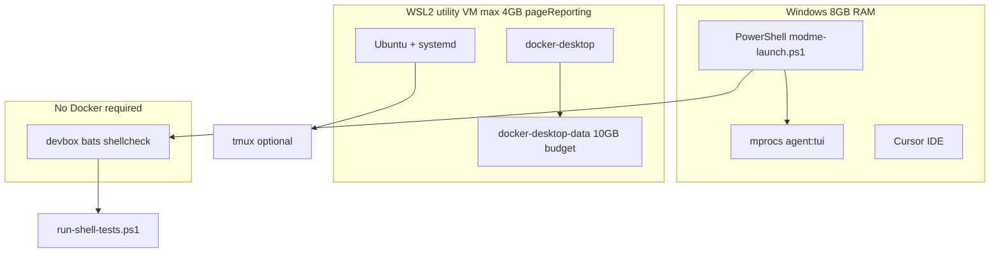

# Docker + WSL2 Resource-Tuned Setup (8 GB RAM / 8 GB VRAM)

## Goals (updated)

| Constraint | Target |
|------------|--------|
| System RAM | 8 GB (+ 8 GB VRAM — GPU memory is separate; WSL caps apply to system RAM only) |
| Docker/WSL memory | **2–4 GB effective**, dynamic return to host when idle |
| Docker disk | **~10 GB budget** (fresh VHDX + cap + prune), down from ~20 GB used |
| Virtualization | **WSL2 kernel backend** — not Docker Desktop Hyper-V backend |
| Bash dependency | **Remove** from Windows launch path; devbox/PowerShell first |
| Orchestration | **mprocs** (`yarn agent:tui`) on Windows; **tmux** optional via WSL+systemd |
| Toolchain layering | **devbox** (Nix tools) + **devcontainer** (optional Docker) + **direnv** (WSL/devcontainer only) |

## What is broken today

```
WSL (10 - Relay) ERROR: execvpe(/bin/bash) failed: No such file or directory
```

Root causes:

1. WSL relay exists but **no Ubuntu (or Git Bash) with `/bin/bash`**
2. `yarn test:shell` → npm global `bats` → broken WSL bash relay
3. [`scripts/modme-launch.mjs`](scripts/modme-launch.mjs) is PowerShell-first on Windows (good), but health checks still call `bats` on PATH which hits the same relay
4. Docker likely **unbounded** in WSL2 utility VM — starves 8 GB RAM
5. `docker-desktop-data` VHDX **~20 GB** with no shrink path except reset



---

## microVM.nix → WSL/Docker mapping

From [inbox microvm.nix options](GenerativeUI_monorepo/docs/inbox/web-clipper/2026-07-11T21-48-30_snippet_researcher_Configuration options.md) — we apply the **resource-control intent**, not NixOS microVM itself (Windows has no microvm.nix module).

| microvm.nix option | ModMe Windows equivalent | Planned value |
|--------------------|--------------------------|---------------|
| `microvm.hypervisor` | Docker backend choice | **WSL2 engine** (Linux kernel in utility VM), **not** Hyper-V Docker VM |
| `microvm.vcpu` | `.wslconfig` `processors` | `2` |
| `microvm.mem` | `.wslconfig` `memory` | `4GB` pool max; Docker workloads target **2–4 GB** within pool |
| `microvm.volumes` | `docker-desktop-data` VHDX | Factory reset + **10 GB** budget (cap + prune) |
| `microvm.forwardPorts` | Worktree port slots | [`scripts/load-worktree-ports.ps1`](scripts/load-worktree-ports.ps1) + devcontainer forwards 3100–6106 |
| `microvm.interfaces` | WSL networking | `localhostForwarding=true` |
| `microvm.kernelParams` | WSL kernel tuning | `pageReporting=true` (dynamic memory return) |
| `microvm.shares` | Bind mounts | Repo bind-mounts in devcontainer; WSL `/mnt/c/...` for optional Linux tools |

**Not applicable on Windows:** `vfkit`, `qemu`, Rosetta, PCI passthrough — those are macOS/Linux microVM hypervisors.

---

## Toolchain layering (devbox / devcontainer / direnv)

### devbox — primary Windows toolchain ([`devbox.json`](devbox.json))

Per [use-devbox skill](.agents/skills/use-devbox/SKILL.md):

- **bats**, **shellcheck**, node, yarn already declared
- `devbox run -- bats scripts/bats/` — **no WSL, no Docker**
- Add devbox script `"test-shell"` in `devbox.json` for discoverability
- First run downloads Nix packages (one-time cost); cached after

### devcontainer — optional, Docker-heavy ([`.devcontainer/devcontainer.json`](.devcontainer/devcontainer.json))

Per [devcontainer-setup skill](.agents/skills/devcontainer-setup/SKILL.md):

- Uses `docker-in-docker` feature — consumes from the **same 4 GB WSL pool**
- On 8 GB RAM: **do not** run devcontainer + `yarn dev:forge:core` + Docker stacks simultaneously
- Use devcontainer only for isolated full-stack repro; daily driver stays **bare PowerShell + yarn**

### direnv — WSL/devcontainer only (no `.envrc` in repo today)

Per [direnv skill](.agents/skills/direnv/SKILL.md):

- direnv hooks require **bash** — not native Windows PowerShell
- Plan: add optional [`.envrc`](.envrc) (committed, no secrets) for **Ubuntu WSL** and devcontainer:

```bash
# .envrc — loaded in WSL/devcontainer only
dotenv_if_exists
watch_file devbox.json package.json
if has devbox; then
  eval "$(devbox shellenv)"
fi
export MODME_REPO_ROOT="$(pwd)"
PATH_add scripts
```

- Windows path uses [`scripts/modme-launch.ps1`](scripts/modme-launch.ps1) + port loader instead of direnv
- Add `.envrc.local` to `.gitignore` if not already

---

## Phase 1 — Audit

Create [`scripts/docker-wsl-doctor.ps1`](scripts/docker-wsl-doctor.ps1) (PowerShell-windows patterns: ASCII only, parenthesized `-or` tests):

```powershell
wsl --status
wsl -l -v
docker context ls
docker info 2>$null | Select-String "Operating System|WSL|Hyper-V"
Get-ChildItem "$env:LOCALAPPDATA\Docker\wsl" -Recurse -Filter "*.vhdx" -ErrorAction SilentlyContinue |
  Select-Object FullName, @{N='SizeGB';E={[math]::Round($_.Length/1GB,2)}}
Get-Content "$env:USERPROFILE\.wslconfig" -ErrorAction SilentlyContinue
```

---

## Phase 2 — `.wslconfig` (global WSL2 resource pool)

Create/edit `C:\Users\dylan\.wslconfig`:

```ini
[wsl2]
memory=4GB
processors=2
swap=2GB
localhostForwarding=true
pageReporting=true
guiApplications=false
```

**Dynamic memory behavior:**

- WSL2 does **not** expose per-distro RAM sliders like microVM `mem` at runtime
- `pageReporting=true` returns idle pages to Windows — this is the **dynamic** behavior
- Docker + Ubuntu **share** the 4 GB pool; keep Docker stopped when not building containers
- Effective Docker budget: **2–4 GB** while containers run; near **0** when `wsl --shutdown` or Docker quit

Apply:

```powershell
wsl --shutdown
Start-Sleep -Seconds 8
```

---

## Phase 3 — Ubuntu WSL2 + systemd

```powershell
wsl --update
wsl --install -d Ubuntu
wsl --set-default-version 2
wsl --set-default Ubuntu
```

Inside Ubuntu (one-time), enable systemd per Microsoft WSL docs:

```bash
sudo tee /etc/wsl.conf >/dev/null <<'EOF'
[boot]
systemd=true

[interop]
enabled=true
appendWindowsPath=true
EOF
```

Then from PowerShell:

```powershell
wsl --shutdown
wsl -d Ubuntu -e bash -lc "systemctl is-system-running || true; which bash"
```

**Why systemd:** enables `systemctl` for future Linux-side services (optional Firecrawl/turbo-cache in WSL instead of Docker Desktop when you want lighter isolation).

---

## Phase 4 — Docker Desktop: WSL2 kernel backend (not Hyper-V)

**Docker Desktop → Settings:**

| Setting | Value |
|---------|-------|
| General → Use the WSL 2 based engine | **On** |
| General → Use Hyper-V / legacy backend | **Off** |
| Resources → WSL Integration → Ubuntu | **On** |
| Resources → Advanced → Disk image max | **10240 MB (10 GB)** if slider available |

If disk slider is grayed (WSL2 defers to `.wslconfig`), set via `%APPDATA%\Docker\settings-store.json` after quit:

```json
"diskSizeMiB": 10240
```

(Exact key varies by Docker Desktop version — doctor script should print current settings path.)

Verify:

```powershell
docker run --rm hello-world
docker info | Select-String "WSL"
```

---

## Phase 5 — Factory reset Docker data (10 GB fresh start)

You approved wipe. **Only** unregister Docker-managed distros:

```powershell
# Quit Docker Desktop fully
wsl --shutdown
wsl --unregister docker-desktop-data
wsl --unregister docker-desktop
Remove-Item "$env:LOCALAPPDATA\Docker\wsl\data\ext4.vhdx" -Force -ErrorAction SilentlyContinue
# Start Docker Desktop — recreates distros
```

**Ongoing 10 GB budget** (docker-expert maintenance):

```powershell
docker system prune -af --volumes   # periodic
docker system df                    # monitor
```

Add optional scheduled task or `yarn docker:prune` script calling doctor + prune when VHDX > 8 GB.

**Note:** VHDX files are sparse but **do not auto-shrink** after prune; if usage grows past 10 GB again, repeat factory reset or `Optimize-VHD` (requires Hyper-V PowerShell module — optional advanced step).

---

## Phase 6 — Terminal orchestration (agent-terminal-orchestration)

Align with [agent-terminal-orchestration skill](.worktrees/dev-agent-cursor-serena-mcp-adr/.cursor/skills/agent-terminal-orchestration/SKILL.md) and [`setup-worktree-windows.ps1`](.cursor/setup-worktree-windows.ps1):

### Primary: mprocs (Windows-native, no bash)

```powershell
. .\scripts\load-worktree-ports.ps1
yarn agent:tui    # npx mprocs — multi-process dev dashboard
yarn agent:status
```

Install check in doctor: `Get-Command mprocs` or rely on `npx --yes mprocs`.

### Secondary: tmux (WSL, after Ubuntu+systemd)

```powershell
yarn worktree:tmux:ps -Command status   # uses agent-workspace-tmux.ps1
```

[`scripts/agent-workspace-tmux.ps1`](scripts/agent-workspace-tmux.ps1) already falls back with clear error → use `yarn agent:tui`.

### Worktree session lifecycle (unchanged)

```powershell
yarn agent:session:start
yarn launch:health
.\scripts\agent-session-finish.ps1 -VerifyStack ...
```

Update doctor to verify: ports loaded, mprocs reachable, WSL Ubuntu optional.

---

## Phase 7 — Shell tests without bare `/bin/bash` on Windows

### Problem

[`package.json`](package.json) `"test:shell": "bats scripts/bats/"` + npm global bats → broken WSL relay.

[`scripts/modme-launch.ps1`](scripts/modme-launch.ps1) lines 127–131 calls `yarn test:shell` when `bats` on PATH — same failure.

### Solution: `scripts/run-shell-tests.ps1`

PowerShell dispatcher (powershell-windows skill):

```powershell
# Priority order:
# 1. devbox run -- bats scripts/bats/
# 2. Git Bash: C:\Program Files\Git\bin\bash.exe -lc 'bats scripts/bats/'
# 3. WSL Ubuntu: wsl -d Ubuntu -- bash -lc 'cd ... && bats scripts/bats/'
# 4. Exit 0 advisory with [WARN] if none available (launch:health)
```

### package.json change

```json
"test:shell": "powershell -NoProfile -ExecutionPolicy Bypass -File ./scripts/run-shell-tests.ps1"
```

### devbox.json addition

```json
"test-shell": ["bats scripts/bats/"]
```

### modme-launch.ps1 change

Replace raw `Get-Command bats` check with `run-shell-tests.ps1 -Advisory` flag.

### bats tests stay bash ([`scripts/bats/test_helper.bash`](scripts/bats/test_helper.bash))

- Keep `#!/usr/bin/env bash`, `set -euo pipefail` in new helpers
- `run_pwsh` / `run_pwsh_file` already follow bash-scripting + powershell-windows bridge pattern
- Add `km-beads.bats` + `worktree-doctor.bats` to CI advisory path in launch health

---

## Phase 8 — Documentation and repo integration

Add [`docs/windows-docker-wsl-setup.md`](docs/windows-docker-wsl-setup.md):

- Hardware tiers (8 / 16 / 32 GB `.wslconfig` templates)
- WSL2 vs Hyper-V backend clarification
- microVM.nix analogy table (this plan)
- devbox / devcontainer / direnv decision tree
- Factory reset + 10 GB disk budget
- mprocs vs tmux orchestration
- Link from [`docs/debug-launch-guide.md`](docs/debug-launch-guide.md) and [`docs/multi-agent-worktrees.md`](docs/multi-agent-worktrees.md)

Optional: extend [`scripts/worktree-doctor.ps1`](scripts/worktree-doctor.ps1) with `-CheckDockerWsl` calling `docker-wsl-doctor.ps1`.

---

## Daily workflow on 8 GB RAM (recommended)

| Task | Command | Docker? |
|------|---------|---------|
| Forge dev | `yarn dev:forge:core` | No |
| Agent TUI | `yarn agent:tui` | No |
| Shell tests | `yarn test:shell` → devbox-first | No |
| KM verify | `yarn km:verify` | No |
| Devcontainer | Reopen in Container | Yes — quit other heavy apps first |
| Firecrawl / turbo cache | `yarn firecrawl:up` | Yes — on demand only |
| DB | Cloud Supabase | No local Docker |

---

## Risk notes

- **8 GB RAM** remains tight; VRAM does not expand system RAM for WSL
- **4 GB WSL pool** is a hard cap; devcontainer + forge + browser may OOM — stagger workloads
- **10 GB disk** requires discipline; images accumulate fast
- **direnv on Windows** native pwsh is unsupported — use modme-launch or WSL
- Factory reset is **irreversible** for Docker images/volumes (approved)

## Success criteria

- [ ] `wsl -l -v` — Ubuntu + docker distros on VERSION 2
- [ ] `%USERPROFILE%\.wslconfig` — 4 GB pool, `pageReporting=true`
- [ ] Ubuntu `/etc/wsl.conf` — `systemd=true`; `systemctl` responds
- [ ] Docker Desktop — WSL2 engine; `docker info` shows WSL; Hyper-V backend off
- [ ] `ext4.vhdx` — fresh < 3 GB after reset; monitoring for 10 GB budget
- [ ] `yarn test:shell` passes via **devbox** without WSL bash relay
- [ ] `yarn launch:health` passes on Windows without `/bin/bash` errors
- [ ] `yarn agent:tui` (mprocs) launches; tmux optional via WSL
- [ ] Task Manager — `VmmemWSL` drops after `wsl --shutdown` / Docker quit
