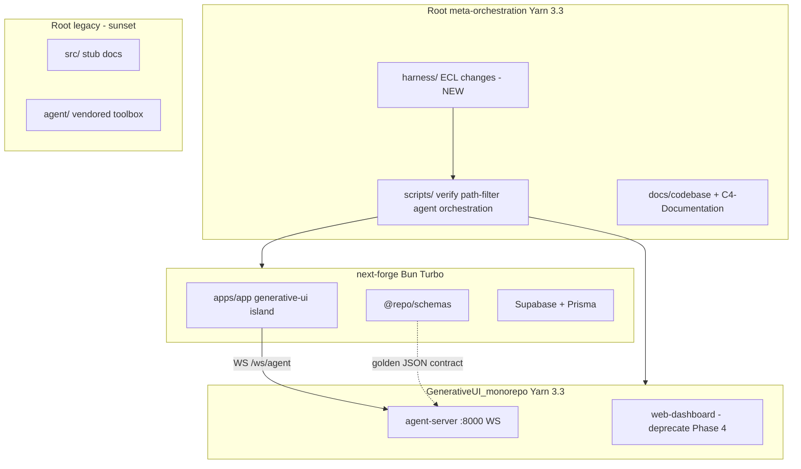
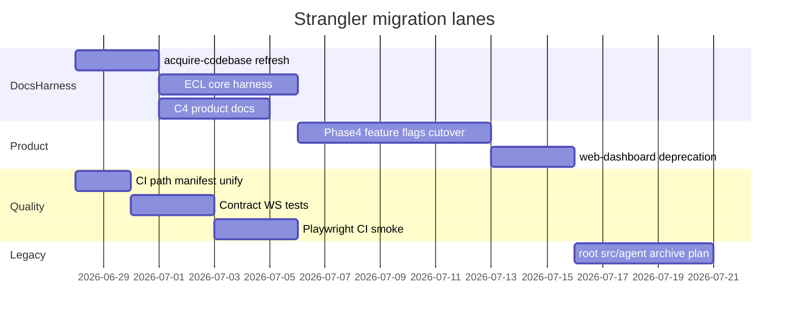

# Dual-Monorepo Quality, Architecture, and Harness Plan

## Executive verdict

**Do not physically merge** `next-forge/` (Bun) and `GenerativeUI_monorepo/` (Yarn 3) into one package-manager monorepo. That conflicts with [`.cursor/rules/monorepo-boundaries.mdc`](.cursor/rules/monorepo-boundaries.mdc), your learned preference against Nx/meta-unification, and the active [`.agents/skills/modme-generative-ui-migrate/SKILL.md`](.agents/skills/modme-generative-ui-migrate/SKILL.md) strangler migration.

**Do reconfigure for efficiency** via:

1. **Meta-orchestration** (already partial at root: `yarn dev:*`, `yarn verify:*`, `yarn agent:*`, worktrees)
2. **ECL harness** (missing today; high ROI for agent reliability)
3. **Documentation truth** (`docs/codebase/*` + C4 + ADR alignment)
4. **Distributed contract testing** (schema golden JSON exists; extend to WS + CI matrix)
5. **Legacy stack sunset** (root `src/`/`agent/` + CLAUDE.md drift)



---

## Phase 0 — Baseline (read-only, this session output)

Run in a **worktree** (not main checkout per [`.cursor/rules/multi-agent-worktrees.mdc`](.cursor/rules/multi-agent-worktrees.mdc)):

```powershell
.\scripts\new-agent-worktree.ps1 -Name "monorepo-audit" -Owner cursor
python .agents/skills/acquire-codebase-knowledge/scripts/scan.py --output docs/codebase/.codebase-scan.txt
yarn verify:forge
yarn verify:generative
yarn worktree:doctor
```

Capture baseline pass/fail before any harness edits (ECL skill Phase 1.3 requirement).

---

## Phase 1 — Thermo-nuclear code quality review (findings + remediation)

Apply [`.cursor/skills/thermo-nuclear-code-quality-review/SKILL.md`](.cursor/skills/thermo-nuclear-code-quality-review/SKILL.md) to **branch diff + structural debt**. Presumptive blockers already visible:

### P0 — Structural regressions / missed code-judo

| Finding                                      | Evidence                                                                                                                                                              | Remedy                                                                                                                                        |
| -------------------------------------------- | --------------------------------------------------------------------------------------------------------------------------------------------------------------------- | --------------------------------------------------------------------------------------------------------------------------------------------- |
| **Triple agent surface** confuses agents     | `CLAUDE.md` → root `src/`/`agent/`; `AGENTS.md` → dual monorepos; `docs/codebase/STRUCTURE.md` omits `next-forge/` entirely                                           | Single **canonical map** in `docs/agent-index.md` + slim `AGENTS.md` (target 80–120 lines per ECL); mark root stack `legacy/deprecated`       |
| **Documentation lies about primary entry**   | [`docs/codebase/STRUCTURE.md`](docs/codebase/STRUCTURE.md) lists only GenerativeUI; ignores next-forge primary status in [`docs/agent-index.md`](docs/agent-index.md) | Refresh all 7 acquire docs (Phase 2)                                                                                                          |
| **CI path-filter duplication**               | [`.github/workflows/ci.yml`](.github/workflows/ci.yml) `dorny/paths-filter` vs [`scripts/lib/path-filter.mjs`](scripts/lib/path-filter.mjs)                           | Extract shared filter manifest `scripts/lib/stack-paths.json`; both CI and pre-push import it                                                 |
| **Test runner fragmentation (GenerativeUI)** | Jest / Vitest / node:test / pytest per package                                                                                                                        | Standardize JS on Vitest for active apps; keep pytest for agent-server only; delete or quarantine example-\* runners from default `yarn test` |
| **Playwright not in CI**                     | [`docs/codebase/TESTING.md`](docs/codebase/TESTING.md), [`next-forge/playwright.config.ts`](next-forge/playwright.config.ts)                                          | Add opt-in CI job `e2e-smoke` (generative-ui + health) with service containers or `webServer` block                                           |

### P1 — Boundary / abstraction / type contract

| Finding                                                              | Remedy                                                                                                                                                                        |
| -------------------------------------------------------------------- | ----------------------------------------------------------------------------------------------------------------------------------------------------------------------------- |
| Schema dual-home (`@generative-ui/shared-schemas` + `@repo/schemas`) | Phase 4 cutover: `@repo/schemas` canonical; shared-schemas read-only until web-dashboard deleted                                                                              |
| Golden contract exists but WS message types not fully gated          | Add Vitest fixture tests mirroring [`use-agent-state.ts`](<next-forge/apps/app/app/(authenticated)/generative-ui/hooks/use-agent-state.ts>) message union against golden JSON |
| `AGENTS.md` at ~220 lines with duplicated lean-ctx blocks            | Move learned prefs to `docs/agent-tech-guide.md`; keep AGENTS as map only                                                                                                     |

### P2 — File size / spaghetti

| Area           | Signal                                                                                                    | Action                                                                                                 |
| -------------- | --------------------------------------------------------------------------------------------------------- | ------------------------------------------------------------------------------------------------------ |
| Root `agent/`  | 1283 tracked files, vendored `genai-toolbox`, large GIFs                                                  | Move to `vendor/` or git-submodule; exclude from agent context via `.cursorignore` / lean-ctx excludes |
| Scan noise     | `.conda/`, `.vendor/` in metrics ([`docs/codebase/.codebase-scan.txt`](docs/codebase/.codebase-scan.txt)) | Update `scan.py` `EXCLUDE_DIRS`; document in CONCERNS                                                  |
| Inbox pipeline | [`docs/inbox-pipeline/README.md`](docs/inbox-pipeline/README.md) ~690 lines                               | Keep; link from C4 Context—not inline in AGENTS                                                        |

**Approval bar:** No structural approval until P0 items have an owner and Phase 2 doc refresh removes intent-vs-reality gaps.

---

## Phase 2 — Acquire codebase knowledge (refresh)

Follow [`.agents/skills/acquire-codebase-knowledge/SKILL.md`](.agents/skills/acquire-codebase-knowledge/SKILL.md):

| Doc                                                | Current gap                        | Refresh focus                                                                                  |
| -------------------------------------------------- | ---------------------------------- | ---------------------------------------------------------------------------------------------- |
| [`STACK.md`](docs/codebase/STACK.md)               | Good (126L)                        | Add root legacy stack row; UniversalWorkbench read-only note                                   |
| [`STRUCTURE.md`](docs/codebase/STRUCTURE.md)       | **Stale** — no next-forge, no root | Full top-level map: root orchestration, both monorepos, legacy `src/`/`agent/`, intake scripts |
| [`ARCHITECTURE.md`](docs/codebase/ARCHITECTURE.md) | Good hexagonal agent-server        | Add next-forge SaaS layer, intake dual-store, migration phase table                            |
| [`CONVENTIONS.md`](docs/codebase/CONVENTIONS.md)   | Thin (20L)                         | Bun vs Yarn rules, worktree branch naming, no cross-import                                     |
| [`INTEGRATIONS.md`](docs/codebase/INTEGRATIONS.md) | Thin (19L)                         | Supabase cloud ref, GreptimeDB, agent-server WS, Auth.js                                       |
| [`TESTING.md`](docs/codebase/TESTING.md)           | Good                               | Add distributed CI matrix plan, contract test paths                                            |
| [`CONCERNS.md`](docs/codebase/CONCERNS.md)         | Good                               | Add triple-stack doc drift, scan perf, binary bloat                                            |

Validation: every claim → evidence list; unknowns → `[TODO]`; team choices → `[ASK USER]`.

**Deliverable:** PR updating all 7 files + fresh `.codebase-scan.txt`.

---

## Phase 3 — C4 architecture (product-focused, not full bottom-up)

Per [c4-architecture skill](c:/Users/dylan/.agents/skills/c4-architecture-c4-architecture/SKILL.md), **skip** exhaustive `c4-code-*` for every subdirectory (29k files). Instead:

### Output directory: `C4-Documentation/`

| Artifact                     | Scope                                                                                                                                                     |
| ---------------------------- | --------------------------------------------------------------------------------------------------------------------------------------------------------- |
| `c4-context.md`              | ModMe personas (developer, consultant, AI agent), external systems (Supabase, Gemini/OpenAI, GreptimeDB)                                                  |
| `c4-container.md`            | Containers: next-forge apps, agent-server, intake orchestrator, Supabase, GreptimeDB; Mermaid C4Container diagram                                         |
| `c4-component-*.md`          | ~10 components: `@repo/schemas`, generative-ui client island, agent-server hex layers, inbox pipeline, worktree orchestration, agenttrace                 |
| `apis/agent-server-api.yaml` | OpenAPI for HTTP health + WS description in `x-websocket` extension                                                                                       |
| `c4-code-*.md`               | **Only** for high-churn migration touchpoints: `next-forge/packages/schemas`, `GenerativeUI_monorepo/apps/agent-server/src/adapters`, generative-ui hooks |

Cross-link to existing ADRs: [`next-forge/docs/adr/`](next-forge/docs/adr/), [`docs/inbox-pipeline/README.md`](docs/inbox-pipeline/README.md).

**Not in scope:** UniversalWorkbench copies, `.vendor/`, `.conda/`, root `agent/genai-toolbox`.

---

## Phase 4 — ECL harness engineer evaluation

**Verdict: Yes — ECL can reconfigure this repo into a _functioning efficient dual monorepo_ without merging lockfiles.**

Current state: **harness maturity = missing** (no `harness/`, `docs/ECL.md`, `docs/STATUS.md`, `scripts/harness-change*`, `scripts/lint-ecl*`).

Existing strengths to **preserve and wire in**:

- Worktrees: [`docs/multi-agent-worktrees.md`](docs/multi-agent-worktrees.md)
- Session orchestration: `yarn agent:session:*`, [`docs/agent-terminal-orchestration.md`](docs/agent-terminal-orchestration.md)
- Observability: **agenttrace** (maps to advanced profile in [`observability-templates.md`](external/awesome-Antigravity/plugins/antigravity-awesome-skills/skills/ecl-harness-engineer/references/observability-templates.md)) — integrate trace export with `logs/agent-orchestrator/sessions/` instead of new Go harness/trace initially

### Core harness delta (create in worktree)

| Item                                                                        | Adapter notes                                                                                              |
| --------------------------------------------------------------------------- | ---------------------------------------------------------------------------------------------------------- |
| `docs/ECL.md`                                                               | Document Small vs Structured change; dual-monorepo verify commands                                         |
| `docs/STATUS.md`                                                            | Handoff after active change closes                                                                         |
| `docs/ARCHITECTURE.md`                                                      | Link to `C4-Documentation/c4-container.md`                                                                 |
| `harness/changes/{active,parking,archive}/` + templates                     | Structured changes for migration Phase 4                                                                   |
| `scripts/harness-change.mjs`                                                | Node profile (root already Node-heavy); PowerShell wrappers call `.mjs`                                    |
| `scripts/lint-ecl.mjs`, `scripts/lint-encoding.mjs`                         | Validate ECL structure + UTF-8                                                                             |
| `scripts/harness-evolve.mjs`                                                | Lightweight archive threshold → `harness/evolution/pending.md`                                             |
| `harness/config/environment.json`                                           | Dual stack: Bun path, Yarn path, ports from [`scripts/launch-manifest.json`](scripts/launch-manifest.json) |
| CI: extend [`scripts/pre-commit-checks.mjs`](scripts/pre-commit-checks.mjs) | Add `lint:harness` target                                                                                  |

Use TypeScript adapter patterns from [`external/.../references/adapters/typescript.md`](external/awesome-Antigravity/plugins/antigravity-awesome-skills/skills/ecl-harness-engineer/references/adapters/typescript.md).

**Advanced (optional, Phase 4b):** JSON trace schema aligned with observability-templates + agenttrace export; `harness/eval/` for agent self-tests on worktree smoke.

### AGENTS.md refactor (ECL content gate)

Target load order:

1. `AGENTS.md` (80–120 lines, project map)
2. `docs/ECL.md`
3. Active change if present
4. `harness/evolution/pending.md` if present
5. `docs/STATUS.md`
6. `docs/agent-index.md` → `docs/codebase/*`

---

## Phase 5 — Monorepo management (efficiency without merge)

Per [monorepo-management skill](c:/Users/dylan/.agents/skills/monorepo-management/SKILL.md) + your constraints:

### Recommended model: **Federated monorepo**

| Layer                   | Responsibility                                |
| ----------------------- | --------------------------------------------- |
| Root Yarn               | Orchestration, harness, intake, CI glue, docs |
| next-forge Bun Turbo    | Product apps, `@repo/*`, Supabase             |
| GenerativeUI Yarn Turbo | agent-server satellite until extracted        |
| HTTP/WS boundary        | Only integration between stacks               |

### Efficiency improvements

1. **Unified verify entry:** `yarn verify:all` → runs path-filtered forge + generative (reuse [`scripts/lib/run-verify-stack.mjs`](scripts/lib/run-verify-stack.mjs))
2. **Turbo remote cache** (optional): separate caches per monorepo; do not share across Bun/Yarn
3. **Dependency policy lint:** extend pre-commit to block `workspace:*` cross-root imports (already forbidden in rules—make mechanical)
4. **Port + env contract:** single generated doc from `launch-manifest.json` + `environment.json`

### NOT recommended

- Single lockfile or Nx root orchestrator
- Relative imports across monorepos
- Deleting GenerativeUI lockfiles before Phase 4 cutover checklist passes

---

## Phase 6 — Framework migration + distributed testing

Follow [modme-generative-ui-migrate](.agents/skills/modme-generative-ui-migrate/SKILL.md) + [framework-migration-code-migrate](c:/Users/dylan/.agents/skills/framework-migration-code-migrate/SKILL.md):

### Migration lanes (parallel)



| Lane                    | Work                                                                              | Verification                      |
| ----------------------- | --------------------------------------------------------------------------------- | --------------------------------- |
| **A — Schema contract** | `@repo/schemas` sole TS source; sync Pydantic via golden JSON                     | Vitest + pytest (already started) |
| **B — WS contract**     | Message types for `state_update`, `token`, `tool_start`                           | New shared fixture + hook tests   |
| **C — CI matrix**       | GitHub Actions: `forge`, `generative`, `orchestration`, `harness`, optional `e2e` | Path filters from shared manifest |
| **D — E2E distributed** | Playwright projects (app/web/api) + manual agent-server; later compose profile    | `generative-ui.spec.ts` in CI     |
| **E — Legacy sunset**   | After Phase 4: archive root `src/`/`agent/` or move to `legacy/genui-workspace/`  | Update CLAUDE.md → pointer doc    |

### Multi-platform note

[multi-platform-apps skill](c:/Users/dylan/.agents/skills/multi-platform-apps-multi-platform/SKILL.md) applies **within next-forge** (web app primary; no iOS/Android today). Treat agent-server as **API-first satellite**—same pattern as cross-platform shared contracts.

---

## Phase 7 — Observability integration

Bridge existing **agenttrace** with ECL advanced profile ([`observability-templates.md`](external/awesome-Antigravity/plugins/antigravity-awesome-skills/skills/ecl-harness-engineer/references/observability-templates.md)):

- Map `AgentTrace` JSON fields to session envelopes in `logs/agent-orchestrator/sessions/`
- Add `yarn agent:trace:export` script (Node, not Go—avoid new language in harness)
- CI: keep [`.github/workflows/agenttrace-ci.yml`](.github/workflows/agenttrace-ci.yml); add harness lint alongside

Do **not** create `harness/trace/` Go code unless you explicitly want advanced profile maintenance burden.

---

## Execution order (recommended)

1. Worktree + baseline verify snapshot
2. Refresh `docs/codebase/*` (quick wins, unblocks agents)
3. Thermo-nuclear P0 fixes (path-filter manifest, STRUCTURE truth, AGENTS slimming)
4. ECL core harness (structured change: `harness-setup-dual-monorepo`)
5. C4 product documentation
6. CI/testing lanes B–D
7. Migration Phase 4 cutover + legacy archive

## Success criteria

- All 7 `docs/codebase/*.md` pass acquire validation with evidence
- `C4-Documentation/c4-context.md` + `c4-container.md` exist and link to ADRs
- ECL core files exist; `yarn lint:harness` passes
- `yarn verify:forge` + `yarn verify:generative` pass in worktree
- CI uses single path manifest; optional E2E job documented
- Thermo-nuclear P0 blockers tracked with owners
- No physical monorepo merge attempted; integration remains HTTP/WS + golden schemas

## [ASK USER] (defaults assumed if unanswered)

1. **C4 depth:** Assumed product-focused (~10 components), not full bottom-up.
2. **Root legacy:** Assumed document-as-deprecated now, archive after Phase 4 cutover.
3. **ECL scope:** Assumed core harness only; agenttrace bridge for observability (not Go trace package).
4. **Physical merge:** Assumed **no** — meta-orchestration + strangler migration only.
