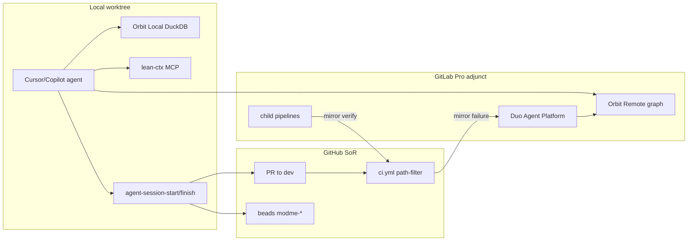

# GitLab Pro + Orbit + Multi-Agent DX Integration

## Current state (validated)

Your repo is **already architected** for dual-remote:

| Layer                  | Status                                                                                                             |
| ---------------------- | ------------------------------------------------------------------------------------------------------------------ |
| GitHub SoR             | PRs, beads promotion, `gh pr create` in session finish — [`docs/beads-workflow.md`](docs/beads-workflow.md)        |
| GitLab adjunct         | Minimal root [`.gitlab-ci.yml`](.gitlab-ci.yml) + [`.gitlab/ci/devops-autofix.yml`](.gitlab/ci/devops-autofix.yml) |
| GenerativeUI CI mirror | Full pipeline in [`GenerativeUI_monorepo/.gitlab-ci.yml`](GenerativeUI_monorepo/.gitlab-ci.yml)                    |
| Labels + templates     | [`.gitlab/labels.yml`](.gitlab/labels.yml), `.gitlab/issue_templates/*`                                            |
| Duo MCP                | [`.gitlab/duo/mcp.json`](.gitlab/duo/mcp.json) — only `mantine` today                                              |
| Orbit MCP (Cursor)     | `user-orbit` server already in Cursor                                                                              |
| **Missing**            | `gitlab-starter` skill, `next-forge/.gitlab-ci.yml`, parent-child router, agent-native Orbit helpers               |

**Policy (keep):** GitHub remains merge authority; GitLab adds **graph intelligence**, **Duo autofix**, and **optional CI mirror** — per [`docs/workflows/POLIS-ROUTING.md`](docs/workflows/POLIS-ROUTING.md).



---

## Phase 1 — Orbit foundation (Remote + Local)

**Goal:** Agents can query SDLC graph (MRs, pipelines, failures) and local code structure on day one.

### 1a. Orbit Remote (hosted)

Prerequisites from [`.agents/skills/orbit/references/prerequisites.md`](.agents/skills/orbit/references/prerequisites.md):

1. `glab` ≥ 1.94 — `glab auth login`
2. Enable Orbit on **top-level group** (Owner): Your Work → Orbit → Configuration
3. Verify: `glab orbit remote graph-status --full-path <your-group>`
4. Install skill: `glab skills install --global orbit`
5. Set env (local `.env`, never commit):
   - `GITLAB_PROJECT_ID` — your existing mirror project ID
   - `GITLAB_TOKEN` — PAT with `read_api` (+ `api` if agents create issues)

**Smoke query** (scoped to your group):

```json
{
  "query": {
    "query_type": "traversal",
    "nodes": [
      {
        "id": "p",
        "entity": "Project",
        "filters": { "full_path": { "op": "starts_with", "value": "<group>/" } }
      },
      {
        "id": "pl",
        "entity": "Pipeline",
        "columns": ["id", "status", "ref"],
        "filters": { "status": "failed" }
      }
    ],
    "relationships": [{ "type": "IN_PROJECT", "from": "pl", "to": "p" }],
    "limit": 5
  }
}
```

Run via: `glab orbit remote query /tmp/q.json` or Cursor `user-orbit` MCP (`query_graph`).

### 1b. Orbit Local (offline code graph)

On Windows (your primary dev OS):

```powershell
glab orbit local --install --yes
glab orbit local index C:\Users\dylan\Monorepo_ModMe
```

Index after major refactors or weekly via `yarn gitlab:orbit:reindex` (new script).

**Complementarity:** Remote = MR/pipeline/work-item graph; Local = symbol/file/call structure. Neither replaces lean-ctx or Supabase intake.

---

## Phase 2 — Smart GitLab CI (mirror GitHub, don't duplicate gates)

**Goal:** GitLab runs **path-filtered child pipelines** aligned with [`.github/workflows/ci.yml`](.github/workflows/ci.yml) — adjunct verification + Duo autofix trigger, not a second merge gate.

### 2a. Parent router — expand [`.gitlab-ci.yml`](.gitlab-ci.yml)

Replace minimal dev-only workflow with:

```yaml
stages: [detect, test, devops]

include:
  - local: .gitlab/ci/devops-autofix.yml
  - template: Security/SAST.gitlab-ci.yml # artifacts only on Pro
  - template: Security/Secret-Detection.gitlab-ci.yml

workflow:
  rules:
    - if: $CI_PIPELINE_SOURCE == "merge_request_event"
    - if: $CI_COMMIT_BRANCH == "dev"
    - if: $CI_PIPELINE_SOURCE == "web"

forge-child:
  stage: test
  trigger:
    include: next-forge/.gitlab-ci.yml
    strategy: depend
  rules:
    - changes: [next-forge/**]

generative-child:
  stage: test
  trigger:
    include: GenerativeUI_monorepo/.gitlab-ci.yml
    strategy: depend
  rules:
    - changes: [GenerativeUI_monorepo/**]
```

### 2b. New `next-forge/.gitlab-ci.yml`

Mirror GitHub `next-forge` job: Bun install → `bun run check` → `bun run test` → `bun run build`. Use `oven/bun` image; cache `~/.bun/install/cache`.

### 2c. TDD adjunct job (modme-tdd)

Add [`.gitlab/ci/tdd-preflight.yml`](.gitlab/ci/tdd-preflight.yml):

- **Trigger:** MR label `tdd` or variable `TDD_TEST_PATH`
- **Script:** `node scripts/preflight.mjs --profile tdd-green --test $TDD_TEST_PATH --report`
- **Artifact:** `docs/devops/reports/preflight-latest.json`
- **Allow_failure:** true on first rollout (advisory until stable)

This wires [`modme-tdd`](.agents/skills/modme-tdd/SKILL.md) into GitLab without replacing local `yarn preflight:tdd-*` in worktrees.

### 2d. Pro-tier security caveat

On **Premium (Pro)**: SAST/secret-detection produce **downloadable artifacts** but **no MR security widget** (Ultimate). Keep [`.github/workflows/codeql.yml`](.github/workflows/codeql.yml) as primary security UX; GitLab scans = secondary signal.

---

## Phase 3 — Agent-native DX (`gitlab-starter` skill + doctor)

**No `gitlab-starter` skill exists today** — create it as the onboarding playbook agents invoke at session start.

### New files

| File                                                                               | Purpose                                                                                                             |
| ---------------------------------------------------------------------------------- | ------------------------------------------------------------------------------------------------------------------- |
| [`.agents/skills/gitlab-starter/SKILL.md`](.agents/skills/gitlab-starter/SKILL.md) | First-run checklist: auth, Orbit, env, query recipes, CI mirror policy                                              |
| [`scripts/gitlab-doctor.ps1`](scripts/gitlab-doctor.ps1)                           | Validates `glab auth`, `GITLAB_PROJECT_ID`, Orbit Remote status, label import                                       |
| [`scripts/lib/gitlab-orbit.mjs`](scripts/lib/gitlab-orbit.mjs)                     | Thin wrappers: `failedPipelines()`, `mrForBranch()`, `pipelinesForMr(iid)` using canonical recipes from orbit skill |
| [`docs/gitlab-setup.md`](docs/gitlab-setup.md)                                     | Human onboarding (5-min clone → doctor → first Orbit query)                                                         |

### `package.json` scripts (dx-optimizer)

```json
"gitlab:doctor": "powershell -File scripts/gitlab-doctor.ps1",
"gitlab:orbit:status": "glab orbit remote graph-status --full-path %GITLAB_GROUP%",
"gitlab:orbit:reindex": "glab orbit local index .",
"gitlab:labels:sync": "glab label create -f .gitlab/labels.yml"
```

### Extend agent session lifecycle

In [`scripts/agent-session-start.ps1`](scripts/agent-session-start.ps1) (non-fatal block):

1. If `GITLAB_PROJECT_ID` set → run `yarn gitlab:doctor -Quiet`
2. Orbit Local: ensure index exists (warn if stale >7d)
3. Write `orbit_context` into session envelope (`logs/agent-orchestrator/sessions/<uuid>.json`)

In [`scripts/agent-session-finish.ps1`](scripts/agent-session-finish.ps1):

- On CI failure + `devops-autofix` label → document `github_sor` URL for GitLab mirror issue (already in POLIS routing)
- Optional: `glab issue create` from template `DevOps_Autofix` when `GITLAB_PROJECT_ID` + failure detected

### Duo MCP expansion — [`.gitlab/duo/mcp.json`](.gitlab/duo/mcp.json)

Add servers agents need (keep `mantine`):

- `gitlab` — GitLab HTTP MCP (`https://gitlab.com/api/v4/mcp`) for issues/MR/pipeline tools
- `orbit` — if Duo supports project MCP config for Orbit queries
- Document credit usage: Duo UI Orbit queries are zero-rated; MCP consumes credits — prefer `glab orbit remote query` in scripts

---

## Phase 4 — Multi-agent orchestration alignment

**Worktrees stay local** — GitLab cannot see `Monorepo_ModMe-dev/` checkouts. Integration points:

| Existing                                                           | GitLab hook                                               |
| ------------------------------------------------------------------ | --------------------------------------------------------- |
| [`yarn agent:session:start`](docs/agent-terminal-orchestration.md) | Orbit context + `gitlab:doctor`                           |
| [`yarn agent:status --json`](docs/agent-terminal-orchestration.md) | Add `gitlab_pipeline_status` field via `glab api`         |
| [`yarn e2e:worktree-smoke`](.github/workflows/ci.yml)              | Stays GitHub-only (orchestration paths)                   |
| Beads `modme-*`                                                    | `beadsLinkExternal` → GitLab issue when autofix escalates |
| POLIS `devops-ci-champion`                                         | Maps to Duo Fix CI/CD Pipeline Flow                       |

**Parallel code review** ([`.cursor/skills/parallel-code-review/SKILL.md`](.cursor/skills/parallel-code-review/SKILL.md)):

- Add `.gitlab/ci/review-adjunct.yml` — manual job posting MR diff summary as artifact for 4-dimension Task review (security/perf/correctness/readability)
- Trigger on MR label `agent:review` — complements Bugbot on GitHub, does not block merge

**Context7** (library docs for CI images):

- Use Context7 MCP when authoring `next-forge/.gitlab-ci.yml` (Bun image tags, GitLab `rules:changes` syntax) — not for business logic

---

## Phase 5 — Issue templates + label sync (one-time on mirror)

You already have templates. Run once against mirror:

```powershell
yarn gitlab:labels:sync
# Verify issue templates visible in GitLab UI → Settings → General → Templates
```

Key labels for agent routing: `devops-autofix`, `beads-linked`, `stack:forge`, `stack:generative`, `agent:review` — from [`.gitlab/labels.yml`](.gitlab/labels.yml).

Mirror workflow for CI failures:

1. GitHub `cicd-failure-handler.yml` creates `devops-autofix` issue (SoR)
2. Script or manual: GitLab issue with `github_sor: <url>` + `devops-autofix` label
3. Duo **Fix CI/CD Pipeline Flow** on GitLab side; Orbit query confirms pipeline/MR linkage

---

## What we explicitly will NOT do (scope guard)

- **Not** switching PR authority to GitLab (`gh pr create` stays default until you request `glab mr` wiring)
- **Not** duplicating inbox-pipeline, agenttrace, or worktree-smoke on GitLab
- **Not** merging `next-forge` and `GenerativeUI` workspaces in CI
- **Not** running feature work on main checkout (worktree rules unchanged)

---

## Verification checklist (acceptance)

- [ ] `yarn gitlab:doctor` passes (auth, project ID, Orbit Remote ready)
- [ ] `glab orbit remote query` returns projects/pipelines for your group
- [ ] `glab orbit local index` completes; schema query works
- [ ] Push to `dev` on mirror triggers child pipeline for changed stack only
- [ ] MR with `tdd` label runs preflight adjunct job
- [ ] Agent session envelope includes `orbit_context`
- [ ] `gitlab-starter` skill discoverable in `.agents/skills/`
- [ ] GitHub CI remains green; GitLab CI advisory (allow_failure on mirror jobs during rollout)

---

## Suggested beads issue (track multi-session work)

Create via `yarn beads:init` / `npx @beads/bd create`:

> **chore: GitLab Pro stack — Orbit + smart CI + gitlab-starter skill**

Deps: existing `chore: GitLab issue templates + Duo devops-autofix job` (already seeded in beads-workflow.md)
