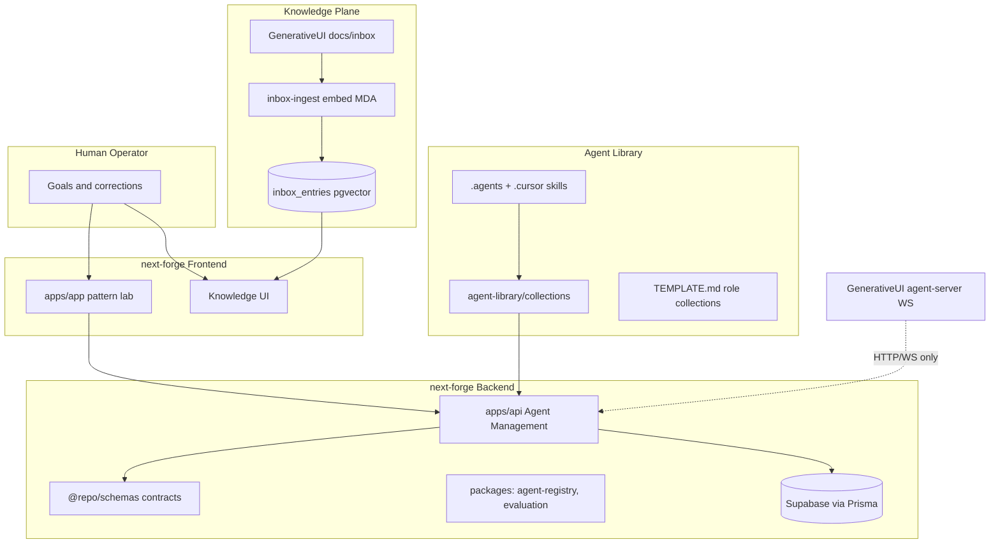
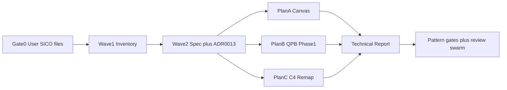

# Knowledge Catalogue and Agent Workforce Architecture Redesign

## Questionnaire outcomes (locked)


| Decision                 | Your choice                                                              | Plan implication                                                                |
| ------------------------ | ------------------------------------------------------------------------ | ------------------------------------------------------------------------------- |
| SICO source files        | **You will add** `llm-hub.md` and `sico-dbgen/db-gen-github.md` to inbox | **Gate 0** blocks deep architecture work until files land and ingest            |
| Agent Management backend | **next-forge `apps/api` + `packages/*`**                                 | ADR-0013, C4, and specs target forge—not GenerativeUI `agent-server` as primary |


## Strategic target (north star)

Evolve ModMe from scattered KM + dual monorepos into a **human-led, role-based agentic workforce platform**:

- **Backend (forge):** Agent registry, role/collection metadata, evaluation events, LLM hub routing contracts, workforce value metrics
- **Frontend (forge `apps/app`):** Deploy/test agent patterns mapped to software architectures; innovation + soft-skill outcomes—not efficiency-only KPIs
- **Knowledge plane:** Inbox → Supabase pgvector catalogue (`[docs/inbox-pipeline/README.md](docs/inbox-pipeline/README.md)`) supersedes legacy toolset-only KM (`[docs/KNOWLEDGE_MANAGEMENT.md](docs/KNOWLEDGE_MANAGEMENT.md)`)
- **Reference architecture:** SICO Digital Worker model (`[GenerativeUI_monorepo/docs/inbox/sico-digitalworker/sico-digital_worker_technical-report.md](GenerativeUI_monorepo/docs/inbox/sico-digitalworker/sico-digital_worker_technical-report.md)`) — Cortex / Action / Memory + three loops (execution, evolution, evaluation)




## Current state (research summary)

**Exists and usable**

- `[docs/AGENT_COLLECTION_PROGRAMMING_GUIDE.md](docs/AGENT_COLLECTION_PROGRAMMING_GUIDE.md)` — collection YAML schema, validation, programmatic creation
- `[agent-library/collections/TEMPLATE.md](agent-library/collections/TEMPLATE.md)` + ~40 collections (worktree copy; promote to root `agent-library/`)
- `[docs/codebase/*.md](docs/codebase/)` — seven evidence docs (refresh needed for agent/KM focus)
- ECL harness partial (`[docs/ECL.md](docs/ECL.md)`, `[harness/changes/](harness/changes/)`)
- Pattern gates `[specs/013-agent-workflow-gates/](specs/013-agent-workflow-gates/)` — `federated-dual-stack`, `bounded-parallel-agents`, etc.
- ADRs through **0012** on disk; index stops at **0011** (`[next-forge/docs/adr/README.md](next-forge/docs/adr/README.md)`)
- Inbox pipeline Phase 1 complete; API routes `GET /api/inbox`, `GET /api/catalogue` documented

**Gaps**

- No committed `quality/` playbook run at root or GenerativeUI
- `llm-hub.md`, `sico-dbgen/db-gen-github.md` **missing** (you will add)
- `[docs/KNOWLEDGE_MANAGEMENT.md](docs/KNOWLEDGE_MANAGEMENT.md)` covers `agent/toolsets.json` only—not inbox pipeline
- C4 docs live in worktrees only (`.worktrees/dev/C4-Documentation/`) — not promoted to root
- `generative-scripts-orchestration` skill only in worktree — merge to root `.agents/skills/` when executing

## Execution model

**Worktree required** — feature work in `.worktrees/dev-agent-cursor-km-agent-architecture/` per `[docs/multi-agent-worktrees.md](docs/multi-agent-worktrees.md)`.

**Orchestration lanes** (human = CEO per ai-team-orchestration):


| Role            | Agent lane                  | Primary outputs                                |
| --------------- | --------------------------- | ---------------------------------------------- |
| Remy (Producer) | This session / orchestrator | Plans, beads, ECL change, gate coordination    |
| Sage (Backend)  | Parallel wave               | ADR-0013, forge API sketch, Prisma/event model |
| Nova (Frontend) | Parallel wave               | Docs canvas, C4 product slice                  |
| Ivy (QA)        | After artifacts             | Quality Playbook Phase 1, review-swarm on ADR  |


**Outcome-oriented execution:** Accept planned intermediate doc-only deltas; verify at wave boundaries (`yarn lint:harness`, pattern gate, inbox audit)—not full green CI on unrelated forge lint debt.

---

## Phase 0 — Prerequisite gate (you)

**You add before Wave 1 deep work:**

```
GenerativeUI_monorepo/docs/inbox/sico-digitalworker/
  llm-hub.md
  sico-dbgen/db-gen-github.md
```

Then run (orchestrator verifies):

```powershell
yarn inbox:audit
yarn intake   # or yarn intake:orchestrate per docs/inbox-pipeline
```

**Exit criteria:** Files present in git; ingest reports entries indexed/embedded; orchestrator has read all three SICO artefacts.

---

## Wave 1 — Discovery and KM inventory (read-only + catalogue)

### 1.1 Mechanical codebase map

- Run `[acquire-codebase-knowledge](.agents/skills/acquire-codebase-knowledge/SKILL.md)` `scan.py` → refresh `[docs/codebase/](docs/codebase/)` with **KM/agent focus**
- Supplement with lightweight AST/index: existing `yarn intake:code-index` / Greptime path per ADR-0010 (code symbols) — **no new heavy indexer** in v1; pivot to catalogue rows in Supabase

### 1.2 KM asset census (new artefact)

Create `**docs/knowledge-catalogue/INDEX.md**` (machine + human index):


| Layer          | Scan roots                                             | Output                             |
| -------------- | ------------------------------------------------------ | ---------------------------------- |
| Skills         | `.agents/skills/`, `.cursor/skills/`, `agent-library/` | Role tags, orchestration vs domain |
| Collections    | `agent-library/collections/*.yml`                      | id, tags, item counts              |
| Harness        | `harness/`, `docs/ECL.md`, `scripts/harness-*`         | ECL maturity                       |
| Specs/ADR      | `specs/`, `next-forge/docs/adr/`                       | Decision graph                     |
| Inbox pipeline | `docs/inbox-pipeline/`, `scripts/inbox-*`              | Feature taxonomy IDs               |
| Legacy KM      | `docs/KNOWLEDGE_MANAGEMENT.md`, `agent/toolsets.json`  | Deprecation map → inbox            |
| Workflows      | `docs/workflows/`, `.cursor/skills/modme-workflow-*`   | Pattern registry links             |


Cross-link each row to inbox entry ID after ingest (Gate 0).

### 1.3 External research (after Gate 0)

- **find-docs / Context7:** LLM routing patterns, event-sourcing workforce audit trails
- **Firecrawl deep research (Thorough):** role-based agent workforce, digital worker value metrics, multi-agent evaluation taxonomies — feeds ADR options section only (not implementation)

### 1.4 Thermo-nuclear Phase 0 baseline

Per `[thermo-nuclear-monorepo-review](.cursor/skills/thermo-nuclear-monorepo-review/SKILL.md)`:

```powershell
yarn worktree:ensure
yarn worktree:doctor
# snapshot → docs/workflows/reports/km-architecture-baseline.md
```

---

## Wave 2 — Spec + ADR-0013 (parallel with Wave 1 synthesis)

### 2.1 Feature spec (spec-driven-development)

New spec: `**specs/014-agent-workforce-platform/spec.md**` covering:

- Objective: human-led role-based workforce; innovation/soft-skill KPIs
- Bounded contexts (DDD): `AgentRegistry`, `RoleCollection`, `WorkforceEvaluation`, `KnowledgeCatalogue` (read model)
- Commands: full forge verify paths
- Boundaries: federated dual-stack; no `workspace:*` cross-imports

Run `**/speckit-pattern-checklist federated-dual-stack**` and `**bounded-parallel-agents**`; resolve `[Gap]` items into `tasks.md`.

### 2.2 ADR-0013 (primary architectural deliverable)

**File:** `[next-forge/docs/adr/0013-role-based-agent-workforce-platform.md](next-forge/docs/adr/0013-role-based-agent-workforce-platform.md)`

**Proposed decision (draft for review):**

- **Agent Management API** in `next-forge/apps/api` (port 3102)
- New packages: `packages/agent-registry/` (collections, roles), `packages/workforce-evaluation/` (event schemas, L1–L4 taxonomy inspired by SICO §6)
- **Event-sourcing-lite:** append-only `workforce_events` table (Supabase/Prisma) for agent runs, operator corrections, pattern deployments — CQRS read models for Knowledge UI and value dashboards
- **LLM Hub:** contract-first adapter interface in `@repo/schemas`; forge API routes to providers; GenerativeUI remains execution consumer via WS until cutover
- **Collections:** extend `[agent-library/collections/TEMPLATE.md](agent-library/collections/TEMPLATE.md)` with `role`, `soft_skills`, `architecture_pattern`, `evaluation_hooks` fields; validate via existing collection schema from AGENT_COLLECTION_PROGRAMMING_GUIDE
- Supersedes nothing; relates to ADR-0009, 0010, 0011, 0012

Update `[next-forge/docs/adr/README.md](next-forge/docs/adr/README.md)` index (include 0012 + 0013).

### 2.3 ECL structured change

```powershell
node scripts/harness-change.mjs create agent-workforce-platform
```

Active change under `harness/changes/active/agent-workforce-platform/` with `spec.md`, `plan.md`, `tasks.md`.

---

## Wave 3 — Three separate deliverable plans (then coordinated execution)

### Plan A — Docs Canvas (KM navigator)

**Skill:** docs-canvas + canvas SKILL

**Output:** `canvases/modme-knowledge-catalogue.canvas.tsx` (Cursor managed path)

**Sections:**

1. Overview — scope, audience (operators + architects)
2. Sticky TOC — links to catalogue layers
3. Body — federated stacks, inbox pipeline, agent-library, harness, ADR graph (cards + DAG)
4. Callouts — legacy KM deprecation, Gate 0 SICO sources
5. References — deep links to repo paths

**Inputs:** `docs/knowledge-catalogue/INDEX.md`, refreshed `docs/codebase/ARCHITECTURE.md`, ADR-0013 draft

### Plan B — Quality Playbook (exploration only, Mode A)

**Target:** repo root (not QPB self-audit)

**Phase 1 only** per quality-playbook skill (stop at boundary):

1. Populate `reference_docs/cite/` with ADR-0013 draft, SICO trio, AGENT_COLLECTION_PROGRAMMING_GUIDE excerpt
2. `python -m bin.reference_docs_ingest .` (if QPB bin available in skill install path; else manual `quality/formal_docs_manifest.json`)
3. Write `quality/EXPLORATION.md` — role map via `git ls-files`, KM risks, pattern deep dives on orchestration scripts
4. Initialize `quality/run_state.jsonl` + `quality/PROGRESS.md`

**Explicit non-goals in v1:** Phases 2–6 deferred to follow-on sessions unless you say "run all phases".

### Plan C — C4 architecture remap (figure-it-out playbook)

Promote from worktree pattern to `**C4-Documentation/**` at repo root:


| File                                  | Content                                            |
| ------------------------------------- | -------------------------------------------------- |
| `c4-context.md`                       | ModMe + human operator + digital workers           |
| `c4-container.md`                     | forge app/api, GenerativeUI WS, Supabase, Greptime |
| `c4-component-agent-management.md`    | **new** — apps/api routes, packages                |
| `c4-component-knowledge-catalogue.md` | inbox pipeline + Knowledge UI                      |
| `apis/agent-workforce-api.yaml`       | OpenAPI sketch aligned with ADR-0013               |


Use figure-it-out phases A–E; log to `docs/workflows/reports/c4-remap-log.md`.

---

## Wave 4 — Coordinated execution and core report

### 4.1 Synthesis document (core deliverable)

`**docs/architecture/modme-digital-worker-technical-report.md**`

Mirror SICO report structure (7 sections):

1. Vision — symbiotic co-evolution; human-led workforce
2. System architecture — forge topology + federated GenerativeUI
3. Cortex–Action–Memory mapping to ModMe components
4. Core execution loop — pattern deploy → agent run → WS/HTTP
5. Evolution loop — inbox → knowledge → collection updates
6. Evaluation loop — workforce_events, soft-skill + innovation metrics
7. Summary + roadmap phases

Embed mermaid diagrams; cite evidence paths; no invented APIs.

### 4.2 dbt-style knowledge transforms (lightweight)

Apply **dbt patterns metaphorically** (not full dbt install unless you request):

- **Staging:** raw inbox entries
- **Intermediate:** categorized relations (MDA)
- **Marts:** `knowledge-catalogue/INDEX.md`, canvas data, evaluation read models

Document layer contract in `docs/knowledge-catalogue/DATA-MODEL.md`.

### 4.3 Verification stack

```powershell
yarn lint:harness
node scripts/lib/run-pattern-gate.mjs --pattern federated-dual-stack
node scripts/lib/run-pattern-gate.mjs --pattern ecl-structured-change
yarn inbox:audit
# review-swarm on ADR-0013 + technical report diff only
```

### 4.4 Beads tracking

```powershell
npx @beads/bd create "epic: KM catalogue + agent workforce ADR-0013"
# child: gate-0-sico, wave-1-inventory, adr-0013, canvas, qpb-phase-1, c4-remap, technical-report
```

---

## Dependency graph




---

## Risks and mitigations


| Risk                          | Mitigation                                                                                             |
| ----------------------------- | ------------------------------------------------------------------------------------------------------ |
| Gate 0 delayed                | Orchestrator proceeds Wave 1 inventory only; ADR marks LLM Hub as `[NEEDS CLARIFICATION]` until ingest |
| Scope explosion (146+ skills) | Role-map top 30 orchestration skills; defer domain skills to catalogue refs                            |
| QPB bin path missing          | Manual `reference_docs/` + EXPLORATION without runner                                                  |
| Forge lint baseline debt      | Document in ECL change; path-filtered verify only                                                      |
| Federated boundary violation  | ADR + pattern gate + thermo-nuclear contract pass                                                      |


---

## What you do next

1. **Add** `llm-hub.md` and `sico-dbgen/db-gen-github.md` under `GenerativeUI_monorepo/docs/inbox/sico-digitalworker/`
2. Reply **"Gate 0 done"** or **"execute the plan"** to start Wave 1 in a worktree

Optional: say **"run quality playbook phase 1 only"** after Wave 2 if you want QPB before canvas/C4.