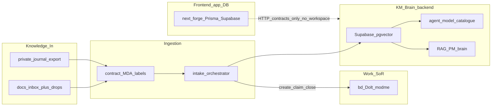

# KM + Beads Phased Implementation Plan

## Architecture validation (monorepo + patterns)

Your order is sound:

| Priority        | Pattern fit                              | Why                                                                                |
| --------------- | ---------------------------------------- | ---------------------------------------------------------------------------------- |
| 1 Beads wiring  | Hexagonal port/adapter + single work SoR | Consolidate duplicate CLI wrappers; claim/close lifecycle before more surface area |
| 2 Full platform | Bounded contexts + strangler of routers  | Taxonomy ADR, journal adapter, router layering, E2E need a stable beads contract   |
| 3 Doc strangler | Strangler Fig on narrative               | Docs describe reality after plumbing exists; avoids rewriting twice                |
| 4 Observability | Measure after path exists                | Metrics need real create/claim/close + intake linkage events                       |

**Canonical data flow (locked):**

**SoR split (locked):**

- **Work:** beads (`bd` / Dolt, prefix `modme`) — not markdown TODOs, not `data/agent-registry.json` (registry stays a local coordination cache with optional `beadsIssue` pointer).
- **Knowledge:** inbox contract (ADR-0009) → embed → MDA → KM/RAG stores.
- **Product UI/codegen:** next-forge app DB — separate; integrate via HTTP/contracts only ([monorepo-boundaries](.cursor/rules/monorepo-boundaries.mdc)).

**Phase-1 exception (thin pointer only):** add a short canonical banner at the top of [docs/KNOWLEDGE_QUICKSTART.md](docs/KNOWLEDGE_QUICKSTART.md) and [docs/KNOWLEDGE_MANAGEMENT.md](docs/KNOWLEDGE_MANAGEMENT.md) pointing to inbox+beads — not a full rewrite (that is Priority 3). Prevents agents from executing the 2025 toolset workflow during Priority 1–2.

**Polis / routers (locked for Priority 2):** keep lightweight citizen cards ([docs/workflows/POLIS-ROUTING.md](docs/workflows/POLIS-ROUTING.md)); do not restore `_polis/`. Layering: polis = CI/citizen routing; inbox MDA = knowledge classify; `agent/routes` = GenUI utterance intent (freeze or migrate later, do not merge into beads).

**Out of scope for Expo:** E2E is Vitest + dry-run intake + beads temp/fixture — not Expo examples.

**Impl location:** feature worktree (prefer `.worktrees/dev-agent-cursor-dolt-beads-entire` or new `feature/cursor/km-beads-*`); PRs → `dev`.

---

## Priority 1 — Beads wiring (work SoR)

**Goal:** One beads adapter used by session + intake; create → claim → close with `--json` / `--description`; no orphan creates.

### Gaps today

- [scripts/lib/beads-hooks.mjs](scripts/lib/beads-hooks.mjs) used by [scripts/intake-orchestrator.mjs](scripts/intake-orchestrator.mjs) and [scripts/code-index-orchestrator.mjs](scripts/code-index-orchestrator.mjs); create does not parse returned IDs; update uses title-like strings (`intake:${MODE}`) and status `done` inconsistently with gastownhall `bd close`.
- [scripts/lib/beads-intake.mjs](scripts/lib/beads-intake.mjs) has **zero consumers** (dead duplicate).
- [scripts/agent-session-start.ps1](scripts/agent-session-start.ps1) / finish call `bd` directly without shared `--description` / `--json` contract.
- [scripts/lib/agent-task-registry.mjs](scripts/lib/agent-task-registry.mjs) stores `beadsIssue` but is not SoR.
- [scripts/lib/issue-autotag.mjs](scripts/lib/issue-autotag.mjs) only GH labels (`beads-linked`), not bd lifecycle.

### Tasks

1. **Unify adapter** — Merge `beads-intake.mjs` into `beads-hooks.mjs` (or thin re-export). Single `runBd` with `BEADS_DISABLED`, cwd root, `--json` parse, always `--description` on create. Exports: `create`, `claim`, `close`, `ready`, `linkExternal`, `createSchemaDrift`, `tryBeads` (never throw). Align with [gastownhall beads instructions](https://github.com/gastownhall/beads/blob/64a136d56e8ae2b89071e57f90f57255e56c9ad9/.github/copilot-instructions.md). → Verify: unit tests mock spawn; create returns `{ id }`.
2. **Wire intake lifecycle** — In `intake-orchestrator.mjs`: create once per run → store issue id → stage comments → close on success / mark blocked on failure. Same for schema-drift in `code-index-orchestrator.mjs`. Delete dead scrape helpers or call them from scrape path. → Verify: `yarn intake:dry-run` with `BEADS_DISABLED=1` still green; with beads enabled, one create + one close per run.
3. **Session scripts use adapter** — `agent-session-start.ps1` / `agent-session-finish.ps1` call node CLI wrapping the adapter (or document `bd` flags matching adapter). Registry continues to store `beadsIssue` pointer only. → Verify: start without id creates with description; finish closes that id.
4. **Autotag + docs pointer** — Keep GH autotag; add optional sync comment `external_issue:` via `beadsLinkExternal` when both exist. Add 10-line KM canonical banner to the two stale KM docs. → Verify: existing `scripts/__tests__/issue-autotag.test.mjs` pass; banner present.
5. **Priority-1 verification** — `yarn inbox:test`; focused vitest for beads adapter; `yarn beads:ready` smoke; update [docs/beads-workflow.md](docs/beads-workflow.md) session/intake section only.

---

## Priority 2 — Full platform

**Goal:** C4 ownership taxonomy, journal reprocess path, router layering ADR, KM pipeline E2E.

### Tasks

6. **Taxonomy ADR** — New ADR (e.g. `docs/adr/00xx-km-c4-ownership.md` or `next-forge/docs/adr/` for forge-owned slices): map containers → dirs → doc homes (orchestration / next-forge / GenerativeUI / agent). Require inbox frontmatter or MDA labels for C4 ownership. → Verify: ADR merged; contract field or MDA tag documented.
7. **Journal → inbox adapter** — Export/promote from [agent/private-journal-mcp](agent/private-journal-mcp/README.md) topic schemas into `docs/inbox/` (or funnel) with contract v1 frontmatter; do not dual-write embeddings. → Verify: one sample memento → `yarn inbox:audit` accepts.
8. **Router layering ADR** — Document polis vs MDA vs `agent/routes`; freeze GenUI router Phase-1 or schedule migrate; no third competing SoR. → Verify: ADR + one README cross-link.
9. **E2E harness** — Vitest (or `scripts/__tests__/km-pipeline.e2e.test.mjs`): fixture inbox file → contract validate → dry-run intake steps → beads adapter mocked lifecycle. Brooks-sweep only if sweeping `scripts/lib` quality after wiring. → Verify: `yarn inbox:test` includes e2e suite green offline.

---

## Priority 3 — Doc strangler (full narrative)

**Goal:** Replace toolset/ripgrep KM narrative with your pipeline truth.

### Tasks

10. **Rewrite KM docs** — [docs/KNOWLEDGE_QUICKSTART.md](docs/KNOWLEDGE_QUICKSTART.md) + [docs/KNOWLEDGE_MANAGEMENT.md](docs/KNOWLEDGE_MANAGEMENT.md): Inbox+beads → classify/label → KM DB / catalogue / RAG brain; quarantine `agent/toolsets.json` + `scripts/knowledge-management/*` as GenUI legacy. Point to [docs/inbox-pipeline/README.md](docs/inbox-pipeline/README.md). → Verify: no root `docs:sync` claims; yarn script table matches `package.json`.
11. **AGENTS.md / handover touch** — Single entry link for agents; align with C4 ADR. → Verify: `docs/handover/latest.md` one-liner updated.

---

## Priority 4 — Observability

**Goal:** First-class doc/capture metrics from [docs/evaluation/OBSERVABILITY-AGENTS.md](docs/evaluation/OBSERVABILITY-AGENTS.md).

### Tasks

12. **Metric design + emitters** — Define: capture_compliance (inbox drops with valid contract), beads_lifecycle_completeness (create without close), doc_freshness (KM entry points vs last rewrite), intake_run_link (pipeline run ↔ beads id). Emit from adapter + intake close. → Verify: JSON/report artifact or agenttrace fields documented; no dashboard required in v1.

---

## Done when

- [ ] Intake and session always create/claim/close beads with descriptions and parsed IDs (or `BEADS_DISABLED`)
- [ ] Single beads module; no dead `beads-intake` consumers
- [ ] C4 taxonomy ADR + journal→inbox path + router ADR + offline E2E
- [ ] KM docs describe Inbox+beads → KM brain; legacy toolset quarantined
- [ ] Capture/lifecycle metrics defined and emitted

## Notes

- Prefer `npx @beads/bd` (repo already does); Windows shell: keep `shell: true` in adapter.
- Do not run `prisma db push --accept-data-loss` on cloud; do not touch UniversalWorkbench\*.
- Skills to install when implementing: `gastownhall/beads` or `steveyegge/beads`, plus existing local beads skill for session protocol.
