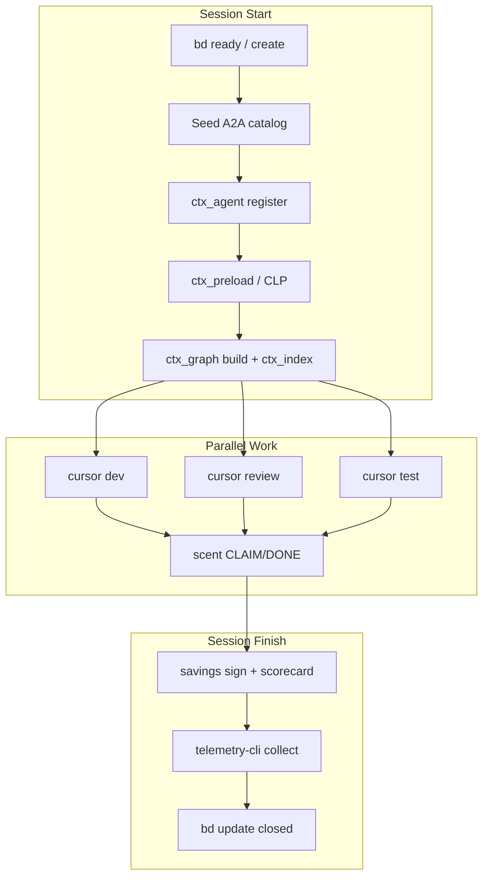

# Lean-CTX Advanced Multi-Agent Setup (ModMe)

## Current baseline (keep, don't rewrite)

ModMe already has a strong lean-ctx floor:

- Project config: [`.lean-ctx.toml`](.lean-ctx.toml) — `buddy_enabled=true`, `auto_preload=true` (CLP), `[loop_detection]` fingerprint throttling, `tool_profile=power`, monorepo `boundary_policy`
- Env dirs: [`scripts/load-lean-ctx-env.ps1`](scripts/load-lean-ctx-env.ps1) → `data/lean-ctx/`, `logs/lean-ctx/`
- Ensure/doctor: `yarn lean-ctx:ensure`, [`docs/lean-ctx/data-dictionary.md`](docs/lean-ctx/data-dictionary.md)
- Session + beads: [`scripts/agent-session-start.ps1`](scripts/agent-session-start.ps1) / [`scripts/agent-session-finish.ps1`](scripts/agent-session-finish.ps1)
- Lightweight registry: [`scripts/lib/agent-task-registry.mjs`](scripts/lib/agent-task-registry.mjs) → `data/agent-registry.json`
- Agent collections pattern: [`scripts/collections/*.collection.json`](scripts/collections/) + [`scripts/schema/collection.schema.json`](scripts/schema/collection.schema.json)

**Gaps to close:** no seeded lean-ctx agent catalog, no beads BFS dispatcher, no task profiles file, no intelligence routing playbook, no ctx_index intake pipeline, no prove-it automation, `extra_roots` empty.



---

## Phase 1 — Config foundations + task profiles

### 1a. Create missing task profiles file

Add [`data/lean-ctx-task-profiles.toml`](data/lean-ctx-task-profiles.toml) (gitignored template + committed example):

```toml
# Activate: $env:LEAN_CTX_PROFILE = "orchestration" | "inbox-intake" | "forge-dev"

[profiles.orchestration]
preload_task = "multi-agent session orchestration beads dispatch"
focus_paths = ["scripts/agent-session-start.ps1", "scripts/lib/agent-task-registry.mjs", "scripts/collections/"]
intelligence = ["ctx_compose", "ctx_graph", "ctx_callgraph", "ctx_agent"]

[profiles.inbox-intake]
preload_task = "inbox pipeline universal intake"
focus_paths = ["GenerativeUI_monorepo/docs/inbox/", "scripts/lib/inbox-contract.mjs", "docs/inbox-pipeline/"]
intelligence = ["ctx_index", "ctx_fill", "ctx_search", "ctx_semantic_search"]

[profiles.forge-dev]
preload_task = "next-forge app development"
focus_paths = ["next-forge/apps/", "next-forge/packages/"]
intelligence = ["ctx_impact", "ctx_architecture", "ctx_delta"]
```

Wire activation in [`scripts/load-lean-ctx-env.ps1`](scripts/load-lean-ctx-env.ps1): optional `$env:LEAN_CTX_PROFILE` passthrough + document in [`.env.example`](.env.example).

### 1b. Multi-repo indexing (Cursor workspace)

Per [Multi-Repo Workspaces journey](https://leanctx.com/docs/journeys/multi-repo-workspace/):

- Keep `allow_auto_reroot = true` (parent `Monorepo_ModMe` auto-detects `next-forge/`, `GenerativeUI_monorepo/`, `src/`, `agent/`)
- Add explicit `extra_roots` only for worktree sibling (not duplicated inside primary):

```toml
extra_roots = ["../Monorepo_ModMe-dev/dev"]  # when worktree exists
```

Document in [`docs/lean-ctx-guide.md`](docs/lean-ctx-guide.md): open **parent folder** as Cursor workspace; multi-root `.code-workspace` optional.

### 1c. Custom aliases for terminal intelligence

Extend [`.lean-ctx.toml`](.lean-ctx.toml) `custom_aliases` for ModMe terminal workflows:

| Alias            | Expands to                                                    |
| ---------------- | ------------------------------------------------------------- |
| `@graph-build`   | `lean-ctx index build` (or MCP `ctx_graph action=build`)      |
| `@beads-ready`   | `npx @beads/bd ready --json`                                  |
| `@prove-it`      | `lean-ctx savings summary && lean-ctx benchmark scorecard`    |
| `@session-audit` | `node scripts/telemetry/telemetry-cli.mjs collect --since=1d` |

### 1d. Rules scope — logging + async telemetry

Add project rule [`.cursor/rules/lean-ctx-orchestration.mdc`](.cursor/rules/lean-ctx-orchestration.mdc) (complements existing `lean-ctx.mdc`):

- Session start: `ctx_agent register` + `ctx_preload` when task is clear
- Session end: `ctx_session save`, `ctx_knowledge consolidate`, trigger async telemetry upload (non-blocking)
- Protocol stack per [Which Protocol When](https://leanctx.com/docs/concepts/protocols/#which-protocol-when): **CEP + CCP + A2A** for multi-agent; CLP when task-oriented

Keep `rules_scope = "both"` in `.lean-ctx.toml`.

---

## Phase 2 — Seeded agent catalog + local A2A registry (orchestration-first)

### 2a. New collection: lean-ctx intelligence + orchestration

Create [`scripts/collections/modme-lean-ctx-advanced.collection.json`](scripts/collections/modme-lean-ctx-advanced.collection.json):

- **Orchestration skills:** `parallel-agents`, `context-driven-development`, `context7-auto-research`, project `.agents/skills/lean-ctx/SKILL.md`
- **Roles mapped to A2A:** `dev`, `review`, `test`, `plan`, `orchestrator` (matches [Multi-Agent registry roles](https://leanctx.com/docs/concepts/multi-agent/#registry))
- **Intelligence usage strings:** which `ctx_*` tool each item should prefer

Extend [`scripts/schema/collection.schema.json`](scripts/schema/collection.schema.json) with optional fields (backward-compatible `additionalProperties` relaxation or parallel schema):

```json
"lean_ctx": {
  "agent_type": "cursor",
  "a2a_role": "dev",
  "protocols": ["CEP", "CCP", "A2A"],
  "intelligence_tools": ["ctx_compose", "ctx_graph"],
  "preload_profile": "orchestration"
}
```

### 2b. Agent catalog manifest (dynamic dispatch source)

Create [`data/lean-ctx-agent-catalog.json`](data/lean-ctx-agent-catalog.json) (generated, gitignored) + committed seed [`scripts/collections/lean-ctx-agent-catalog.seed.json`](scripts/collections/lean-ctx-agent-catalog.seed.json):

```json
{
  "version": 1,
  "agents": [
    {
      "id": "cursor-dev",
      "agent_type": "cursor",
      "role": "dev",
      "collection": "modme-core",
      "intelligence": ["ctx_compose", "ctx_impact"]
    },
    {
      "id": "cursor-review",
      "agent_type": "cursor",
      "role": "review",
      "collection": "modme-core",
      "intelligence": ["ctx_delta", "ctx_review"]
    }
  ],
  "mcp_gateways": [
    {
      "namespace": "context7",
      "find_hint": "library docs",
      "mcp_server": "plugin-context7-plugin-context7"
    },
    {
      "namespace": "supabase",
      "find_hint": "schema migration",
      "mcp_server": "plugin-supabase-supabase"
    }
  ]
}
```

New CLI: [`scripts/lean-ctx-agent-catalog.mjs`](scripts/lean-ctx-agent-catalog.mjs)

- `seed` — merge collection JSONs → catalog seed
- `register` — emit `ctx_agent` MCP instructions for session (agent_type, role, diary categories)
- `resolve --intent "fix auth bug"` — map intent → collection + intelligence tool list (uses keyword rules initially; optional `ctx_intent` at runtime)

Bridge to existing registry: extend [`scripts/lib/agent-task-registry.mjs`](scripts/lib/agent-task-registry.mjs) with `agents[]` array synced from catalog on session start.

### 2c. Session start integration

Update [`scripts/agent-session-start.ps1`](scripts/agent-session-start.ps1):

1. After `load-lean-ctx-env.ps1`, run `node scripts/lean-ctx-agent-catalog.mjs register --role dev`
2. Write catalog snapshot into session envelope (`logs/agent-orchestrator/sessions/<id>.json`)
3. Append lean-ctx marker: `{ event: "a2a-register", agent_type, role, catalog_version }`

Agents use buddy mode + scent field locally ([A2A protocol](https://leanctx.com/docs/concepts/protocols/#a2a)) — **no Remote Agent Bus** in Phase 1.

---

## Phase 3 — Beads BFS dispatch

### 3a. BFS ready-queue traverser

New [`scripts/beads-bfs-dispatch.mjs`](scripts/beads-bfs-dispatch.mjs):

1. `npx @beads/bd ready --json` → root-ready issues
2. For each issue with dependencies, BFS layers (blocked → ready as deps close)
3. Output dispatch plan: `{ layer, issue_id, title, suggested_role, suggested_collection, claim_paths[] }`
4. Integrate duplicate detection via `agent-task-registry.mjs` `findDuplicateTask`

### 3b. Yarn commands

Add to [`package.json`](package.json):

```json
"beads:bfs": "node scripts/beads-bfs-dispatch.mjs",
"beads:bfs:dry": "node scripts/beads-bfs-dispatch.mjs --dry-run",
"agent:catalog:seed": "node scripts/lean-ctx-agent-catalog.mjs seed",
"agent:catalog:validate": "node scripts/lean-ctx-agent-catalog.mjs validate"
```

### 3c. Parallel dispatch hook

Document + optional flag on `agent-session-start.ps1`:

```powershell
yarn beads:bfs:dry          # inspect layers
yarn agent:session:start -TaskTitle "..." -ClaimPaths @("next-forge/apps/app/")
# parallel-agents pattern: launch Task subagents per BFS layer with collection role
```

Reference [`parallel-agents` skill](c:/Users/dylan/.agents/skills/parallel-agents/SKILL.md) and existing collections' `role` fields ([`modme-observability.collection.json`](scripts/collections/modme-observability.collection.json) already uses `role`).

---

## Phase 4 — Intelligence toolchain (terminal + MCP routing)

Add [`docs/lean-ctx/intelligence-routing.md`](docs/lean-ctx/intelligence-routing.md) — decision tree for agents:

| User intent                  | Primary tool                    | Secondary                |
| ---------------------------- | ------------------------------- | ------------------------ |
| "Where is X?" / orient       | `ctx_compose(task)`             | `ctx_overview`           |
| "What breaks if I change Y?" | `ctx_impact(path)`              | `ctx_callgraph` (BFS)    |
| Codebase map                 | `ctx_architecture`              | `ctx_graph action=build` |
| Keyword → files in catalogue | `ctx_fill(keywords, catalogue)` | `ctx_search`             |
| Classify task type           | `ctx_intent(message)`           | catalog `resolve`        |
| After edits                  | `ctx_delta(path)`               | `ctx_read mode=diff`     |
| Project indexing             | `ctx_index action=build`        | format extractors        |

Session bootstrap script [`scripts/lean-ctx-session-bootstrap.ps1`](scripts/lean-ctx-session-bootstrap.ps1):

```powershell
# Called from agent-session-start when -BootstrapIntelligence
ctx_graph build    # via lean-ctx CLI or MCP
ctx_index build    # universal intake index
ctx_knowledge wakeup
```

Link to [intelligence tools docs](https://leanctx.com/docs/tools/intelligence/) and adaptive compression / task-aware KG sections for profile tuning.

### ctx_tools gateway (ModMe MCP catalog)

New [`docs/lean-ctx/mcp-tool-catalog.md`](docs/lean-ctx/mcp-tool-catalog.md) mapping lean-ctx `ctx_tools action=find|call` pattern to ModMe MCP servers:

- `context7::resolve_library` / `query_docs` → Context7 plugin
- `supabase::list_tables` → Supabase plugin
- `gitlab::*` → GitLab plugin

Wrapper script [`scripts/lean-ctx-tool-gateway.mjs`](scripts/lean-ctx-tool-gateway.mjs) for terminal use when MCP `ctx_tools` unavailable — mirrors [MCP Tool Catalog Gateway journey](https://leanctx.com/docs/journeys/mcp-tool-catalog-gateway/).

---

## Phase 5 — Universal intake (ctx_index)

Replace minimal [`scripts/run-lean-ctx-intake.mjs`](scripts/run-lean-ctx-intake.mjs) with full pipeline [`scripts/lean-ctx-universal-intake.mjs`](scripts/lean-ctx-universal-intake.mjs):

**Corpus paths** (format-aware extractors per [Universal Intake](https://leanctx.com/docs/tools/intelligence/#format-extractors-universal-intake)):

- `GenerativeUI_monorepo/docs/inbox/**`
- `docs/inbox-pipeline/**`, `docs/handover/**`
- `.agents/skills/**/SKILL.md` (metadata only)
- `prompts/**`, `scripts/collections/**`

**Flow:**

1. `lean-ctx index build-full` (or MCP `ctx_index`)
2. Export knowledge snapshot → existing Supabase ingest hook (`yarn lean-ctx:intake`)
3. Optional inbox contract validation (`yarn inbox:audit`) before index

Add `yarn lean-ctx:index` and wire into `yarn intake:orchestrate` as optional `--lean-ctx-index` flag in [`scripts/intake-orchestrator.mjs`](scripts/intake-orchestrator.mjs).

**CLP for collections:** preload map in task profiles linking collection ID → L1/L2/L3 paths (implements [CLP activation](https://leanctx.com/docs/concepts/protocols/#when-clp-activates) for prompt-cache / collection relationships).

---

## Phase 6 — Prove-it quantification + observability

### 6a. Prove-it script

New [`scripts/lean-ctx-prove-it.ps1`](scripts/lean-ctx-prove-it.ps1):

```powershell
lean-ctx savings verify
lean-ctx savings summary
lean-ctx savings sign --out metrics/lean-ctx-savings-$(Get-Date -Format yyyy-MM).json
lean-ctx benchmark scorecard --json > metrics/lean-ctx-scorecard.json
# optional quarterly: lean-ctx audit evidence --from ... --out evidence.zip
```

Extend [`.env.example`](.env.example) with prove-it / eval vars (commented):

```
# LEAN_CTX_EVAL_MODEL=gpt-4o-mini
# LEAN_CTX_EVAL_MODEL_URL=...
# LEAN_CTX_EVAL_MODEL_KEY=...
```

Document in [`docs/lean-ctx/data-dictionary.md`](docs/lean-ctx/data-dictionary.md) — align with existing observability correlation table.

### 6b. Async telemetry upload rule

On session finish ([`agent-session-finish.ps1`](scripts/agent-session-finish.ps1)):

- Fire-and-forget: `Start-Job { node scripts/telemetry/telemetry-cli.mjs collect --since=1d }`
- Collects `lean-ctx-journal`, `lean-ctx-tee`, `lean-ctx-marker`, archive refs per data-dictionary

### 6c. Extend existing metrics

Keep [`scripts/track_lean_ctx.ps1`](scripts/track_lean_ctx.ps1); append prove-it outputs to `metrics/lean_ctx_savings.csv` lineage.

---

## Phase 7 — Validation, skills discovery, docs sync

| Check             | Command                                                               |
| ----------------- | --------------------------------------------------------------------- |
| Config valid      | `yarn lean-ctx:ensure`                                                |
| Collections       | `yarn collection:validate`                                            |
| Catalog           | `yarn agent:catalog:validate`                                         |
| Graph/index       | `lean-ctx index status`                                               |
| Multi-agent smoke | Two worktrees: both `ctx_agent register`, verify scent claim conflict |
| Prove-it          | `.\scripts\lean-ctx-prove-it.ps1`                                     |

Use [`awesome-agent-skills`](.cursor/skills/awesome-agent-skills/SKILL.md) + `npx skills find lean-ctx multi-agent` to discover external skills; add winners to `modme-lean-ctx-advanced.collection.json`.

Update [`docs/lean-ctx-guide.md`](docs/lean-ctx-guide.md) §2–§3 with A2A registry, BFS dispatch, intelligence routing links.

---

## Files to create

| File                                                          | Purpose                       |
| ------------------------------------------------------------- | ----------------------------- |
| `data/lean-ctx-task-profiles.toml.example`                    | Committed profile template    |
| `scripts/collections/modme-lean-ctx-advanced.collection.json` | Orchestration collection      |
| `scripts/collections/lean-ctx-agent-catalog.seed.json`        | Catalog seed                  |
| `scripts/lean-ctx-agent-catalog.mjs`                          | Catalog seed/register/resolve |
| `scripts/beads-bfs-dispatch.mjs`                              | BFS ready-queue planner       |
| `scripts/lean-ctx-session-bootstrap.ps1`                      | Graph + index + wakeup        |
| `scripts/lean-ctx-universal-intake.mjs`                       | ctx_index corpus pipeline     |
| `scripts/lean-ctx-tool-gateway.mjs`                           | ctx_tools-style MCP router    |
| `scripts/lean-ctx-prove-it.ps1`                               | Savings + scorecard           |
| `docs/lean-ctx/intelligence-routing.md`                       | Tool decision tree            |
| `docs/lean-ctx/mcp-tool-catalog.md`                           | MCP gateway map               |
| `.cursor/rules/lean-ctx-orchestration.mdc`                    | Multi-agent session rules     |

## Files to modify

| File                                                                             | Change                                |
| -------------------------------------------------------------------------------- | ------------------------------------- |
| [`.lean-ctx.toml`](.lean-ctx.toml)                                               | `extra_roots`, `custom_aliases`       |
| [`.env.example`](.env.example)                                                   | `LEAN_CTX_PROFILE`, prove-it vars     |
| [`scripts/load-lean-ctx-env.ps1`](scripts/load-lean-ctx-env.ps1)                 | Profile passthrough                   |
| [`scripts/agent-session-start.ps1`](scripts/agent-session-start.ps1)             | Catalog register + optional bootstrap |
| [`scripts/agent-session-finish.ps1`](scripts/agent-session-finish.ps1)           | Async telemetry job                   |
| [`scripts/lib/agent-task-registry.mjs`](scripts/lib/agent-task-registry.mjs)     | Catalog agent entries                 |
| [`scripts/schema/collection.schema.json`](scripts/schema/collection.schema.json) | Optional `lean_ctx` block             |
| [`package.json`](package.json)                                                   | New yarn scripts                      |
| [`docs/lean-ctx/data-dictionary.md`](docs/lean-ctx/data-dictionary.md)           | Catalog, prove-it, intake             |
| [`docs/lean-ctx-guide.md`](docs/lean-ctx-guide.md)                               | End-to-end workflow                   |

## Out of scope (Phase 1)

- Remote Agent Bus / cross-machine `lean-ctx pack send`
- `lean-ctx eval ab --gate` in CI (document only; add in Phase 2 if eval model key available)
- Replacing Supabase inbox pipeline with lean-ctx-only storage (dual-store remains)

## Risks

| Risk                           | Mitigation                                                 |
| ------------------------------ | ---------------------------------------------------------- |
| Catalog/schema drift           | `agent:catalog:validate` in pre-commit advisory            |
| Index bloat on `data/**`       | Keep `extra_ignore_patterns`; index docs/skills only       |
| Beads BFS false-ready          | `--dry-run` default; human confirms dispatch               |
| Worktree `extra_roots` missing | Guard in `ensure-lean-ctx-config.ps1`: skip if path absent |
