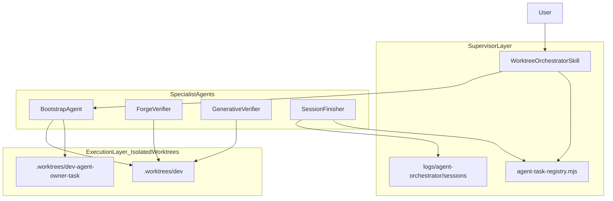

# Multi-Agent Worktree Workspace Configuration

## Current state (no stuck subagent)

Worktree **consolidation is complete**. The remaining gap is **operational bootstrap**, not Git layout:

| Item                                  | Status                                                                                                                                          |
| ------------------------------------- | ----------------------------------------------------------------------------------------------------------------------------------------------- |
| `.worktrees/dev` git checkout         | Exists                                                                                                                                          |
| Scripts/docs updated to `.worktrees/` | Done ([`scripts/lib/worktree-context.ps1`](scripts/lib/worktree-context.ps1), [`docs/multi-agent-worktrees.md`](docs/multi-agent-worktrees.md)) |
| Cursor auto-bootstrap                 | [`/.cursor/setup-worktree-windows.ps1`](.cursor/setup-worktree-windows.ps1) — 9-step install (ports, yarn, bun, poetry, hooks, session)         |
| `.worktrees/dev` full install         | **Not run** — audit noted missing `node_modules`; verify commands failed                                                                        |
| `new-agent-worktree.ps1`              | Ports + env + hooks only — **no** yarn/bun/poetry (relies on Cursor setup or manual)                                                            |
| Devcontainer `post-create.sh`         | **Legacy** (root `npm install`, old `agent/` layout, smart-coding-mcp) — does not match federated monorepo                                      |
| Beads                                 | `bd` available, DB not initialized                                                                                                              |

**Primary dev surface:** open [`Monorepo_ModMe/.worktrees/dev`](.worktrees/dev) (not main checkout). Main stays review/merge-only per [`.cursor/rules/multi-agent-worktrees.mdc`](.cursor/rules/multi-agent-worktrees.mdc).

---

## Architecture: supervisor + isolated worktrees

Apply **multi-agent-patterns** (context isolation via worktrees, supervisor for coordination) and **agent-orchestration-multi-agent-optimize** (parallel verify, minimal cross-agent chatter):



**Design choices:**

- **Supervisor** = `modme-worktree-orchestration` skill + session envelope — workers return structured JSON (`yarn agent:status --json`, `worktree-doctor.ps1 -Json`), not prose summaries (avoids telephone-game).
- **Context isolation** = one worktree per agent task; shared state only via filesystem (`data/agent-registry.json`, session envelopes, beads).
- **Forward path** = `vibe-session-finish.ps1 -Yes ... -CreatePr` passes PR URL directly to user (no supervisor rewrite).

---

## Phase 1 — Bootstrap `.worktrees/dev` (immediate unblock)

From **main checkout** `C:\Users\dylan\Monorepo_ModMe`:

```powershell
# Ensure dev worktree exists
.\scripts\init-worktrees.ps1

# Full bootstrap (same as Cursor Agents Window)
$env:ROOT_WORKTREE_PATH = "C:\Users\dylan\Monorepo_ModMe"
cd .worktrees\dev
..\..\.cursor\setup-worktree-windows.ps1

# Verify
yarn worktree:doctor
yarn lint:harness
```

`ROOT_WORKTREE_PATH` is required so step 5 copies `.env` from main ([`worktree-copy-env.ps1`](scripts/worktree-copy-env.ps1)).

**Open IDE:** `code C:\Users\dylan\Monorepo_ModMe\.worktrees\dev\workspace.code-workspace`

---

## Phase 2 — Native workspace bootstrap (devcontainer parity, no container)

Create **[`scripts/setup-workspace-windows.ps1`](scripts/setup-workspace-windows.ps1)** — single entry for humans + non-Cursor agents opening a folder in workspace mode.

| Devcontainer / Cursor smart op           | Workspace script step                                                                                              |
| ---------------------------------------- | ------------------------------------------------------------------------------------------------------------------ |
| Git context detection (`post-create.sh`) | `Get-WorktreeContext` — print branch, main vs worktree                                                             |
| Port allocation                          | `worktree-allocate-ports.ps1` (worktrees only)                                                                     |
| Deps install                             | Reuse [`setup-worktree-windows.ps1`](.cursor/setup-worktree-windows.ps1) core steps OR dot-source shared functions |
| `.env` copy                              | `worktree-copy-env.ps1 -SourceRoot $ctx.MainRepoRoot`                                                              |
| `data/` dirs                             | `mkdir data/raw, data/processed, data/reports`                                                                     |
| Git hooks                                | `install-git-hooks.ps1`                                                                                            |
| lean-ctx                                 | `yarn lean-ctx:ensure` + `lean-ctx-session-bootstrap.ps1`                                                          |
| Session envelope                         | `agent-session-start.ps1 -BootstrapIntelligence`                                                                   |
| Main-checkout guard                      | `ensure-worktree.ps1 -WarnOnly` when `IsMainCheckout`                                                              |

**Refactor (DRY):** extract shared steps from `.cursor/setup-worktree-windows.ps1` into [`scripts/lib/worktree-bootstrap.ps1`](scripts/lib/worktree-bootstrap.ps1); both Cursor setup and workspace setup call it.

**Wire into existing flows:**

- [`scripts/init-worktrees.ps1`](scripts/init-worktrees.ps1) — add `-Bootstrap` switch (default on) → call bootstrap after creating `.worktrees/dev`
- [`scripts/new-agent-worktree.ps1`](scripts/new-agent-worktree.ps1) — add `-Bootstrap` switch → full install after create (today only ports/env/hooks)
- Root [`package.json`](package.json) — add `"workspace:bootstrap": "powershell ... setup-workspace-windows.ps1"`

**Update devcontainer docs (read-only cross-link, no container required):** add section to [`.devcontainer/README.md`](.devcontainer/README.md) — "Native workspace equivalent: `yarn workspace:bootstrap`".

---

## Phase 3 — IDE workspace configuration

Update **[`.worktrees/dev/workspace.code-workspace`](workspace.code-workspace)** (via `yarn repo:doctor:fix` if needed) with tasks:

| Task                | Command                                 |
| ------------------- | --------------------------------------- |
| Bootstrap workspace | `yarn workspace:bootstrap`              |
| Worktree doctor     | `yarn worktree:doctor`                  |
| Load ports          | `. .\\scripts\\load-worktree-ports.ps1` |
| Agent session start | `yarn agent:session:start`              |
| Agent TUI           | `yarn agent:tui`                        |
| Verify all          | `yarn verify:all`                       |

Confirm [`.vscode/settings.json`](.vscode/settings.json) already has `cursor.worktreeMaxCount: 25` and `cursor.worktreeCleanupIntervalHours: 6` (per [`docs/multi-agent-worktrees.md`](docs/multi-agent-worktrees.md) IDE section).

**Copilot alignment:** update [`.github/copilot-instructions.md`](.github/copilot-instructions.md) Multi-Agent Worktrees section — paths to `.worktrees/dev`, `yarn workspace:bootstrap`, open worktree workspace file.

---

## Phase 4 — Agent + skills collection (awesome-agent-skills)

### 4a. Project skill (supervisor)

Create **[`.agents/skills/modme-worktree-orchestration/SKILL.md`](.agents/skills/modme-worktree-orchestration/SKILL.md)**:

- When to use: starting/finishing worktree sessions, spawning parallel agents, disk/port triage
- Lifecycle checklist mirroring [`docs/multi-agent-worktrees.md`](docs/multi-agent-worktrees.md) daily workflow
- Commands table: `init-worktrees`, `new-agent-worktree`, `workspace:bootstrap`, `agent:session:*`, `vibe-session-finish`
- Multi-agent routing: forge task → claim `next-forge/**`; generative → `GenerativeUI_monorepo/**`; harness → root scripts
- Output contract: prefer `--json` / `-Json` flags for machine handoff

### 4b. Collection manifest

Create **[`collections/multi-agent-worktrees.collection.yml`](collections/multi-agent-worktrees.collection.yml)**:

```yaml
id: multi-agent-worktrees
name: Multi-Agent Worktree Orchestration
items:
  - path: .agents/skills/modme-worktree-orchestration/SKILL.md
    kind: skill
  - path: .cursor/skills/agent-terminal-orchestration/SKILL.md
    kind: skill
  - path: .agents/skills/smart-git-automation/SKILL.md
    kind: skill
  - path: .agents/skills/lean-ctx/SKILL.md
    kind: skill
  - path: .agents/skills/next-forge/SKILL.md
    kind: skill
tags: [worktrees, multi-agent, orchestration, cursor, copilot]
```

### 4c. Specialist agent definitions

Create thin agent files under **`agents/`** (supervisor delegates via instructions, not runtime framework):

| Agent file                            | Role                   | Primary tools/commands                                 |
| ------------------------------------- | ---------------------- | ------------------------------------------------------ |
| `agents/worktree-bootstrap.agent.md`  | Bootstrap + doctor     | `setup-workspace-windows.ps1`, `worktree-doctor -Fix`  |
| `agents/forge-verifier.agent.md`      | next-forge CI parity   | `yarn verify:forge`, `yarn fix:forge`                  |
| `agents/generative-verifier.agent.md` | GenerativeUI CI parity | `yarn verify:generative`                               |
| `agents/session-finisher.agent.md`    | PR + cleanup           | `vibe-session-finish.ps1`, `remove-agent-worktree.ps1` |

### 4d. Install external skills (awesome-agent-skills)

Use skills-sh MCP / `npx skills find` to add complementary skills to `.agents/skills/`:

- Context engineering: `context-fundamentals`, `context-optimization` (if in catalog)
- Agent safety / governance patterns
- Any `ai-team-orchestration` or `agent-governance` from awesome-copilot vendor

Run `npm run validate:collections` after manifest creation.

---

## Phase 5 — Orchestration hardening

Leverage existing terminal orchestration ([`docs/agent-terminal-orchestration.md`](docs/agent-terminal-orchestration.md)):

1. **Enable beads (optional):** `bd init` in `.worktrees/dev` if persistent task memory wanted; remove `-SkipBeads` from bootstrap once initialized
2. **Duplicate-task guard:** `agent-session-start.ps1 -ClaimPaths` for parallel agents on same paths
3. **Smoke test:** `yarn e2e:worktree-smoke` (if present) after bootstrap
4. **Parallel verify pattern** (infinite-gratitude style): dispatch forge + generative + harness checks concurrently at session end via `agent-session-finish.ps1 -VerifyStack`

**Cost/latency controls** (orchestration-optimize):

- Lite bootstrap for docs-only agent worktrees (`-Bootstrap Lite` — ports + env only)
- Full bootstrap for code tasks
- Turbo shared cache already configured; optional remote cache follow-up per audit

---

## Phase 6 — Documentation + validation

| Doc                                                                                        | Change                                                                                   |
| ------------------------------------------------------------------------------------------ | ---------------------------------------------------------------------------------------- |
| [`docs/multi-agent-worktrees.md`](docs/multi-agent-worktrees.md)                           | New section: **Native workspace (no devcontainer)** with bootstrap + open workspace file |
| [`AGENTS.md`](AGENTS.md)                                                                   | Point session start to `yarn workspace:bootstrap`                                        |
| [`docs/audit/worktree-monorepo-2026-07-04.md`](docs/audit/worktree-monorepo-2026-07-04.md) | Append post-bootstrap verify results                                                     |

**Validation checklist (run from `.worktrees/dev`):**

```powershell
yarn workspace:bootstrap      # idempotent
yarn worktree:doctor
yarn agent:status --json
yarn lint:harness
yarn pre-commit:check --full
yarn verify:forge             # after installs
yarn verify:generative
```

---

## What we are NOT doing

- Rewriting devcontainer `post-create.sh` for federated monorepo (out of scope unless you later use containers — workspace path is primary)
- Merging `next-forge` ↔ `GenerativeUI_monorepo` workspaces
- Force-deleting residual `Monorepo_ModMe-dev` fragments (manual `rimraf` if still on disk)

---

## Success criteria

1. Opening `.worktrees/dev/workspace.code-workspace` + one bootstrap command yields working forge + generative dev stacks with isolated ports
2. `new-agent-worktree.ps1 -Bootstrap` produces agent-ready folders without manual install
3. Cursor Agents Window and native workspace share the same bootstrap library (`worktree-bootstrap.ps1`)
4. `collections/multi-agent-worktrees.collection.yml` + supervisor skill documented and valid
5. Copilot/Cursor rules reference `.worktrees/` paths consistently
