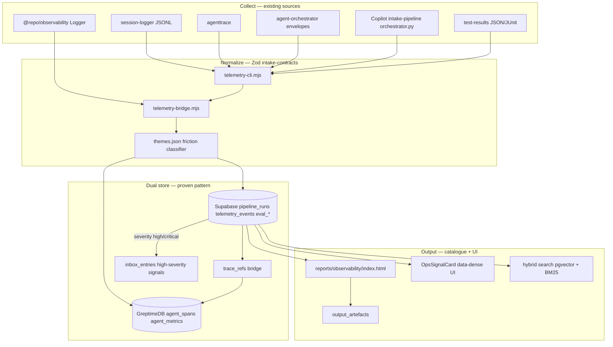

# Observability & Telemetry Ingestion Pipeline (Revised)

## Alignment with prior art

This plan **extends** existing ModMe pipelines — it does not invent parallel schemas. Key precedents:

| Prior work             | Pattern to reuse                                                                                                        | Path                                                                                                                                 |
| ---------------------- | ----------------------------------------------------------------------------------------------------------------------- | ------------------------------------------------------------------------------------------------------------------------------------ |
| Scrape handover        | 3-stage lifecycle (`raw` → `classified` → `promoted`), Zod at boundaries, handover frontmatter + `/handover` skill spec | [`GenerativeUI_monorepo/scrape-pipeline/handover-2026-06-27.md`](GenerativeUI_monorepo/scrape-pipeline/handover-2026-06-27.md)       |
| Inbox card contract    | Shared enums: `entry_type`, `severity`, `agent_role`, `tags[]`, `features{}`                                            | [`docs/inbox-pipeline/contracts/inbox-contract.v1.json`](docs/inbox-pipeline/contracts/inbox-contract.v1.json)                       |
| Copilot metrics intake | Session/tool metrics → JSONL staging → Supabase upsert (`--dry-run`)                                                    | [`GenerativeUI_monorepo/intake-pipeline/orchestrator.py`](GenerativeUI_monorepo/intake-pipeline/orchestrator.py)                     |
| Eval architecture      | Collect → normalize → score → report; theme-driven signals; HTML artefact                                               | [`docs/evaluation/ARCHITECTURE.md`](docs/evaluation/ARCHITECTURE.md)                                                                 |
| Codebase dual-store    | Greptime (spans/code) + Supabase (cards/metadata); `code_pattern_refs` bridge                                           | [`docs/codebase/ARCHITECTURE.md`](docs/codebase/ARCHITECTURE.md)                                                                     |
| Knowledge cards UI     | `EntryCard` molecule consuming `InboxEntryListItem`                                                                     | [`next-forge/apps/app/.../entry-card.tsx`](<next-forge/apps/app/app/(authenticated)/knowledge/components/entry-card.tsx>)            |
| Catalogue              | `output_schemas` + `output_artefacts` for generated reports/skills                                                      | Prisma `OutputSchema` / `OutputArtefact`                                                                                             |
| Schema snapshots       | Golden fixture + Vitest `toMatchSnapshot()` on enum contracts                                                           | [`next-forge/packages/schemas/__snapshots__/schemas.test.ts.snap`](next-forge/packages/schemas/__snapshots__/schemas.test.ts.snap)   |
| ai-native-cli          | JSON stdout, structured stderr, exit 0/1/2                                                                              | [`scripts/agent-eval-collect.mjs`](scripts/agent-eval-collect.mjs), [`scripts/agent-eval-report.mjs`](scripts/agent-eval-report.mjs) |
| Journal CI             | Health workflow + code-index pipeline + adaptive changelog                                                              | [`scripts/journal/README.md`](scripts/journal/README.md), `.github/workflows/journal-health.yml`                                     |
| Knowledge KB           | Concept → keywords → files → docs mapping for issue enrichment                                                          | [`scripts/knowledge-management/README.md`](scripts/knowledge-management/README.md)                                                   |
| Auditor integrity      | No facade hooks or hallucinated config keys — real scripts only                                                         | [`.agents/auditor/handoff.md`](.agents/auditor/handoff.md)                                                                           |

**User decisions (confirmed):** tenant-ready schema from day one; dual-store Greptime + Supabase.

---

## Aria blueprint summary

```
ARIA BLUEPRINT — Observability Pipeline v1.0
Project: ModMe unified observability
Input: scrape handover + eval ARCHITECTURE + dual-store intake

ADR:
- Pattern: Extend intake 3-stage model (collect → classify/normalize → promote/store)
- DB: Supabase (cards/signals/runs) + Greptime (spans/metrics) — same as code intake
- Auth: tenant_id on all rows + RLS; service-role ingest scripts set tenant explicitly
- CLI: ai-native-cli JSON-first (telemetry-cli.mjs)

Data model (new/amended):
  tenants          — root FK for all tenant-scoped observability
  pipeline_runs    — unifies intake_pipeline_runs + eval_events audit pattern
  telemetry_events — + tenant_id; links to trace_refs
  trace_refs       — like code_pattern_refs: telemetry_event_id ↔ greptime_span_id
  eval_*           — + tenant_id (006_eval_pipeline.sql tables)
  agent_spans      — Greptime: trace_id, span_id, tenant_id, session_id, duration_ms, attributes

Lifecycle (maps scrape stages):
  collect (raw)     → JSONL logs, agenttrace, test-results, session envelopes
  normalize         → Zod validate → telemetry-bridge
  classify          → theme matching (eval_signals), categorizeLog (telemetry_categories)
  promote           → Supabase rows + optional inbox_entries for high-severity friction signals
  report            → HTML artefact + output_artefacts catalogue row
```

---

## Target architecture



---

## Phase 0 — Align prior art + equip agents

**Integrity rule** (from auditor handoff): every hook, script, and config key must exist and be verifiable — no `multi_agent_sync`-style hallucinations, no hooks pointing to missing PS1 files.

1. Run [`scripts/cursor-ai/setup.ps1`](scripts/cursor-ai/setup.ps1) in a worktree.
2. Create [`.cursor/skills/observability-pipeline/SKILL.md`](.cursor/skills/observability-pipeline/SKILL.md) referencing:
   - Prior handover format (YAML frontmatter + next-agent checklist) from scrape handover §4
   - Skills: `error-debugging-error-trace`, `distributed-debugging-debug-trace`, `ai-agents-architect`, `saas-multi-tenant`, `hybrid-search-implementation`, `ai-native-cli`, `aria`
3. Add `/handover` section to skill (mirror scrape handover §4.5 checklist).
4. Extend [`.lean-ctx.toml`](.lean-ctx.toml) `task_profiles`:
   - `observability-work` — focus `scripts/`, `next-forge/packages/observability/`, `docs/evaluation/`
   - `session-audit` — `tee_mode = "always"`, include `logs/**`
5. **Fix session-logger**: implement [`.github/hooks/session-logger/session-logger.ps1`](.github/hooks/session-logger/session-logger.ps1) with real JSONL writes (fields from eval ARCHITECTURE: `agent`, `worktree`, `branch`, `catalogue_item_id`, `toolCall`, `userCorrection`).
6. Extend [`scripts/knowledge-management/issue-context-mapper.ts`](scripts/knowledge-management/issue-context-mapper.ts) `KNOWLEDGE_BASE` with observability concepts: `agenttrace`, `telemetry-bridge`, `eval_signals`, `pipeline_runs`, `OpsSignalCard`.

---

## Phase 1 — Schema + golden contracts (Aria + Prisma + Supabase)

**Migration** [`next-forge/supabase/migrations/009_observability_tenant.sql`](next-forge/supabase/migrations/009_observability_tenant.sql):

- `tenants` + dev seed (`modme-local`)
- `tenant_id` on `telemetry_events`, `eval_sessions`, `eval_signals`, `eval_events`, `eval_contract_results`
- `pipeline_runs` — **unifies** legacy `intake_pipeline_runs` ([`GenerativeUI_monorepo/intake-pipeline/sql/001_init_tables.sql`](GenerativeUI_monorepo/intake-pipeline/sql/001_init_tables.sql)) and `eval_events` audit columns
- `trace_refs` — mirrors `code_pattern_refs` pattern for Greptime span linkage
- RLS: `tenant_id = current_setting('app.current_tenant_id')::uuid`; ingest role bypasses via explicit column writes
- Indexes: `(tenant_id, created_at DESC)` per supabase-postgres-best-practices

**Prisma** — extend [`next-forge/packages/database/prisma/schema.prisma`](next-forge/packages/database/prisma/schema.prisma).

**Golden contract** (snapshot pattern from `@repo/schemas`):

- Add [`next-forge/packages/schemas/fixtures/observability-contract.golden.json`](next-forge/packages/schemas/fixtures/observability-contract.golden.json)
- Add Vitest test + snapshot for enum literals (`telemetryLevels`, `pipelineStatuses`, `evalImpactLevels`)
- Zod mirror in [`next-forge/packages/schemas/observability.ts`](next-forge/packages/schemas/observability.ts)

**Greptime** — extend [`experiments/micro-agents/models/greptimedb_client.ts`](experiments/micro-agents/models/greptimedb_client.ts): `agent_spans`, `agent_metrics` tables (port OTEL fields from [`src/lib/observability/greptime-config.ts`](src/lib/observability/greptime-config.ts)).

---

## Phase 2 — Contracts + card molecules

Extend [`packages/intake-contracts/`](packages/intake-contracts/) — **reuse inbox enums**, do not fork:

| Schema                | Maps to                             | Reuses                                                                                       |
| --------------------- | ----------------------------------- | -------------------------------------------------------------------------------------------- |
| `telemetry-event.mjs` | `telemetry_events`                  | `severity`, `agent_role` from classify-output                                                |
| `pipeline-run.mjs`    | `pipeline_runs`                     | status enum: `running\|completed\|failed\|skipped` (from eval_events)                        |
| `eval-signal.mjs`     | `eval_signals`                      | themes from [`docs/evaluation/contracts/themes.json`](docs/evaluation/contracts/themes.json) |
| `test-result.mjs`     | `eval_contract_results` + telemetry | Playwright/JUnit normalized shape                                                            |

JSON mirrors in [`docs/inbox-pipeline/contracts/`](docs/inbox-pipeline/contracts/) as `observability-contract.v1.json` (ADR-0009 parity).

**UI molecule** — [`next-forge/apps/app/.../components/ops-signal-card.tsx`](<next-forge/apps/app/app/(authenticated)/knowledge/components/ops-signal-card.tsx>):

- **data-dense-design**: 11–12px monospace, tight padding, severity color deltas, tabular metrics
- Props mirror `eval_signals` + `pipeline_runs` fields (not fluffy EntryCard layout)
- Composable in Knowledge UI "Session Ops" tab alongside existing `EntryCard` grid

---

## Phase 3 — ai-native-cli telemetry tool

New [`scripts/telemetry-cli.mjs`](scripts/telemetry-cli.mjs) + [`scripts/telemetry/agent/`](scripts/telemetry/agent/) directory:

```
scripts/telemetry/
  agent/
    brief.md
    rules/trigger.md, workflow.md, writeback.md
  telemetry-cli.mjs      # subcommands: sync, collect, report, ingest-agenttrace
  lib/telemetry-bridge.mjs
```

**CLI contract** (match `agent-eval-collect.mjs` + ai-native-cli Phase 1):

- Default stdout: JSON `{ result, stats, pipeline_run_id }`
- stderr on error: `{ error: true, code, message, suggestion }`
- Exit: `0` success, `1` runtime, `2` usage
- Flags: `--dry-run`, `--human`, `--since=7d`, `--tenant-id=`, `--yes` (destructive purge)

**Subcommands:**

| Command          | Source                                              | Output                          |
| ---------------- | --------------------------------------------------- | ------------------------------- |
| `sync`           | `logs/copilot/*`, orchestrator errors, test-results | dual-write via bridge           |
| `collect`        | wraps `agent-eval-collect.mjs` + Supabase upsert    | `eval_events` + `eval_signals`  |
| `report`         | wraps `agent-eval-report.mjs`                       | HTML + `output_artefacts`       |
| `ingest-copilot` | wraps `intake-pipeline/orchestrator.py`             | unifies Copilot session metrics |

Root scripts: `yarn telemetry:sync`, `yarn telemetry:report`, `yarn telemetry:test`.

---

## Phase 4 — Bridge + orchestrator wiring

[`scripts/lib/telemetry-bridge.mjs`](scripts/lib/telemetry-bridge.mjs):

- Propagates `pipeline_run_id`, `AGENT_SESSION_ID`, `DEV_TENANT_ID`
- Stage lifecycle mirrors scrape: `raw` (collected) → `normalized` (Zod pass) → `stored` (DB write) → `promoted` (inbox if high severity)
- Dual-write Supabase + Greptime; `trace_refs` on span linkage
- Idempotent via content hashes (same pattern as `inbox_entries.content_hash`)

**Wire existing orchestrators** (minimal diff):

| Script                                                                                                           | Change                                                         |
| ---------------------------------------------------------------------------------------------------------------- | -------------------------------------------------------------- |
| [`scripts/intake-orchestrator.mjs`](scripts/intake-orchestrator.mjs)                                             | Open/close `pipeline_runs` per stage                           |
| [`scripts/agent-session-start/finish.ps1`](scripts/agent-session-start.ps1)                                      | Upsert `eval_sessions`; call `telemetry-cli collect` on finish |
| [`scripts/agent-eval-collect.mjs`](scripts/agent-eval-collect.mjs)                                               | Delegate DB sync to bridge (keep JSONL as source of truth)     |
| [`GenerativeUI_monorepo/intake-pipeline/orchestrator.py`](GenerativeUI_monorepo/intake-pipeline/orchestrator.py) | Add `--tenant-id` + map to unified `pipeline_runs`             |

---

## Phase 5 — UI, catalogue, hybrid search

1. **Session Ops panel** — data-dense table in Knowledge UI:
   - Columns: `pipeline`, `status`, `duration_ms`, `signal_count`, `impact`, `session_id`
   - Filter by tenant, date range, severity
2. **Catalogue artefacts** — on `telemetry report --output`:
   - Insert `output_schemas` row `schema_type: 'observability-report'`
   - Insert `output_artefacts` with HTML path `reports/observability/latest.html`
3. **Hybrid search** ([`hybrid-search-implementation`](.agents/skills/hybrid-search-implementation/SKILL.md)):
   - Embed `eval_signals.title + description` into pgvector (reuse inbox 384-dim pipeline)
   - BM25 on `telemetry_events.message` via existing lean-ctx search or Supabase full-text
   - RPC `match_observability_signals(query_embedding, tenant_id, threshold)` — mirror `match_inbox_entries`
4. **Wire `@repo/observability` Logger** in API routes; Greptime OTEL in [`apps/api/instrumentation.ts`](next-forge/apps/api/instrumentation.ts).

---

## Phase 6 — CI, beads, adaptive learning

**New workflow** [`.github/workflows/observability-pipeline-check.yml`](.github/workflows/observability-pipeline-check.yml) — mirror [`inbox-pipeline-check.yml`](.github/workflows/inbox-pipeline-check.yml):

| Job                | Runs                                            | Blocking                 |
| ------------------ | ----------------------------------------------- | ------------------------ |
| `contract-test`    | `yarn telemetry:test` + golden snapshot         | yes                      |
| `sync-dry-run`     | `node scripts/telemetry-cli.mjs sync --dry-run` | yes                      |
| `retrieval-eval`   | hybrid search Recall@5 on eval_signals fixtures | no (`continue-on-error`) |
| `agenttrace-smoke` | `agenttrace --overview --fail-on-critical`      | advisory                 |

**Beads** — add starter issues via [`scripts/init-beads-starter-issues.ps1`](scripts/init-beads-starter-issues.ps1) pattern:

- `modme-observability-phase-1-schema`
- `modme-telemetry-cli-agent-native`
- `modme-ops-signal-card-ui`

**Changelog** — extend [`scripts/validate-changelog.mjs`](scripts/validate-changelog.mjs) path filters for `scripts/telemetry/**`, `docs/evaluation/**`.

**Adaptive learning loop** (from eval + journal patterns):

```
session logs → theme match → eval_signals → popularity composite → catalogue_popularity_snapshots
CI failure   → telemetry_event → inbox drop (severity high) → MDA categorize
```

---

## Parallel agent dispatch (implementation order)

When executing, launch these tracks concurrently:

| Agent        | Scope                                        | Deliverable                                        |
| ------------ | -------------------------------------------- | -------------------------------------------------- |
| **Aria**     | Schema + API contract + file tree            | `009_observability_tenant.sql` draft + Prisma diff |
| **Mason**    | `telemetry-cli.mjs` + `telemetry-bridge.mjs` | ai-native-cli compliant scripts                    |
| **Luna**     | Golden fixtures + Vitest snapshots           | `@repo/schemas/observability.ts` tests             |
| **Rex**      | CI workflow + beads issues                   | `observability-pipeline-check.yml`                 |
| **Frontend** | OpsSignalCard + Session Ops tab              | data-dense-design molecule                         |

---

## Verification checklist

| Check              | Command                                                                    |
| ------------------ | -------------------------------------------------------------------------- |
| No facade hooks    | `Test-Path .github/hooks/session-logger/session-logger.ps1` → True         |
| Schema + RLS       | `cd next-forge && bun run db:push` + `supabase db advisors`                |
| Golden snapshots   | `cd next-forge/packages/schemas && bun test`                               |
| CLI agent-friendly | `node scripts/telemetry-cli.mjs sync --dry-run \| jq .`                    |
| Dual-write         | query `pipeline_runs` + Greptime `agent_spans` after `yarn telemetry:sync` |
| Tenant isolation   | two tenants; RLS blocks cross-read                                         |
| HTML artefact      | `yarn telemetry:report --output reports/observability/latest.html`         |
| CI parity          | `yarn telemetry:test` in PR validate job                                   |

---

## Key files

**Create:** `009_observability_tenant.sql`, `scripts/telemetry/` tree, `observability-contract.golden.json`, `ops-signal-card.tsx`, `observability-contract.v1.json`, `observability-pipeline-check.yml`, `.cursor/skills/observability-pipeline/SKILL.md`

**Modify:** `intake-orchestrator.mjs`, `agent-eval-collect/report.mjs`, `agent-session-*.ps1`, `telemetry-ingestor.ts`, `greptimedb_client.ts`, `schema.prisma`, `intake-contracts/index.mjs`, `knowledge-management/issue-context-mapper.ts`, `docs/evaluation/ARCHITECTURE.md`, `docs/inbox-pipeline/README.md`

**Deprecate (don't duplicate):** keep `GenerativeUI_monorepo/intake-pipeline/` as Copilot-specific collector; route through `telemetry-cli ingest-copilot` instead of parallel Supabase writers.

---

## Risks & mitigations

| Risk                        | Mitigation                                                                                               |
| --------------------------- | -------------------------------------------------------------------------------------------------------- |
| Schema drift vs inbox enums | Single source: `packages/intake-contracts` exports shared `ENTRY_TYPES`, `SEVERITIES`                    |
| Facade implementations      | Auditor checklist in PR template; verify `Test-Path` on all hook scripts                                 |
| Greptime/Supabase desync    | `trace_refs` bridge + pipeline_run `greptime_run_id`                                                     |
| Secret leakage in logs      | `secret_detection` in bridge + session-logger `SKIP_LOGGING`                                             |
| Monorepo boundary           | Root `scripts/telemetry/` orchestrates; next-forge consumes via `@repo/observability` + HTTP ingest only |
