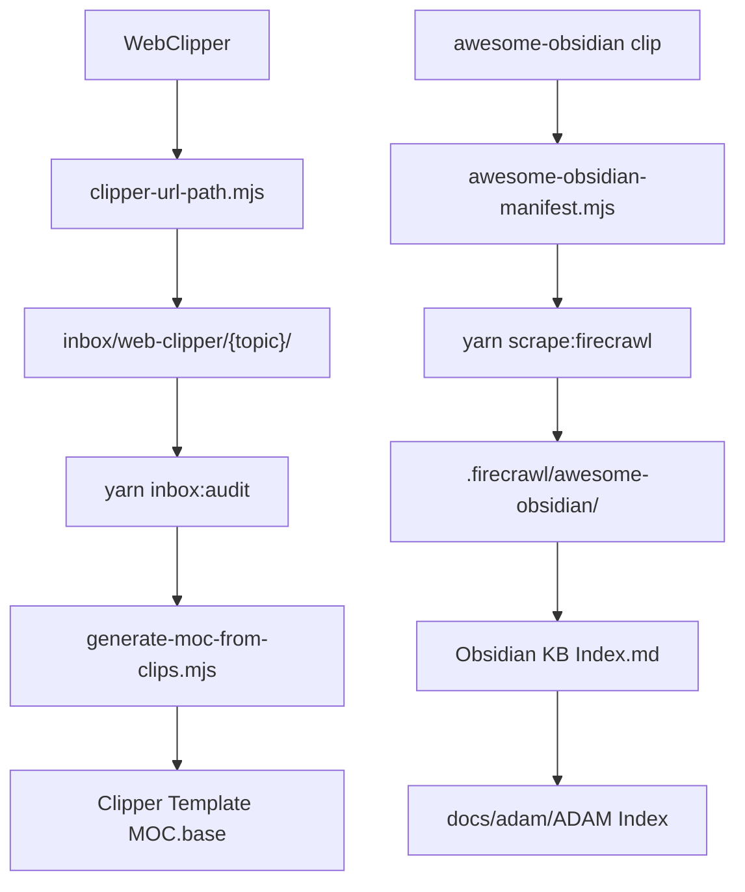

# Obsidian Vault Automation & Clipper Path Refinement

## Goals

1. **Clipper path model** — all ModMe inbox clips land under `GenerativeUI_monorepo/docs/inbox/web-clipper/{url-derived-dirs}/` with **timestamp-prefixed filenames** and unchanged inbox frontmatter contract.
2. **Script-driven vault** — repeatable scripts for Zettelkasten folders, MOC/Bases generation, clipper validation, and optional post-clip normalization.
3. **Knowledge harvest** — Firecrawl local download of ~50–80 URLs (plugins + core `help.obsidian.md` pages) from the clipped [awesome-obsidian](GenerativeUI_monorepo/docs/inbox/web-clipper/2026-07-12T01-10-54_snippet_researcher_kmaasrudawesome-obsidian%20🕶️%20Awesome%20stuff%20for%20Obsidian.md) list, emitted as Obsidian-indexed KB notes.
4. **Skill alignment** — update `obsidian-markdown`, `obsidian-clipper-template-creator`, `ci-cd-and-automation`, and add Bases MOCs for template topics.

## Architecture

## Phase 1 — Shared URL path logic (clipper)

**Problem:** Templates hardcode `"path": "GenerativeUI_monorepo/docs/inbox"` (`[modme-inbox-github-repo.json](templates/obsidian-clipper/modme-inbox-github-repo.json)`, `[modme-inbox-code-snippet.json](templates/obsidian-clipper/modme-inbox-code-snippet.json)`, etc.). Clips flatten into `web-clipper/` with timestamp-only names.

**Solution:** Add canonical path builder + document filter strings for Clipper JSON.

| URL pattern                             | Subpath example              | Filename leaf                  |
| --------------------------------------- | ---------------------------- | ------------------------------ |
| `github.com/{owner}/{repo}` (repo home) | `web-clipper/{repo}/`        | `README`                       |
| `github.com/.../blob/.../{file}`        | `web-clipper/{repo}/`        | `{file}` (no ext in safe_name) |
| `obsidian.md/help/{a}/{b}`              | `web-clipper/obsidian/{a}/`  | `{b}`                          |
| `help.obsidian.md/...`                  | same as obsidian.md          | same                           |
| Fallback (generic link)                 | `web-clipper/{domain-stem}/` | `{title                        |

**Filename (confirmed):** keep `{{time|date:"YYYY-MM-DDTHH-mm-ss"}}_{type}_{agent_role}_{leaf|safe_name}` inside the subfolder.

**New file:** `[scripts/obsidian/clipper-url-path.mjs](scripts/obsidian/clipper-url-path.mjs)`

- Export `resolveClipperPath(url)` and `resolveClipperLeaf(url)` (Node, testable).
- CLI: `node scripts/obsidian/clipper-url-path.mjs --url <url>` for template authoring/debug.
- Vitest fixtures for obsidian help, GitHub repo/blob, docs.expo.dev.

**Template updates** (all ModMe starter pack in `[templates/obsidian-clipper/](templates/obsidian-clipper/)`):

- Change base `path` to embed URL-derived segments using Clipper filters (document exact strings in README; complex GitHub logic may use `` blocks in path if supported, else per-template expressions).
- Add frontmatter property `clip_path` = resolved relative path for intake/MOC scripts.
- Update `[templates/obsidian-clipper/README.md](templates/obsidian-clipper/README.md)` template order section — **Code Snippet before GitHub Repo** (already documented; verify triggers exclude `/blob/` on repo template).

**Restore CI script:** copy `[export-obsidian-clipper.mjs](.worktrees/dev-agent-cursor-workflow-speckit-residual/scripts/knowledge-management/export-obsidian-clipper.mjs)` to `[scripts/knowledge-management/export-obsidian-clipper.mjs](scripts/knowledge-management/export-obsidian-clipper.mjs)` and extend validation:

- Require `path` contains `web-clipper`
- Optional `--test-url` runs `clipper-url-path.mjs` against fixture URLs

**Sidecar alignment:** update `[scripts/setup-modme-obsidian-sidecar.ps1](scripts/setup-modme-obsidian-sidecar.ps1)` default `newFileFolderPath` to `inbox/web-clipper` if vault-relative path is used.

## Phase 2 — Zettelkasten + Format Converter automation

Adopt patterns from clipped research + official docs:

| Source                                                                                            | Adoption                                                                               |
| ------------------------------------------------------------------------------------------------- | -------------------------------------------------------------------------------------- |
| [Import Zettelkasten](https://obsidian.md/help/import/zettelkasten)                               | Document UID→title link fix via **Format converter** core plugin                       |
| [Format converter](https://obsidian.md/help/plugins/format-converter)                             | Vault policy note: run once after legacy UID imports; not in CI                        |
| [Zettelkasten in Obsidian](https://obsidian.rocks/getting-started-with-zettelkasten-in-obsidian/) | `Fleeting/` + `Permanent/` folder convention in sidecar vault note                     |
| [MOC inbox query](https://obsidian.rocks/quick-tip-quickly-organize-notes-in-obsidian/)           | **Bases** "unsorted backlinks" view instead of Dataview DQL (per [[Query Tool Guide]]) |
| [Growth graph](https://obsidian.rocks/a-graph-for-zettelkasten-measuring-growth-in-obsidian/)     | Defer DataviewJS charts; use Bases `file.ctime` table + manual KPI in Command Center   |

**New docs:**

- `[docs/adam/Zettelkasten Workflow.md](docs/adam/Zettelkasten Workflow.md)` — fleeting→permanent refactor loop, Format converter steps, link to inbox clips for [basic](GenerativeUI_monorepo/docs/inbox/web-clipper/2026-07-12T01-28-58_snippet_researcher_Basic%20formatting%20syntax.md) / [advanced](GenerativeUI_monorepo/docs/inbox/web-clipper/2026-07-12T01-29-28_snippet_researcher_Advanced%20formatting%20syntax.md) syntax.
- `[docs/adam/Obsidian Syntax Index.md](docs/adam/Obsidian Syntax Index.md)` — curated OFM cheat sheet linking clipped help pages.

**New script:** `[scripts/obsidian/vault-orchestrator.mjs](scripts/obsidian/vault-orchestrator.mjs)`

- `init-zettelkasten` — ensure `Fleeting/`, `Permanent/` placeholders in vault docs (junction-safe).
- `promote-clip` — move a clip from `web-clipper/` to `Permanent/` with wikilinks + `type: permanent` frontmatter.
- `moc-refresh` — calls MOC generator (Phase 3).

**yarn scripts** in root `[package.json](package.json)`:

- `obsidian:clipper:validate` → export-obsidian-clipper.mjs
- `obsidian:clipper:path` → clipper-url-path.mjs
- `obsidian:vault:orchestrate` → vault-orchestrator.mjs

## Phase 3 — Bases MOCs for clipper template topics

**New Bases files in `[docs/adam/](docs/adam/)`:**

1. `[Clipper Template MOC.base](docs/adam/Clipper Template MOC.base)`

- Views: by `type` (research/snippet/link), by `tags` domain, recent 14d in `web-clipper/`
- Filters: `file.inFolder("inbox/web-clipper")` or vault junction `inbox/`

2. `[Obsidian KB MOC.base](docs/adam/Obsidian KB MOC.base)`

- Views: plugins, core-help, themes (populated after Firecrawl manifest)

3. `[Clipper Template MOC.md](docs/adam/Clipper Template MOC.md)` — hub note embedding both bases + wikilinks to each JSON template topic in `[templates/obsidian-clipper/README.md](templates/obsidian-clipper/README.md)`

**Generator:** `[scripts/obsidian/generate-moc-from-clips.mjs](scripts/obsidian/generate-moc-from-clips.mjs)`

- Scan `GenerativeUI_monorepo/docs/inbox/web-clipper/**`
- Group by first path segment (`obsidian/`, `awesome-obsidian/`, etc.)
- Append "unsorted" section (MOC inbox pattern) listing notes not yet linked from MOC body
- Update `Clipper Template MOC.md` backlink sections only (idempotent)

Link from `[docs/adam/ADAM Index.md](docs/adam/ADAM Index.md)`.

## Phase 4 — Firecrawl knowledge base (plugins + core help)

**Scope (confirmed):** ~50–80 URLs — official `help.obsidian.md` / `obsidian.md/help` pages (syntax, plugins, import, format-converter) + plugin README/docs links extracted from awesome-obsidian clip.

**Pipeline:**

1. `[scripts/obsidian/awesome-obsidian-manifest.mjs](scripts/obsidian/awesome-obsidian-manifest.mjs)`

- Parse markdown tables/links from clipped awesome file
- Filter: `Core plugins` section + `help.obsidian.md` URLs from existing clips
- Output: `data/obsidian-kb/manifest.json` (url, category, title, priority)

2. `[scripts/obsidian/firecrawl-obsidian-kb.mjs](scripts/obsidian/firecrawl-obsidian-kb.mjs)`

- Uses `[scripts/lib/firecrawl-local-client.mjs](scripts/lib/firecrawl-local-client.mjs)` (self-host `yarn firecrawl:up`)
- Writes `.firecrawl/awesome-obsidian/{category}/{slug}/index.md` per firecrawl-knowledge-base convention
- Rate-limit + `--dry-run` + `--limit N`

3. `[scripts/obsidian/emit-obsidian-kb-index.mjs](scripts/obsidian/emit-obsidian-kb-index.mjs)`

- Generate `[docs/adam/Obsidian KB Index.md](docs/adam/Obsidian KB Index.md)` with wikilinks + frontmatter tags per category
- Optional: promote high-value pages to `docs/obsidian-kb/` (curated subset, not full mirror)

**yarn:** `obsidian:kb:manifest`, `obsidian:kb:scrape`, `obsidian:kb:index`

**Prerequisite:** `yarn firecrawl:status` must pass before scrape phase.

## Phase 5 — schema-crawler clarification (not awesome JSONL)

`[schema-crawler.ts](GenerativeUI_monorepo/apps/agent-generator/src/mcp-registry/schema-crawler.ts)` generates **Zod modules from MCP JSON Schema**, not Obsidian KB. Plan treats it as a **separate optional bridge**:

- Add `scripts/obsidian/emit-mcp-schema-index.mjs` that reads existing Zod output / `scrape-schemas.ts` definitions and writes a small **MCP Schema Index** note under `docs/adam/` for agent tooling cross-reference.
- Does **not** block clipper/MOC/Firecrawl work.

## Phase 6 — Skill & CI refinements

| Skill                                                                                                           | Updates                                                                                                    |
| --------------------------------------------------------------------------------------------------------------- | ---------------------------------------------------------------------------------------------------------- |
| `[obsidian-markdown](c:/Users/dylan/.agents/skills/obsidian-markdown/SKILL.md)`                                 | Zettelkasten note types, MOC wikilink patterns, syntax callouts, property conventions for Bases            |
| `[obsidian-clipper-template-creator](c:/Users/dylan/.agents/skills/obsidian-clipper-template-creator/SKILL.md)` | Mandatory `web-clipper/` path rules, `clipper-url-path.mjs` test step, timestamp+leaf naming               |
| `[ci-cd-and-automation](c:/Users/dylan/.agents/skills/ci-cd-and-automation/SKILL.md)`                           | Add ModMe gates: `yarn obsidian:clipper:validate`, `yarn inbox:audit --lens funnel` on web-clipper changes |
| `[obsidian-bases](c:/Users/dylan/.agents/skills/obsidian-bases/SKILL.md)`                                       | Reference Clipper MOC + KB MOC as canonical examples                                                       |

**Pre-commit / verify path** (extend `[scripts/pre-commit-checks.mjs](scripts/pre-commit-checks.mjs)` or `yarn pre-commit:check`):

- When `templates/obsidian-clipper/**` changes → run `obsidian:clipper:validate`
- Advisory when `GenerativeUI_monorepo/docs/inbox/web-clipper/**` changes → `inbox:audit`

## Phase 7 — Parallel read-only research (nano models)

Launch **read-only** explore subagents (`gemini-3.5-flash` or `gpt-5.4-nano-medium`) in parallel:

1. **Format converter + core plugin triggers** — summarize automatable Obsidian flows (Format converter, Unique note creator, Templates folder triggers).
2. **Awesome plugin categorization** — validate manifest.json categories against clipped table.
3. **Syntax index** — diff basic vs advanced clipped syntax into `Obsidian Syntax Index.md` outline.

Parent synthesizes into docs; no file writes from subagents.

## Verification checklist

- [ ] Clip `https://obsidian.md/help/import/zettelkasten` → `web-clipper/obsidian/import/{timestamp}_snippet_researcher_zettelkasten.md`
- [ ] Clip `https://github.com/obsidianmd/obsidian` → `web-clipper/obsidian/{timestamp}_research_researcher_README.md`
- [ ] Clip GitHub blob `AGENTS.md` → `web-clipper/obsidian/{timestamp}_snippet_researcher_AGENTS.md`
- [ ] `yarn obsidian:clipper:validate` passes all templates
- [ ] `Clipper Template MOC.base` shows recent clips grouped by folder
- [ ] Firecrawl dry-run produces manifest with 50–80 URLs
- [ ] `docs/adam/ADAM Index.md` links new hubs
- [ ] Sidecar vault opens `web-clipper/` clips via `inbox/` junction

## Out of scope (this iteration)

- Full awesome-obsidian crawl (themes, tools, all resources)
- DataviewJS growth charts (Bases-only per vault policy)
- Smart Connections rebuild automation
- Migrating existing flat `web-clipper/*.md` files (optional follow-up script `normalize-web-clipper-paths.mjs`)

## Key files touched

| Area       | Files                                                                                                              |
| ---------- | ------------------------------------------------------------------------------------------------------------------ |
| Clipper    | `templates/obsidian-clipper/modme-inbox-*.json`, `README.md`                                                       |
| Scripts    | `scripts/obsidian/*.mjs`, `scripts/knowledge-management/export-obsidian-clipper.mjs`                               |
| Vault docs | `docs/adam/Zettelkasten Workflow.md`, `Obsidian Syntax Index.md`, `Obsidian KB Index.md`, `Clipper Template MOC.*` |
| CI         | `package.json`, `scripts/pre-commit-checks.mjs`                                                                    |
| Skills     | `.agents/skills/obsidian-*`, `ci-cd-and-automation`                                                                |
