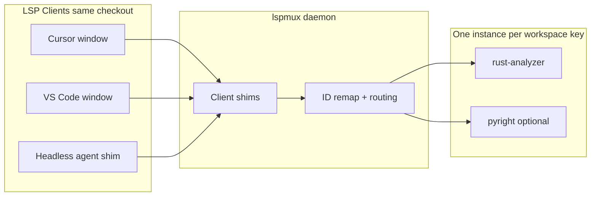

# Shared LSP Multiplexer for ModMe Multi-IDE + Worktree DX

## Research Summary

Your inbox note ([`GenerativeUI_monorepo/docs/inbox/lspmux_dx-ide.md`](GenerativeUI_monorepo/docs/inbox/lspmux_dx-ide.md)) correctly distinguishes two unrelated problems:

| Problem | Direction | Tool | Your need |
|---------|-----------|------|-----------|
| **Instance sharing** | N clients → 1 server | [`lspmux`](https://codeberg.org/p2502/lspmux) | **Yes** (your selection) |
| **Feature merging** | 1 client → N servers | [`rassumfrassum`](https://github.com/joaotavora/rassumfrassum), [`lspx`](https://github.com/thefrontside/lspx) | No (Emacs-only use case) |

**Recommendation:** Use **`lspmux` only** for your stated goal. Defer rassumfrassum unless you add Emacs/Eglot later.

### What lspmux actually does

From upstream README and your parallel research:

- **Daemon:** `lspmux server` listens on `127.0.0.1:27631` (Windows) or a Unix socket (Linux/macOS)
- **Client shim:** Editors invoke `lspmux` (or `lspmux client`) instead of the real server binary; stdio is proxied to the daemon
- **Instance key:** `(workspaceFolders, environment)` from the LSP `initialize` handshake — **not** merely “same git repo”
- **Default server:** `rust-analyzer`; override via `--server-path` or `LSPMUX_SERVER`
- **Known limitation:** Server→client requests are **dropped** (progress UI, `workspace/configuration`, interactive prompts). File a bug upstream if you hit this; it is documented behavior.



### Architecture context (your reference links)

| Reference | Relevance to your setup |
|-----------|-------------------------|
| [rust-analyzer: three architectures](https://rust-analyzer.github.io/blog/2020/07/20/three-architectures-for-responsive-ide.html) | Explains why RA is heavy and worth multiplexing; Salsa/query model is why one shared instance amortizes indexing cost |
| [rassumfrassum / Eglot](https://elpa.gnu.org/devel/doc/eglot.html#Using-Rassumfrassum) | Solves the **opposite** problem; skip unless Emacs joins the pool |
| [Pete Vilter datalog-ts](https://github.com/vilterp/datalog-ts) | Future direction for custom type engines; not needed for lspmux rollout |
| [OpenAI agents-as-tools](https://openai.github.io/openai-agents-python/tools/#agents-as-tools) | Complementary: agents consume LSP **results** via MCP/tools, not replace IDE LSP |
| Repo [`experiments/micro-agents/models/MCP_LSP_INTEGRATION.md`](experiments/micro-agents/models/MCP_LSP_INTEGRATION.md) | Separate track: MCP pseudo-LSP for embeddings/models — keep orthogonal to lspmux |

### Current repo state (gap analysis)

Parallel explore found **zero** `lspmux` / `ra-multiplex` / `rassumfrassum` references in the monorepo. Existing DX is strong on:

- **Worktree isolation:** [`scripts/new-agent-worktree.ps1`](scripts/new-agent-worktree.ps1), port slots via [`scripts/launch-manifest.json`](scripts/launch-manifest.json)
- **Debug/trace:** [`docs/debug-launch-guide.md`](docs/debug-launch-guide.md), launch manifest validator
- **Context compression:** lean-ctx (unrelated to LSP)

**Gap:** No centralized LSP daemon, no editor wiring, no worktree onboarding for LSP.

---

## Critical Constraint: Worktrees vs “Shared Pool”

You selected **worktrees must share the LSP pool**. This needs a precise definition:

| Scenario | Can share one LSP instance? | Why |
|----------|----------------------------|-----|
| Cursor + VS Code on **same checkout** (e.g. main dev folder) | **Yes** | Same `workspaceFolders` + same files on disk |
| Cursor on checkout A + VS Code on worktree B (different paths/branches) | **No (should not)** | Different file contents; sharing would produce **wrong diagnostics** |
| Multiple worktrees | **Separate instances, one daemon** | lspmux still saves ops cost (one daemon, GC, unified config) but spawns per-workspace servers |

**Honest target:** “Shared pool” = **one `lspmux` daemon** + **one language-server instance per unique workspace path**, not one server for all worktrees.

If agents need cross-worktree type awareness, that belongs in **MCP/inbox-pipeline semantic index**, not shared LSP state.

---

## Recommended Architecture (Windows-first, portable)

### Layer 0 — Host daemon (once per machine login)

1. Install: `cargo install lspmux` (crate name is `lspmux`, not `ra-multiplex`)
2. Config: `%USERPROFILE%\.config\lspmux\config.toml` (created on first run)
3. Critical defaults to set:

```toml
instance_timeout = 300
listen = ["127.0.0.1", 27631]
connect = ["127.0.0.1", 27631]
# Prevent per-terminal env from spawning duplicate instances:
pass_environment = ["*", "!WINDOWID", "!DESKTOP_STARTUP_ID", "!ALACRITTY_*", "!WT_SESSION"]
```

4. **Windows service:** No systemd — use one of:
   - Login Task Scheduler task running `lspmux server`
   - Manual `lspmux server` in a dedicated terminal during dev sessions
   - Optional: wrap in [`scripts/setup.ps1`](scripts/setup.ps1) health check (`lspmux status`)

### Layer 1 — Per-language client shims

Create small wrapper scripts in repo (portable, versioned):

| Language | Real server | Shim invocation | Cursor/VS Code setting |
|----------|-------------|-----------------|------------------------|
| Rust | `rust-analyzer` | `lspmux` (default) | `rust-analyzer.server.path` |
| Python | `pyright-langserver` or basedpyright | `lspmux client --server-path <pyright>` | `python.languageServer` + custom path where supported |
| C/C++ | `clangd` | `lspmux client --server-path clangd` | `clangd.path` |

**TypeScript caveat:** VS Code/Cursor use the **built-in TypeScript extension** (`tsserver`), which is **not** easily replaced by lspmux without switching to `typescript-language-server` — a larger DX change. **Phase 1:** multiplex Rust + Python only; **Phase 2:** evaluate `typescript-language-server` behind lspmux if RAM is still a bottleneck.

### Layer 2 — Editor wiring

Add shared settings (not committed secrets) under:

- [`.vscode/settings.json`](.vscode/settings.json) — team baseline
- [`.cursor/settings.json`](.cursor/settings.json) — Cursor overrides if needed

Example for Rust (paths adjusted at setup time):

```json
{
  "rust-analyzer.server.path": "${env:USERPROFILE}\\.cargo\\bin\\lspmux.exe",
  "rust-analyzer.server.extraEnv": {
    "LSPMUX_SERVER": "${env:USERPROFILE}\\.cargo\\bin\\rust-analyzer.exe"
  }
}
```

VS Code and Cursor both honor `rust-analyzer.*` settings when the RA extension is installed.

### Layer 3 — Worktree integration

Extend [`scripts/new-agent-worktree.ps1`](scripts/new-agent-worktree.ps1) (or [`scripts/worktree-copy-env.ps1`](scripts/worktree-copy-env.ps1)) to:

1. Copy `.vscode/settings.json` shim paths into the worktree
2. Write `.worktree-ports.env` (already exists) **plus** optional `LSPMUX_CONNECT=127.0.0.1:27631`
3. Document in worktree README snippet: “LSP shares daemon with host; instance is per worktree path — expected”

Add `yarn worktree:doctor` check: `lspmux status` reachable, daemon running.

### Layer 4 — Observability (distributed-debugging-debug-trace)

| Trace boundary | Implementation |
|----------------|----------------|
| lspmux daemon | `RUST_LOG=lspmux=debug` (temporary); log to `%LOCALAPPDATA%\lspmux\logs` |
| Editor sessions | Existing VS Code/Cursor LSP trace: `"typescript.tsserver.log"`, `"rust-analyzer.trace.server"` |
| Agent correlation | Reuse inbox-pipeline correlation ID pattern; tag agent tool runs separately from LSP (agents rarely attach to lspmux directly on Windows) |
| Health | `lspmux status` + `lspmux reload <workspace>` in troubleshooting doc |

Do **not** enable verbose LSP trace globally in production-like flows — sample on failure only.

---

## Phased Rollout (Atlas-aligned, ≤4 phases)

### Phase 1 — Proof on main checkout (low risk)

- Install lspmux on Windows
- Start daemon manually
- Wire **rust-analyzer only** in Cursor + VS Code on **one** checkout
- Verify: open two windows → `lspmux status` shows **1** RA instance, both clients connected
- Document pitfalls (server→client drops, `pass_environment`)

**Success criteria:** Two editors, one RA process, diagnostics match direct RA.

### Phase 2 — Repo DX automation

- Add [`scripts/lspmux/`](scripts/lspmux/) with:
  - `install.ps1` — cargo install + config template
  - `start-daemon.ps1` / `status.ps1`
  - Wrapper scripts for pyright/clangd if used in monorepo
- Hook into [`scripts/setup.ps1`](scripts/setup.ps1) optional step
- Add [`docs/lspmux-setup.md`](docs/lspmux-setup.md) (Windows + WSL/Linux portable section)
- Extend `yarn worktree:doctor` with daemon probe

### Phase 3 — Worktree onboarding

- Auto-copy LSP settings into new worktrees
- Clarify in [`docs/multi-agent-worktrees.md`](docs/multi-agent-worktrees.md): per-path instances are correct
- Add troubleshooting: stale diagnostics when switching branches in same worktree → `lspmux reload`

### Phase 4 — Agent intelligence (optional, orthogonal)

- Keep IDE LSP for humans; agents use existing CLI (`tsc --noEmit`, `ruff`, `yarn verify:*`) + inbox semantic search
- Revisit [`experiments/micro-agents/models/MCP_LSP_INTEGRATION.md`](experiments/micro-agents/models/MCP_LSP_INTEGRATION.md) only if agents need completion/hover without IDE

---

## What NOT to do

- Do not expect lspmux to merge ESLint + TS + Tailwind (that is rassumfrassum/lspx)
- Do not share one LSP instance across worktrees with different file trees
- Do not replace `yarn verify:forge` / `yarn verify:generative` with LSP diagnostics for CI truth
- Do not commit machine-specific absolute paths without env-var indirection

---

## Comparison Matrix (final)

| Approach | Cursor + VS Code | Worktrees | RAM savings | Correctness risk |
|----------|------------------|-----------|-------------|------------------|
| **lspmux (recommended)** | Yes, per serverPath | Per-path instances, one daemon | High for RA/Python | Low if same checkout |
| **Native per-window LSP (current)** | Default | Isolated | None | Lowest |
| **rassumfrassum** | Poor fit (VS Code multi-server native) | N/A | N/A | N/A |
| **Remote LSP over TCP to another machine** | Possible but unsupported upstream | High complexity | Medium | Medium |

---

## Skills applied

| Skill | Application |
|-------|-------------|
| **parallel-exploring** | Four concurrent agents researched lspmux, repo DX, LSP patterns, multi-agent fit |
| **dx-optimizer** | Setup scripts, doctor checks, worktree onboarding automation |
| **environment-setup-guide** | Windows install, config template, verification steps |
| **distributed-debugging-debug-trace** | RUST_LOG boundaries, LSP trace sampling, correlation separation |
| **multi-agent-patterns** | Daemon = supervisor; per-workspace instances = isolated workers; inbox = shared memory |
| **atlas-contract** | Phased rollout with explicit preserve: worktree file isolation must not be weakened |

---

## Open decisions (defaults assumed in plan)

- **Phase 1 language:** Rust only (biggest win in a repo with RA; TS deferred)
- **Daemon persistence:** Manual start first; Task Scheduler after validation
- **WSL:** If you edit in WSL frequently, run a **separate** lspmux daemon inside WSL (Unix socket) — do not mix Windows/WSL filesystem views through one server instance
