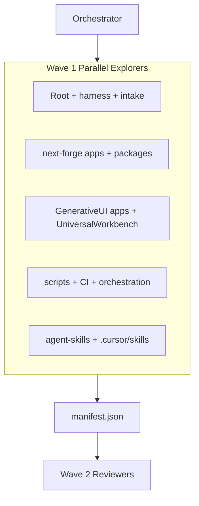

# Thermo-Nuclear Round 2 — Redundancy & Architecture Fit Review

## Context (what we already know)

Prior wave-1 run exists: [`docs/workflows/reports/manifest.json`](docs/workflows/reports/manifest.json) + [`docs/workflows/reports/thermo-nuclear-forge-2026-06-28.md`](docs/workflows/reports/thermo-nuclear-forge-2026-06-28.md) (2026-06-28). That pass validated boundaries, `@repo/schemas` golden contracts, and molecule index — but **did not** deeply audit redundancy or produce an architecture-deepening report.

**Known redundancy zones** (from [`docs/codebase/STACK.md`](docs/codebase/STACK.md), [`docs/agent-index.md`](docs/agent-index.md)):

| Zone                                        | Status                                  | Canonical target                                     |
| ------------------------------------------- | --------------------------------------- | ---------------------------------------------------- |
| Root [`src/`](src/)                         | Deprecated GenUI stub                   | `next-forge/apps/app` + generative-ui island         |
| Root [`agent/`](agent/)                     | Deprecated ADK + vendored genai-toolbox | `GenerativeUI_monorepo/apps/agent-server`            |
| `GenerativeUI_monorepo/apps/web-dashboard`  | Legacy, Phase 4 pending                 | `next-forge/apps/app/(authenticated)/generative-ui/` |
| `packages/shared-schemas`                   | Legacy                                  | `next-forge/packages/schemas` (`@repo/schemas`)      |
| `GenerativeUI_monorepo/UniversalWorkbench/` | Separate product (Yarn 4.10)            | Include in audit; exclude `-dev`/`-staging`          |

**Gaps to fill this round:** [`docs/codebase/CONCERNS.md`](docs/codebase/CONCERNS.md) and [`docs/codebase/STRUCTURE.md`](docs/codebase/STRUCTURE.md) are template shells (no evidence). No root `CONTEXT.md` for architecture vocabulary. `.tools/awesome-agent-skills/` not cloned locally.

**Platform note:** [`orbit` local repo map](.agents/skills/orbit/references/local_repo_map.md) is macOS/Linux-only. On Windows, use **lean-ctx** (`ctx_overview`, `ctx_graph`, `ctx_semantic_search`, `ctx_knowledge`) as the graph substitute; use `glab orbit remote` only if GitLab mirror is indexed.

---

## Phase 0 — Session setup (serial orchestrator)

Work in an isolated worktree branched from **`dev`** (user-selected baseline):

```powershell
.\scripts\new-agent-worktree.ps1 -Name "thermo-round2-redundancy" -Owner cursor
yarn worktree:doctor
yarn lean-ctx:ensure
```

Create structured ECL change:

```powershell
node scripts/harness-change.mjs create thermo-round2-redundancy
```

Fill [`harness/changes/active/thermo-round2-redundancy/CHANGE.md`](harness/changes/active/thermo-round2-redundancy/CHANGE.md) with scope, baseline (`dev`), and deliverable links.

Install review skill bundle:

```powershell
node scripts/install-agents.mjs -c scripts/collections/modme-migration-review.collection.json
npx skills add obra/superpowers@parallel-agents --agent cursor -y
npx skills add muratcankoylan/agent-skills@multi-agent-patterns --agent cursor -y
```

Activate lean-ctx profile: `/context-focus thermo-nuclear-review` (per [`data/lean-ctx-task-profiles.toml`](data/lean-ctx-task-profiles.toml)).

**Baseline capture:**

```powershell
git diff dev...HEAD --stat   # should be empty in fresh worktree
yarn verify:all              # record pass/fail snapshot
yarn lint:harness
yarn molecule-index:verify
```

---

## Phase 1 — Parallel acquisition (5 lane dispatch)

Publish wave-1 evidence to [`docs/workflows/reports/manifest.json`](docs/workflows/reports/manifest.json) before any thermo reviewers start (ADR-0012 gate).



| Lane                   | Focus paths                                                           | Skills                                            | Deliverable                                          |
| ---------------------- | --------------------------------------------------------------------- | ------------------------------------------------- | ---------------------------------------------------- |
| **Root**               | `src/`, `agent/`, `harness/`, `docs/codebase/`, root `package.json`   | `acquire-codebase-knowledge`, `legacy-modernizer` | Redundancy matrix vs forge + GenerativeUI            |
| **next-forge**         | `next-forge/apps/*`, `next-forge/packages/*`                          | `next-forge`, `modme-generative-ui-migrate`       | Migration fit scorecard (Phase 1–4)                  |
| **GenerativeUI**       | `GenerativeUI_monorepo/apps/*`, `packages/shared-schemas`             | `modme-generative-ui-migrate`, `reverse-engineer` | PORTING_GUIDE portable vs duplicated                 |
| **UniversalWorkbench** | `GenerativeUI_monorepo/UniversalWorkbench/` only                      | `legacy-modernizer` (strangler pattern)           | Overlap with forge design-system / workshop          |
| **scripts**            | `scripts/`, `.github/workflows/`, `harness/`                          | `cicd-automation-workflow-automate`, `gem-devops` | Orchestration duplication (`yarn agent:*` vs legacy) |
| **agent-skills**       | `.agents/skills/`, `.cursor/skills/`, `.vendor/awesome-copilot-main/` | `awesome-agent-skills`, `doublecheck`             | Skill catalog overlap + install dedup                |

**lean-ctx commands per lane:**

- `ctx_overview("<lane task>")` — orient
- `ctx_search` — find duplicates (e.g. `GenerativeCanvas`, `useAgentState`, `toolset_manager`, `copilotkit`)
- `ctx_graph(action="impact", path="...")` — blast radius for deletion candidates
- `ctx_semantic_search` — conceptual overlap (agent state, intake, observability)
- `ctx_knowledge(action="remember")` — non-obvious redundancy findings

**Refresh evidence docs** (currently hollow templates):

- [`docs/codebase/CONCERNS.md`](docs/codebase/CONCERNS.md) — debt, risks, testing gaps
- [`docs/codebase/STRUCTURE.md`](docs/codebase/STRUCTURE.md) — entry points, module boundaries
- Update [`docs/agent-index.md`](docs/agent-index.md) drift register if commands/layout changed

---

## Phase 2 — Parallel code review (4 thermo dimensions)

Per [`parallel-code-review`](C:/Users/dylan/.cursor/skills/parallel-code-review/SKILL.md), launch **four readonly `explore` subagents in one message** scoped to the highest-signal overlap files identified in Phase 1:

**Seed file list** (expand after Phase 1 search):

- Root: `src/app/canvas/*`, `src/utils/agent-integration.ts`, `agent/main.py`, `agent/toolset_manager.py`
- Forge: `next-forge/apps/app/app/(authenticated)/generative-ui/**`
- Legacy: `GenerativeUI_monorepo/apps/web-dashboard/src/components/GenerativeCanvas.tsx`, `apps/agent-server/src/**`
- Contracts: `next-forge/packages/schemas/**`, `GenerativeUI_monorepo/packages/shared-schemas/**`
- UW: `GenerativeUI_monorepo/UniversalWorkbench/**` (component registry overlap only)

| Subagent    | Focus                                                                         |
| ----------- | ----------------------------------------------------------------------------- |
| Security    | WS auth, env secrets, Supabase RLS, agent-server input validation             |
| Performance | Bundle duplication (CopilotKit dynamic imports), N+1 intake, Greptime queries |
| Correctness | Schema drift TS↔Python, reconnect logic parity, migration phase gaps          |
| Readability | File size (>1k lines), spaghetti branches, wrong-layer logic                  |

Apply [`thermo-nuclear-code-quality-review`](c:/Users/dylan/.cursor/plugins/cache/cursor-public/cursor-team-kit/e46364b8be46000b7df0f260550cd712afbb8d36/skills/thermo-nuclear-code-quality-review/SKILL.md) bar to readability lane output — prioritize **code-judo** moves (delete layers, not rearrange).

---

## Phase 3 — Architecture deepening map (HTML report)

Per [`improve-codebase-architecture`](C:/Users/dylan/.agents/skills/improve-codebase-architecture/SKILL.md):

1. **Create root [`CONTEXT.md`](CONTEXT.md)** lazily with domain terms: DualMonorepo, GenUIIsland, AgentSatellite, MoleculeIndex, IntakePipeline, LegacyRootStub.
2. Run `/codebase-design` vocabulary (module, interface, depth, seam, adapter, leverage, locality) when naming candidates.
3. Synthesize Phase 1+2 into **5–8 deepening candidates** with before/after diagrams.
4. Write self-contained HTML to `%TEMP%\architecture-review-<timestamp>.html` (Tailwind + Mermaid CDN) — **do not commit to repo**.
5. Open with `start <path>` on Windows.

**Expected high-conviction candidates** (validate in Phase 1):

1. **Legacy root stub deletion seam** — archive `src/` + `agent/` per [`docs/migration/legacy-archive-plan.md`](docs/migration/legacy-archive-plan.md); genai-toolbox vendoring decision
2. **Single GenUI client module** — collapse root stub + web-dashboard + forge island behind one `@repo/genui-client` seam
3. **Schema single source** — retire `shared-schemas` after golden parity; codegen path for Pydantic
4. **Skill catalog consolidation** — dedupe `.agents/skills` vs `.cursor/skills` vs awesome-copilot vendor; clone `.tools/awesome-agent-skills/`
5. **Intake/orchestration depth** — `scripts/intake-orchestrator.mjs` + `yarn agent:*` overlap; one orchestration interface
6. **UniversalWorkbench boundary** — document HTTP-only integration vs forge workshop; no cross-import

End report with **Top recommendation** and ask user which candidate to grill via `/grilling`.

---

## Phase 4 — Skills discovery (awesome-agent-skills)

```powershell
# Clone local catalog (missing today)
git clone --depth 1 https://github.com/Ditto190/awesome-agent-skills .tools/awesome-agent-skills

# Search for migration/review skills
npx skills find "legacy migration monorepo"
npx skills find "architecture review"
npx skills find "strangler fig"
```

Cross-reference findings against installed collection in [`scripts/collections/modme-migration-review.collection.json`](scripts/collections/modme-migration-review.collection.json). Propose adds only where a gap exists (e.g. `garrytan/plan-eng-review` already listed).

---

## Phase 5 — Thermo-monorepo gates (serial verify)

Per [`thermo-nuclear-monorepo-review`](.cursor/skills/thermo-nuclear-monorepo-review/SKILL.md) phases 2–6:

| Gate          | Command                                                | Blocker?                                           |
| ------------- | ------------------------------------------------------ | -------------------------------------------------- |
| Harness lint  | `yarn lint:harness`                                    | Yes                                                |
| Forge CI      | `yarn verify:forge`                                    | Document lint debt; block on structural regression |
| Generative CI | `yarn verify:generative`                               | If legacy paths touched                            |
| Contracts     | `cd next-forge && bun test packages/schemas/*.test.ts` | Yes                                                |
| Molecule      | `yarn molecule-index:verify`                           | Yes                                                |
| Telemetry     | `yarn telemetry:audit --lens all`                      | Advisory                                           |

**Redundancy-specific P0 blockers** (presumptive unless justified):

- New cross-monorepo imports or lockfile merge attempts
- Root `src/`/`agent/` extension instead of archive path
- File crossing 1k lines without decomposition (thermo code-quality rule)
- Feature logic scattered into shared `scripts/lib/` without seam

---

## Phase 6 — Synthesis deliverables

Emit to [`docs/workflows/reports/thermo-nuclear-redundancy-2026-07-04.md`](docs/workflows/reports/thermo-nuclear-redundancy-2026-07-04.md) using template from [`docs/evaluation/OBSERVABILITY-AGENTS.md`](docs/evaluation/OBSERVABILITY-AGENTS.md#parallel-synthesis-template):

1. **Executive summary** (5 bullets max)
2. **Redundancy matrix** — zone × canonical owner × deletion/archive readiness
3. **next-forge fit scorecard** — Phase 1–4 checklist from [`modme-generative-ui-migrate`](.agents/skills/modme-generative-ui-migrate/SKILL.md)
4. **Parallel review findings** — deduped Critical→Low table
5. **Architecture candidates** — link to temp HTML report path
6. **Skills recommendations** — install list from awesome-agent-skills search
7. **Action items** — ordered: archive legacy root → Phase 4 cutover → skill dedup → CONCERNS/STRUCTURE fill

Update ECL change STATUS; archive after merge:

```powershell
node scripts/harness-change.mjs archive thermo-round2-redundancy
```

Session finish (worktree only):

```powershell
.\scripts\vibe-session-finish.ps1 -DryRun   # preview first
```

---

## Approval bar (do not sign off unless)

- No unjustified structural regression across monorepo boundaries
- Redundancy matrix has explicit owner per duplicate zone
- At least one **code-judo** recommendation per major overlap (not just "clean up later")
- `CONCERNS.md` / `STRUCTURE.md` filled with evidence links
- HTML architecture report generated and path recorded in synthesis doc
- `manifest.json` wave-2 unblocked only after wave-1 lane completion
