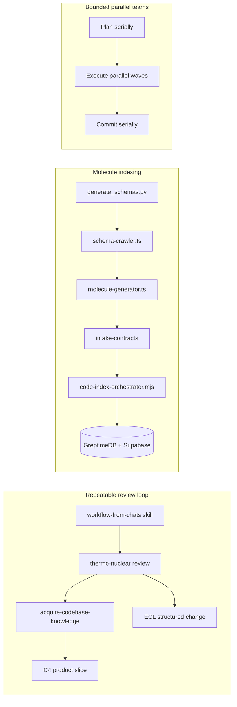
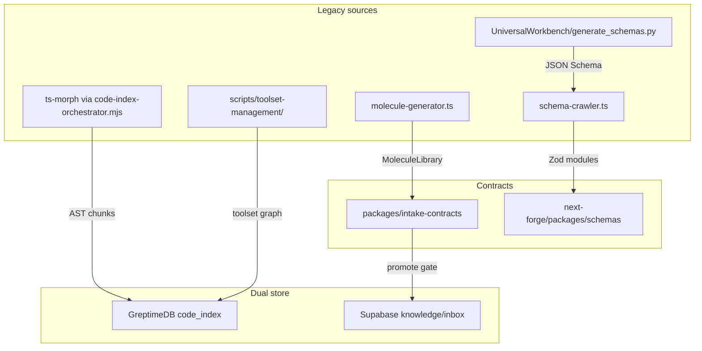

# Thermo-Nuclear Review Workflow + Code Molecule Indexing

## Context: what we just did (to repeat)

The [dual monorepo audit plan](c:\Users\dylan\Monorepo_ModMe.cursor\plans\dual_monorepo_audit_da92678e.plan.md) established a **federated** model (no Bun/Yarn merge):

| Step                       | Deliverable                                                                                                                                           | Status                                  |
| -------------------------- | ----------------------------------------------------------------------------------------------------------------------------------------------------- | --------------------------------------- |
| Baseline                   | worktree + `scan.py` + `verify:*` + `worktree:doctor` snapshot                                                                                        | Done on `feature/cursor/monorepo-audit` |
| acquire-codebase-knowledge | 7× [`docs/codebase/*.md`](docs/codebase/) refreshed                                                                                                   | Done in worktree                        |
| Thermo P0                  | [`scripts/lib/stack-paths.json`](scripts/lib/stack-paths.json), slim [`AGENTS.md`](AGENTS.md), canonical [`docs/agent-index.md`](docs/agent-index.md) | Done in worktree                        |
| ECL harness                | [`docs/ECL.md`](docs/ECL.md), `harness/`, `scripts/harness-*.mjs`, `yarn lint:harness`                                                                | Done in worktree                        |
| C4                         | [`C4-Documentation/`](C4-Documentation/) product-focused docs                                                                                         | Done in worktree                        |
| Contract tests             | [`next-forge/packages/schemas/*contract*.test.ts`](next-forge/packages/schemas/) vs golden JSON                                                       | Done in worktree                        |
| Migration docs             | [`docs/migration/phase4-cutover.md`](docs/migration/phase4-cutover.md), legacy archive plan                                                           | Done in worktree                        |

**You chose: merge worktree first** → Phase 0 below.



---

## Phase 0 — Merge audit worktree into `dev`

**Branch:** `feature/cursor/monorepo-audit` from `../Monorepo_ModMe-dev/dev-agent-cursor-monorepo-audit`

1. `yarn worktree:doctor` in worktree; fix hooks/env warnings
2. `yarn verify:forge` + `yarn verify:generative` (install GenerativeUI deps if needed)
3. `yarn lint:harness` + schema contract tests
4. PR to `dev` via `vibe-session-finish.ps1` or `gh pr create`
5. Archive ECL change: `node scripts/harness-change.mjs archive harness-setup-dual-monorepo`

**Gate:** merge only after harness lint + contract tests pass; forge lint debt may remain documented baseline (not harness regression).

---

## Phase 1 — workflow-from-chats: encode the audit as durable artifacts

Apply [`.cursor/skills/workflow-from-chats/SKILL.md`](.cursor/skills/workflow-from-chats/SKILL.md) to the dual-monorepo audit conversation.

### Preference atoms (strong confidence)

| Trigger              | Rule                                                                                                                                                                                                                 |
| -------------------- | -------------------------------------------------------------------------------------------------------------------------------------------------------------------------------------------------------------------- |
| Dual-monorepo review | Federated model; HTTP/WS + golden schemas only                                                                                                                                                                       |
| Feature work         | Worktree mandatory; never main checkout                                                                                                                                                                              |
| Agent docs           | `AGENTS.md` 80–120 lines map; details in `docs/ECL.md` + `docs/agent-index.md`                                                                                                                                       |
| Quality bar          | Thermo-nuclear: block structural regression, not cosmetic nits                                                                                                                                                       |
| Verification         | Path-filtered `verify:forge` / `verify:generative`; harness lint always                                                                                                                                              |
| Parallelism          | One agent per independent domain ([dispatching-parallel-agents](c:\Users\dylan.cursor\plugins\cache\cursor-public\superpowers\b7a8f76985f1e93e75dd2f2a3b424dc731bd9d37\skills\dispatching-parallel-agents\SKILL.md)) |

### Artifacts to create

| Artifact             | Path                                                                                                                       | Purpose                                                                                                                               |
| -------------------- | -------------------------------------------------------------------------------------------------------------------------- | ------------------------------------------------------------------------------------------------------------------------------------- |
| **Skill**            | [`.cursor/skills/thermo-nuclear-monorepo-review/SKILL.md`](.cursor/skills/thermo-nuclear-monorepo-review/SKILL.md)         | Repeatable 7-phase audit (baseline → acquire → P0 → ECL → C4 slice → contracts → migration notes)                                     |
| **Skill**            | [`.agents/skills/modme-molecule-index/SKILL.md`](.agents/skills/modme-molecule-index/SKILL.md)                             | Indexing pipeline orchestration                                                                                                       |
| **Workflow doc**     | [`docs/workflows/thermo-nuclear-dual-monorepo-review.md`](docs/workflows/thermo-nuclear-dual-monorepo-review.md)           | Human-readable runbook + agent team roster                                                                                            |
| **Collection**       | [`scripts/collections/modme-migration-review.collection.json`](scripts/collections/modme-migration-review.collection.json) | Parallel agent skill bundle (mirror [`modme-observability.collection.json`](scripts/collections/modme-observability.collection.json)) |
| **lean-ctx profile** | extend [`data/lean-ctx-task-profiles.toml`](data/lean-ctx-task-profiles.toml)                                              | New `thermo-nuclear-review` + `molecule-index` focus_paths; wire to `/context-focus`                                                  |

### awesome-agent-skills to vendor/install (curated)

From [`.tools/awesome-agent-skills/README.md`](.tools/awesome-agent-skills/README.md) + project needs:

| Skill                                       | Use in team                          |
| ------------------------------------------- | ------------------------------------ |
| `muratcankoylan/multi-agent-patterns`       | Team topology                        |
| `garrytan/plan-eng-review`                  | Pre-implementation architecture lock |
| `mattpocock/skills` (codebase architecture) | Layer boundaries                     |
| `testdino-hq/playwright-skill`              | E2E for next-forge                   |
| `NeoLabHQ/sdd`                              | Spec-driven migration slices         |
| `zxkane/aws-skills`                         | Optional cloud deploy patterns       |

Install via existing [`scripts/install-agents.mjs`](scripts/install-agents.mjs) pattern + `npx skills add` (document in collection JSON).

---

## Phase 2 — Code molecule pipeline (AST → Zod → DB)

Unify scattered tools into one **indexing spine** aligned with [`PORTING_GUIDE.md`](PORTING_GUIDE.md) portable components and [`docs/inbox-pipeline/README.md`](docs/inbox-pipeline/README.md).

### Pipeline stages



| Stage                | Canonical tool                                                                                                                                              | Output contract                                      |
| -------------------- | ----------------------------------------------------------------------------------------------------------------------------------------------------------- | ---------------------------------------------------- |
| 1. TS → JSON Schema  | [`GenerativeUI_monorepo/UniversalWorkbench/generate_schemas.py`](GenerativeUI_monorepo/UniversalWorkbench/generate_schemas.py)                              | `tools_schema.json`                                  |
| 2. JSON Schema → Zod | [`schema-crawler.ts`](GenerativeUI_monorepo/apps/agent-generator/src/mcp-registry/schema-crawler.ts)                                                        | `@repo/schemas` modules + SemVer tag in filename     |
| 3. MCP → molecules   | [`molecule-generator.ts`](GenerativeUI_monorepo/apps/agent-generator/src/mcp-registry/molecule-generator.ts)                                                | `Molecule` records (validate via `validateMolecule`) |
| 4. Repo AST          | [`scripts/code-index-orchestrator.mjs`](scripts/code-index-orchestrator.mjs)                                                                                | GreptimeDB `code_index` rows                         |
| 5. Runtime gate      | `packages/intake-contracts` (per [`AGENTS.md`](AGENTS.md))                                                                                                  | Zod at classify/promote boundaries                   |
| 6. Observability     | [`scripts/bootstrap-dsp-observability.mjs`](scripts/bootstrap-dsp-observability.mjs) + [`telemetry-bridge.mjs`](scripts/telemetry/lib/telemetry-bridge.mjs) | OTel-shaped events → Supabase + Greptime             |

### New orchestrator script

Create [`scripts/molecule-index-orchestrator.mjs`](scripts/molecule-index-orchestrator.mjs):

- Inputs: `--stack forge|generative|legacy-root`, `--paths`, `--semver 1.0.0`
- Steps: run generate_schemas (Python subprocess) → schema-crawler batch → emit Zod + golden fixture diff → optional `yarn intake:code-index` / `code-index-orchestrator`
- Outputs: `data/molecule-index/manifest.json` (molecule id, path, semver, zod export, greptime id)
- Tests: Vitest contract tests per molecule; pytest parity for Python wire types ([`principle-type-system-discipline`](.cursor/skills/principle-type-system-discipline/SKILL.md))

### Type discipline rules

- Branded IDs: `MoleculeId`, `CodeChunkId`, `SchemaVersion` in [`next-forge/packages/schemas`](next-forge/packages/schemas/)
- Discriminated unions for index record kinds: `ts_ast | zod_module | mcp_molecule | toolset_entry`
- Golden JSON snapshots versioned with SemVer bump process (mirror existing [`genui-agent-contract.golden.json`](next-forge/packages/schemas/fixtures/))

### `dist` / build artifacts

Index **source** only; optionally record `agent-generator/dist/**` hashes in manifest for drift detection (do not index `node_modules` or `.vendor/`). Extend `scan.py` excludes per audit learnings.

---

## Phase 3 — Bounded-parallel agent teams (repeat thermo-nuclear on next-forge)

Model after [`docs/evaluation/OBSERVABILITY-AGENTS.md`](docs/evaluation/OBSERVABILITY-AGENTS.md) and Gas City **plan → execute → commit** lifecycle.

### Team roster (`modme-migration-review` collection)

| Wave                            | Agent lane             | Scope                                                   | Skills                                                 |
| ------------------------------- | ---------------------- | ------------------------------------------------------- | ------------------------------------------------------ |
| 0 (serial)                      | orchestrator           | ECL change, baseline, synthesis                         | `workflow-from-chats`, ECL harness                     |
| 1 (parallel)                    | explorer-forge         | `next-forge/apps/*`, `packages/*` map                   | `acquire-codebase-knowledge`, `lean-ctx`, `next-forge` |
| 1                               | explorer-legacy        | `GenerativeUI_monorepo/apps/*`, root `src/`/`agent/`    | `reverse-engineer`, `modme-generative-ui-migrate`      |
| 1                               | contract-auditor       | `@repo/schemas`, WS, intake-contracts                   | `principle-type-system-discipline`                     |
| 2 (parallel, blocked on wave 1) | thermo-reviewer-forge  | P0/P1 findings on forge diff                            | `thermo-nuclear-code-quality-review`                   |
| 2                               | thermo-reviewer-legacy | PORTING_GUIDE portable components                       | `thermo-nuclear-code-quality-review`                   |
| 2                               | test-engineer          | Vitest + Playwright + contract + `yarn telemetry:audit` | `distributed-debugging-debug-trace`, playwright-skill  |
| 3 (serial commit)               | doc-writer             | C4 slice + `docs/codebase/*` + ADR                      | `c4-architecture`, `context7-auto-research`            |

**Dependency rule (from Gas City):** wave 2 cannot start until wave 1 publishes `manifest.json` + acquire docs draft. Commit phase applies findings in stable planned order, not worker completion order.

### lean-ctx integration

Add to [`data/lean-ctx-task-profiles.toml`](data/lean-ctx-task-profiles.toml):

```toml
[task_profiles.thermo-nuclear-review]
focus_paths = [
  "next-forge/",
  "GenerativeUI_monorepo/apps/agent-server/",
  "GenerativeUI_monorepo/apps/web-dashboard/",
  "docs/codebase/",
  "C4-Documentation/",
  "harness/",
  "scripts/lib/stack-paths.json",
]
lean_ctx_profile = "thermo-nuclear-review"

[task_profiles.molecule-index]
focus_paths = [
  "GenerativeUI_monorepo/UniversalWorkbench/generate_schemas.py",
  "GenerativeUI_monorepo/apps/agent-generator/src/mcp-registry/",
  "scripts/code-index-orchestrator.mjs",
  "scripts/molecule-index-orchestrator.mjs",
  "packages/intake-contracts/",
]
```

Use `/context-focus` at session start; **pin** active ECL change files with `/context-pin`.

### SEMANTIC_ROUTER alignment

Map [`SEMANTIC_ROUTER_TODO.md`](SEMANTIC_ROUTER_TODO.md) Phase 2 routes → molecule types:

- `dashboard` / `visualization` → GenUI molecules from `molecule-generator`
- `component` → `@repo/design-system` + registry
- `audit` → inbox pipeline + telemetry audit lanes

Defer router implementation; index molecules with `route_hint` metadata for future routing.

---

## Phase 4 — Multi-platform + E2E testing (web-first)

Per [multi-platform-apps skill](c:\Users\dylan.agents\skills\multi-platform-apps-multi-platform\SKILL.md): **web-only today**; agent-server as API-first satellite.

| Layer             | Test type                             | Command / path                        |
| ----------------- | ------------------------------------- | ------------------------------------- |
| Contracts         | Vitest golden + WS                    | `bun test packages/schemas/*.test.ts` |
| Unit              | Turbo `test` per package              | `yarn verify:forge`                   |
| Integration       | agent-server pytest + schema contract | `yarn verify:generative`              |
| E2E               | Playwright (app/web/api)              | `cd next-forge && bun run test:e2e`   |
| Distributed trace | telemetry audit lenses                | `yarn telemetry:audit --lens all`     |
| Migration parity  | Molecule manifest diff                | new `yarn molecule-index:verify`      |

Wire optional CI job `molecule-contract` (path-filter: `packages/schemas`, `packages/intake-contracts`, `scripts/molecule-index*`).

---

## Phase 5 — ADR: Dependency-Aware Bounded Parallel Lifecycle

**Proposed:** [`next-forge/docs/adr/0012-bounded-parallel-agent-lifecycle.md`](next-forge/docs/adr/0012-bounded-parallel-agent-lifecycle.md)

**Subject:** Adopt Gas City's [dependency-aware bounded parallel lifecycle](https://github.com/gastownhall/gascity/blob/main/engdocs/design/dependency-aware-bounded-parallel-lifecycle.md) for ModMe agent orchestration and migration indexing.

**Decision:**

- **Plan serially:** ECL spec/plan gate, molecule manifest, acquire docs before parallel reviewers
- **Execute in waves:** independent explorer lanes in parallel; thermo reviewers blocked on manifest
- **Commit serially:** merge findings, update golden fixtures, INDEX.json, STATUS.md in stable order
- **Separate budgets:** `defaultMaxWakesPerTick` (agent attempts) vs `defaultMaxParallelStartsPerWave` (concurrent subagents)
- **Reverse order for teardown:** legacy archive stops dependents before dependencies

**Relation to gascity generated-schemas pattern:** Gas City treats config/bead metadata as single-writer; ModMe treats **Zod contracts + golden JSON** as single-writer—generated artifacts are read-only inputs to parallel workers.

**Alternatives rejected:** full-repo parallel edits (merge conflicts); Nx root orchestrator (user preference).

---

## Phase 6 — PORTING_GUIDE adoption into next-forge

Use [`PORTING_GUIDE.md`](PORTING_GUIDE.md) + [`MIGRATION_IMPLEMENTATION_PLAN.md`](MIGRATION_IMPLEMENTATION_PLAN.md) as section breakdown for agent teams:

| PORTING_GUIDE section | Target in next-forge                     | Index molecule kind |
| --------------------- | ---------------------------------------- | ------------------- |
| Component Registry    | `apps/storybook` + `@repo/design-system` | `genui_molecule`    |
| Schema Crawler        | `@repo/schemas` + orchestrator           | `zod_module`        |
| Toolset Management    | `scripts/toolset-management/`            | `toolset_entry`     |
| ChromaDB/Knowledge    | inbox pipeline + Supabase                | `knowledge_chunk`   |
| GenAI Toolbox         | legacy `agent/` (archive)                | `legacy_satellite`  |

Each section gets one ECL structured change with acceptance = molecule manifest entry + contract test.

---

## Execution order

1. **Merge** `feature/cursor/monorepo-audit` → `dev` (Phase 0)
2. **workflow-from-chats** artifacts (Phase 1)
3. **molecule-index-orchestrator** + lean-ctx profiles (Phase 2)
4. **modme-migration-review** collection + first bounded-parallel run on `next-forge/` (Phase 3)
5. **E2E + telemetry** gates (Phase 4)
6. **ADR-0012** (Phase 5)
7. **PORTING_GUIDE** section migrations via ECL changes (Phase 6)

## Success criteria

- Audit worktree merged; `yarn lint:harness` passes on `dev`
- Repeatable skill runs full review without re-deriving steps
- `yarn molecule-index:verify` passes on forge + agent-server touchpoints
- At least one bounded-parallel review produces synthesis doc in `docs/workflows/reports/`
- ADR-0012 published and linked from [`docs/evaluation/ARCHITECTURE.md`](docs/evaluation/ARCHITECTURE.md)
- GreptimeDB + Supabase receive indexed molecules with Zod gates at promote

## Open items

- **Forge Biome lint debt:** track separately; do not block harness merge
- **UniversalWorkbench:** read-only unless explicitly tasked
- **`inbox_pipeline.py`:** include in wave-1 legacy explorer scope (user has open)
