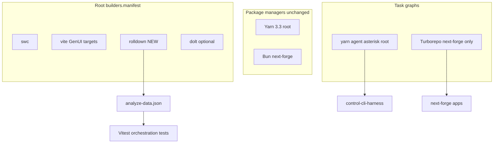

# Thermo-Nuclear Finish + Rolldown Root Builders

## Clarification (locked)

**Rolldown is a Rust JS/TS bundler** ([rolldown.rs](https://rolldown.rs/)), not a dependency/package manager. This plan:

- Keeps **Yarn 3.3** (root / GenerativeUI) and **Bun** (next-forge) for installs
- Keeps **Turborepo siloed to next-forge** for app task graphs (ADR-0011)
- Adds **Rolldown** to the existing root [builders orchestration layer](scripts/builders.manifest.json) beside SWC/Vite/Dolt
- Uses `bundleAnalyzerPlugin` → `analyze-data.json` + **Vitest** assertions (per [agent-library/instructions/nodejs-javascript-vitest.instructions.md](agent-library/instructions/nodejs-javascript-vitest.instructions.md) and inbox clips)

**Worktree:** continue in [`.worktrees/dev-agent-cursor-control-cli-orchestration`](.worktrees/dev-agent-cursor-control-cli-orchestration) on `feature/cursor/control-cli-orchestration` (control-cli changes already present; do not re-implement them).



---

## Phase A — Thermo-nuclear gate (ADR-0012)

Follow [docs/workflows/thermo-nuclear-dual-monorepo-review.md](docs/workflows/thermo-nuclear-dual-monorepo-review.md) and [`.cursor/skills/thermo-nuclear-monorepo-review/SKILL.md`](.cursor/skills/thermo-nuclear-monorepo-review/SKILL.md), **scoped** to root orchestration (no UniversalWorkbench edits; no forge/GenUI app rewrites).

### A0 Baseline (serial)

- `yarn worktree:doctor` in the control-cli worktree
- Create ECL change: `harness/changes/active/control-cli-rolldown-orchestration/` from [harness/templates/change/](harness/templates/change/) (`spec.md`, `plan.md`, `tasks.md`, `STATUS.md`)
- Pin change; lean-ctx profile `thermo-nuclear-review`
- Baseline: `yarn lint:harness`, `node e2e/worktree-smoke/run.mjs`, `node scripts/control-cli-harness.mjs`

### A1 Acquire (lightweight — root only)

- Wave-1 explorers publish [docs/workflows/reports/manifest.json](docs/workflows/reports/manifest.json) for this run (branch, change-id, paths: `scripts/**`, `flake.nix`, `.worktreeexclude`, builders)
- Evidence-only notes in `docs/workflows/reports/` — no full `docs/codebase/*` refresh unless drift is found

### A2–A3 P0 + ECL

- Confirm [scripts/lib/stack-paths.json](scripts/lib/stack-paths.json) still lists orchestration paths; no cross-lockfile deps
- `yarn lint:harness` PASS on the active ECL change
- Update change `STATUS.md` through phases

### A4–A6 Contracts / C4 / synthesis (minimal)

- Vitest goldens for Rolldown analyse artefact (Phase B) — single-writer per ADR-0012 table
- Short C4 note under `C4-Documentation/components/` only if builders surface changes
- Synthesis: `docs/workflows/reports/thermo-nuclear-control-cli-rolldown-2026-07-12.md`

**Commit order (serial):** ECL STATUS → Rolldown builders + tests → docs/ADR → CHANGELOG → PR to `dev`

---

## Phase B — Rolldown builder + Vitest

### B1 Register builder

Extend [scripts/builders.manifest.json](scripts/builders.manifest.json):

```json
{
  "id": "rolldown",
  "name": "Rolldown",
  "docs": "https://rolldown.rs/",
  "rootDevDeps": ["rolldown"],
  "config": "config/builders/rolldown.config.mjs",
  "verify": { "cmd": "npx", "args": ["rolldown", "--version"] },
  "build": {
    "steps": [
      {
        "id": "bundle-orchestration-smoke",
        "cwd": ".",
        "cmd": "npx",
        "args": ["rolldown", "-c", "config/builders/rolldown.config.mjs"]
      }
    ]
  }
}
```

- Add pipeline entry: `preflight-builders` gains `rolldown:verify` + `rolldown:build` (keep SWC; do not remove)
- Root `package.json`: add `rolldown` as **devDependency** via workspace root only (no next-forge / GenerativeUI lockfile edits)

### B2 Config + analyse artefact

Add [config/builders/rolldown.config.mjs](config/builders/rolldown.config.mjs):

- Inputs: `scripts/control-cli-harness.mjs`, `scripts/agent-status.mjs` (orchestration smoke bundle)
- Output dir: `.cache/builders/rolldown/` (gitignored)
- Plugin: `bundleAnalyzerPlugin` from `rolldown/experimental` → `analyze-data.json` (matches inbox clip on [bundle-analyzer](https://github.com/rolldown/rolldown/blob/main/docs/builtin-plugins/bundle-analyzer.md))

Wire `yarn builders:build --builder rolldown` through existing [scripts/builders-orchestrator.mjs](scripts/builders-orchestrator.mjs) (manifest-driven; minimal code change if `ensure`/`build` already generic).

### B3 Vitest suite

Add [scripts/**tests**/rolldown-builder.test.mjs](scripts/__tests__/rolldown-builder.test.mjs) (orchestration project):

- `builders:verify` / version smoke
- After build: `analyze-data.json` exists and has expected shape (chunks/modules keys — assert on real plugin output, do not invent schema)
- Bundle outputs under `.cache/builders/rolldown/` are ESM and non-empty
- Follow vitest instructions: test original behaviour; no null; ESM

Extend [scripts/preflight.manifest.json](scripts/preflight.manifest.json) `builders` profile to include the new test file.

### B4 Docs + ADR

- New ADR: [next-forge/docs/adr/0013-rolldown-root-builders.md](next-forge/docs/adr/0013-rolldown-root-builders.md) — decision: Rolldown for root builders analyse/bundle smoke; Turborepo remains next-forge; Yarn/Bun remain PMs; related ADR-0011/0012
- Update [docs/agent-terminal-orchestration.md](docs/agent-terminal-orchestration.md) — builders + `yarn builders:build --builder rolldown`
- Update [docs/workflows/thermo-nuclear-dual-monorepo-review.md](docs/workflows/thermo-nuclear-dual-monorepo-review.md) — verification row for Rolldown analyse artefact
- [CHANGELOG.md](CHANGELOG.md) `[Unreleased]`

### B5 Explicit non-goals

- Do not replace Vite for vibe-web-app production builds in this change
- Do not add Rolldown inside `next-forge/` turbo pipeline
- Do not claim Rolldown manages npm dependencies
- Do not edit UniversalWorkbench copies

---

## Phase C — Verify + finish session

| Gate         | Command                                                                                                                                                 |
| ------------ | ------------------------------------------------------------------------------------------------------------------------------------------------------- |
| Doctor       | `yarn worktree:doctor`                                                                                                                                  |
| Harness lint | `yarn lint:harness`                                                                                                                                     |
| Control-cli  | `node scripts/control-cli-harness.mjs`                                                                                                                  |
| Smoke        | `node e2e/worktree-smoke/run.mjs`                                                                                                                       |
| Builders     | `node scripts/builders-orchestrator.mjs ensure --builder rolldown` then `build`                                                                         |
| Vitest       | `npx vitest run --config vitest.config.mjs --project orchestration scripts/__tests__/rolldown-builder.test.mjs scripts/__tests__/agent-status.test.mjs` |
| Preflight    | `node scripts/preflight.mjs --profile worktree-shared-deps` and `--profile builders`                                                                    |

Then serial commit + PR to `dev` via `agent-session-finish` (use `-RemoveWorktree -DeleteBranch` only after push succeeds, per prior lifecycle).

---

## Mapping to thermo skill phases

| Skill phase | This plan                                           |
| ----------- | --------------------------------------------------- |
| 0 Baseline  | A0                                                  |
| 1 Acquire   | A1 (root-scoped)                                    |
| 2 P0        | A2 stack-paths / AGENTS touch only if needed        |
| 3 ECL       | A0–A3 active change                                 |
| 4 C4        | A4 minimal                                          |
| 5 Contracts | B3 Vitest + analyse JSON                            |
| 6 Migration | skip full cutover; ADR-0013 documents builders only |
