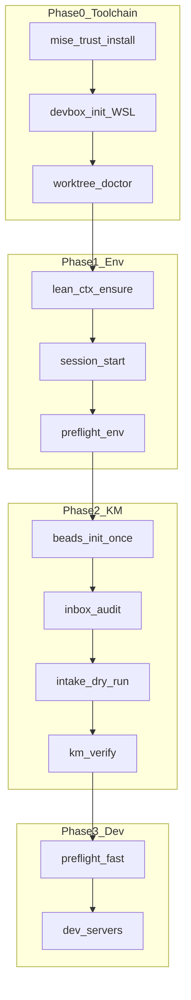

# Toolchain, KM Bootstrap, and Agent MicroVM Sandbox Plan

> **For agentic workers:** REQUIRED SUB-SKILL: Use superpowers:subagent-driven-development (recommended) or superpowers:executing-plans to implement task-by-task. Steps use checkbox (`- [ ]`) syntax for tracking.

**Goal:** One reproducible toolchain (mise + devbox) for local/worktree/CI dev, WSL2-backed agent sandboxes via [microvm.nix](https://microvm-nix.github.io/microvm.nix/intro.html), and a documented KM cold-start sequence integrated with existing launch/preflight flows.

**Architecture:** mise owns **version pins and tasks** across the dual monorepo (Yarn 3.3 root/GenerativeUI, Bun 1.3.10 next-forge, Node 20/22, Python 3.11+, gh, vitest). devbox owns **Nix-isolated binaries** inside WSL2 for agent sandboxes. microvm.nix (Phase 2 scaffold) wraps each sandbox as a minimal NixOS guest. KM stays on the existing inbox → intake → pgvector path ([`docs/KNOWLEDGE_MANAGEMENT.md`](docs/KNOWLEDGE_MANAGEMENT.md)); toolchain bootstrap runs **before** `yarn km:verify`.

**Tech stack:** mise, devbox, microvm.nix flake, WSL2 Ubuntu, existing `modme-launch.ps1`, `preflight.mjs`, Vitest orchestration tests, `jdx/mise-action@v4` in CI.

**Platform choice (confirmed):** WSL2 Ubuntu on Windows — devbox runs in WSL; Windows-side mise orchestrates cross-platform tasks; microvm hypervisor = `cloud-hypervisor` or `qemu` inside WSL2.

---

## Current gaps (research summary)

| Area                                                                 | State                                                                                                                                                                  |
| -------------------------------------------------------------------- | ---------------------------------------------------------------------------------------------------------------------------------------------------------------------- |
| [`mise.toml`](mise.toml)                                             | Missing                                                                                                                                                                |
| [`devbox.json`](devbox.json)                                         | Missing                                                                                                                                                                |
| [`.cursor/mcp.json`](.cursor/mcp.json)                               | Has context7, supabase, etc.; **no** microvm.nix / Nix MCP                                                                                                             |
| [`scripts/preflight.manifest.json`](scripts/preflight.manifest.json) | Only 5 profiles; skill docs reference `full`/`ci`/`forge`/`generative` but they **do not exist**                                                                       |
| [`package.json`](package.json) scripts                               | Has `preflight:fast/env/worktree/...` but **not** `preflight`, `preflight:forge`, `preflight:ci`                                                                       |
| ADR index                                                            | Latest bounded-agent ADR is [`0012-bounded-parallel-agent-lifecycle.md`](next-forge/docs/adr/0012-bounded-parallel-agent-lifecycle.md); next = **0013**                |
| Inbox clips                                                          | microvm intro/declaring/options already in [`GenerativeUI_monorepo/docs/inbox/web-clipper/`](GenerativeUI_monorepo/docs/inbox/web-clipper/) — ready for audit + ingest |

---

## Target bootstrap order (human + agent session)



**Single entry commands after implementation:**

- `yarn launch:health` — toolchain check + doctor + session verify (existing, extended)
- `yarn launch:full` — health + km:verify + session-start (existing, extended)
- `yarn toolchain:bootstrap` — new: mise + devbox + WSL probe
- `yarn sandbox:up` — new: devbox run inside WSL for agent slot

---

## Parallel workstreams (multi-agent)

| Stream | Owner focus      | Key deliverables                                                                           |
| ------ | ---------------- | ------------------------------------------------------------------------------------------ |
| **A**  | mise + CI        | `mise.toml`, CI workflow patch, yarn scripts                                               |
| **B**  | devbox + WSL     | `devbox.json`, `scripts/wsl-devbox.ps1`, shell bridge                                      |
| **C**  | microvm scaffold | `sandbox/microvm/flake.nix`, devbox flake refs                                             |
| **D**  | ADR + MCP        | ADR-0013, `.cursor/mcp.json`, inbox promotion note                                         |
| **E**  | KM + preflight   | manifest profiles, launch manifest, KM doc updates                                         |
| **F**  | devcontainer     | align [`.devcontainer/devcontainer.json`](.devcontainer/devcontainer.json) with mise tasks |
| **G**  | testing + hooks  | Vitest contract tests, auto-type-check hook                                                |

Streams A, B, D, F, G can start in parallel. Stream C depends on B. Stream E depends on A+B for `toolchain` preflight step.

---

## File map

| Action | Path                                                                                                                                                                 |
| ------ | -------------------------------------------------------------------------------------------------------------------------------------------------------------------- |
| Create | [`mise.toml`](mise.toml)                                                                                                                                             |
| Create | [`devbox.json`](devbox.json)                                                                                                                                         |
| Create | [`sandbox/microvm/flake.nix`](sandbox/microvm/flake.nix)                                                                                                             |
| Create | [`sandbox/microvm/README.md`](sandbox/microvm/README.md)                                                                                                             |
| Create | [`scripts/wsl-devbox.ps1`](scripts/wsl-devbox.ps1)                                                                                                                   |
| Create | [`scripts/toolchain-bootstrap.ps1`](scripts/toolchain-bootstrap.ps1)                                                                                                 |
| Create | [`.cursor/hooks/check-types.ps1`](.cursor/hooks/check-types.ps1)                                                                                                     |
| Create | [`next-forge/docs/adr/0013-agent-sandbox-devbox-microvm-wsl2.md`](next-forge/docs/adr/0013-agent-sandbox-devbox-microvm-wsl2.md)                                     |
| Create | [`docs/superpowers/plans/2026-07-11-toolchain-km-microvm-sandbox.md`](docs/superpowers/plans/2026-07-11-toolchain-km-microvm-sandbox.md) (this plan, copied on save) |
| Create | [`scripts/__tests__/toolchain-config.test.mjs`](scripts/__tests__/toolchain-config.test.mjs)                                                                         |
| Modify | [`.cursor/mcp.json`](.cursor/mcp.json)                                                                                                                               |
| Modify | [`.cursor/hooks.json`](.cursor/hooks.json)                                                                                                                           |
| Modify | [`scripts/preflight.manifest.json`](scripts/preflight.manifest.json)                                                                                                 |
| Modify | [`package.json`](package.json)                                                                                                                                       |
| Modify | [`scripts/modme-launch.ps1`](scripts/modme-launch.ps1)                                                                                                               |
| Modify | [`scripts/modme-session.manifest.json`](scripts/modme-session.manifest.json)                                                                                         |
| Modify | [`docs/KNOWLEDGE_MANAGEMENT.md`](docs/KNOWLEDGE_MANAGEMENT.md)                                                                                                       |
| Modify | [`docs/KNOWLEDGE_QUICKSTART.md`](docs/KNOWLEDGE_QUICKSTART.md)                                                                                                       |
| Modify | [`.github/workflows/ci.yml`](.github/workflows/ci.yml)                                                                                                               |
| Modify | [`.devcontainer/devcontainer.json`](.devcontainer/devcontainer.json)                                                                                                 |
| Modify | [`next-forge/docs/adr/README.md`](next-forge/docs/adr/README.md)                                                                                                     |

---

## Task 1: Root `mise.toml` (mise-configurator + Context7)

**Files:** Create [`mise.toml`](mise.toml)

Pin from existing repo evidence:

- Root: `yarn@3.3.0` ([`package.json`](package.json) `packageManager`)
- next-forge: `bun@1.3.10` ([`next-forge/package.json`](next-forge/package.json))
- CI GenerativeUI: Node 20 ([`.github/workflows/ci.yml`](.github/workflows/ci.yml))
- CI maintenance: Node 22.9.0 (ai-assisted-maintenance workflow)
- Python 3.11+ (agent-server, scripts pytest)
- Tools: `node`, `bun`, `yarn`, `python`, `gh`, `vitest` (via npm backend or aqua)

```toml
min_version = "2024.9.5"

[monorepo]
config_roots = [".", "next-forge", "GenerativeUI_monorepo"]

[tools]
node = "22.9.0"
python = "3.12"
bun = "1.3.10"
yarn = "3.3.0"
gh = "latest"

[env]
MISE_ENV = "{{ get_env(name='MISE_ENV', default='development') }}"
_.file = { path = ".env", redact = true }

[tasks.bootstrap]
description = "Install toolchain + verify"
run = ["mise install", "yarn --version", "bun --version"]

[tasks.preflight-fast]
run = "yarn preflight:fast"

[tasks.km-verify]
run = "yarn km:verify"

[tasks.launch-full]
run = "yarn launch:full"
```

- [ ] **Step 1:** Write `mise.toml` with monorepo roots and pinned versions above
- [ ] **Step 2:** Add [`mise.toml`](next-forge/mise.toml) override: `bun = "1.3.10"`, tasks `check/test/build` delegating to `bun run …`
- [ ] **Step 3:** Add root yarn scripts: `"toolchain:install": "mise install"`, `"toolchain:doctor": "mise doctor && node scripts/toolchain-doctor.mjs"`
- [ ] **Step 4:** Run `mise trust` + `mise install` (WSL + Windows PATH check)
- [ ] **Step 5:** Commit

---

## Task 2: `devbox.json` + WSL bridge (use-devbox)

**Files:** Create [`devbox.json`](devbox.json), [`scripts/wsl-devbox.ps1`](scripts/wsl-devbox.ps1)

Packages (Nix-backed, WSL2):

- `nodejs@20`, `python@3.12`, `git`, `curl`, `jq`
- Optional flake refs for microvm tooling later: `github:microvm-nix/microvm.nix` (document in README, add in Task 4)

```json
{
  "$schema": "https://raw.githubusercontent.com/jetify-com/devbox/main/.schema/devbox.schema.json",
  "name": "modme-agent-sandbox",
  "packages": {
    "nodejs": "20",
    "python": "3.12",
    "git": "latest",
    "curl": "latest",
    "jq": "latest"
  },
  "env": {
    "MODME_SANDBOX": "1"
  },
  "shell": {
    "init_hook": ["echo 'ModMe devbox sandbox ready'"],
    "scripts": {
      "preflight": ["yarn preflight:fast"],
      "km-verify": ["yarn km:verify"],
      "agent-shell": ["bash"]
    }
  }
}
```

- [ ] **Step 1:** `devbox init` at repo root (inside WSL: `cd /mnt/c/Users/dylan/Monorepo_ModMe && devbox init`)
- [ ] **Step 2:** Add packages + scripts above
- [ ] **Step 3:** Create `scripts/wsl-devbox.ps1` — detects WSL distro, runs `wsl -d Ubuntu -- bash -lc 'cd $REPO && devbox run $CMD'`
- [ ] **Step 4:** Add yarn script `"sandbox:run": "powershell -File scripts/wsl-devbox.ps1"`
- [ ] **Step 5:** Document Windows prerequisite: devbox installed in WSL (`curl -fsSL https://get.jetify.com/devbox | bash`)
- [ ] **Step 6:** Commit

---

## Task 3: microvm.nix scaffold (inbox clips → implementation)

**Files:** Create [`sandbox/microvm/flake.nix`](sandbox/microvm/flake.nix), [`sandbox/microvm/README.md`](sandbox/microvm/README.md)

Based on inbox clips ([declaring MicroVMs](GenerativeUI_monorepo/docs/inbox/web-clipper/2026-07-11T21-48-04_snippet_researcher_Declaring%20MicroVMs.md), [configuration options](GenerativeUI_monorepo/docs/inbox/web-clipper/2026-07-11T21-48-30_snippet_researcher_Configuration%20options.md)):

```nix
{
  inputs.nixpkgs.url = "github:nixos/nixpkgs/nixos-unstable";
  inputs.microvm.url = "github:microvm-nix/microvm.nix";
  inputs.microvm.inputs.nixpkgs.follows = "nixpkgs";

  outputs = { self, nixpkgs, microvm }: {
    nixosConfigurations.modme-agent = nixpkgs.lib.nixosSystem {
      system = "x86_64-linux";
      modules = [
        microvm.nixosModules.microvm
        ({ ... }: {
          networking.hostName = "modme-agent";
          microvm.hypervisor = "cloud-hypervisor";
          microvm.vcpu = 2;
          microvm.mem = 2048;
          microvm.interfaces = [ { type = "tap"; id = 0; } ];
          microvm.shares = [{
            proto = "virtiofs";
            tag = "repo";
            source = "/mnt/c/Users/dylan/Monorepo_ModMe";
            mountPoint = "/work";
          }];
        })
      ];
    };
  };
}
```

- [ ] **Step 1:** Write flake + README (build/run only inside WSL2 with KVM)
- [ ] **Step 2:** Add devbox script `"microvm:build": "cd sandbox/microvm && nix build .#nixosConfigurations.modme-agent.config.microvm.declaredRunner"`
- [ ] **Step 3:** Note macOS vfkit path in README as future ADR amendment (out of scope for WSL2 phase)
- [ ] **Step 4:** Commit

---

## Task 4: MCP servers (microvm.nix + Nix)

**Files:** Modify [`.cursor/mcp.json`](.cursor/mcp.json)

Add SSE GitMCP entries per [gitmcp.io docs](https://gitmcp.io/microvm-nix/microvm.nix.git):

```json
"microvm.nix Docs": {
  "url": "https://gitmcp.io/microvm-nix/microvm.nix.git"
},
"nix Docs": {
  "url": "https://gitmcp.io/NixOS/nix.git"
}
```

- [ ] **Step 1:** Append both servers to `.cursor/mcp.json`
- [ ] **Step 2:** Add optional project template at [`.vscode/mcp.json`](.vscode/mcp.json) if Copilot workspace needs parity (mirror pattern from existing plans)
- [ ] **Step 3:** Drop inbox capture: `GenerativeUI_monorepo/docs/inbox/2026-07-11T..._architecture_cursor_mcp-nix-microvm.md` documenting MCP wiring
- [ ] **Step 4:** Commit

---

## Task 5: ADR-0013 — Agent sandbox microservices pattern

**Files:** Create [`next-forge/docs/adr/0013-agent-sandbox-devbox-microvm-wsl2.md`](next-forge/docs/adr/0013-agent-sandbox-devbox-microvm-wsl2.md), update [`next-forge/docs/adr/README.md`](next-forge/docs/adr/README.md)

**Decision summary:** Compartmentalize parallel agents using **service-boundary pattern** (microservices-patterns skill): each agent worktree slot gets an isolated **devbox environment**; Phase 2 promotes to **microvm.nix NixOS guests** for kernel-level isolation vs containers ([microvm intro](https://microvm-nix.github.io/microvm.nix/intro.html)).

**Considered options:**

1. Docker/devcontainer only — rejected: shared kernel, heavier on Windows
2. Raw QEMU — rejected: microvm.nix reduces boilerplate
3. **devbox + microvm.nix on WSL2** — chosen: matches Nix store isolation, aligns with beads/worktree slots (ADR-0011, ADR-0012)

**Links:** Supersedes nothing; relates to ADR-0011 (orchestration), ADR-0012 (bounded parallel lifecycle), ADR-0010 (dual-store intake for sandbox logs).

- [ ] **Step 1:** Draft ADR with MADR template from `/architecture-decision-records` command
- [ ] **Step 2:** Add index row in README
- [ ] **Step 3:** Cross-link from [`docs/KNOWLEDGE_MANAGEMENT.md`](docs/KNOWLEDGE_MANAGEMENT.md) new "Agent sandbox" subsection
- [ ] **Step 4:** Commit

---

## Task 6: KM bootstrap + preflight expansion

**Files:** Modify [`scripts/preflight.manifest.json`](scripts/preflight.manifest.json), [`package.json`](package.json), [`scripts/modme-launch.ps1`](scripts/modme-launch.ps1), [`docs/KNOWLEDGE_MANAGEMENT.md`](docs/KNOWLEDGE_MANAGEMENT.md), [`docs/KNOWLEDGE_QUICKSTART.md`](docs/KNOWLEDGE_QUICKSTART.md)

Add missing preflight profiles:

```json
"toolchain": {
  "description": "mise + devbox + WSL probe",
  "steps": [
    { "id": "toolchain-config-test", "cmd": "npx", "args": ["vitest", "run", "--config", "vitest.config.mjs", "scripts/__tests__/toolchain-config.test.mjs"] },
    { "id": "mise-doctor", "cmd": "mise", "args": ["doctor"] }
  ]
},
"full": {
  "description": "Env + toolchain + KM smoke + forge check",
  "steps": [
    { "id": "preflight-env", "cmd": "node", "args": ["scripts/preflight.mjs", "--profile", "env"] },
    { "id": "preflight-toolchain", "cmd": "node", "args": ["scripts/preflight.mjs", "--profile", "toolchain"] },
    { "id": "preflight-fast", "cmd": "node", "args": ["scripts/preflight.mjs", "--profile", "fast"] },
    { "id": "inbox-audit-funnel", "cmd": "node", "args": ["scripts/inbox-audit.mjs", "--lens", "funnel"] }
  ]
},
"forge": {
  "description": "next-forge CI parity",
  "steps": [
    { "id": "forge-verify", "cmd": "powershell", "args": ["-ExecutionPolicy", "Bypass", "-File", "scripts/verify-forge-ci.ps1"] }
  ]
},
"generative": {
  "description": "GenerativeUI CI parity",
  "steps": [
    { "id": "generative-verify", "cmd": "powershell", "args": ["-ExecutionPolicy", "Bypass", "-File", "scripts/verify-generative-ci.ps1"] }
  ]
},
"ci": {
  "description": "CI mirror — path-filtered externally",
  "steps": [
    { "id": "preflight-fast", "cmd": "node", "args": ["scripts/preflight.mjs", "--profile", "fast"] },
    { "id": "km-vitest", "cmd": "npx", "args": ["vitest", "run", "--config", "vitest.config.mjs", "--project", "knowledge-management"] }
  ]
}
```

Add yarn scripts:

```json
"preflight": "node scripts/preflight.mjs --profile full",
"preflight:ci": "node scripts/preflight.mjs --profile ci",
"preflight:forge": "node scripts/preflight.mjs --profile forge",
"preflight:generative": "node scripts/preflight.mjs --profile generative",
"preflight:toolchain": "node scripts/preflight.mjs --profile toolchain",
"toolchain:bootstrap": "powershell -File scripts/toolchain-bootstrap.ps1"
```

Extend `Invoke-HealthSteps` in [`modme-launch.ps1`](scripts/modme-launch.ps1):

```powershell
@{ Name = 'preflight toolchain'; StepArgs = @('preflight:toolchain') }
```

Update KM docs with ordered "Cold start" section referencing: `toolchain:bootstrap` → `launch:health` → `beads:init` → `inbox:audit` → `intake:dry-run` → `km:verify` → `intake:orchestrate` (when Supabase creds present).

- [ ] **Step 1:** Expand preflight manifest + package.json scripts
- [ ] **Step 2:** Wire modme-launch + modme-session.manifest.json `toolchain` phase
- [ ] **Step 3:** Update KNOWLEDGE_MANAGEMENT + QUICKSTART with bootstrap diagram (reuse mermaid from this plan)
- [ ] **Step 4:** Run `yarn preflight:toolchain` then `yarn km:verify`
- [ ] **Step 5:** Commit

---

## Task 7: CI/CD — mise-action

**Files:** Modify [`.github/workflows/ci.yml`](.github/workflows/ci.yml)

Add reusable setup before stack-specific jobs:

```yaml
- uses: jdx/mise-action@v4
  with:
    install: true
    cache: true
    cache_save: ${{ github.event_name != 'pull_request' }}
```

Replace hardcoded `node-version: "20"` in generative-ui job with mise-provided Node from `mise.toml`. Keep `oven-sh/setup-bun@v2` for next-forge until bun mise backend verified on ubuntu-latest.

- [ ] **Step 1:** Add mise-action to `generative-ui` and new `orchestration` job for toolchain tests
- [ ] **Step 2:** Add CI step: `mise run -- preflight:ci` (or `node scripts/preflight.mjs --profile ci`)
- [ ] **Step 3:** Verify workflow YAML locally with `actionlint` if available
- [ ] **Step 4:** Commit

---

## Task 8: devcontainer alignment (devcontainer-setup skill)

**Files:** Modify [`.devcontainer/devcontainer.json`](.devcontainer/devcontainer.json), [`.devcontainer/post-create.sh`](.devcontainer/post-create.sh)

- Add devcontainer feature or postCreate: `curl https://mise.run | sh && mise trust && mise install`
- Chain existing postCreate with `yarn toolchain:bootstrap` (advisory)
- Document in [`.devcontainer/README.md`](.devcontainer/README.md): devcontainer = human IDE sandbox; devbox/microvm = **agent** sandbox (ADR-0013 distinction)

- [ ] **Step 1:** Patch devcontainer postCreateCommand
- [ ] **Step 2:** Update README with agent vs human sandbox table
- [ ] **Step 3:** Commit

---

## Task 9: Auto type-checking + testing-patterns

**Files:** Create [`.cursor/hooks/check-types.ps1`](.cursor/hooks/check-types.ps1), modify [`.cursor/hooks.json`](.cursor/hooks.json), create [`scripts/__tests__/toolchain-config.test.mjs`](scripts/__tests__/toolchain-config.test.mjs)

**Hook** (Windows-native, non-blocking per auto-type-checking skill):

```json
{
  "event": "afterFileEdit",
  "command": "powershell -NoProfile -ExecutionPolicy Bypass -File .cursor/hooks/check-types.ps1",
  "pattern": "**/*.{ts,tsx}",
  "timeoutSec": 15,
  "failClosed": false
}
```

`check-types.ps1` logic:

- Detect nearest `tsconfig.json` (root vs next-forge package vs GenerativeUI package)
- Run `npx tsc --noEmit --pretty 2>&1 | Select-Object -First 20`
- Exit 0 always (advisory)

**Vitest** (`toolchain-config.test.mjs`) — behavior tests per testing-patterns:

- `mise.toml` parses; required tools present
- `devbox.json` valid JSON + schema `$schema` key
- `.cursor/mcp.json` includes `microvm.nix Docs` and `nix Docs`
- `preflight.manifest.json` includes `toolchain`, `full`, `ci`, `forge`, `generative`

- [ ] **Step 1:** Write failing tests
- [ ] **Step 2:** Implement config files until green
- [ ] **Step 3:** Add hook + script
- [ ] **Step 4:** Run `yarn test:orchestration`
- [ ] **Step 5:** Commit

---

## Task 10: Inbox promotion for microvm research clips

- [ ] **Step 1:** `yarn inbox:audit --lens funnel` on web-clipper clips
- [ ] **Step 2:** Fix frontmatter (`c4_container: root-orchestration`, tags: `[microvm, devbox, nix]`)
- [ ] **Step 3:** `yarn intake:dry-run` then `yarn intake` (if Supabase env OK)
- [ ] **Step 4:** Verify clips appear in audit report

---

## Task 11: Session finish checklist

- [ ] `yarn preflight:toolchain`
- [ ] `yarn preflight:fast`
- [ ] `yarn km:verify`
- [ ] `yarn verify:forge` (if forge paths touched)
- [ ] Update [`CHANGELOG.md`](CHANGELOG.md) under `[Unreleased]`
- [ ] Update [`AGENTS.md`](AGENTS.md) toolchain section only if commands/layout changed

---

## Risks and mitigations

| Risk                                       | Mitigation                                                                      |
| ------------------------------------------ | ------------------------------------------------------------------------------- |
| WSL2 no KVM                                | Fall back to QEMU software emulation; document in sandbox README                |
| mise vs Yarn PnP on Windows                | Root orchestration uses mise; package installs stay yarn/bun per monorepo rules |
| devbox first-run slow                      | Cache `.devbox/` in WSL; document in QUICKSTART                                 |
| microvm build needs Linux builder on macOS | N/A for WSL2 path; note in ADR for mac contributors                             |
| Preflight profile drift vs skill docs      | Task 6 closes gap explicitly                                                    |

---

## Execution choice (after plan approval)

1. **Subagent-driven (recommended)** — Stream A/B/D/F/G in parallel; review between tasks
2. **Inline execution** — sequential Tasks 1–11 in this session
