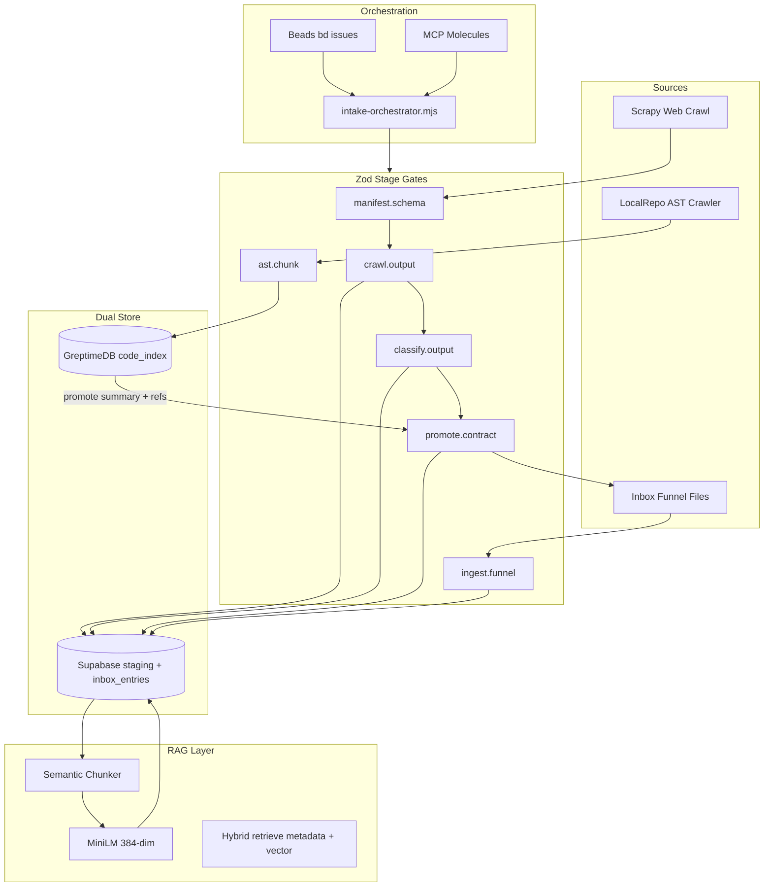

# Unified Knowledge Intake Pipeline (Validated Dual-Store)

**Disposition: APPROVED** — after structured multi-agent review (see Decision Log). Work in an isolated worktree per [docs/multi-agent-worktrees.md](docs/multi-agent-worktrees.md).

---

## Understanding Lock

**Goal:** Ingest **local repo patterns (AST)** and **web crawl data** into the existing [docs/inbox-pipeline/README.md](docs/inbox-pipeline/README.md) funnel with **contract-first validation**, **data quality gates**, and **RAG-ready chunking**—without replacing current scrape/inbox scripts.

**Confirmed constraint:** **Dual store** — GreptimeDB owns code-pattern vectors; Supabase pgvector owns `inbox_entries` knowledge. Sync only at **promote** boundary.

---

## Multi-Agent Brainstorming Summary

### Phase 1 — Primary Designer (initial architecture)

**Pattern:** Hexagonal (Ports & Adapters) over the existing orchestrator spine.

| Port | Adapter (existing / new) |
|------|--------------------------|
| `SourceCollector` | Scrapy ([scrape-pipeline](GenerativeUI_monorepo/scrape-pipeline/)), local AST crawler (new) |
| `StageValidator` | Zod modules from [scrape-tools.ts](GenerativeUI_monorepo/apps/agent-generator/src/mcp-registry/scrape-tools.ts), [schema-crawler.ts](GenerativeUI_monorepo/apps/agent-generator/src/mcp-registry/schema-crawler.ts) |
| `PatternIndex` | [greptimedb_client.ts](experiments/micro-agents/models/greptimedb_client.ts) + [embeddings.ts](experiments/micro-agents/models/embeddings.ts) |
| `KnowledgeStore` | Supabase `inbox_entries` + pgvector (384-dim, [005_embedding_384.sql](next-forge/supabase/migrations/005_embedding_384.sql)) |
| `WorkQueue` | Beads CLI (`bd create/list/update`) — [Beads library pattern](https://github.com/gastownhall/beads/blob/main/examples/library-usage/README.md) deferred to Phase 3 |
| `SemanticLayer` | [molecule-generator.ts](GenerativeUI_monorepo/apps/agent-generator/src/mcp-registry/molecule-generator.ts) `webScraper` + new `codePatternScanner` molecule |

### Phase 2 — Reviewer feedback (incorporated)

**Skeptic / Challenger**
- Classifier JSON coercion in [scrape-classifier-helper.ts](experiments/micro-agents/helpers/scrape-classifier-helper.ts) silently accepts malformed LLM output → **mandate Zod at classify + promote**
- Greptime `searchTopK` fetches all candidates then scores in Node → **cap `candidateLimit`, add content_hash dedup, fail CI if stub embeddings used**
- Python scrape manifest YAML loaded without schema check → **wire Ajv via [yaml-parser.mjs](scripts/yaml-parser.mjs) in orchestrator pre-flight**
- Failed scrape pages stay `raw` forever → **add `failed` status + dead-letter table**

**Constraint Guardian**
- pgvector: add **HNSW partial indexes** on `status = 'indexed'` rows (Context7/pgvector: partial HNSW reduces index size for filtered retrieval)
- FK indexes on all new join columns (Supabase Postgres best practice)
- RLS on all new staging tables; service_role writes only
- No cross-monorepo `workspace:*` — HTTP/scripts boundary only ([monorepo-boundaries](.cursor/rules/monorepo-boundaries.mdc))

**User Advocate**
- Categorization must map to human-readable **spec artifacts** via [.specify/templates/spec-template.md](.specify/templates/spec-template.md) + [tasks-template.md](.specify/templates/tasks-template.md) when promoting high-severity architecture entries
- Validation errors must surface in `docs/inbox-pipeline/reports/latest.md`, not only stderr

### Phase 3 — Arbiter

Accepted all three reviewer blocks. Rejected premature Beads Go-library embedding (CLI + issue IDs in pipeline metadata is sufficient for MVP).

---

## Target Architecture



---

## Core Design Decisions

### 1. Contract-first validation (data-quality-frameworks)

Create a shared package **`packages/intake-contracts`** (root-level, consumed by scripts + agent-generator tests — not cross-monorepo workspace):

| Contract file | Zod source | Enforced at |
|---------------|-----------|-------------|
| [scrape-job.schema.json](GenerativeUI_monorepo/scrape-pipeline/scrape-jobs/scrape-job.schema.json) | generated | orchestrator pre-crawl |
| [scrape-schemas.ts](GenerativeUI_monorepo/apps/agent-generator/src/mcp-registry/scrape-schemas.ts) | [scrape-tools.ts](GenerativeUI_monorepo/apps/agent-generator/src/mcp-registry/scrape-tools.ts) | classify, promote, MCP tools |
| [scrape-promotion.v1.json](docs/inbox-pipeline/contracts/scrape-promotion.v1.json) | new `promote-contract.ts` | scrape-promote.mjs |
| [inbox-contract.v1.json](docs/inbox-pipeline/contracts/inbox-contract.v1.json) | existing [inbox-contract.mjs](scripts/lib/inbox-contract.mjs) | ingest |
| **new** `code-chunk.v1.json` | AST crawler output | code-index stage |

**Pattern:** Every stage returns `{ ok: true, data } | { ok: false, issues: ZodIssue[] }` using `safeParse` ([Zod docs](https://github.com/colinhacks/zod) — never `.parse()` in batch pipelines without quarantine).

**Quality dimensions:** completeness (required fields), validity (enums), uniqueness (`content_hash`), timeliness (embedding freshness), consistency (Greptime id ↔ inbox `source_file`).

### 2. Local AST / schema crawler (new stage)

New script: **`scripts/code-index-orchestrator.mjs`** calling a TypeScript worker in **`experiments/micro-agents/workers/ast-indexer.ts`**:

- **Parser:** `ts-morph` for TS/TSX; `@babel/parser` for JS; Prisma schema → JSON Schema via existing [generate.ts](agent-generator/src/scripts/generate.ts) patterns
- **Extract:** exports, Zod schemas, Prisma models, MCP tool shapes (reuse [schema-crawler.ts](GenerativeUI_monorepo/apps/agent-generator/src/mcp-registry/schema-crawler.ts) `generateZodFromJSONSchema`)
- **Chunk:** semantic boundaries (function/class/export), 512-token target with overlap (RAG engineer: avoid fixed token splits mid-idea)
- **Index:** upsert to Greptime via [greptimedb_client.ts](experiments/micro-agents/models/greptimedb_client.ts); store AST metadata in `sections[]`
- **Promote:** high-signal patterns (new Zod exports, schema drift) → inbox `.md` with frontmatter + link `greptime_id`

Wire into [intake-orchestrator.mjs](scripts/intake-orchestrator.mjs) as `--mode=code-index`.

### 3. Dual-store sync at promote

New column on `inbox_entries` (migration `008_code_pattern_refs.sql`):

```sql
-- sketch only
code_pattern_ids TEXT[] DEFAULT '{}',
source_kind TEXT CHECK (source_kind IN ('inbox_file','scrape_url','code_pattern'))
```

Promote flow writes **summary text + tags** to Supabase; Greptime retains full AST text + embedding. Cross-ref via `code_pattern_ids`.

### 4. Molecule layer (agent-facing API)

Extend [molecule-generator.ts](GenerativeUI_monorepo/apps/agent-generator/src/mcp-registry/molecule-generator.ts):

- **`code_pattern_scanner`** molecule — wraps AST indexer + Greptime search
- **`knowledge_intake`** molecule — wraps existing `webScraper` + new code scanner + `scrape.promote_batch`
- Register in MCP registry tests ([scrape-tools.test.ts](GenerativeUI_monorepo/apps/agent-generator/src/mcp-registry/__tests__/scrape-tools.test.ts) pattern)

Agents call molecules, not raw stage scripts ([MCP_LSP_INTEGRATION.md](experiments/micro-agents/models/MCP_LSP_INTEGRATION.md) vision).

### 5. Meaning attachment via Specify templates

When `severity >= high` AND `entry_type IN (architecture, design, solution)`:

- Auto-generate **`specs/intake-{content_hash-prefix}/spec.md`** from [spec-template.md](.specify/templates/spec-template.md)
- Auto-generate **`tasks.md`** from [tasks-template.md](.specify/templates/tasks-template.md) with FR/SC IDs mapped from classification `features` JSON
- Store artefact paths in `output_artefacts` (existing Prisma model)

### 6. Beads orchestration

Pipeline stages create/update Beads issues ([.beads/README.md](.beads/README.md)):

| Stage | Beads action |
|-------|--------------|
| Crawl start | `bd create "scrape:{manifest_slug}"` |
| Classify fail | `bd update --status blocked` + link validation report |
| Promote done | `bd update --status done` |
| AST drift detected | `bd create "schema-drift:{path}"` priority 1 |

Use CLI subprocess from orchestrator (not Go library yet). Prefix: `modme` per [docs/beads-workflow.md](docs/beads-workflow.md).

### 7. Postgres / pgvector optimizations (supabase-postgres-best-practices)

Apply in migration `008_*`:

- **HNSW** on `inbox_entries.embedding` WHERE `status = 'indexed'` (partial index per pgvector guidance)
- Index FKs: `scrape_pages.inbox_entry_id`, new `code_pattern_refs`
- **RLS** enabled; service_role policies mirror [007_scrape_staging.sql](next-forge/supabase/migrations/007_scrape_staging.sql)
- **Conn:** keep service-role REST from scripts; no new pool per stage
- **Monitoring:** extend [inbox-audit.mjs](scripts/inbox-audit.mjs) `--lens pipeline` with duplicate embedding check + orphan Greptime ref check

### 8. RAG retrieval strategy (rag-engineer)

| Content type | Store | Embedding | Retrieval |
|--------------|-------|-----------|-----------|
| Inbox prose | Supabase | MiniLM 384 | pgvector + metadata filter (tags, severity, date) |
| Code patterns | Greptime | MiniLM 384 / Gemma3n 1024 for complex | metadata pre-filter → top-K cosine |
| Hybrid queries | Both | — | Reciprocal Rank Fusion in `experiments/micro-agents/evaluation/runner.ts` |

**Eval harness:** extend [queries.json](experiments/micro-agents/evaluation/queries.json) with labeled retrieval pairs; track Recall@5 separately for retrieval vs generation (RAG sharp edge #6).

**Embedding gate:** remove silent random stub in [inbox-embeddings.mjs](scripts/inbox-embeddings.mjs) — fail CI if `@xenova/transformers` unavailable.

---

## Recommended Skills (awesome-agent-skills / skills.sh)

Install before implementation:

```bash
npx skills add giuseppe-trisciuoglio/developer-kit@zod-validation-utilities --agent cursor -g -y
npx skills add majesticlabs-dev/majestic-marketplace@data-quality --agent cursor -g -y
npx skills add giuseppe-trisciuoglio/developer-kit@chunking-strategy --agent cursor -g -y
npx skills add hamelsmu/evals-skills@evaluate-rag --agent cursor -g -y
npx skills add jeffallan/claude-skills@rag-architect --agent cursor -g -y
```

---

## Implementation Phases

### Phase A — Validation spine (P1, no new stores)

- Add `packages/intake-contracts/` with Zod schemas generated/synced from JSON contracts
- Wire `validateScrapeToolOutput` into [scrape-classify.mjs](scripts/scrape-classify.mjs) + [scrape-promote.mjs](scripts/scrape-promote.mjs)
- Ajv gate for scrape YAML in [scrape-orchestrator.mjs](scripts/scrape-orchestrator.mjs)
- Mark failed pages `status='failed'`; extend [scrape-promotion.v1.json](docs/inbox-pipeline/contracts/scrape-promotion.v1.json) tests
- CI: extend [inbox-pipeline-check.yml](.github/workflows/inbox-pipeline-check.yml)

### Phase B — Code AST index (P1)

- `ast-indexer.ts` worker + `code-index-orchestrator.mjs`
- Greptime schema extension: `ast_kind`, `schema_json`, `content_hash`
- Molecule `code_pattern_scanner` + MCP registry export via [index.ts](GenerativeUI_monorepo/apps/agent-generator/src/mcp-registry/index.ts)

### Phase C — Dual-store promote + Specify artefacts (P2)

- Migration `008_code_pattern_refs.sql` + Prisma sync
- Promote bridge: Greptime → inbox entry with cross-refs
- Spec/tasks auto-generation for high-severity entries
- Beads hooks in orchestrator

### Phase D — RAG eval + hybrid retrieval (P2)

- Hybrid retrieval in micro-agents evaluation runner
- pgvector HNSW partial index migration
- Retrieval eval CI job (non-blocking initially, blocking after baseline)

### Phase E — Docs + ARCHITECTURE sync (P3)

- Update [docs/inbox-pipeline/README.md](docs/inbox-pipeline/README.md) mermaid with code-index + dual-store
- Extend [docs/codebase/ARCHITECTURE.md](docs/codebase/ARCHITECTURE.md) with intake hex diagram
- ADR in `next-forge/docs/adr/` for dual-store decision

---

## Decision Log

| Decision | Alternatives | Objections | Resolution |
|----------|-------------|------------|------------|
| Dual store (Greptime + Supabase) | Consolidate pgvector only | Ops complexity, two conn strings | **Accepted** — user choice; sync at promote only |
| Zod at every stage boundary | Ajv only | Duplication with JSON Schema | **Accepted** — JSON Schema = contract docs; Zod = runtime (generate via schema-crawler) |
| ts-morph AST indexer | LSP pattern-only | Heavier dep | **Accepted** — true AST required per user; LSP remains IDE assist layer |
| Beads CLI not Go library | beads.Storage direct | Process spawn overhead | **Deferred** — CLI sufficient for MVP; revisit if >100 stage transitions/min |
| Specify auto-spec on promote | Manual only | Noise for low-value entries | **Accepted with gate** — only high severity + architecture/design/solution |
| Stub embedding fail CI | Warn only | Breaks offline dev | **Accepted** — use `USE_LOCAL_EMBEDDINGS=true` explicit flag instead of silent stub |

---

## Key Files to Create / Modify

**Create**
- `packages/intake-contracts/` — shared Zod + JSON Schema sync
- `experiments/micro-agents/workers/ast-indexer.ts`
- `scripts/code-index-orchestrator.mjs`
- `docs/inbox-pipeline/contracts/code-chunk.v1.json`
- `next-forge/supabase/migrations/008_code_pattern_refs.sql`

**Modify**
- [scripts/intake-orchestrator.mjs](scripts/intake-orchestrator.mjs) — `--mode=full` = scrape + code-index + ingest
- [scripts/scrape-classify.mjs](scripts/scrape-classify.mjs) — Zod gate
- [scripts/scrape-promote.mjs](scripts/scrape-promote.mjs) — promote contract + Greptime refs
- [GenerativeUI_monorepo/apps/agent-generator/src/mcp-registry/molecule-generator.ts](GenerativeUI_monorepo/apps/agent-generator/src/mcp-registry/molecule-generator.ts) — new molecules
- [experiments/micro-agents/models/greptimedb_client.ts](experiments/micro-agents/models/greptimedb_client.ts) — AST metadata columns
- [package.json](package.json) — `yarn intake:code-index`, `yarn intake:full`

---

## Verification Checklist

- `yarn inbox:test` + strict funnel audit pass
- `yarn intake:orchestrate --mode=pr-validate --dry-run` pass
- AST indexer indexes `schema-crawler.ts` and retrieves it for query "JSON Schema to Zod"
- Scrape classify rejects malformed Ollama JSON (quarantine, not promote)
- Greptime row linked from promoted `inbox_entries.code_pattern_ids`
- Recall@5 baseline recorded in `experiments/micro-agents/evaluation/`
