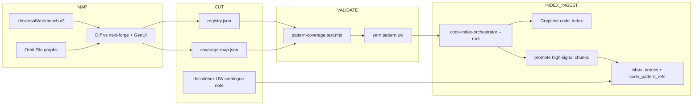

# UniversalWorkbench Non-Migrate Pattern Catalogue

## Goal

Map UW surfaces that stay **out of next-forge runtime migration**, cut unique scripts/tools/helpers into a durable pattern registry, validate with the existing Node coverage gate, then index + ingest into the intake dual-store (Greptime code_index ↔ Supabase `inbox_entries` / `code_pattern_refs`).

## Locked decisions

| Decision                                           | Choice                                                                                                                                                      |
| -------------------------------------------------- | ----------------------------------------------------------------------------------------------------------------------------------------------------------- | --- | ---------------------- |
| Non-migrate boundary                               | Entire `UniversalWorkbench{,-dev,-staging}` product trees stay **read-only**; extract **knowledge/patterns**, do not port `apps/web                         | api | agent` into next-forge |
| Already-migrating (exclude from archive catalogue) | Schema crawler → `[port-schema-crawler](docs/migration/porting-guide-slices.md)` → `@repo/schemas`; inbox/knowledge → root intake + next-forge Knowledge UI |
| Primary CI validator                               | Extend `[scripts/__tests__/pattern-coverage.test.mjs](scripts/__tests__/pattern-coverage.test.mjs)` + registry/coverage-map                                 |
| Secondary knowledge map                            | Orbit File/Definition graphs (GitLab MCP empty for this repo; use `glab orbit` when indexed)                                                                |
| CodeQL                                             | **Not** primary — only later for security-shaped rules; Context7 confirms CodeQL is alert/path analysis, not registry↔path contracts                        |
| Index/promote path                                 | `[scripts/code-index-orchestrator.mjs](scripts/code-index-orchestrator.mjs)` with `--root` override + `--promote`                                           |
| Tracking                                           | GitHub/beads (GitLab search returned no related issues)                                                                                                     |

## Architecture




## Non-migrate candidate set (seed from exploration)

**Keep as archive patterns (unique / not in next-forge):**

- `.flow` behavior system: `behavior-sync.ts`, `behavior-validate.ts`, `behavior-search.ts`, taxonomy — all three UW copies
- Base-only agent tools/workflows: `inboxIngest.ts`, `mdaCategorize.ts`, `inboxPipeline.ts` (root scripts already cover intake; UW copies are **pattern references**, not second runtimes)
- Base-only `generate_schemas.py` + `scripts/init-worktrees.ps1`, `scripts/new-feature.ps1`
- Docs: `docs/validation-patterns.md`, `FEATURE-TAXONOMY.md`, `.flow/README.md`
- UW `apps/agent-generator` MCP registry **only as reference** if it diverges from GenUI `apps/agent-generator` (prefer GenUI path for migrate slice)

**Do not catalogue as non-migrate (already migrate or duplicate):**

- Schema crawler / Zod generation → porting slice `port-schema-crawler`
- Inbox ingest/embed/MDA → root `[scripts/intake-orchestrator.mjs](scripts/intake-orchestrator.mjs)` + next-forge Knowledge
- Generic `apiHealthCheck` / `statusReport` if forge `apps/agent` already covers VoltAgent workflows
- Full `apps/web` / `apps/api` / `packages/ui` product code (product absorb is a separate future task; out of this plan)

**Variant rule:** Canonical path = `GenerativeUI_monorepo/UniversalWorkbench/...`. `-dev` / `-staging` listed as `variants[]` only when content differs; otherwise one path.

## FAF context seed

Goal sentence for `.faf` / session context:

> Catalogue UniversalWorkbench-only agent-dev patterns that will not migrate into next-forge, validate them with pattern-coverage gates, and ingest them as code_pattern inbox entries for Agent-Management.

Slots: who=`monorepo agents`, what=`UW non-migrate pattern catalogue`, why=`avoid re-discovering archive tooling`, where=`registry + Greptime + Supabase`, when=`pre Phase-4 archive`, how=`map→cut→validate→index`.

## Multi-agent work packets

### Packet 1 — MAP (explore + Orbit)

**Owner files:** write-only `docs/migration/uw-non-migrate-inventory.md` (new)

**Actions:**

1. Diff tool/script trees across UW / `-dev` / `-staging` (base-only vs shared)
2. Diff against next-forge (`apps/agent`, Knowledge, `@repo/schemas`) and GenUI (`agent-generator`, root `scripts/`)
3. Orbit queries (when available): File `path starts_with UniversalWorkbench`, Definition neighborhood for `.flow` + `apps/agent/src/tools`
4. Emit inventory table: `path | kind | migrate? | rationale | canonical_vs_variant`

**Done when:** Inventory lists every keeper with `migrate=false` and excludes schema-crawler / root-intake duplicates.

### Packet 2 — CUT (architect)

**Owner files:**

- `[specs/013-agent-workflow-gates/patterns/registry.json](specs/013-agent-workflow-gates/patterns/registry.json)`
- `[specs/013-agent-workflow-gates/patterns/coverage-map.json](specs/013-agent-workflow-gates/patterns/coverage-map.json)`
- Add schemas if missing: `registry.schema.json`, `coverage-map.schema.json`
- Checklist: `specs/013-agent-workflow-gates/checklists/uw-archive.md`

**Registry fields (additive):**

```json
"uw-flow-behavior-sync": {
  "title": "UW .flow behavior sync",
  "principle": "Tests drive behavior registry",
  "source": "UniversalWorkbench/.flow",
  "lifecycle": "archive",
  "stack": "universal-workbench",
  "nonMigrate": true
}
```

**Coverage-map fields:**

- `paths[]` under UW prefix only
- `verify[]`: `yarn pattern:uw`
- `checklistDomain`: `uw-archive`
- optional `variants[]` for `-dev`/`-staging`

**Seed pattern IDs (≤8):**

1. `uw-flow-behavior-sync`
2. `uw-flow-taxonomy`
3. `uw-agent-inbox-pipeline-tools` (base-only tools as reference)
4. `uw-generate-schemas-py`
5. `uw-worktree-scripts`
6. `uw-validation-patterns-doc`

**Done when:** Registry ids ⊆ coverage-map; no `next-forge/` paths on `nonMigrate: true` entries.

### Packet 3 — VALIDATE (devops)

**Owner files:**

- `[scripts/__tests__/pattern-coverage.test.mjs](scripts/__tests__/pattern-coverage.test.mjs)`
- Root `[package.json](package.json)` script `pattern:uw`
- Optional small `scripts/verify-uw-patterns.mjs` (path existence + nonMigrate path-prefix assert)

**New assertions:**

- `nonMigrate: true` → every path matches `GenerativeUI_monorepo/UniversalWorkbench`
- No forge paths on archive patterns
- Existing four checks remain (registry↔map, paths exist, yarn scripts exist, checklistDomain)

**Verify:** `node --test scripts/__tests__/pattern-coverage.test.mjs` and `yarn pattern:uw`

**CodeQL:** skip for this PR; document as future tertiary in inventory doc only.

### Packet 4 — INDEX (researcher / backend)

**Owner:** orchestration only (no UW edits)

```powershell
node scripts/code-index-orchestrator.mjs --root GenerativeUI_monorepo/UniversalWorkbench/.flow --dry-run
node scripts/code-index-orchestrator.mjs --root GenerativeUI_monorepo/UniversalWorkbench/apps/agent/src/tools --dry-run
# then without --dry-run, with --promote for high-signal ast_kind
```

Extend promote filter if needed so `ast_kind` covers UW helpers (today: `zod_schema|prisma_model|mcp_tool` only in `[code-index-orchestrator.mjs](scripts/code-index-orchestrator.mjs)` L61–66) — add `workflow` / `tool_export` if scanner emits them, or tag via inbox note.

**Done when:** Greptime rows exist for UW roots; promote creates `inbox_entries` with `source_kind=code_pattern` and `code_pattern_refs` rows (`[008_code_pattern_refs.sql](next-forge/supabase/migrations/008_code_pattern_refs.sql)`).

### Packet 5 — INGEST + DQ (intake)

**Owner files:**

- Inbox capture under `GenerativeUI_monorepo/docs/inbox/` (architecture note linking registry ids)
- Optional Great Expectations / contract check via existing `yarn inbox:audit` + `[docs/inbox-pipeline/contracts/](docs/inbox-pipeline/contracts/)`

```powershell
yarn intake:orchestrate -- # or mode code-index after index
yarn inbox:audit
```

**DQ gates:** contract validation on funnel files; embeddings for new entries; MDA tags `[uw-archive, pattern, non-migrate]`.

**Done when:** Knowledge UI / `GET /api/catalogue` can surface UW archive patterns; `inbox:audit` clean for new entries.

## Orchestrator rules (multi-agent)

- One file owner per wave; never parallel-edit `registry.json` / `coverage-map.json` / `pattern-coverage.test.mjs`
- Sequence: MAP → CUT → VALIDATE → INDEX → INGEST
- Quality gate: agent claim ≠ done until `pattern-coverage` test + `inbox:audit` evidence
- Do **not** edit `UniversalWorkbench-dev` / `-staging` product code; inventory may reference them read-only

## Out of scope

- Porting UW web/api product UI into next-forge
- Completing `port-schema-crawler` implementation (separate migrate slice)
- Archiving root `src/` + `agent/` (`[legacy-archive-plan.md](docs/migration/legacy-archive-plan.md)` — after Phase 4)
- Standing up CodeQL GHAS packs in CI

## Success criteria

- [ ] Inventory doc lists non-migrate keepers with migrate=false rationale
- [ ] ≥5 UW patterns in registry + coverage-map with `nonMigrate: true`
- [ ] `pattern-coverage.test.mjs` green with new UW assertions
- [ ] Code-index `--root` UW paths dry-run then promote succeeds
- [ ] Inbox entries tagged `uw-archive` with `code_pattern_ids` / refs
- [ ] CHANGELOG `[Unreleased]` bullet for pattern catalogue gate