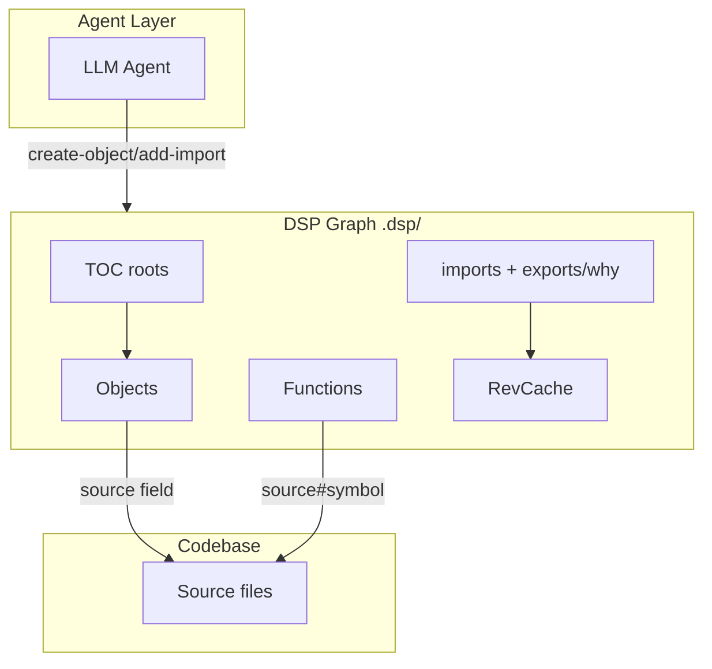
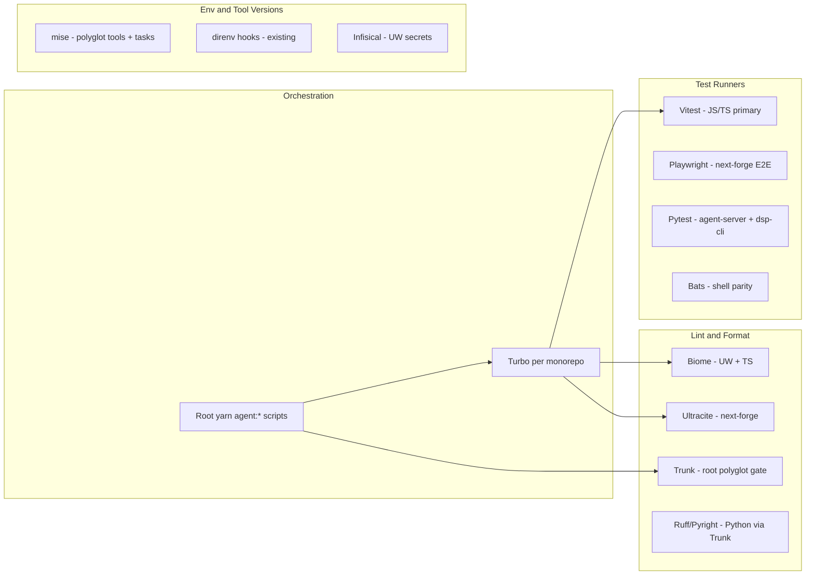

# UniversalWorkbench + Scripts Migration and Test Coverage Plan

## Key findings (from research)

### 1. `dsp-cli.py` — what it does

[`scripts/dsp-cli.py`](scripts/dsp-cli.py) implements the **Data Structure Protocol (DSP)**: a **filesystem-backed dependency graph** for LLM agents to maintain long-term structural memory of a codebase. It is **not** a multi-parser code-extraction pipeline (no AST/Tree-sitter per language).

**Storage model** (`.dsp/` directory):

| Artifact | Role |
|----------|------|
| `description` | Entity metadata (`source`, `kind`, `purpose`, optional `scope`) |
| `imports` | Directed edges: `imported_uid [via=exporter_uid]` |
| `shared` | Public API surface for an exporter object |
| `exports/` | Per-edge "why" text (human/agent rationale) |
| `TOC` / `TOC-<root_uid>` | Table of contents / scoped roots |
| `.cache/rev/` | Reverse adjacency index for fast parent lookups |

**Entity kinds**: `object`, `function`, `external` — keyed as `obj-<8hex>` / `func-<8hex>`.

**Graph operations** (single `Engine` class, not separate extractors):

- **Mutation**: `create-object`, `create-function`, `create-shared`, `add-import`, `remove-*`, `move-entity`, TOC management
- **Traversal**: `get-children`, `get-parents`, `get-path` (BFS shortest path), `detect-cycles`, `get-orphans`
- **Lookup**: `search` (full-text across `.dsp`), `find-by-source` (path → uids)
- **Integrity**: `rebuild-cache`, `get-stats`

**Parsing that exists** (minimal, protocol-specific only):

- `_parse_desc` / `_serialize_desc` — key:value description files
- `_parse_import_line` — import edge format
- `_normalize_source_path` — strips `#symbol` fragments for scope matching

**Repo integration**: [`scripts/bootstrap-dsp-observability.mjs`](scripts/bootstrap-dsp-observability.mjs) seeds a ~15–25 entity observability subgraph (telemetry CLI, bridge, audit, contracts) via `python scripts/dsp-cli.py`.

**Test gap**: `dsp-cli.py` (~1560 lines) has **no pytest suite** in-repo. High-priority target for `/unit-testing-test-generate` + `/brooks-test`.

---

### 2. Dolt — not an AI fleet graph tool

[Dolt](https://www.dolthub.com/blog/2024-10-15-dolt-use-cases/#content-management-for-a-catalog) is a **version-controlled SQL database** (Git-like branch/merge/diff for relational tables). It is written in **Go** and speaks **MySQL-compatible SQL**.

| Question | Answer |
|----------|--------|
| Does it build agent fleets with graphs? | **No.** It stores relational rows in SQL tables with version history. |
| Is Go used for schema-driven composition? | **Partially.** Dolt's engine is Go; you define **SQL schemas** and use branch/merge workflows—not a Go DSL for agent composition. |
| Repo usage today? | **Zero references** to Dolt in Monorepo_ModMe. Current data plane: **Supabase/Postgres + Prisma** (next-forge), **SQLite/Chroma** (GenerativeUI agent). |
| Relevant use case for ModMe? | **Optional future**: agent catalog / skills CMS with PR-style review (Threekit pattern from blog)—**not** a replacement for agent orchestration graphs (beads, lean-ctx catalog, DSP). |

**Recommendation**: keep Dolt in **research-only** lane; do not block lint/test migration on it. If adopted later, scope to **human-curated catalog data** (skills, toolsets, feature flags) with branch preview—not runtime agent routing.

---

### 3. Recommended polyglot toolchain (no true single "all-in-one")

Context7 research confirms no one tool covers lint + test + deps + env for **Bun + Yarn + Python + shell** stacks. Best **composite** for this repo:

| Layer | Tool | Already in repo | Role |
|-------|------|-----------------|------|
| Task graph | **Turbo** | next-forge, UniversalWorkbench | `build`, `test`, `lint:check` with cache |
| TS lint/format | **Biome** | UW; underlying next-forge via **Ultracite** | Fast formatter + 500+ lint rules; `biome ci` for CI |
| Polyglot lint | **Trunk** | [`.trunk/trunk.yaml`](.trunk/trunk.yaml) | Python (ruff, pyright, bandit), shell, markdown, secrets—**underused** |
| JS/TS tests | **Vitest** | root `scripts/__tests__`, UW, next-forge | Unify on Vitest; retire Jest in `scripts/knowledge-management` |
| E2E | **Playwright** | next-forge | Integration across apps |
| Python tests | **pytest** | agent-server CI parity | Extend to `scripts/dsp-cli.py`, `scripts/journal/journal-cli.py` |
| Shell tests | **Bats** | `scripts/bats/` | Keep for PS/bash orchestration |
| Env/tools | **mise** | partial (direnv scripts exist) | Node 22, Python 3.12, Bun pins; monorepo task templates |
| Build bundler | **ESBuild** | setup scripts | Bundling only—not lint/test; complements Vite in UW |
| Angular | N/A in UW | UW uses React + TanStack | Angular MCP/TDD loop applies only if UW pivots; not current stack |

**ESBuild vs Vite**: ESBuild = bundler/dev-server primitive; UW `apps/web` uses **Vite + Vitest**. Do not replace—use ESBuild where root scripts already wrap it ([`scripts/setup-esbuild.ps1`](scripts/setup-esbuild.ps1)).

**Jest skill**: [`jest-skill`](c:\Users\dylan\.agents\skills\jest-skill\SKILL.md) remains useful for **migration reference** (mock patterns, RTL)—target output is Vitest + `@testing-library/react` to match UW/next-forge.

---

### 4. Current fragmentation (tech debt inventory)

| Area | Lint | Test | Gap |
|------|------|------|-----|
| [`scripts/`](scripts/) | `lint:harness` only | Vitest (17 contract tests), Bats, Jest subfolder | No pytest for Python CLIs; Jest orphan |
| [`GenerativeUI_monorepo/UniversalWorkbench/`](GenerativeUI_monorepo/UniversalWorkbench/) | Biome | Vitest (`src/**/*.test.ts` only) | No `modules/` layout; narrow test glob; TanStack stack not yet modularized |
| [`next-forge/`](next-forge/) | Ultracite/Biome | Vitest + Playwright | Reference stack—do not merge lockfiles |
| Root | Trunk configured, not wired to `yarn verify:*` | `test:orchestration` | Trunk + verify scripts disconnected |

---

### 5. Frontend-architecture mapping (UniversalWorkbench)

UniversalWorkbench [`apps/web`](GenerativeUI_monorepo/UniversalWorkbench/apps/web/package.json) already uses **TanStack Query + TanStack Router**—aligned with frontend-architecture **server-state vs UI-state split**. Debt is **structure**, not libraries:

| Rule | Current | Target |
|------|---------|--------|
| Feature modules | Flat app structure | `src/modules/{feature}/` with barrels |
| Pages as directories | Likely single-file routes | `pages/{page}/{page}.tsx` + styles + README |
| Server vs UI state | TanStack Query present | Add per-module Zustand slices; never mirror query data into store |
| Cross-module imports | Unknown coupling | Barrel-only `@/modules/{feature}` |
| Routing layer | TanStack Router in app | Thin route files mounting module pages |

Migration should be **incremental** (one feature module at a time), not big-bang.

---

## Phased execution plan

### Phase 0 — Preflight (worktree + baseline)

- Run from `.worktrees/` per [multi-agent-worktrees](docs/multi-agent-worktrees.md)
- Capture baseline: `yarn test:orchestration`, `yarn verify:generative`, `yarn verify:forge`, `trunk check` (sample)
- Brooks-test audit on existing suites: [`scripts/__tests__/`](scripts/__tests__/), UW tests, `knowledge-management` Jest

### Phase 1 — Scripts test harness (highest ROI, lowest blast radius)

**1a. Unified Vitest workspace for scripts**

- Extend root [`vitest.config.mjs`](vitest.config.mjs) or add `scripts/vitest.config.mjs` with projects:
  - `orchestration` (existing `__tests__/*.test.mjs`)
  - `knowledge-management` (migrate Jest → Vitest)
- Shared fixtures pattern from [`scripts/__tests__/observability-integration.test.mjs`](scripts/__tests__/observability-integration.test.mjs) (golden JSON + schema skip guards)

**1b. Python CLI tests (pytest)**

- Add `scripts/__tests__/python/` or `scripts/tests/` with pytest for:
  - [`dsp-cli.py`](scripts/dsp-cli.py): Store, RevCache, Engine graph ops, CLI dispatch (tmp `.dsp/` dir)
  - [`journal/journal-cli.py`](scripts/journal/journal-cli.py) if in scope
- Wire into root `package.json`: `test:scripts:python` → `pytest scripts/tests`
- Add to [`scripts/verify-generative-ci.ps1`](scripts/verify-generative-ci.ps1) or new `verify:scripts` script

**1c. Brooks-test quality gate**

- Run brooks-test on new suites before merge; fix: brittle env deps, mock leakage, assertion vagueness

**1d. DSP CLI hardening**

- Document agent workflow in [`scripts/README`](scripts/) or link to DSP spec
- Optional: CI step `python scripts/dsp-cli.py detect-cycles` after bootstrap

### Phase 2 — Trunk + mise integration (polyglot quality gate)

**2a. Activate Trunk in verify pipeline**

- Add `yarn trunk:check` → `trunk check --ci` scoped to changed files
- Map Trunk linters to stacks: ruff/pyright (Python agent + scripts), shellcheck (bats/ps1), osv-scanner/grype (deps)

**2b. mise monorepo tasks**

- Root `mise.toml` with `monorepo_root = true`:
  - Tools: `node = "22"`, `python = "3.12"`, `bun = "1.3"`
  - Tasks: `verify:forge`, `verify:generative`, `test:orchestration`, `trunk:check`
- Complements existing [`scripts/install-direnv-hook.ps1`](scripts/install-direnv-hook.ps1)—mise owns versions; direnv loads env

**2c. Do NOT add Nx** (per repo convention)—Turbo stays per-monorepo; root orchestrates via `yarn agent:*`

### Phase 3 — UniversalWorkbench structure migration

**3a. Vitest coverage expansion**

- Update [`GenerativeUI_monorepo/UniversalWorkbench/vitest.config.ts`](GenerativeUI_monorepo/UniversalWorkbench/vitest.config.ts):
  - Include `**/*.{test,spec}.{ts,tsx}`, `**/*.integration.test.ts`
  - Coverage thresholds per package (start low: 40% global, 60% for `packages/shared`)
- Turbo tasks already define `test`, `test:coverage` in [`turbo.json`](GenerativeUI_monorepo/UniversalWorkbench/turbo.json)

**3b. Frontend-architecture scaffold**

- Create `apps/web/src/modules/` + `shared/` skeleton per skill
- Pilot module: pick smallest feature (e.g. auth or dashboard shell)
- TanStack Query hooks → `modules/{feature}/hooks/`; UI state → `stores/{feature}.store.ts`

**3c. Tech debt targets (from code-refactoring skill)**

- Duplicate validation/utils between `packages/shared` and apps
- God files in `apps/agent` / `apps/api` (split when touching)
- Type-coverage gate already in UW scripts—enforce in CI

### Phase 4 — Integration test layer (cross-stack)

| Test type | Tool | Scope |
|-----------|------|-------|
| Contract | Vitest + JSON fixtures | inbox, intake, observability (existing pattern) |
| API integration | Vitest + supertest/fetch | UW `apps/api`, next-forge `apps/api` |
| E2E | Playwright | next-forge apps; UW web smoke |
| Agent flow | Vitest dry-run + optional live | beads-bfs, lean-ctx catalog (existing) |
| Full stack | `yarn e2e:worktree-smoke` | Extend for UW paths |

### Phase 5 — Dolt evaluation (optional, non-blocking)

- Document ADR: Dolt vs Supabase for catalog CMS use case
- Spike: branch/merge workflow for `agent/toolsets.json` or skills index—compare to git-based approach already in use
- **No implementation** until ADR approved

---

## Skills and plugins to leverage

Install/search via [`awesome-agent-skills`](.cursor/skills/awesome-agent-skills/SKILL.md):

| Skill | Use |
|-------|-----|
| `/brooks-test` | Audit existing + new test suites |
| `/unit-testing-test-generate` | Generate pytest for dsp-cli, Vitest for scripts gaps |
| `jest-skill` | Migration patterns → Vitest |
| `modme-tdd` / `modme-quality-orchestrator` | Repo-specific verify matrix |
| `playwright-generate-test` | next-forge/UW E2E |
| `dependabot` | Dep health across dual monorepos |
| `modme-worktree-orchestration` | Session finish + verify |
| `modme-generative-ui-migrate` | UW ↔ next-forge boundary rules |

---

## Success metrics

| Metric | Baseline | Target (Q1) |
|--------|----------|---------------|
| `dsp-cli.py` test coverage | 0% | 70%+ lines |
| `scripts/` unified test runner | Vitest + Jest + Bats | Vitest + pytest + Bats |
| Trunk in CI | Config only | Pre-push advisory |
| UW Vitest include glob | `src/**/*.test.ts` | ts + tsx + integration |
| UW module structure | Flat | 1 pilot module + shared skeleton |
| Brooks-test health | Unscored | No critical decay risks in new suites |

---

## Default sequencing (assumed—adjust if you prefer UW-first)

1. **Phase 0–1** (scripts tests + dsp-cli pytest) — 1–2 sprints
2. **Phase 2** (Trunk + mise wiring) — parallel with Phase 1 tail
3. **Phase 3** (UW structure + Vitest) — 2–3 sprints
4. **Phase 4** (integration expansion) — ongoing
5. **Phase 5** (Dolt ADR) — research only

**Out of scope**: `UniversalWorkbench-staging` / `UniversalWorkbench-dev` copies (read-only unless explicitly tasked); cross-monorepo `workspace:*` merges.
