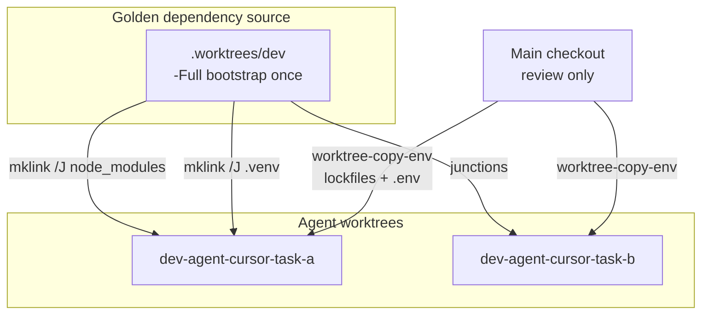

# Worktree Shared-Deps Architecture Fix

## Root cause

Git worktrees already share the object store (only modified source files differ). **Disk/RAM bloat comes from per-worktree dependency trees** (`node_modules`, `.venv`), not from Git checkout duplication.

The repo **already implements** the right pattern in `[scripts/lib/worktree-link-deps.ps1](scripts/lib/worktree-link-deps.ps1)` and `[scripts/lib/worktree-bootstrap.ps1](scripts/lib/worktree-bootstrap.ps1)` (`-SharedDeps` mode), but three layers bypass it:


| Layer                                                                      | Current behavior                                       | Should be                                               |
| -------------------------------------------------------------------------- | ------------------------------------------------------ | ------------------------------------------------------- |
| `[.cursor/setup-worktree-windows.ps1](.cursor/setup-worktree-windows.ps1)` | Full `yarn` + `bun` + `poetry` every Cursor agent      | Thin wrapper → `Invoke-WorktreeBootstrap -SharedDeps`   |
| `[.cursor/setup-worktree-unix.sh](.cursor/setup-worktree-unix.sh)`         | Same (full installs)                                   | Same fix via `setup-workspace-windows.ps1` / shared PS1 |
| `[scripts/new-agent-worktree.ps1](scripts/new-agent-worktree.ps1)`         | Ports + env only; Cursor setup does full install after | Create worktree + **immediate SharedDeps bootstrap**    |


Additionally, **skills/docs lie about commands that do not exist**: `[modme-worktree-orchestration/SKILL.md](.agents/skills/modme-worktree-orchestration/SKILL.md)` and `[agents/worktree-bootstrap.agent.md](agents/worktree-bootstrap.agent.md)` reference `yarn workspace:bootstrap`* but `[package.json](package.json)` has no such scripts. `[docs/multi-agent-worktrees.md](docs/multi-agent-worktrees.md)` still says each worktree gets its own `node_modules`.




## Target architecture (multi-agent-patterns alignment)

Per the attached **multi-agent-patterns** skill: sub-agents exist for **context isolation**, not role-play. File-system junctions are the coordination layer (like Orca's separate worktrees sharing one repo — Orca does not re-install deps per worktree).


| Role         | Component                            | Responsibility                                      |
| ------------ | ------------------------------------ | --------------------------------------------------- |
| Coordinator  | `modme-worktree-orchestration` skill | Policy: never feature on main; default SharedDeps   |
| Golden image | `.worktrees/dev`                     | **One** `-Full` bootstrap (deps source of truth)    |
| Agent lanes  | `dev-agent-*` worktrees              | `-Lite` ports/env + junction link only              |
| Gate         | `worktree-doctor` + TDD tests        | Detect bloat, validate junctions, block regressions |


**agent-workbench-orchestration** Phase 0/1 unchanged (goal contract + parallel BE/FE); worktree layer only affects bootstrap before `yarn dev:`*.

---

## Implementation plan

### Phase 1 — Wire bootstrap defaults (stop the bleeding)

**1.1 Replace Cursor setup scripts with shared bootstrap**

Rewrite `[.cursor/setup-worktree-windows.ps1](.cursor/setup-worktree-windows.ps1)` to ~15 lines:

```powershell
$WorktreeRoot = (Get-Location).Path
$SourceRoot = if ($env:ROOT_WORKTREE_PATH) { $env:ROOT_WORKTREE_PATH } else { $WorktreeRoot }
. "$WorktreeRoot/scripts/lib/worktree-bootstrap.ps1"
Invoke-WorktreeBootstrap -WorktreeRoot $WorktreeRoot -SourceRoot $SourceRoot -SharedDeps
```

Rewrite `[.cursor/setup-worktree-unix.sh](.cursor/setup-worktree-unix.sh)` to invoke the same via `pwsh -File scripts/setup-workspace-windows.ps1 -SharedDeps`.

**1.2 Add missing yarn aliases** to `[package.json](package.json)`:

```json
"workspace:bootstrap": "powershell -File ./scripts/setup-workspace-windows.ps1 -Full",
"workspace:bootstrap:shared": "powershell -File ./scripts/setup-workspace-windows.ps1 -SharedDeps",
"workspace:bootstrap:lite": "powershell -File ./scripts/setup-workspace-windows.ps1 -Lite",
"worktree:relink-deps": "powershell -File ./scripts/worktree-relink-deps.ps1",
"worktree:session:end": "powershell -File ./scripts/worktree-session-end.ps1"
```

**1.3 Upgrade `[scripts/new-agent-worktree.ps1](scripts/new-agent-worktree.ps1)`**

Add parameters (skill-promised but missing):

- `-SharedDeps` (default `$true`)
- `-FullBootstrap` (implies `-SharedDeps:$false` + full install)

After worktree creation, call `Invoke-WorktreeBootstrap` instead of only ports/env/hooks.

**1.4 Fix lockfile copy gap** in `[scripts/worktree-copy-env.ps1](scripts/worktree-copy-env.ps1)`

Extend bootstrap paths to include:

- `next-forge/bun.lock`
- `GenerativeUI_monorepo/apps/agent-server/poetry.lock`

Without these, `[Test-LockfilesMatch](scripts/lib/worktree-link-deps.ps1)` fails for `next-forge/node_modules` and `.venv`, triggering **local fallback installs** (the main reason junctions silently fail).

**1.5 Golden image bootstrap in `[scripts/init-worktrees.ps1](scripts/init-worktrees.ps1)`**

After creating `.worktrees/dev`, run `Invoke-WorktreeBootstrap -Full` once so agent worktrees have a dependency source. Add `-SkipBootstrap` for idempotent re-runs.

---

### Phase 2 — One-time migration (user chose: relink all)

**New script: `[scripts/worktree-relink-deps.ps1](scripts/worktree-relink-deps.ps1)`**

For each worktree under `.worktrees/` except `.worktrees/dev`:

1. Skip if path is `.worktrees/dev` (golden source)
2. Copy lockfiles via `worktree-copy-env.ps1`
3. For each heavy dir in link-deps spec (`node_modules`, `GenerativeUI_monorepo/node_modules`, `next-forge/node_modules`, `agent-server/.venv`):
  - If real directory (not reparse point): `Remove-Item -Recurse -Force`
  - Call `Invoke-WorktreeLinkDeps`
4. Emit JSON summary: `{ worktree, linked[], removed_mb_estimate, failed[] }`

Expose as `yarn worktree:relink-deps` (all) and `yarn worktree:relink-deps -- -WorktreePath <path>` (single).

**Prerequisite**: ensure `.worktrees/dev` has full deps (`yarn workspace:bootstrap` from dev checkout if doctor reports missing source).

---

### Phase 3 — Doctor + observability

Extend `[scripts/worktree-doctor.ps1](scripts/worktree-doctor.ps1)` with checks:


| Check ID          | Condition                                                                              | Severity                                    |
| ----------------- | -------------------------------------------------------------------------------------- | ------------------------------------------- |
| `deps_source`     | `.worktrees/dev` has `GenerativeUI_monorepo/node_modules` or `next-forge/node_modules` | error on agent WT if missing                |
| `deps_junction`   | Each heavy dir is reparse point OR equals golden source                                | warn if real dir                            |
| `deps_lock_drift` | Lock fingerprints match golden                                                         | warn                                        |
| `deps_bloat`      | Sum size of non-junction heavy dirs > threshold                                        | warn + fix hint `yarn worktree:relink-deps` |


`-Fix` mode: copy lockfiles + invoke relink for current worktree.

Update `[e2e/worktree-smoke/run.mjs](e2e/worktree-smoke/run.mjs)` to assert `workspace:bootstrap:shared` script exists and `worktree-link-deps.ps1` is loadable.

---

### Phase 4 — modme-tdd tests (committed to main, not buried in worktrees)

Add `[scripts/__tests__/worktree-link-deps.test.mjs](scripts/__tests__/worktree-link-deps.test.mjs)` using vitest (pattern from existing `molecule-index.test.mjs` in package.json):


| Test  | Behavior                                                                  |
| ----- | ------------------------------------------------------------------------- |
| Red   | `Get-LockfileFingerprint` equivalent (Node) returns null for missing file |
| Red   | `lockfilesMatch` returns false when bun.lock differs                      |
| Green | Junction spec list has exactly 4 entries with correct lock paths          |
| Green | `worktree-copy-env` copies bun.lock + poetry.lock (temp dir fixture)      |


Add `[scripts/preflight.manifest.json](scripts/preflight.manifest.json)` (referenced by modme-tdd skill but missing) with profile:

```json
"worktree-shared-deps": {
  "steps": [
    { "cmd": "vitest run scripts/__tests__/worktree-link-deps.test.mjs" },
    { "cmd": "node e2e/worktree-smoke/run.mjs" }
  ]
}
```

Wire `yarn preflight:worktree` alias. Red phase first: tests fail until copy-env + scripts land.

---

### Phase 5 — Docs + skills alignment

Update these to match reality:

- `[docs/multi-agent-worktrees.md](docs/multi-agent-worktrees.md)` — Problem section: shared deps via junctions; only `.worktrees/dev` gets full install; Cursor setup steps list SharedDeps
- `[.agents/skills/modme-worktree-orchestration/SKILL.md](.agents/skills/modme-worktree-orchestration/SKILL.md)` — fix "dot-sources worktree-bootstrap" claim for Cursor script
- `[agents/worktree-bootstrap.agent.md](agents/worktree-bootstrap.agent.md)` — default `workspace:bootstrap:shared`
- `[.cursor/rules/multi-agent-worktrees.mdc](.cursor/rules/multi-agent-worktrees.mdc)` — add shared-deps one-liner

---

## Execution order


TDD red tests written first (Phase 4 skeleton), then Phase 1 makes them green, then migration.

## Verification checklist

From repo root after implementation:

```powershell
# 1. Golden image
cd .worktrees/dev
yarn workspace:bootstrap          # full once

# 2. Migrate existing agent worktrees
cd ../..
yarn worktree:relink-deps

# 3. Doctor every active worktree
yarn worktree:doctor
yarn worktree:doctor:fix

# 4. TDD + smoke
yarn preflight:worktree
yarn e2e:worktree-smoke

# 5. Spot-check: node_modules should be junction
# (Get-Item .worktrees/dev-agent-*/node_modules).Attributes -band ReparsePoint
```

## Expected disk/RAM impact

- **Before**: N worktrees × (~2–4 GB node_modules + .venv each)
- **After**: 1 full install in `.worktrees/dev` + N junctions (metadata only)
- **RAM**: fewer duplicate file caches; IDE indexers still per-worktree (unavoidable) but no duplicate package trees on disk

## Out of scope (unless you ask later)

- Orca CLI integration (reference only; Git worktrees remain the mechanism)
- Linux symlink strategy (junctions are Windows-first; Unix setup can use `setup-workspace-windows.ps1` via pwsh or add `ln -s` parity in a follow-up)
- Deleting stale merged worktrees (use existing `[remove-agent-worktree.ps1](scripts/remove-agent-worktree.ps1)` after PR merge)

