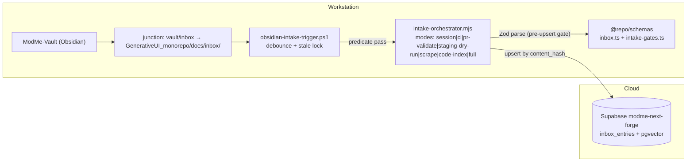

# C4 Component — Intake Pipeline

**Location:** Root `scripts/` + `next-forge/packages/schemas` + Supabase pgvector
**ADR:** `next-forge/docs/adr/0013-obsidian-intake-trigger-and-session-gates.md` (trigger + gates), 0009 (contract), 0010 (dual-store)
**Beads:** `modme-7lo`

## Responsibility

Obsidian vault capture → funnel → audit → ingest → embed → categorize → Supabase knowledge store. Dual-store with GreptimeDB for code index (optional). Event-triggered from vault writes via the promotion predicate.

## Entry commands

- `yarn intake`, `yarn intake:orchestrate`
- `yarn inbox:audit`, `yarn inbox:fix`
- `pwsh scripts/obsidian-intake-trigger.ps1` (watcher; `-Live` to enable real upserts)

## Container view



## Event flow (Fable-5 lifecycle)

```mermaid
sequenceDiagram
  participant V as Vault (Obsidian)
  participant W as Watcher (ps1)
  participant O as Orchestrator (mjs)
  participant S as Supabase

  V->>W: NoteCaptured (file event)
  W->>W: debounce; sha256 content_hash; stale-lock check
  W->>W: NoteQualified (pipeline_ready | severity high/critical | tag intake/ready)
  W->>O: node intake-orchestrator.mjs --mode=session [--dry-run]
  O->>O: inbox-audit --lens funnel (reconciliation)
  O->>O: inbox-ingest → NoteTransformed
  O->>S: upsert ON CONFLICT (content_hash) → NoteUpserted (status=indexed)
  O->>S: embeddings + mda-categorize → NotePromoted (status=categorized)
  O->>O: inbox-audit --lens pipeline + get_advisors (post-upsert gate)
```

## Modules (code level)

| Module | Role |
|---|---|
| `scripts/obsidian-intake-trigger.ps1` | File watcher, content_hash debounce, PID stale lock, predicate call, orchestrator invocation |
| `scripts/intake-orchestrator.mjs` | Stage sequencing, beads + telemetry `pipeline_run` hooks, mode/flag handling |
| `scripts/inbox-audit.mjs` / `inbox-fix.mjs` | Reconciliation lens (funnel / pipeline / all); fix runs dry inside orchestrator |
| `scripts/inbox-ingest.mjs` | Parse funnel files, upsert into `inbox_entries` by `content_hash` |
| `scripts/inbox-embeddings.mjs` | 384-dim MiniLM vectors for rows without embeddings |
| `scripts/mda-categorize.mjs` | Status-driven categorization (`indexed` → `categorized`) |
| `next-forge/packages/schemas/inbox.ts` | Contract v1 Zod schemas (`InboxFrontmatterSchema`, `InboxFunnelFileSchema`, `InboxEntryRecordSchema`) |
| `next-forge/packages/schemas/intake-gates.ts` | Gate-phase discriminated union, promotion predicate, trigger-set hash |

## Quality gates

Pre-session (`lean-ctx:ensure`, `worktree:doctor`, beads claim) → during-session (`inbox-audit --lens funnel`, telemetry open) → pre-upsert (strict Zod parse, RLS-safe server path) → post-upsert (`inbox-audit --lens pipeline`, Supabase `get_advisors`, `beadsFinishPipelineRun`). Details and the per-stage idempotency table: ADR-0013.

## Evidence

- `docs/inbox-pipeline/README.md`
- `docs/inbox-pipeline/contracts/inbox-contract.v1.json`
- `docs/obsidian-sidecar-setup.md`
- `scripts/intake-orchestrator.mjs`
- `@repo/schemas` inbox + intake-gates exports
