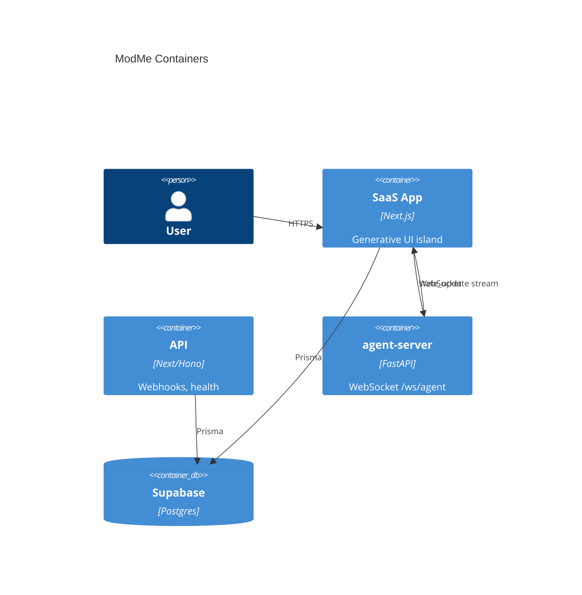

# C4 Level 2 — Containers

## Container map

| Container | Tech | Port | Path |
|-----------|------|------|------|
| **next-forge App** | Next.js 15+, Auth.js | 3100 | `next-forge/apps/app` |
| **next-forge Web** | Next.js marketing | 3101 | `next-forge/apps/web` |
| **next-forge API** | Hono/Next API routes | 3102 | `next-forge/apps/api` |
| **agent-server** | FastAPI + AG2 | 8000 | `GenerativeUI_monorepo/apps/agent-server` |
| **Supabase** | Hosted Postgres | 5432 / cloud | `next-forge/packages/database` |
| **Docs** | Mintlify | 3104 | `next-forge/apps/docs` |
| **Storybook** | Workshop | 6106 | `next-forge/apps/storybook` |
| **Root orchestrator** | Yarn scripts + harness | — | `scripts/`, `harness/` |
| **Legacy root GenUI** | Next + Python ADK | [deprecated] | `src/`, `agent/` |

## Container diagram

## Boundaries

- next-forge and GenerativeUI are **separate monorepos** — integrate via WebSocket + shared contract JSON only.
- Root `src/`/`agent/` excluded from product container map (legacy).

## Evidence

- `scripts/launch-manifest.json`
- `harness/config/environment.json`
- `C4-Documentation/c4-context.md`
