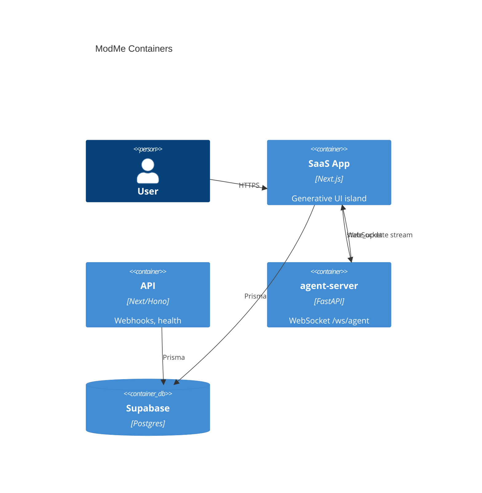
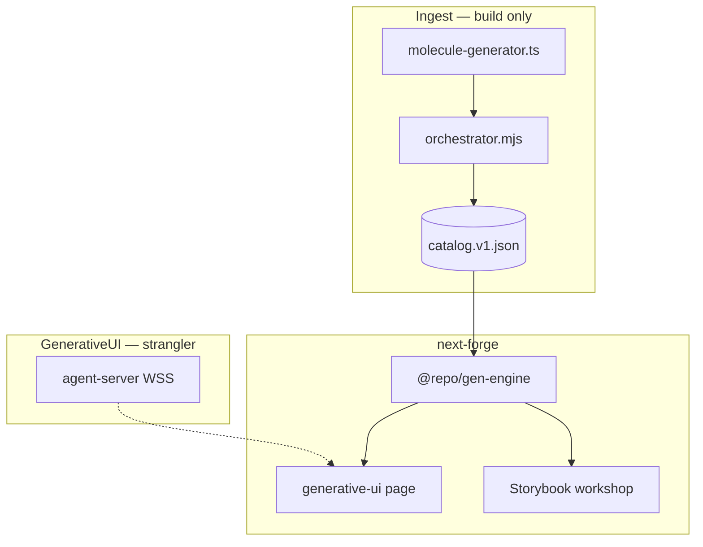

# C4 Level 2 — Containers

## Container map

| Container | Tech | Port | Path |
|-----------|------|------|------|
| **next-forge App** | Next.js 15+, Auth.js | 3100 | `next-forge/apps/app` |
| **next-forge Web** | Next.js marketing | 3101 | `next-forge/apps/web` |
| **next-forge API** | Hono/Next API routes | 3102 | `next-forge/apps/api` |
| **agent-server** | FastAPI + AG2 | 8000 | `GenerativeUI_monorepo/apps/agent-server` |
| **Supabase** | Hosted Postgres | 5432 / cloud | `next-forge/packages/database` |
| **Docs** | Mintlify | 3104 | `next-forge/apps/docs` |
| **Storybook** | Workshop | 6106 | `next-forge/apps/storybook` |
| **Root orchestrator** | Yarn scripts + harness | — | `scripts/`, `harness/` |
| **Legacy root GenUI** | Next + Python ADK | [deprecated] | `src/`, `agent/` |

## Container diagram

```mermaid
C4Container
  title ModMe Containers
  Person(user, "User")
  Container(app, "SaaS App", "Next.js", "Generative UI island")
  Container(api, "API", "Next/Hono", "Webhooks, health")
  Container(as, "agent-server", "FastAPI", "WebSocket /ws/agent")
  ContainerDb(db, "Supabase", "Postgres")
  Rel(user, app, "HTTPS")
  Rel(app, as, "WebSocket")
  Rel(app, db, "Prisma")
  Rel(api, db, "Prisma")
  Rel(as, app, "state_update stream")
```

## Frontend Gen Engine containers (stub)

| Container | Tech | Path | Role |
|-----------|------|------|------|
| **Molecule orchestrator** | Node (root scripts) | `scripts/molecule-index-orchestrator.mjs` | Emits `data/molecule-index/catalog.v1.json` |
| **Intake contracts** | Zod (ESM) | `packages/intake-contracts/` | `molecule-catalog` schema validation |
| **@repo/gen-engine** | TypeScript package | `next-forge/packages/gen-engine/` | Catalog loader, `MoleculeRenderer`, form compiler |
| **Generative UI route** | Next.js client island | `next-forge/apps/app/.../generative-ui/` | Catalog browser + preview + WS panel |
| **Workshop / Molecules** | Storybook | `next-forge/apps/workshop/stories/ModMe/Molecules/` | Per-tier visual baseline |

### Engine container diagram

```mermaid
flowchart TB
  subgraph ingest [Ingest — build only]
    MolGen[molecule-generator.ts]
    Orch[orchestrator.mjs]
    Catalog[(catalog.v1.json)]
    MolGen --> Orch --> Catalog
  end

  subgraph nf [next-forge]
    GenEngine["@repo/gen-engine"]
    App[generative-ui page]
    SB[Storybook workshop]
    Catalog --> GenEngine
    GenEngine --> App
    GenEngine --> SB
  end

  subgraph legacy [GenerativeUI — strangler]
    AS[agent-server WSS]
    AS -.-> App
  end
```

**Boundary:** GenerativeUI sources are read by the root orchestrator only — no `workspace:*` link at runtime.

## Boundaries

- next-forge and GenerativeUI are **separate monorepos** — integrate via WebSocket + shared contract JSON only.
- Root `src/`/`agent/` excluded from product container map (legacy).
- Runtime apps consume **built** `catalog.v1.json`, not live GenerativeUI imports.

## Evidence

- `scripts/launch-manifest.json`
- `harness/config/environment.json`
- `C4-Documentation/c4-context.md`
- `docs/frontend-gen-engine/PROJECT_BRIEF.md`
