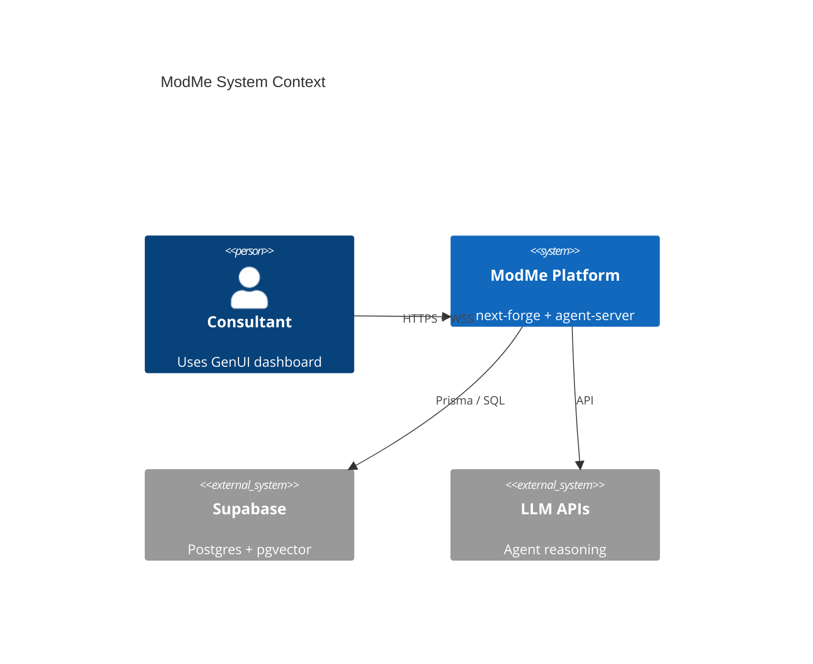

# C4 Level 1 — System Context

## ModMe GenUI Platform

AI-assisted consulting platform with **dynamic Generative UI**: agents orchestrate UI components via WebSocket streaming.

## Actors

| Actor | Interaction |
|-------|-------------|
| Consultant / user | Uses next-forge SaaS app (browser) |
| AI agents (AG2) | Run in agent-server, emit UI actions |
| Developer | Maintains dual-monorepo, harness, intake pipeline |

## External systems

| System | Relationship |
|--------|--------------|
| Supabase Postgres | Primary data store (next-forge) |
| LLM providers (OpenAI, etc.) | agent-server backend |
| GitHub / CI | Build and deploy |
| Mintlify | Product documentation |

## Context diagram

## Evidence

- `docs/ARCHITECTURE.md`
- `AGENTS.md`
- `next-forge/SETUP.md`
