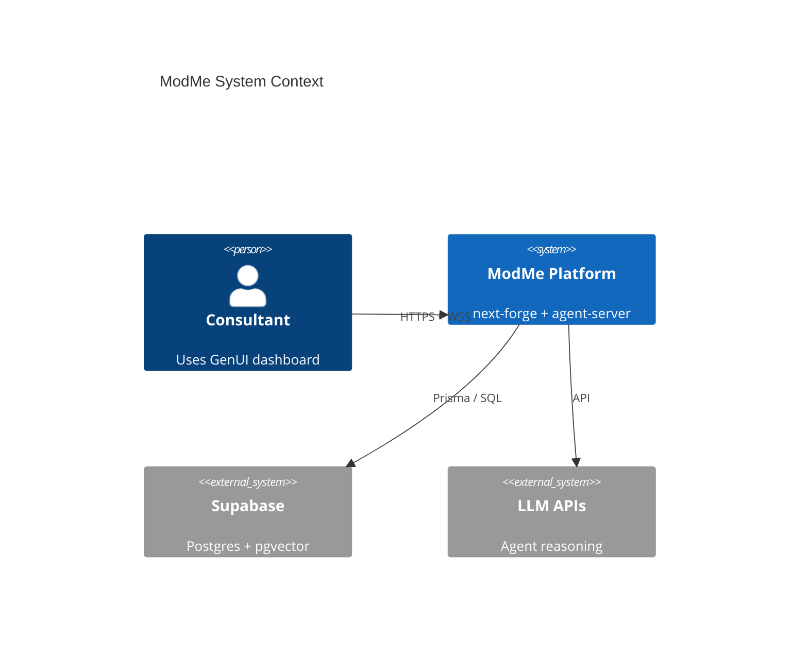
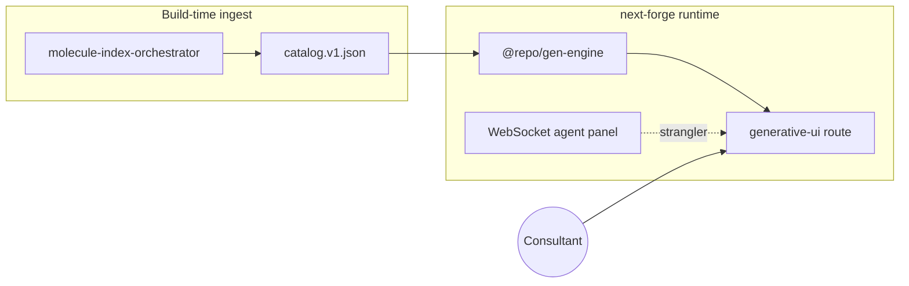

# C4 Level 1 — System Context

## ModMe GenUI Platform

AI-assisted consulting platform with **dynamic Generative UI**: agents orchestrate UI components via WebSocket streaming.

## Actors

| Actor | Interaction |
|-------|-------------|
| Consultant / user | Uses next-forge SaaS app (browser) |
| AI agents (AG2) | Run in agent-server, emit UI actions |
| Developer | Maintains dual-monorepo, harness, intake pipeline |

## External systems

| System | Relationship |
|--------|--------------|
| Supabase Postgres | Primary data store (next-forge) |
| LLM providers (OpenAI, etc.) | agent-server backend |
| GitHub / CI | Build and deploy |
| Mintlify | Product documentation |

## Context diagram

```mermaid
C4Context
  title ModMe System Context
  Person(user, "Consultant", "Uses GenUI dashboard")
  System(modme, "ModMe Platform", "next-forge + agent-server")
  System_Ext(supabase, "Supabase", "Postgres + pgvector")
  System_Ext(llm, "LLM APIs", "Agent reasoning")
  Rel(user, modme, "HTTPS + WSS")
  Rel(modme, supabase, "Prisma / SQL")
  Rel(modme, llm, "API")
```

## Frontend Gen Engine (stub)

Molecule-catalog-first UI generation: build-time ingest produces `catalog.v1.json`; next-forge `@repo/gen-engine` renders molecules in the generative-ui route. Legacy agent-server WebSocket remains until TanStack AI strangler (Phase 4).

### Engine actors

| Actor | Interaction |
|-------|-------------|
| Consultant / user | Browses molecule catalog, previews rendered molecules |
| Nova (agent lane) | Implements catalog loader, `MoleculeRenderer`, Storybook |
| Ivy (QA lane) | Playwright + Storybook verification |
| Build orchestrator | `molecule-index-orchestrator.mjs` (reads GenerativeUI sources at build time only) |

### Engine context diagram

```mermaid
flowchart LR
  subgraph build [Build-time ingest]
    Orch[molecule-index-orchestrator]
    Cat[catalog.v1.json]
    Orch --> Cat
  end

  subgraph forge [next-forge runtime]
    GE["@repo/gen-engine"]
    GUI[generative-ui route]
    WS[WebSocket agent panel]
    Cat --> GE
    GE --> GUI
    WS -. strangler .-> GUI
  end

  User((Consultant)) --> GUI
```

Program brief: [`docs/frontend-gen-engine/PROJECT_BRIEF.md`](../docs/frontend-gen-engine/PROJECT_BRIEF.md).

## Evidence

- `docs/ARCHITECTURE.md`
- `AGENTS.md`
- `next-forge/SETUP.md`
- `docs/frontend-gen-engine/PROJECT_BRIEF.md`
