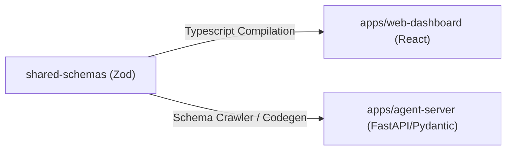

# Unified Frontend-Backend Coordination Guide
*Establishing the Monorepo Standard for High-Craft UI and Scalable Architecture*

This document defines how `/frontend-design` (memorable, production-grade UIs) and `@backend-architect` (scalable, resilient backend services) coordinate inside the `GenerativeUI_monorepo` to build applications.

It adapts the "Model-First" philosophy of **Microsoft Rayfin** to our existing React, Next.js, and FastAPI tech stack.

---

## 1. The Model-First Workflow (Inspired by Rayfin)

In Rayfin, backends are generated directly from TypeScript classes. In our monorepo, we achieve the same alignment using **`packages/shared-schemas`** as our single source of truth.



### Protocol for Model Updates:
1. **Model First:** Any new feature must start by defining or updating schemas inside `packages/shared-schemas/src/index.ts`.
2. **Never Drift:** Never write raw JSON objects for API payloads. They must be validated using the generated types in React and FastAPI.
3. **Run Verification:** After schema changes, run compilation to verify that no frontend components or backend routes break:
   ```bash
   yarn workspace @generative-ui/shared-schemas build
   ```

---

## 2. Designing for API States (The `/frontend-design` Mandate)

A common mistake in backend-frontend coordination is neglecting intermediate network states. Under our frontend design guidelines, generic loading spinners are prohibited. The Backend Architect must expose the metadata necessary for the Frontend Designer to craft premium transitions.

Every API integration must explicitly style the **5 Core States**:

```
┌──────────────────────────────────────────────────────────────────┐
│ 1. Loading State     ─► Glassmorphism Skeleton Cards (Blurred)  │
│ 2. Empty / Success   ─► Beautiful illustration, typography focus│
│ 3. Active Stream     ─► Micro-animations showing data feed      │
│ 4. Error / Limit     ─► Contextual error banner (RFC 7807 data) │
│ 5. Optimistic UI     ─► Instant visual state change on click     │
└──────────────────────────────────────────────────────────────────┘
```

### Loading State Requirements:
* **No Spinners:** Use skeleton frames styled with local glassmorphism tokens (`--glass-blur`, `--glass-shadow`).
* **Staggered Entrances:** If loading a list, stagger the appearance of the skeleton slots to create rhythm.

### Error & Rate-Limited States:
* The backend must return structured errors using the RFC 7807 (Problem Details) specification.
* The frontend must map these error codes to contextual, styled error elements rather than generic alert boxes.

---

## 3. API Design for Optimistic UI (The `@backend-architect` Mandate)

To build premium, responsive interfaces, the frontend must often update the UI **before** the backend database acknowledges the write (Optimistic UI). This requires specific backend patterns:

1. **Idempotency Keys:**
   * Any mutation/POST request from the frontend must support an client-generated `idempotency-key` in the header or payload.
   * This allows the frontend to retry requests safely without creating duplicate records in case of network drops.
2. **Client-Generated IDs:**
   * Do not rely solely on database-generated auto-incrementing IDs.
   * Generate UUIDs on the client side (frontend) and send them to the backend, enabling the frontend to immediately render the new item in lists with its final ID.
3. **Structured Response Payloads:**
   * The backend should return the updated state of the entity in the mutation response so the client can reconcile its local cache without performing a secondary GET request.

---

## 4. Real-Time Communication Protocol (WebSockets & SSE)

For generative interfaces (such as Agent-to-User chat panels), standard polling is too slow and ruins the user experience.

* **WebSocket State Synchronization:**
  * Use the shared `WebSocketMessage` schemas inside `packages/shared-schemas`.
  * The backend (`apps/agent-server`) broadcasts state updates (`AgentState`) containing all current actions.
  * The frontend (`apps/web-dashboard`) reads the state stream via the `useAgentState` hook and updates the canvas live.
* **Server-Sent Events (SSE) for Text Streams:**
  * For streaming text output from LLMs/agents, use SSE instead of raw WebSockets when the communication is strictly one-way (server-to-client). SSE degrades gracefully and has built-in reconnection mechanisms.

---

## 5. Checklist for Feature Delivery

Before finalizing any full-stack feature, both the Frontend Designer-Engineer and the Backend Architect must sign off on this coordination checklist:

* [ ] **Single Source of Truth:** Data models are defined in Zod schemas in `packages/shared-schemas` and correctly mirrored or crawled to Pydantic models in Python.
* [ ] **Aesthetic Loading:** Loading state uses glassmorphism skeletons styled with native CSS custom properties.
* [ ] **Optimistic Reconciliation:** Write operations use client-generated UUIDs and are designed to support optimistic UI updates.
* [ ] **Error Handling:** API errors use structured error payloads and are mapped to dedicated error UI components.
* [ ] **Turborepo Compliance:** Running `yarn build` at the root executes successfully without any type mismatches across workspaces.
