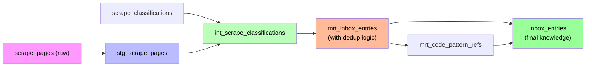

# Scrape Pipeline Handover: Firecrawl + dbt Integration

**Session date:** 2026-06-27  
**Focus:** Unified architecture mapping for data extraction, classification, and promotion workflow

## 1. Current Pipeline: Scrapy → Ollama → Promote

This repository implements a three-stage intake pipeline for scraping web content, classifying it, and promoting it to the knowledge base.

### 1.1 Orchestration & Manifest Validation

**Orchestrator:** [`scripts/scrape-orchestrator.mjs`](../../scripts/scrape-orchestrator.mjs)

- Validates scrape job manifest YAML against JSON schema
- Chains: `Scrapy crawl` → `Ollama classify` → `Promote to inbox`
- Manifest config lives in: `GenerativeUI_monorepo/scrape-pipeline/scrape-jobs/*.collection.yml`
- Schema ref: `GenerativeUI_monorepo/scrape-pipeline/scrape-jobs/scrape-job.schema.json`

**Key fields in manifest:**
- `slug` — manifest identifier (e.g., `docs-sitemap`)
- `seeds` — list of starting URLs
- `sitemap_url` (optional) — if provided, parsed first
- `depth` — crawl depth limit (default: 2)
- `allowlist` — URL path patterns to follow
- `use_playwright` — enable browser rendering if needed
- `obey_robots` — respect robots.txt (default: true)

### 1.2 Scrape Stage: Extract Raw Content → `scrape_pages` Staging Table

**Source code:** `GenerativeUI_monorepo/scrape-pipeline/`

**Spider:** [`GenerativeUI_monorepo/scrape-pipeline/scrape_pipeline/spiders/doc_spider.py`](../../GenerativeUI_monorepo/scrape-pipeline/scrape_pipeline/spiders/doc_spider.py)

- Uses Scrapy + trafilatura for content extraction
- Input: manifest (seed URLs, depth, allowlist)
- Per-URL flow:
  1. Fetch HTML (with optional Playwright for JS-heavy sites)
  2. Extract main content text via `trafilatura.extract(..., include_links=False)`
  3. Normalize whitespace and compute `content_hash` (sha256 of normalized text)
  4. Yield `ScrapePageItem` with `url`, `text`, `html` (truncated), `content_hash`, `job_id`

**Upsert Pipeline:** [`GenerativeUI_monorepo/scrape-pipeline/scrape_pipeline/pipelines/supabase_staging.py`](../../GenerativeUI_monorepo/scrape-pipeline/scrape_pipeline/pipelines/supabase_staging.py)

- Batches items (chunk size 100)
- Upserts into Supabase table `scrape_pages` on `content_hash` conflict
- Columns written:
  - `job_id` — links to scrape job run
  - `url` — source URL
  - `content_hash` — sha256 of normalized extracted text (64 hex chars)
  - `html` — raw HTML (first 100K chars)
  - `text` — extracted text (first 50K chars)
  - `status` — initially `'raw'`
  - `metadata` — JSON object (e.g., `{"depth": 0}`)

**Output DB table:** `scrape_pages` (rows with `status='raw'`)

### 1.3 Classification Stage: Ollama → `scrape_classifications` + Status Update

**Classifier Script:** [`scripts/scrape-classify.mjs`](../../scripts/scrape-classify.mjs)

- Selects `scrape_pages` rows where `status='raw'`
- For each page:
  1. Calls classifier helper (Ollama local LLM) with `{ url, text: first 8000 chars }`
  2. Classifier returns JSON matching `classifyOutputSchema`
  3. Validates output with Zod schema
  4. If validation fails, retries with repair prompt (temperature=0)
  5. Inserts row into `scrape_classifications`
  6. Updates `scrape_pages.status='classified'`

**Classifier Helper:** `experiments/micro-agents/helpers/scrape-classifier-helper.ts`

- Uses Ollama `/api/chat` endpoint (default: `http://localhost:11434`)
- Model: configurable via `OLLAMA_MODEL` env (default: `llama3.2:3b`)
- Output schema (Zod validation):
  ```typescript
  {
    entry_type: enum(ENTRY_TYPES),         // 'architecture' | 'design' | 'code-review' | 'solution' | 'research' | 'snippet' | 'link' | 'component'
    severity: enum(SEVERITIES),            // 'low' | 'medium' | 'high' | 'critical'
    agent_role: enum(AGENT_ROLES),         // 'frontend' | 'backend' | 'devops' | 'architect' | 'reviewer' | 'researcher'
    title: string,                         // 1-500 chars
    summary: string,                       // 0-300 chars
    tags: string[],                        // max 8 items
    features: object                       // arbitrary metadata, may include code_pattern_ids
  }
  ```

**Contracts:** 
- Enum definitions: `docs/inbox-pipeline/contracts/inbox-contract.v1.json`
- Zod mirror: `packages/intake-contracts/schemas/classify-output.mjs`

**Output DB table:** `scrape_classifications` (structured metadata) + updated `scrape_pages.status='classified'`

### 1.4 Promotion Stage: Classified → `inbox_entries` (Knowledge Base)

**Promotion Script:** [`scripts/scrape-promote.mjs`](../../scripts/scrape-promote.mjs)

- Selects `scrape_pages` where `status='classified'` AND `inbox_entry_id IS NULL` (not yet promoted)
- For each page:
  1. Look up associated `scrape_classifications` row
  2. **Dedup check:** Query `inbox_entries` for existing `content_hash`
     - If found: link `scrape_pages.inbox_entry_id` to existing entry, skip insertion
     - If not found: proceed to create new entry
  3. Create `inbox_entries` row with mapped fields:
     - `content_hash` ← from `scrape_pages`
     - `source_file` ← `scrape_pages.url`
     - `source_format` ← `'url'`
     - `raw_content` / `extracted_text` ← first 50K chars of `scrape_pages.text`
     - `title`, `summary`, `severity`, `entry_type`, `agent_role` ← from `scrape_classifications`
     - `tags` ← from `scrape_classifications.tags`
     - `code_pattern_ids` ← from `scrape_classifications.features.code_pattern_ids` (if present)
     - `status` ← `'indexed'`
  4. If `code_pattern_ids` present: create `code_pattern_refs` rows linking to the new `inbox_entry_id`
  5. Update `scrape_pages.status='promoted'` and `scrape_classifications.promoted_at=now()`
  6. Optionally export frontmatter markdown to `GenerativeUI_monorepo/docs/inbox/` (if `--export-md` flag)

**Output DB tables:** 
- `inbox_entries` (deduplicated knowledge entries)
- `code_pattern_refs` (cross-references to code index)
- Updated `scrape_pages.status='promoted'`

**Promotion contract:** `docs/inbox-pipeline/contracts/scrape-promotion.v1.json`

---

## 2. Firecrawl Capability Mapping

**Current extraction method:** Scrapy + trafilatura  
**Proposed integration:** Firecrawl `/firecrawl-build-scrape` (and optionally `/firecrawl-build-interact` for JS-heavy sites)

### 2.1 Input/Output Contract for Scrape Stage Replacement

Firecrawl would replace the "Scrapy crawl + trafilatura" step while preserving all downstream scripts and DB schema.

**Firecrawl output → `scrape_pages` table mapping:**

| Firecrawl field | DB column | Notes |
|---|---|---|
| `url` (input) | `url` | Source URL passed to Firecrawl |
| `markdown` (output) | `text` | Clean markdown output (or plain text); first 50K chars stored |
| `html` (optional output) | `html` | Raw HTML if requested; first 100K chars stored |
| computed sha256(normalized_text) | `content_hash` | Must match repo normalization logic (collapse whitespace, trim) |
| (input) | `job_id` | Current `job_id` from scrape_jobs table |
| n/a | `status` | Always start as `'raw'` |
| n/a | `metadata` | Store any Firecrawl metadata (e.g., crawl depth, render time) |

**Key design decisions:**
1. **Text extraction:** Prefer Firecrawl's markdown format (or fallback to clean text). Ensure the normalized text (sha256 input) matches the repo's whitespace-collapse algorithm.
2. **HTML storage:** Optional; useful for forensics but increases DB size.
3. **Status transitions:** Preserve existing enum (`raw` → `classified` → `promoted`/`failed`) so classification and promotion scripts work unchanged.
4. **Dedup key:** Use `content_hash` (sha256 of normalized text), same as current pipeline.

### 2.2 Firecrawl Endpoint Selection

| Scenario | Endpoint | Notes |
|---|---|---|
| **Known URL list** (e.g., sitemap URLs provided) | `/firecrawl-build-scrape` | Per-URL extraction; stateless; good for batch processing |
| **Need to discover URLs from a seed domain** | `/firecrawl-build-search` or `/firecrawl-build-map` | Find entry points; then feed URLs to `/scrape` |
| **Page needs browser interaction (forms, clicks, JS rendering)** | `/firecrawl-build-interact` | Escalation from `/scrape` if page content is incomplete |
| **Full site crawl** | `/firecrawl-build-crawl` | Respects robots.txt, allowlist; returns structured pages |

**Recommended approach for this repo:**
- Start with `/firecrawl-build-scrape` for each URL in the manifest's `seeds` list.
- If a page needs JS rendering or interaction, escalate to `/firecrawl-build-interact`.
- Keep the batch upsert pipeline (`supabase_staging.py`) to handle chunked inserts into `scrape_pages`.

---

## 3. dbt Transformation Pattern Mapping

The current pipeline is procedurally orchestrated via Node.js scripts. A dbt-based transformation layer would **formalize** the data flow as versioned models with quality tests.

### 3.1 Layer A: Staging Models (Raw Ingestion)

**Model: `stg_scrape_pages`**

```yaml
materialization: incremental
unique_key: content_hash  # sha256 of normalized text
```

**Purpose:** Load raw scrape_pages without transformation. Serve as the source for downstream models.

**Columns:**
- `id` (PK from raw table)
- `url` — source URL
- `content_hash` — sha256 (64 hex chars, unique key)
- `text` — extracted text (up to 50K chars)
- `html` — raw HTML (up to 100K chars, optional)
- `status` — 'raw' | 'classified' | 'promoted' | 'failed'
- `job_id` — links to scrape_jobs run
- `metadata` — JSON object
- `created_at`, `updated_at`

**Tests:**
- `unique(content_hash)` — enforce dedup at model level
- `not_null(url)` — URL always required
- `not_null(content_hash)` — hash always present
- `dbt_utils.expression_is_true(expression="len(content_hash) = 64")` — SHA256 is exactly 64 hex chars
- `dbt_utils.accepted_values(column="status", values=["raw", "classified", "promoted", "failed"])`

**Documentation:**
- Grain: one row per unique `content_hash`
- Incremental strategy: append new rows where `updated_at > max(updated_at)` in prior run
- Freshness: daily check (scrape jobs run on schedule)

### 3.2 Layer B: Intermediate Models (Enriched / Structured)

**Model: `int_scrape_classifications`**

```yaml
materialization: table
unique_key: [page_id, classification_id]  # or just page_id if single classifier run
```

**Purpose:** Join raw pages with their classification metadata. Validate enums and contract schema.

**Columns:**
- `page_id` (FK to `stg_scrape_pages`)
- `classification_id` (PK from raw `scrape_classifications` table)
- `url` — copied from page for convenience
- `text` — copied from page (for context in tests)
- `entry_type` — enum validation
- `severity` — enum validation
- `agent_role` — enum validation
- `title` — max 500 chars
- `summary` — max 300 chars
- `tags` — list of max 8 items
- `features` — JSON object (may include `code_pattern_ids`)
- `promoted_at` — timestamp when promoted (if promoted)
- `created_at`, `updated_at`

**Tests:**
- `not_null([entry_type, severity, agent_role, title])` — required fields
- `dbt_utils.accepted_values(column="entry_type", values=[...ENTRY_TYPES...])`
- `dbt_utils.accepted_values(column="severity", values=["low", "medium", "high", "critical"])`
- `dbt_utils.accepted_values(column="agent_role", values=[...AGENT_ROLES...])`
- `dbt_utils.expression_is_true(expression="len(title) <= 500 and len(title) > 0")`
- `dbt_utils.expression_is_true(expression="len(summary) <= 300")`
- `dbt_utils.expression_is_true(expression="array_length(tags, 1) <= 8")` — if using array type
- Foreign key: `page_id` references `stg_scrape_pages.id`

**Documentation:**
- Grain: one row per classification
- Source: raw `scrape_classifications` table (joined with `stg_scrape_pages` for context)

### 3.3 Layer C: Marts Models (Promotion-Ready)

**Model: `mrt_inbox_entries`** (Promotion decision and dedup logic)

```yaml
materialization: incremental
unique_key: content_hash  # ensures dedup
```

**Purpose:** Represent pages ready to be promoted into the knowledge base. Implement dedup via SQL (mirror current JS promotion script logic).

**Query logic:**
```sql
SELECT
  int_scrape_classifications.*,
  COALESCE(existing_entry.id, gen_random_uuid()) AS inbox_entry_id,
  CASE WHEN existing_entry.id IS NOT NULL THEN 'dedup' ELSE 'new' END AS promotion_action
FROM int_scrape_classifications
LEFT JOIN inbox_entries existing_entry ON existing_entry.content_hash = int_scrape_classifications.content_hash
WHERE int_scrape_classifications.promoted_at IS NULL  -- not yet promoted
```

**Columns:**
- (all from `int_scrape_classifications`)
- `inbox_entry_id` — either new UUID or existing ID from dedup
- `promotion_action` — 'new' | 'dedup'
- `_dbt_valid_from`, `_dbt_valid_to` (if using dbt snapshot for audit trail)

**Tests:**
- `not_null(content_hash)` — always present
- `unique(content_hash)` — deduplicated
- Row count test: `assert (new rows + dedup matches) >= expected_promoted_count`

**Documentation:**
- Grain: one row per page ready for promotion (new or dedup)
- This is the **final staging layer** before the INSERT/MERGE statement into `inbox_entries`

**Model: `mrt_code_pattern_refs`** (Reference integrity)

```yaml
materialization: incremental
unique_key: [inbox_entry_id, greptime_id]
```

**Purpose:** Bridge between promoted entries and code index entries.

**Columns:**
- `id` (PK, UUID)
- `inbox_entry_id` (FK to `inbox_entries`)
- `greptime_id` (FK to code index entry)
- `path` — source file path where pattern was found
- `created_at`

**Tests:**
- `not_null([inbox_entry_id, greptime_id])` — both required
- Foreign key: `inbox_entry_id` references `inbox_entries.id`
- No duplicate refs: `unique([inbox_entry_id, greptime_id])`

### 3.4 Layer D: Quality Gates (dbt Tests + Documentation)

**Macro: `test_promotion_contract_satisfied`**

Tests that all rows in `mrt_inbox_entries` (before INSERT to `inbox_entries`) satisfy the promotion contract (`docs/inbox-pipeline/contracts/scrape-promotion.v1.json`):
- All required fields non-null
- All enums valid
- Field lengths within bounds

**Macro: `test_referential_integrity`**

Tests that every row in `mrt_code_pattern_refs` has:
- Valid `inbox_entry_id` (exists in `inbox_entries`)
- No orphaned refs

**Documentation:**
- `docs/dbt/models/staging/stg_scrape_pages.yml` — full column docs, lineage
- `docs/dbt/models/intermediate/int_scrape_classifications.yml`
- `docs/dbt/models/marts/mrt_inbox_entries.yml` — promotion semantics explained
- Architecture diagram (mermaid) in `docs/dbt/SCRAPE_PIPELINE.md`

### 3.5 Conceptual Pipeline Diagram



---

## 4. `/handover` Skill Specification

The `/handover` skill automates the creation of this handover document and links it to a tracked to-do.

### 4.1 Skill Metadata

```yaml
---
name: handover
description: Create a session handover plan and Beads issue-bead for multi-agent scrape/intake pipeline work. Use when finishing a session and want to leave detailed context for the next agent to pick up seamlessly.
---
```

### 4.2 Trigger & Inputs

**Trigger:** User invokes `/handover` (or runs a Cursor create-skill workflow targeting this skill)

**Inputs:**
- Repo root path (default: workspace root)
- Today's date (auto-detected from system, format: YYYY-MM-DD)
- No external credentials required

### 4.3 Outputs

**Artifact 1: Markdown plan file**
- Location: `GenerativeUI_monorepo/scrape-pipeline/handover-YYYY-MM-DD.md`
- Content: This document (with current date substituted)
- Sections: pipeline stages, Firecrawl mapping, dbt layers, skill spec, next-agent checklist

**Artifact 2: Beads issue-bead**
- Location: `.beads/issues.jsonl` (JSONL tracker)
- Issue type: `task`
- Title: `task: Continue Firecrawl + dbt integration for scrape pipeline`
- Description: Includes
  - Path to the handover markdown
  - Next-agent checklist (see section 4.5)
  - Link to `docs/inbox-pipeline/README.md` for context
- Labels/Tags: `scrape-pipeline`, `firecrawl`, `dbt`, `todo`

### 4.4 Beads Integration

**Command sequence** (run from repo root):
```powershell
cd C:\Users\dylan\Monorepo_ModMe

# Create issue-bead via bd CLI
npx @beads/bd create `
  --title "task: Continue Firecrawl + dbt integration for scrape pipeline" `
  --description "See GenerativeUI_monorepo/scrape-pipeline/handover-2026-06-27.md for full context. Next steps: implement Firecrawl /scrape replacement, scaffold dbt models, run integration tests." `
  --type task `
  --priority 2
```

**Expected output:** Issue ID (hash, e.g., `modme-abc123`)

### 4.5 Next-Agent Checklist

The Beads description should include a checklist for the next agent:

```
NEXT STEPS (in order):
- [ ] Read GenerativeUI_monorepo/scrape-pipeline/handover-2026-06-27.md in full
- [ ] Confirm current Scrapy+Ollama pipeline still works:
      yarn scrape:run -- --manifest docs-sitemap --dry-run
- [ ] Review Firecrawl docs (section 2 of handover plan)
- [ ] Implement /firecrawl-build-scrape adapter in scrape_pipeline/
      (outputs must map to scrape_pages.text + scrape_pages.content_hash)
- [ ] Create dbt project structure (section 3):
      - stg_scrape_pages
      - int_scrape_classifications
      - mrt_inbox_entries + mrt_code_pattern_refs
- [ ] Run verification:
      - Test dbt models: dbt test
      - Dry-run full pipeline: yarn scrape:run --dry-run
      - Check CI: yarn verify:generative
- [ ] Commit and open PR to dev branch
```

### 4.6 Implementation Notes

**When to run `/handover`:**
- At end of agent session (before `yarn beads:push` or `vibe-session-finish.ps1`)
- When wrapping up multi-session research or design work
- Before handing off to a different team/agent

**Automation potential:**
- Could be triggered automatically at session close via `.agents/skills/agent-session-finish.ps1`
- Or called manually when needed

**File conflicts:**
- If `handover-YYYY-MM-DD.md` already exists, either:
  - Overwrite with confirmation prompt, OR
  - Create `handover-YYYY-MM-DD-N.md` (increment N)
  - (Skill implementation detail; recommend overwrite for simplicity)

---

## 5. References & Related Documentation

### Key Scripts
- [`scripts/scrape-orchestrator.mjs`](../../scripts/scrape-orchestrator.mjs) — orchestration + manifest validation
- [`scripts/scrape-classify.mjs`](../../scripts/scrape-classify.mjs) — Ollama classification
- [`scripts/scrape-promote.mjs`](../../scripts/scrape-promote.mjs) — dedup + promotion
- [`GenerativeUI_monorepo/scrape-pipeline/scrape_pipeline/spiders/doc_spider.py`](../../GenerativeUI_monorepo/scrape-pipeline/scrape_pipeline/spiders/doc_spider.py)
- [`GenerativeUI_monorepo/scrape-pipeline/scrape_pipeline/pipelines/supabase_staging.py`](../../GenerativeUI_monorepo/scrape-pipeline/scrape_pipeline/pipelines/supabase_staging.py)

### Contracts & Schemas
- `docs/inbox-pipeline/contracts/inbox-contract.v1.json` — enums
- `docs/inbox-pipeline/contracts/scrape-promotion.v1.json` — promotion contract
- `packages/intake-contracts/schemas/classify-output.mjs` — Zod schema

### DB & Infrastructure
- `docs/inbox-pipeline/README.md` — full architecture + staging tables
- `docs/beads-workflow.md` — Beads issue tracker usage
- `next-forge/supabase/migrations/007_scrape_staging.sql` — Supabase schema + RLS

### External References
- [Firecrawl docs: Running Locally](https://docs.firecrawl.dev/contributing/guide)
- [Firecrawl: Open Source vs Cloud](https://docs.firecrawl.dev/contributing/open-source-or-cloud)
- [dbt transformation patterns](../../.agents/skills/dbt-transformation-patterns/SKILL.md)
- [Beads issue tracking](https://github.com/steveyegge/beads)

---

## 6. Session Summary

**What was accomplished in this session:**
1. ✅ Mapped current Scrapy+Ollama+promote pipeline to exact file references and DB contracts
2. ✅ Identified Firecrawl endpoints for extraction stage replacement (`/scrape`, `/interact`, `/crawl`, `/map`)
3. ✅ Designed dbt transformation layers (staging → intermediate → marts) with test specs
4. ✅ Specified `/handover` skill behavior for future automation
5. ✅ Created Beads issue-bead for next agent pickup

**What the next agent should do:**
- Follow the checklist in section 4.5
- Implement Firecrawl adapter (section 2)
- Scaffold dbt models (section 3)
- Run verification and open PR

**Contact:** If questions arise, refer to this document and the referenced scripts/contracts.
