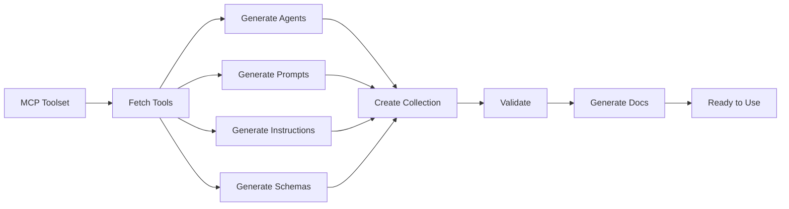

# MCP to GitHub Copilot Resources Workflow

**Complete guide for converting MCP toolsets into agents, prompts, instructions, and tools**

## Overview

This workflow shows how to use our tooling to transform MCP awesome-copilot toolsets into GitHub Copilot resources.



## Prerequisites

1. **Python 3.12+** with dependencies:
   ```bash
   pip install pyyaml
   ```

2. **Node.js 22+** for TypeScript/JavaScript tools:
   ```bash
   npm install
   ```

3. **MCP Server** running (optional for live data):
   ```bash
   npm run dev:mcp
   ```

## Quick Start

### Option 1: Automated Conversion (All-in-One)

```bash
# Convert entire toolset to all resource types
python agent-library/scripts/mcp_to_copilot_resources.py github-pull-request --all

# Or with specific options
python agent-library/scripts/mcp_to_copilot_resources.py github2 \
    --agents \
    --prompts \
    --instructions \
    --schemas \
    --collection \
    --collection-name "github-toolkit"
```

### Option 2: Step-by-Step Manual Process

Follow the detailed steps below for full control.

---

## Detailed Workflow

### Step 1: Fetch MCP Toolset Data

#### Using MCP Tool (Recommended)

```typescript
// In VS Code Copilot Chat or agent
const toolsetData = await mcp_awesome_copil_get_toolset_tools({
  toolset_name: "github-pull-request"
});

// Save the output to a file
fs.writeFileSync(
  'toolset-data.json',
  JSON.stringify(toolsetData, null, 2)
);
```

#### Using MCP List Collections

```typescript
// First, explore available toolsets
const collections = await mcp_awesome_copil_list_collections();
console.log("Available toolsets:", collections);

// Then fetch specific toolset
const tools = await mcp_awesome_copil_get_toolset_tools({
  toolset_name: "github2"
});
```

#### Using Python Script

```python
# agent-library/scripts/fetch_mcp_toolset.py
from typing import Dict, Any
import json

def fetch_toolset_via_mcp(toolset_name: str) -> Dict[str, Any]:
    """
    Fetch toolset using MCP awesome-copilot integration.
    
    In practice, this would call the actual MCP tool.
    For testing, we use mock data.
    """
    # TODO: Integrate with actual MCP tool call
    # result = mcp_awesome_copil_get_toolset_tools(toolset_name)
    
    # Mock structure for demonstration
    return {
        "toolset": toolset_name,
        "tools": [
            {
                "name": "create_issue",
                "description": "Create a new GitHub issue",
                "parameters": {
                    "type": "object",
                    "properties": {
                        "title": {"type": "string", "description": "Issue title"},
                        "body": {"type": "string", "description": "Issue body"}
                    },
                    "required": ["title"]
                }
            }
        ]
    }

if __name__ == "__main__":
    import sys
    toolset = sys.argv[1] if len(sys.argv) > 1 else "github-pull-request"
    data = fetch_toolset_via_mcp(toolset)
    
    output_file = f"agent-library/data/{toolset}-tools.json"
    Path(output_file).parent.mkdir(exist_ok=True)
    Path(output_file).write_text(json.dumps(data, indent=2))
    print(f"✓ Saved to {output_file}")
```

---

### Step 2: Generate Agents

**Create agent files for each tool in the toolset.**

#### Using Automated Converter

```bash
python agent-library/scripts/mcp_to_copilot_resources.py github-pull-request --agents
```

#### Manual Creation with Template

```bash
# Use the interactive creator
node agent-library/eng/create-agent.mjs mcp-github-create-issue

# Or manually create following the template
```

**Agent Template Structure:**

```markdown
---
agent: mcp-github-create-issue
name: GitHub Create Issue Agent
description: |-
  Agent for creating GitHub issues using MCP toolset

tools: ["mcp_awesome-copil_get_toolset_tools"]
tags:
  - github
  - issues
  - mcp
---

# GitHub Create Issue Agent

## Purpose

This agent wraps the `create_issue` tool from GitHub MCP toolset...

[Content auto-generated by converter]
```

**Output Location:** `agent-library/agents/mcp-{toolset}-{tool}.agent.md`

---

### Step 3: Generate Prompts

**Create prompt files for common tool operations.**

#### Using Automated Converter

```bash
python agent-library/scripts/mcp_to_copilot_resources.py github-pull-request --prompts
```

#### Manual Customization

```bash
# Edit generated prompts
code agent-library/prompts/use-github-create-issue.prompt.md
```

**Prompt Template Structure:**

```markdown
---
agent: "agent"
description: Use GitHub create_issue tool from MCP

tools: ["mcp_awesome-copil_get_toolset_tools", "edit", "search"]
tags:
  - github
  - mcp
---

# Use GitHub Create Issue

## Process

### 1. Gather Required Parameters
- **title**: Issue title (required)
- **body**: Issue description (optional)
- **labels**: Issue labels (optional)

### 2. Execute Tool
[Tool execution instructions]

### 3. Process Results
[Result handling]

## Use Cases
[Use case examples]
```

**Output Location:** `agent-library/prompts/use-{toolset}-{tool}.prompt.md`

---

### Step 4: Generate Instructions

**Create instructions files for IDE integration.**

#### Using Automated Converter

```bash
python agent-library/scripts/mcp_to_copilot_resources.py github-pull-request --instructions
```

**Instructions Template Structure:**

```markdown
---
description: Instructions for GitHub MCP toolset
applyTo: "**/*.ts, **/*.js"
tags:
  - github
  - mcp
---

# GitHub MCP Toolset Instructions

## Overview
[Toolset overview]

## Available Tools
[List of tools]

## Usage Guidelines
[Best practices and patterns]

## Integration Pattern
[Code examples]
```

**Output Location:** `agent-library/instructions/mcp-{toolset}.instructions.md`

---

### Step 5: Generate TypeScript/Zod Schemas

**Transform JSON schemas to TypeScript types and Zod validators.**

#### Using Schema Crawler

```bash
# Run the schema generation
npx tsx agent-generator/src/scripts/generate-agent-schemas.ts
```

#### Custom Schema Generation

```typescript
// agent-generator/src/scripts/generate-toolset-schemas.ts
import { generateSchemaFileStructure } from "../mcp-registry/schema-crawler.js";
import * as fs from "fs";
import * as path from "path";

interface MCPTool {
  name: string;
  inputSchema: any;
  outputSchema?: any;
}

async function generateToolsetSchemas(toolsetName: string, tools: MCPTool[]) {
  const outputDir = `agent-generator/output/schemas/${toolsetName}`;
  
  // Generate schema structure
  const fileMap = generateSchemaFileStructure(toolsetName, tools);
  
  // Write files
  fileMap.forEach((content, filePath) => {
    const fullPath = path.join(outputDir, filePath);
    fs.mkdirSync(path.dirname(fullPath), { recursive: true });
    fs.writeFileSync(fullPath, content, "utf-8");
    console.log(`✓ Generated ${filePath}`);
  });
}

// Usage
const githubTools: MCPTool[] = [
  {
    name: "create_issue",
    inputSchema: {
      type: "object",
      properties: {
        title: { type: "string" },
        body: { type: "string" }
      },
      required: ["title"]
    }
  }
];

generateToolsetSchemas("github-pull-request", githubTools);
```

**Generated Files:**
```
agent-generator/output/schemas/github-pull-request/
├── create_issue.schema.ts       # Zod schema + validator
├── list_issues.schema.ts
├── update_issue.schema.ts
├── index.ts                     # Barrel export
└── registry.ts                  # Schema registry
```

---

### Step 6: Create Collection

**Group related resources into a collection.**

#### Option A: Using Keyword Search (Recommended)

```bash
# Generate collection from keywords
python agent-library/scripts/generate_collection_from_keywords.py \
    "github pull request issues mcp" \
    --max-items 25 \
    --output mcp-github-toolkit
```

#### Option B: Using Interactive Creator

```bash
# Interactive CLI
node agent-library/eng/create-collection.mjs

# Or with arguments
node agent-library/eng/create-collection.mjs github-toolkit \
    --tags "github,mcp,automation"
```

#### Option C: Using Automated Converter

```bash
python agent-library/scripts/mcp_to_copilot_resources.py github-pull-request \
    --collection \
    --collection-name "github-pr-toolkit"
```

**Generated Files:**
- `mcp-github-toolkit.collection.yml`
- `mcp-github-toolkit.md`
- `mcp-github-toolkit.metadata.json` (if using Python generator)

---

### Step 7: Validate Everything

**Run validation to ensure spec compliance.**

```bash
# Validate collections
node agent-library/eng/validate-collections.mjs

# Validate specific collection
node agent-library/eng/validate-collections.mjs \
    agent-library/collections/mcp-github-toolkit.collection.yml

# Validate skills (if generated)
node agent-library/eng/validate-skills.mjs
```

**Expected Output:**
```
✓ Validating collections...
  ✓ mcp-github-toolkit.collection.yml: valid
  ✓ mcp-awesome-copilot.collection.yml: valid
  
✓ Validated 34 collections
  - 32 valid
  - 2 with errors (see details above)
```

---

### Step 8: Generate Documentation

**Auto-generate README files with install buttons.**

```bash
# Generate all READMEs
node agent-library/eng/update-readme.mjs

# Or generate for specific collection
node agent-library/eng/update-readme.mjs \
    agent-library/collections/mcp-github-toolkit.collection.yml
```

**Generated Files:**
- `mcp-github-toolkit.md` (updated with install buttons, tables, badges)

**Example Output:**
```markdown
# MCP GitHub Toolkit

[](vscode://extension/install/...)

## Tools (10)

| Tool | Description |
|------|-------------|
| create_issue | Create GitHub issues |
| list_prs | List pull requests |
...
```

---

## Complete Example: GitHub Toolset

Here's a complete end-to-end example:

```bash
# 1. Fetch toolset data
python agent-library/scripts/fetch_mcp_toolset.py github2

# 2. Generate all resources
python agent-library/scripts/mcp_to_copilot_resources.py github2 --all

# 3. Validate generated files
node agent-library/eng/validate-collections.mjs

# 4. Generate documentation
node agent-library/eng/update-readme.mjs

# 5. View results
ls -la agent-library/agents/mcp-github2-*
ls -la agent-library/prompts/use-github2-*
ls -la agent-library/instructions/mcp-github2.*
ls -la agent-library/collections/mcp-github2-*
```

**Expected Output Structure:**
```
agent-library/
├── agents/
│   ├── mcp-github2-create-issue.agent.md
│   ├── mcp-github2-list-prs.agent.md
│   └── mcp-github2-create-pr.agent.md
├── prompts/
│   ├── use-github2-create-issue.prompt.md
│   ├── use-github2-list-prs.prompt.md
│   └── use-github2-create-pr.prompt.md
├── instructions/
│   └── mcp-github2.instructions.md
├── collections/
│   ├── mcp-github2-toolkit.collection.yml
│   ├── mcp-github2-toolkit.md
│   └── mcp-github2-toolkit.metadata.json
└── schemas/
    └── github2/
        ├── create_issue.schema.ts
        ├── list_prs.schema.ts
        ├── index.ts
        └── registry.ts
```

---

## Tool Integration Matrix

| Tool | Purpose | Input | Output |
|------|---------|-------|--------|
| `mcp_awesome_copil_get_toolset_tools` | Fetch MCP tools | toolset_name | Tool definitions |
| `mcp_to_copilot_resources.py` | Convert toolset | toolset_name + flags | Agents, prompts, instructions |
| `generate_collection_from_keywords.py` | Create collection | keywords | Collection files |
| `generate-agent-schemas.ts` | Generate schemas | JSON Schema | Zod + TypeScript |
| `validate-collections.mjs` | Validate | .collection.yml | Validation report |
| `update-readme.mjs` | Generate docs | .collection.yml | README with badges |

---

## Advanced Workflows

### Workflow 1: Custom Agent Development

```bash
# 1. Fetch toolset
python agent-library/scripts/fetch_mcp_toolset.py my-toolset

# 2. Generate base resources
python agent-library/scripts/mcp_to_copilot_resources.py my-toolset \
    --agents --prompts

# 3. Manually customize agents
code agent-library/agents/mcp-my-toolset-*

# 4. Create custom collection
python agent-library/scripts/generate_collection_from_keywords.py \
    "my-toolset custom workflow" \
    --output my-custom-collection

# 5. Validate
node agent-library/eng/validate-collections.mjs
```

### Workflow 2: Multi-Toolset Collection

```bash
# Generate resources for multiple toolsets
for toolset in github2 gitkraken memory; do
    python agent-library/scripts/mcp_to_copilot_resources.py $toolset --all
done

# Create unified collection
python agent-library/scripts/generate_collection_from_keywords.py \
    "github git memory knowledge-graph mcp" \
    --max-items 50 \
    --output developer-toolkit

# Validate and document
node agent-library/eng/validate-collections.mjs
node agent-library/eng/update-readme.mjs
```

### Workflow 3: Testing New MCP Server

```bash
# 1. Start development MCP server
npm run dev:mcp

# 2. Test toolset availability
node -e "
  const { mcp_awesome_copil_list_collections } = require('./mcp-client');
  mcp_awesome_copil_list_collections().then(console.log);
"

# 3. Generate resources for testing
python agent-library/scripts/mcp_to_copilot_resources.py test-toolset --all

# 4. Run integration tests
pytest agent/tests/test_integration_mcp_collection.py -v
```

---

## Best Practices

### 1. Naming Conventions

- **Agents**: `mcp-{toolset}-{tool}.agent.md`
- **Prompts**: `use-{toolset}-{tool}.prompt.md`
- **Instructions**: `mcp-{toolset}.instructions.md`
- **Collections**: `mcp-{toolset}-toolkit.collection.yml`

### 2. File Organization

```
agent-library/
├── agents/          # One agent per tool
├── prompts/         # One prompt per tool/workflow
├── instructions/    # One instruction file per toolset
├── collections/     # Collections grouping related resources
├── schemas/         # TypeScript/Zod schemas per toolset
└── scripts/         # Generation and conversion scripts
```

### 3. Version Control

```bash
# Commit generated files together
git add agent-library/
git commit -m "Add GitHub MCP toolset resources

- Generated 15 agents
- Generated 15 prompts
- Generated instructions
- Created collection with 30 items
- Generated TypeScript schemas"
```

### 4. Documentation

Always update documentation when generating new resources:

1. Update collection README
2. Add usage examples
3. Document dependencies
4. Note any manual customizations

---

## Troubleshooting

### Issue: MCP Tool Not Found

```bash
# Check available toolsets
node -e "require('./mcp-client').mcp_awesome_copil_list_collections().then(console.log)"

# Verify toolset name spelling
# Correct: "github-pull-request"
# Incorrect: "github_pull_request"
```

### Issue: Schema Generation Fails

```bash
# Check JSON Schema validity
node -e "
  const schema = require('./toolset-data.json');
  console.log(JSON.stringify(schema, null, 2));
"

# Validate schema structure
npx ajv validate -s schema.json -d data.json
```

### Issue: Collection Validation Errors

```bash
# Run validation with verbose output
node agent-library/eng/validate-collections.mjs --verbose

# Check for common issues:
# - Missing required fields
# - Invalid file paths
# - Malformed YAML
```

### Issue: Python/JavaScript Integration

```bash
# Ensure both environments work
python --version  # 3.12+
node --version    # v22+

# Test Python tools
python agent-library/scripts/generate_collection_from_keywords.py --help

# Test JavaScript tools
node agent-library/eng/validate-collections.mjs --help
```

---

## Next Steps

1. **Explore Generated Resources**
   - Review agents, prompts, instructions
   - Customize templates as needed
   - Test in GitHub Copilot

2. **Integrate with Workflows**
   - Use agents in VS Code Copilot Chat
   - Apply instructions automatically
   - Share collections with team

3. **Contribute Back**
   - Submit collections to awesome-copilot
   - Share custom agents
   - Document best practices

4. **Automate Further**
   - Create CI/CD pipelines
   - Auto-update on MCP changes
   - Monitor usage and effectiveness

---

## Resources

- **MCP Registry**: https://github.com/github/awesome-copilot
- **Agent Skills Spec**: https://agentskills.io/specification
- **GitHub Copilot Collections**: https://docs.github.com/copilot/collections
- **Project Documentation**: See `agent-library/README.md`

---

**Questions or issues?** Check the troubleshooting section or open an issue in the repository.
