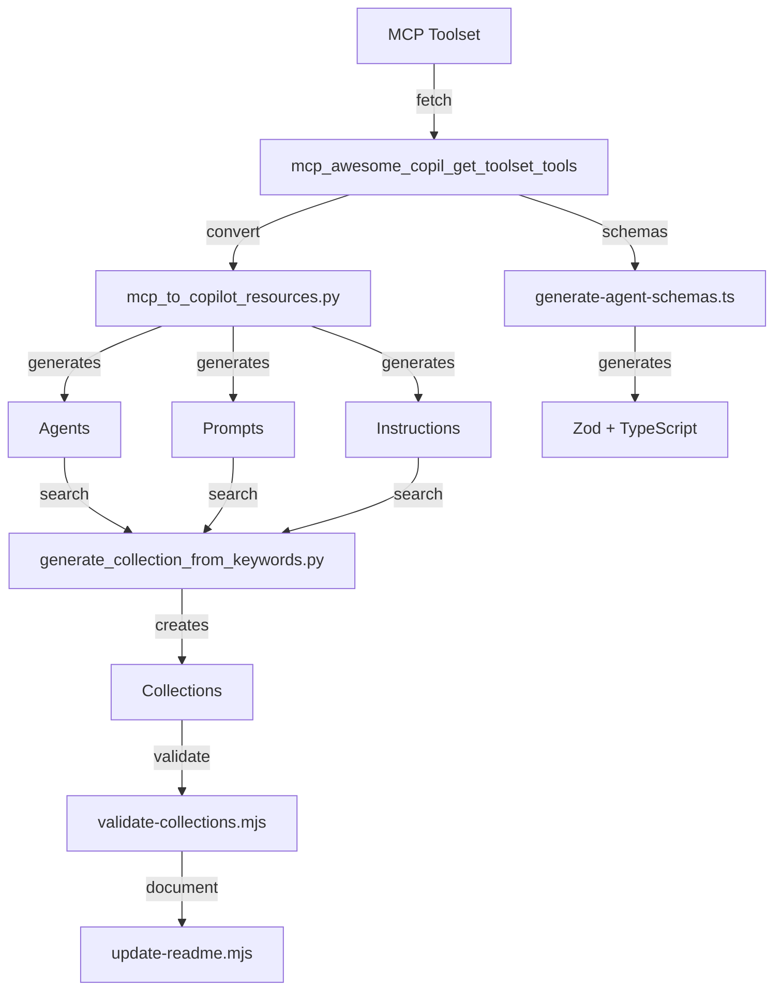

# Quick Reference: MCP to Copilot Resources

**Fast reference for converting MCP toolsets to GitHub Copilot resources**

## One-Liners

```bash
# Convert entire toolset (all resource types)
python agent-library/scripts/mcp_to_copilot_resources.py <toolset-name> --all

# Just agents
python agent-library/scripts/mcp_to_copilot_resources.py <toolset-name> --agents

# Just prompts
python agent-library/scripts/mcp_to_copilot_resources.py <toolset-name> --prompts

# Agents + Prompts + Collection
python agent-library/scripts/mcp_to_copilot_resources.py <toolset-name> --agents --prompts --collection

# Generate collection from keywords
python agent-library/scripts/generate_collection_from_keywords.py "keywords here" --output collection-name

# Validate everything
node agent-library/eng/validate-collections.mjs

# Generate docs
node agent-library/eng/update-readme.mjs

# Generate TypeScript schemas
npx tsx agent-generator/src/scripts/generate-agent-schemas.ts
```

## Tool Chain



## File Structure

```
agent-library/
├── agents/
│   └── mcp-{toolset}-{tool}.agent.md          # One per tool
├── prompts/
│   └── use-{toolset}-{tool}.prompt.md         # One per tool
├── instructions/
│   └── mcp-{toolset}.instructions.md          # One per toolset
├── collections/
│   ├── mcp-{toolset}-toolkit.collection.yml   # YAML config
│   ├── mcp-{toolset}-toolkit.md               # Documentation
│   └── mcp-{toolset}-toolkit.metadata.json    # Generation metadata
└── schemas/
    └── {toolset}/
        ├── {tool}.schema.ts                   # Zod schema
        ├── index.ts                           # Barrel export
        └── registry.ts                        # Schema registry
```

## Templates

### Agent Template

```markdown
---
agent: mcp-toolset-tool-name
name: Tool Name Agent
description: |-
  Agent description

tools: ["mcp_awesome-copil_get_toolset_tools"]
tags: [mcp, toolset, automation]
---

# Tool Name Agent

## Purpose

[What this agent does]

## Capabilities

[List capabilities]

## Usage

[Usage examples]
```

### Prompt Template

```markdown
---
agent: "agent"
description: Use tool from toolset

tools: ["mcp_awesome-copil_get_toolset_tools", "edit"]
tags: [mcp, toolset]
---

# Use Tool Name

## Process

1. Gather parameters
2. Execute tool
3. Process results

## Use Cases

[Use case examples]
```

### Instructions Template

```markdown
---
description: Instructions for toolset
applyTo: "**/*.ts, **/*.js"
tags: [mcp, toolset]
---

# Toolset Instructions

## Overview

[Toolset overview]

## Available Tools

[Tool list]

## Best Practices

[Best practices]
```

### Collection Template

```yaml
id: mcp-toolset-name
name: Toolset Name
description: Collection for toolset
tags: [mcp, toolset, automation]
items:
  - path: agents/mcp-toolset-tool.agent.md
    kind: agent
  - path: prompts/use-toolset-tool.prompt.md
    kind: prompt
display:
  ordering: manual
  show_badge: true
```

## Common Commands

### Fetch MCP Data

```bash
# List available toolsets
mcp_awesome_copil_list_collections

# Get tools from toolset
mcp_awesome_copil_get_toolset_tools --toolset-name github2
```

### Generate Resources

```bash
# Agents only
python agent-library/scripts/mcp_to_copilot_resources.py github2 --agents

# Prompts only
python agent-library/scripts/mcp_to_copilot_resources.py github2 --prompts

# Instructions only
python agent-library/scripts/mcp_to_copilot_resources.py github2 --instructions

# Everything
python agent-library/scripts/mcp_to_copilot_resources.py github2 --all
```

### Create Collections

```bash
# From keywords (automatically finds matching files)
python agent-library/scripts/generate_collection_from_keywords.py \
    "github pull request" \
    --output github-pr-toolkit

# Interactive
node agent-library/eng/create-collection.mjs

# With parameters
node agent-library/eng/create-collection.mjs my-collection \
    --tags "tag1,tag2,tag3"
```

### Validation

```bash
# Validate all collections
node agent-library/eng/validate-collections.mjs

# Validate specific file
node agent-library/eng/validate-collections.mjs collections/my-collection.collection.yml

# Validate with verbose output
node agent-library/eng/validate-collections.mjs --verbose

# Validate skills
node agent-library/eng/validate-skills.mjs
```

### Documentation Generation

```bash
# Generate all READMEs
node agent-library/eng/update-readme.mjs

# Generate for specific collection
node agent-library/eng/update-readme.mjs collections/my-collection.collection.yml

# With verbose output
node agent-library/eng/update-readme.mjs --verbose
```

### Schema Generation

```bash
# Generate Zod schemas from JSON schemas
npx tsx agent-generator/src/scripts/generate-agent-schemas.ts

# Or use the schema crawler directly
npx tsx agent-generator/src/mcp-registry/schema-crawler.ts
```

## Integration Patterns

### Pattern 1: Full Automation

```bash
#!/bin/bash
TOOLSET=$1

# Generate everything
python agent-library/scripts/mcp_to_copilot_resources.py $TOOLSET --all

# Validate
node agent-library/eng/validate-collections.mjs

# Generate docs
node agent-library/eng/update-readme.mjs

echo "✓ Complete: $TOOLSET converted to Copilot resources"
```

### Pattern 2: Selective Generation

```bash
#!/bin/bash
TOOLSET=$1

# Generate only agents and prompts
python agent-library/scripts/mcp_to_copilot_resources.py $TOOLSET --agents --prompts

# Create collection manually
python agent-library/scripts/generate_collection_from_keywords.py \
    "mcp $TOOLSET automation" \
    --output "mcp-$TOOLSET-toolkit"

# Validate
node agent-library/eng/validate-collections.mjs
```

### Pattern 3: Custom Workflow

```bash
#!/bin/bash
TOOLSET=$1
KEYWORDS=$2

# Generate base resources
python agent-library/scripts/mcp_to_copilot_resources.py $TOOLSET --agents --prompts --instructions

# Generate custom collection with specific keywords
python agent-library/scripts/generate_collection_from_keywords.py \
    "$KEYWORDS" \
    --output "$TOOLSET-custom" \
    --max-items 30

# Validate and document
node agent-library/eng/validate-collections.mjs
node agent-library/eng/update-readme.mjs
```

## Examples

### Example 1: GitHub Toolset

```bash
# Generate all resources for GitHub toolset
python agent-library/scripts/mcp_to_copilot_resources.py github2 --all

# Output:
# ✓ agents/mcp-github2-create-issue.agent.md
# ✓ agents/mcp-github2-list-prs.agent.md
# ✓ agents/mcp-github2-create-pr.agent.md
# ✓ prompts/use-github2-create-issue.prompt.md
# ✓ prompts/use-github2-list-prs.prompt.md
# ✓ prompts/use-github2-create-pr.prompt.md
# ✓ instructions/mcp-github2.instructions.md
# ✓ collections/mcp-github2-toolkit.collection.yml
# ✓ schemas/github2/create_issue.schema.ts
# ✓ schemas/github2/list_prs.schema.ts
```

### Example 2: Memory Toolset

```bash
# Generate resources with custom collection name
python agent-library/scripts/mcp_to_copilot_resources.py memory \
    --agents \
    --prompts \
    --collection \
    --collection-name "knowledge-graph-toolkit"

# Output:
# ✓ agents/mcp-memory-create-entities.agent.md
# ✓ agents/mcp-memory-create-relations.agent.md
# ✓ prompts/use-memory-create-entities.prompt.md
# ✓ collections/knowledge-graph-toolkit.collection.yml
```

### Example 3: Custom Keywords Collection

```bash
# Create collection from keywords
python agent-library/scripts/generate_collection_from_keywords.py \
    "testing automation tdd unit integration" \
    --max-items 25 \
    --output testing-automation-suite

# Output:
# ✓ collections/testing-automation-suite.collection.yml
# ✓ collections/testing-automation-suite.md
# ✓ collections/testing-automation-suite.metadata.json
```

## Validation Checklist

- [ ] All agent files have valid frontmatter
- [ ] All prompt files have valid frontmatter
- [ ] Instructions file has valid frontmatter and applyTo patterns
- [ ] Collection YAML has all required fields (id, name, description, items)
- [ ] All item paths in collection exist
- [ ] All tags are lowercase
- [ ] No duplicate IDs
- [ ] Generated metadata is valid JSON
- [ ] README files generated successfully

## Quick Troubleshooting

### MCP tool not found

```bash
# Check available toolsets
mcp_awesome_copil_list_collections

# Verify spelling
python agent-library/scripts/mcp_to_copilot_resources.py --help
```

### Collection validation fails

```bash
# Check specific error
node agent-library/eng/validate-collections.mjs --verbose

# Common issues:
# - Missing required fields
# - Invalid file paths
# - Malformed YAML
```

### Schema generation fails

```bash
# Verify JSON schema structure
cat agent-library/data/toolset-tools.json | python -m json.tool

# Check TypeScript/Node version
node --version  # Should be v22+
npx tsx --version
```

### Python/JavaScript integration issues

```bash
# Test Python scripts
python --version  # 3.12+
python agent-library/scripts/mcp_to_copilot_resources.py --help

# Test JavaScript tools
node --version  # v22+
node agent-library/eng/validate-collections.mjs --help
```

## Environment Setup

```bash
# Python dependencies
pip install pyyaml

# Node dependencies
npm install

# Verify setup
python --version
node --version
npm --version

# Test tools
python agent-library/scripts/generate_collection_from_keywords.py --help
node agent-library/eng/validate-collections.mjs --help
npx tsx agent-generator/src/scripts/generate-agent-schemas.ts --help
```

## Next Steps

1. Read [MCP_TO_COPILOT_WORKFLOW.md](./MCP_TO_COPILOT_WORKFLOW.md) for detailed guide
2. Try examples with your own toolsets
3. Customize templates as needed
4. Share collections with team
5. Contribute back to awesome-copilot

---

**Quick Links:**

- [Full Workflow Guide](./MCP_TO_COPILOT_WORKFLOW.md)
- [Collection Generator Prompt](./prompts/generate-collection-from-keywords.prompt.md)
- [Schema Crawler](../agent-generator/src/mcp-registry/schema-crawler.ts)
- [MCP Registry](https://github.com/github/awesome-copilot)
