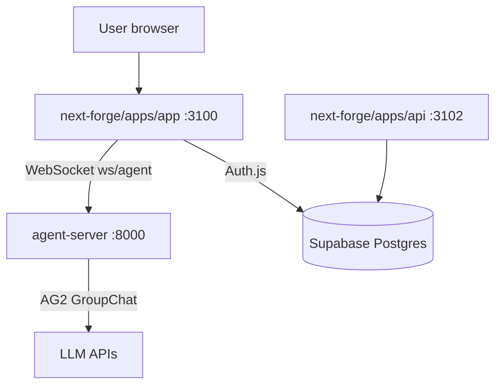

# Architecture — Monorepo_ModMe

Product-level architecture for the **federated dual-monorepo**. Detailed stack evidence lives in [`docs/codebase/ARCHITECTURE.md`](codebase/ARCHITECTURE.md). C4 views: [`C4-Documentation/`](../../C4-Documentation/).

## System identity

ModMe is a **Generative UI consulting platform**: next-forge delivers the primary SaaS product; GenerativeUI **agent-server** is the Python WebSocket satellite for multi-agent orchestration. Root `src/`/`agent/` is **legacy/deprecated**.

## Context load order

1. [`AGENTS.md`](../AGENTS.md)
2. [`docs/ECL.md`](ECL.md)
3. Active harness change (if any)
4. This file + C4 docs
5. [`docs/codebase/`](codebase/)

## High-level diagram

## Layer responsibilities

| Layer | Location | Responsibility |
|-------|----------|------------------|
| Product UI | `next-forge/apps/app` | SaaS, Generative UI client island |
| Marketing | `next-forge/apps/web` | Public site |
| API / webhooks | `next-forge/apps/api` | Cron, health, integrations |
| Contracts | `next-forge/packages/schemas` | Zod + golden JSON (WS message types) |
| Agent runtime | `GenerativeUI_monorepo/apps/agent-server` | FastAPI, hexagonal ports/adapters |
| Orchestration | Root `scripts/`, `harness/` | CI, worktrees, ECL, intake |
| Legacy | `src/`, `agent/` | **Deprecated** — no new features |

## Integration boundaries

- **Allowed:** HTTP, WebSocket, duplicated schema fixtures
- **Forbidden:** `workspace:*` or relative imports across monorepos
- **Contract:** `WebSocketMessage` types in `@repo/schemas` ↔ Pydantic mirror

## Key flows

### Generative UI session

1. User opens generative-ui route in next-forge app
2. Client hook connects to `ws://localhost:8000/ws/agent`
3. agent-server runs AG2 GroupChat, emits `state_update`, `token`, `tool_*`, `done`
4. Client validates payloads against Zod schemas and renders canvas components

### Intake / knowledge

1. Inbox drop in `GenerativeUI_monorepo/docs/inbox/`
2. Root `yarn intake` → Supabase pgvector + optional GreptimeDB code index
3. Promote to knowledge base per `docs/inbox-pipeline/README.md`

## Evidence

- [`C4-Documentation/c4-context.md`](../C4-Documentation/c4-context.md)
- [`C4-Documentation/c4-container.md`](../C4-Documentation/c4-container.md)
- [`docs/codebase/ARCHITECTURE.md`](codebase/ARCHITECTURE.md)
- [`harness/config/environment.json`](../harness/config/environment.json)
- [`.cursor/rules/monorepo-boundaries.mdc`](../.cursor/rules/monorepo-boundaries.mdc)
