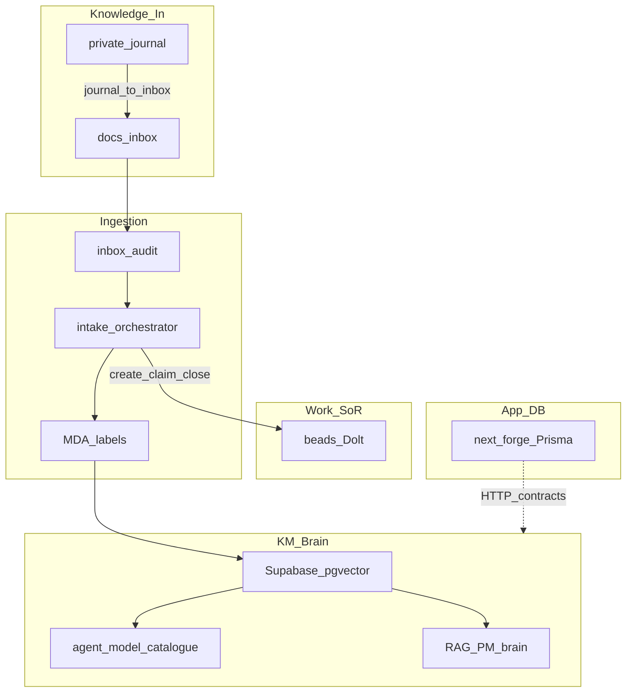

# Knowledge Management System

ModMe knowledge management follows **Inbox + beads → classify/label → KM database → catalogue / RAG brain**.

> **Work SoR:** [beads](beads-workflow.md) (`bd`, prefix `modme`)  
> **Knowledge SoR:** [inbox pipeline](inbox-pipeline/README.md) (contract ADR-0009)  
> **Product data:** next-forge Prisma/Supabase — isolated ([monorepo-boundaries](../.cursor/rules/monorepo-boundaries.mdc))

## Architecture


```mermaid
flowchart TB
  subgraph work [Work_SoR]
    BD[beads_Dolt]
  end
  subgraph knowledge_in [Knowledge_In]
    INBOX[docs_inbox]
    JOURNAL[private_journal]
  end
  subgraph ingest [Ingestion]
    AUDIT[inbox_audit]
    ORCH[intake_orchestrator]
    MDA[MDA_labels]
  end
  subgraph brain [KM_Brain]
    PG[Supabase_pgvector]
    CAT[agent_model_catalogue]
    RAG[RAG_PM_brain]
  end
  subgraph app [App_DB]
    NF[next_forge_Prisma]
  end
  INBOX --> AUDIT
  JOURNAL -->|journal_to_inbox| INBOX
  AUDIT --> ORCH
  ORCH -->|create_claim_close| BD
  ORCH --> MDA
  MDA --> PG
  PG --> CAT
  PG --> RAG
  NF -.->|HTTP_contracts| brain
```

## Components

### 1. Inbox funnel

- **Path:** `GenerativeUI_monorepo/docs/inbox/`
- **Contract:** `docs/inbox-pipeline/contracts/inbox-contract.v1.json`
- **Quality:** `yarn inbox:audit`, `yarn inbox:fix`, `yarn inbox:test`
- **C4 tags:** `c4_container` per [ADR-0014](adr/0014-km-c4-ownership-taxonomy.md)

### 2. Beads (work tracking)

- Unified adapter: `scripts/lib/beads-hooks.mjs`
- Intake/scrape/session lifecycle: create → claim → close (or blocked)
- `BEADS_DISABLED=1` for CI/dry-run
- Metrics emitted to `docs/inbox-pipeline/reports/km-metrics-latest.json`

### 3. Intake orchestrator

- `scripts/intake-orchestrator.mjs` — audit, ingest, embed, MDA
- `yarn intake:orchestrate` — full pipeline
- Links pipeline runs to beads issue IDs (`intake_run_link` metric)

### 4. KM brain (backend)

- Supabase pgvector for inbox/knowledge embeddings
- GreptimeDB for code/AST index (dual-store per ADR-0010)
- Catalogue + RAG surfaces consume promoted knowledge — not workspace-linked to next-forge

### 5. Journal promotion

Private journal MCP exports promote via:

```powershell
node scripts/journal-to-inbox.mjs --dry-run
node scripts/journal-to-inbox.mjs
yarn inbox:audit --lens funnel
```

No dual-write of embeddings from journal — intake owns embed.

## Router layering

Three routers, three jobs ([ADR-0015](adr/0015-router-layering-km-polis-genui.md)):

| Router               | Role                              |
| -------------------- | --------------------------------- |
| Polis citizens       | CI/devops/session routing         |
| Inbox MDA            | Knowledge classification          |
| GenUI `agent/routes` | Utterance intent (legacy, frozen) |

## Agent capture protocol

Drop notes in inbox with minimum frontmatter (see [AGENTS.md](../AGENTS.md) Inbox Capture Protocol). Filename: `YYYY-MM-DDTHH-MM-SS_{type}_{agent-role}_{slug}.md`

## Observability (v1)

| Metric               | Source                                       |
| -------------------- | -------------------------------------------- |
| `capture_compliance` | `inbox-audit` per-file valid/invalid         |
| `beads_lifecycle`    | `beads-hooks` create/claim/close/blocked     |
| `intake_run_link`    | pipeline run ↔ beads id                      |
| `doc_freshness`      | KM entry point rewrite dates in metrics JSON |

See [OBSERVABILITY-AGENTS.md](evaluation/OBSERVABILITY-AGENTS.md#km-pipeline-metrics-v1).

## Yarn scripts (root)

| Script                    | Purpose                          |
| ------------------------- | -------------------------------- |
| `yarn inbox:audit`        | Contract audit                   |
| `yarn inbox:test`         | Vitest including km-pipeline e2e |
| `yarn intake`             | Ingest                           |
| `yarn intake:orchestrate` | Full pipeline                    |
| `yarn intake:dry-run`     | Dry-run intake                   |
| `yarn beads:ready`        | Unblocked beads work             |

## Legacy: GenUI toolset KM (quarantined)

The following is **GenerativeUI-only** legacy — not the monorepo KM path:

| Artifact                         | Status                  |
| -------------------------------- | ----------------------- |
| `agent/toolsets.json`            | Canvas toolset registry |
| `agent/toolset-schema.json`      | JSON schema             |
| `scripts/knowledge-management/*` | ripgrep sync, diagrams  |
| `npm run docs:*`                 | Toolset doc generation  |

For new monorepo knowledge, use inbox + intake. Migrate toolset-specific docs only when touching GenerativeUI canvas features.

## References

- [KNOWLEDGE_QUICKSTART.md](KNOWLEDGE_QUICKSTART.md)
- [inbox-pipeline/README.md](inbox-pipeline/README.md)
- [beads-workflow.md](beads-workflow.md)
- [docs/adr/0014-km-c4-ownership-taxonomy.md](adr/0014-km-c4-ownership-taxonomy.md)
- [docs/adr/0015-router-layering-km-polis-genui.md](adr/0015-router-layering-km-polis-genui.md)

**Last updated:** 2026-07-11
