# Knowledge Management System

This document describes the knowledge management infrastructure for the ModifyMe GenUI project, implementing patterns inspired by **ripgrep** (fast search) and **SchemaCrawler** (templating & MCP integration).

## Table of Contents

1. [Architecture Overview](#architecture-overview)
2. [Storage Strategy](#storage-strategy)
3. [Bidirectional Synchronization](#bidirectional-synchronization)
4. [Search with Ripgrep](#search-with-ripgrep)
5. [Diagram Generation](#diagram-generation)
6. [CI/CD Integration](#cicd-integration)
7. [Developer Workflows](#developer-workflows)
8. [Schema Reference](#schema-reference)

---

## Architecture Overview

### Design Goals

1. **Hybrid Storage**: JSON as source of truth (12KB) + generated markdown for readability (45KB)
2. **Bidirectional Sync**: Maintain consistency between JSON and markdown formats
3. **Fast Search**: ripgrep with JSON output for 10-100x faster searches
4. **Visual Documentation**: Mermaid diagrams showing toolset relationships
5. **CI/CD Automation**: GitHub Actions workflows for incremental updates

### System Components

```
agent/toolsets.json              # Source of truth (validated JSON)
├── templates/*.hbs              # Handlebars templates
│   ├── toolset-single.md.hbs   # Individual toolset docs
│   └── toolset-full.md.hbs     # Full reference documentation
├── docs/toolsets/               # Generated markdown files
│   ├── ui_elements.md
│   ├── theme.md
│   └── toolset-relationships.svg
└── scripts/knowledge-management/
    ├── sync-docs.js             # Bidirectional sync script
    ├── generate-diagram.js      # Mermaid diagram generator
    ├── search-toolsets.sh       # ripgrep wrapper (Bash)
    └── search-toolsets.bat      # ripgrep wrapper (Windows)
```

---

## Storage Strategy

### JSON Format (Source of Truth)

**File**: `agent/toolsets.json`

```json
{
  "toolsets": [
    {
      "id": "ui_elements",
      "name": "UI Elements",
      "description": "Tools for manipulating UI elements on the canvas",
      "tools": ["upsert_ui_element", "remove_ui_element", "clear_canvas"],
      "metadata": {
        "status": "active",
        "category": "generative_ui",
        "version": "1.0.0",
        "authors": ["modme-team"],
        "last_modified": "2025-01-15T10:30:00Z",
        "requires": [],
        "related_toolsets": ["theme"]
      }
    }
  ]
}
```

**Advantages**:

- Validated against JSON Schema ([agent/toolset-schema.json](../agent/toolset-schema.json))
- Lightweight (12KB vs 45KB markdown)
- Machine-readable for programmatic access
- Efficient for CI/CD workflows

### Markdown Format (Human-Readable)

**Generated from JSON** using Handlebars templates.

**File**: `docs/toolsets/ui_elements.md`

```markdown
# UI Elements

**ID**: `ui_elements`  
**Status**: 🟢 Active  
**Category**: Generative UI  
**Version**: 1.0.0

## Description

Tools for manipulating UI elements on the canvas.

## Tools

- `upsert_ui_element` - Add or update UI element
- `remove_ui_element` - Remove UI element by ID
- `clear_canvas` - Clear all elements

## Related Toolsets

- [theme](theme.md)
```

**Advantages**:

- Easy to read and edit in GitHub
- Works with standard markdown tools
- Can be converted back to JSON automatically

---

## Bidirectional Synchronization

### Sync Script

**Location**: `scripts/knowledge-management/sync-docs.js`

#### Markdown → JSON

Parses markdown files using the `marked` library:

```javascript
const tokens = marked.lexer(markdownContent);
// Extract metadata from headings, lists, code blocks
// Validate against schema using Ajv
// Write to agent/toolsets.json
```

#### JSON → Markdown

Generates markdown using Handlebars templates:

```javascript
const template = Handlebars.compile(templateContent);
const markdown = template(toolsetData);
// Write to docs/toolsets/{id}.md
```

### Usage

```bash
# Validate both formats
npm run docs:sync -- --validate-only

# Convert markdown → JSON
npm run docs:md-to-json

# Convert JSON → markdown
npm run docs:json-to-md

# Full sync + diagram
npm run docs:all
```

### Schema Validation

All toolsets are validated against `agent/toolset-schema.json` using **Ajv**:

```javascript
const ajv = new Ajv({ allErrors: true });
require("ajv-formats")(ajv);
const validate = ajv.compile(schema);

if (!validate(toolsets)) {
  console.error("Validation errors:", validate.errors);
}
```

---

## Search with Ripgrep

### Why Ripgrep?

- **10-100x faster** than grep/ack/ag
- **JSON output mode** for structured results
- **Smart filtering** (.gitignore, file types)
- **CI/CD friendly** (non-interactive, stable output)

### Search Scripts

**Bash**: `scripts/knowledge-management/search-toolsets.sh`  
**Windows**: `scripts/knowledge-management/search-toolsets.bat`

### Usage

```bash
# Search for "upsert_ui_element" in Python files
./scripts/knowledge-management/search-toolsets.sh "upsert_ui_element"

# Windows
search-toolsets.bat "upsert_ui_element"

# Use npm script
npm run search:toolset "theme"
```

### Search Patterns

Searches the following directories:

- `agent/**/*.py` (Python agent code)
- `src/**/*.{ts,tsx}` (TypeScript/React frontend)
- `scripts/**/*.js` (JavaScript scripts)

### JSON Output

```bash
rg --json --glob '*.py' "upsert_ui_element" agent/ | jq -r 'select(.type=="match")'
```

Output:

```json
{
  "type": "match",
  "data": {
    "path": { "text": "agent/main.py" },
    "line_number": 25,
    "lines": {
      "text": "def upsert_ui_element(tool_context: ToolContext, id: str, type: str, props: Dict[str, Any]):"
    }
  }
}
```

---

## Diagram Generation

### Mermaid Diagrams

**Script**: `scripts/knowledge-management/generate-diagram.js`

Generates visual representations of toolset relationships:

```mermaid
graph TD
    ui_elements[UI Elements<br/>🟢 Active]
    theme[Theme<br/>🟢 Active]
    deprecated_set[Old Toolset<br/>🔴 Deprecated]

    ui_elements -->|requires| theme
    deprecated_set -.->|superseded_by| ui_elements
    ui_elements -.->|related| theme

    style ui_elements fill:#4ade80,stroke:#16a34a,color:#000
    style theme fill:#4ade80,stroke:#16a34a,color:#000
    style deprecated_set fill:#ef4444,stroke:#dc2626,stroke-dasharray: 5 5,color:#fff
```



### Node Styling

- **Active**: Green (`#4ade80`)
- **Deprecated**: Red dashed border (`#ef4444`)
- **Experimental**: Yellow (`#facc15`)
- **Beta**: Orange (`#fb923c`)

### Edge Types

- **Solid arrows**: Dependencies (`requires`)
- **Dashed lines**: Related toolsets (`related`)
- **Dotted arrows**: Deprecation (`superseded_by`)

### Output Formats

```bash
# Generate .mmd file
node scripts/knowledge-management/generate-diagram.js --format mmd

# Generate SVG (default)
npm run docs:diagram:svg

# Generate PNG
node scripts/knowledge-management/generate-diagram.js --format png

# Generate PDF
node scripts/knowledge-management/generate-diagram.js --format pdf
```

### Statistics

The script also prints toolset statistics:

```
📊 Toolset Statistics:
━━━━━━━━━━━━━━━━━━━━━━━━━━━━━━━━━━━━━━━━━
  Total Toolsets:    12
  Active:            10
  Deprecated:        2
  Experimental:      0
  Beta:              0

📂 By Category:
  generative_ui:     5
  frontend:          3
  backend:           2
  system:            2

🔧 Tools:            47
🔗 Dependencies:     8
```

---

## CI/CD Integration

### Workflow 1: Sync Documentation

**File**: `.github/workflows/sync-docs.yml`

**Triggers**:

- Push to `docs/toolsets/**/*.md` → Sync markdown → JSON
- Push to `agent/toolsets.json` → Sync JSON → markdown
- Manual dispatch (workflow_dispatch)

**Jobs**:

1. **Validate**: Run Ajv validation on both formats
2. **Sync MD → JSON**: Convert markdown to JSON (if markdown changed)
3. **Sync JSON → MD**: Convert JSON to markdown (if JSON changed)
4. **Generate Diagram**: Create SVG diagram

**Auto-commit**: Commits changes with `[skip ci]` to prevent infinite loops.

### Workflow 2: Incremental Documentation

**File**: `.github/workflows/toolset-docs-incremental.yml`

**Triggers**:

- Pull requests modifying `agent/**/*.py`, `src/**/*.{ts,tsx}`, `scripts/**/*.{js,sh}`
- Manual dispatch

**Jobs**:

1. **Detect Changes**: Use ripgrep to find modified toolsets
2. **Generate Docs**: Regenerate only affected toolsets
3. **Validate Docs**: Run schema validation
4. **Upload Artifacts**: Store generated docs for PR review

**Optimization**: Only regenerates docs for changed toolsets (faster CI, cleaner git history).

---

## Developer Workflows

### VS Code Tasks

**File**: `.vscode/tasks.json`

Available tasks:

1. **Search Toolsets** - Interactive ripgrep search
2. **Validate Toolsets** - Run Ajv validation
3. **Generate Documentation** - Full sync + diagram
4. **Sync Markdown to JSON** - MD → JSON conversion
5. **Sync JSON to Markdown** - JSON → MD conversion
6. **View Toolset Diagram** - Generate and open SVG

### Common Workflows

#### Adding a New Toolset

1. **Edit JSON**:

   ```bash
   code agent/toolsets.json
   # Add new toolset entry
   ```

2. **Generate Documentation**:

   ```bash
   npm run docs:json-to-md
   ```

3. **View Diagram**:

   ```bash
   npm run docs:diagram:svg
   # Open docs/toolsets/toolset-relationships.svg
   ```

4. **Commit**:

   ```bash
   git add agent/toolsets.json docs/toolsets/
   git commit -m "feat: add new_toolset"
   git push
   ```

#### Editing Markdown Documentation

1. **Edit Markdown**:

   ```bash
   code docs/toolsets/ui_elements.md
   # Make changes
   ```

2. **Sync to JSON**:

   ```bash
   npm run docs:md-to-json
   ```

3. **Validate**:

   ```bash
   npm run docs:sync -- --validate-only
   ```

4. **Commit**:

   ```bash
   git add agent/toolsets.json docs/toolsets/ui_elements.md
   git commit -m "docs: update ui_elements toolset"
   git push
   ```

#### Searching the Codebase

```bash
# Find all references to a toolset
npm run search:toolset "ui_elements"

# Search with VS Code task (Ctrl+Shift+P → "Run Task" → "Search Toolsets")
# Enter pattern when prompted
```

---

## Schema Reference

### Toolset Schema

**File**: `agent/toolset-schema.json`

#### Required Fields

- `id` (string): Unique identifier (e.g., `ui_elements`)
- `name` (string): Display name
- `description` (string): Purpose of the toolset
- `tools` (array): List of tool function names

#### Metadata Fields

- `status`: "active" | "deprecated" | "experimental" | "beta"
- `category`: "generative_ui" | "data_analysis" | "frontend" | "backend" | "system" | "integration" | "testing" | "knowledge_management"
- `version`: Semantic versioning (e.g., "1.0.0")
- `authors`: Array of contributor names
- `last_modified`: ISO 8601 timestamp
- `created`: ISO 8601 timestamp
- `documentation_url`: Optional URL to external docs
- `related_toolsets`: Array of related toolset IDs
- `requires`: Array of dependency toolset IDs

#### Deprecation Fields

- `deprecated.deprecated_since`: When toolset was deprecated
- `deprecated.removal_date`: Planned removal (180-day grace period)
- `deprecated.superseded_by`: ID of replacement toolset
- `deprecated.reason`: Why it was deprecated
- `deprecated.migration_guide`: Path to migration guide

### Example

```json
{
  "id": "old_ui",
  "name": "Old UI Tools",
  "description": "Legacy UI manipulation tools",
  "tools": ["old_create_element"],
  "metadata": {
    "status": "deprecated",
    "category": "generative_ui",
    "version": "0.9.0",
    "deprecated": {
      "deprecated_since": "2025-01-01T00:00:00Z",
      "removal_date": "2025-06-30T00:00:00Z",
      "superseded_by": "ui_elements",
      "reason": "Replaced by unified UI elements API",
      "migration_guide": "docs/migration/old_ui_to_ui_elements.md"
    }
  }
}
```

---

## Additional Resources

- [Toolset Management](TOOLSET_MANAGEMENT.md) - Runtime toolset loading
- [Knowledge Quickstart](KNOWLEDGE_QUICKSTART.md) - Getting started guide
- [Project Overview](../Project_Overview.md) - High-level architecture
- [Contributing](../CONTRIBUTING.md) - Development guidelines

---

**Last Updated**: 2025-01-15  
**Version**: 1.0.0  
**Maintained by**: ModifyMe GenUI Team
