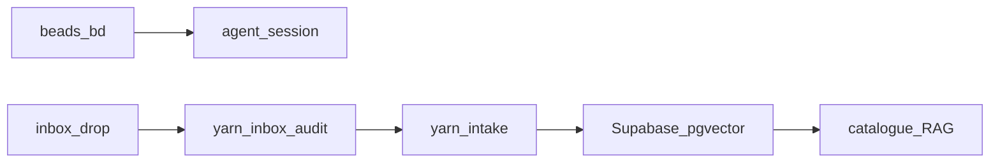

# Knowledge Management Quickstart

Canonical KM for **Monorepo_ModMe** (2026): **beads** for work, **inbox** for knowledge, **intake** for ingest → KM brain.

## Flow (5 minutes)



| Step          | Command                                          | Purpose                              |
| ------------- | ------------------------------------------------ | ------------------------------------ |
| 1. Capture    | Drop file in `GenerativeUI_monorepo/docs/inbox/` | Knowledge funnel (contract v1)       |
| 2. Track work | `yarn beads:ready` / session scripts             | Work SoR (`modme` prefix)            |
| 3. Validate   | `yarn inbox:audit`                               | Contract + manifest quality          |
| 4. Ingest     | `yarn intake` or `yarn intake:orchestrate`       | Embed + MDA + beads lifecycle        |
| 5. Query      | Supabase / catalogue / RAG APIs                  | KM brain (HTTP only from next-forge) |

## Capture an inbox drop

Create `GenerativeUI_monorepo/docs/inbox/YYYY-MM-DDTHH-MM-SS_{type}_{role}_{slug}.md`:

```yaml
---
timestamp: 2026-07-11T10:00:00Z
agent: cursor
agent_role: architect
type: architecture
severity: medium
c4_container: next-forge
tags: [supabase, adr]
branch: feature/cursor/my-task
---
```

Required: `timestamp`, `agent`, `type`. See [inbox contract](inbox-pipeline/contracts/inbox-contract.v1.json) and [ADR-0014](adr/0014-km-c4-ownership-taxonomy.md).

## Beads (work SoR)

```powershell
yarn beads:init          # once
yarn agent:session:start --% -TaskTitle "my task"
yarn intake:dry-run      # pipeline dry-run (BEADS_DISABLED ok)
yarn agent:session:finish
yarn beads:push
```

Adapter: `scripts/lib/beads-hooks.mjs` · CLI: `scripts/beads-cli.mjs` · Guide: [beads-workflow.md](beads-workflow.md)

## Intake commands

| Command                                       | Description                        |
| --------------------------------------------- | ---------------------------------- |
| `yarn inbox:audit`                            | Funnel + pipeline + manifest audit |
| `yarn inbox:fix`                              | Dry-run autofix suggestions        |
| `yarn inbox:test`                             | Vitest (contract + beads + e2e)    |
| `yarn intake`                                 | Ingest only                        |
| `yarn intake:orchestrate`                     | Audit → ingest → embed → MDA       |
| `yarn intake:dry-run`                         | No Supabase writes                 |
| `node scripts/journal-to-inbox.mjs --dry-run` | Promote private journal → inbox    |

Reports: `docs/inbox-pipeline/reports/latest.md` · Metrics: `docs/inbox-pipeline/reports/km-metrics-latest.json`

## C4 ownership

Set `c4_container` on captures:

| Value                | Scope                                |
| -------------------- | ------------------------------------ |
| `root-orchestration` | `scripts/`, root agent orchestration |
| `next-forge`         | `next-forge/**`                      |
| `generative-ui`      | `GenerativeUI_monorepo/**`           |
| `agent-stack`        | `agent/**`, agent-server             |

## SoR split (do not mix)

- **Work:** beads — not chat todos for multi-session, not `data/agent-registry.json` as SoR
- **Knowledge:** inbox → intake → pgvector / MDA
- **Product UI DB:** next-forge Prisma/Supabase — separate; HTTP/contracts only

## Deep dive

- [KNOWLEDGE_MANAGEMENT.md](KNOWLEDGE_MANAGEMENT.md) — architecture
- [inbox-pipeline/README.md](inbox-pipeline/README.md) — pipeline reference
- [ADR-0015](adr/0015-router-layering-km-polis-genui.md) — polis vs MDA vs GenUI routes

## Obsidian vault (sidecar)

Lean vault at `C:\Users\dylan\ModMe-Vault` — junctions to `inbox/`, `docs/`, `Templates/`.

```powershell
yarn obsidian:sidecar:setup -OpenVault
```

| Entry         | Path                                                           |
| ------------- | -------------------------------------------------------------- |
| Setup         | [obsidian-sidecar-setup.md](obsidian-sidecar-setup.md)         |
| A.D.A.M hub   | [adam/ADAM Index.md](adam/ADAM%20Index.md)                     |
| Dashboards    | [adam/ADAM Command Center.md](adam/ADAM%20Command%20Center.md) |
| Plugin policy | [adam/Vault Plugin Policy.md](adam/Vault%20Plugin%20Policy.md) |

---

## Legacy: GenUI toolsets (quarantined)

The sections below describe **GenerativeUI canvas toolsets** only (`agent/toolsets.json`, `scripts/knowledge-management/*`). Do **not** use for monorepo KM.

<details>
<summary>Legacy toolset workflow (GenUI only)</summary>

### Validate toolsets

```bash
cd GenerativeUI_monorepo  # or legacy package root with toolsets
npm run docs:sync -- --validate-only
```

### Search toolsets

```bash
npm run search:toolset "upsert_ui_element"
```

See [TOOLSET_MANAGEMENT.md](TOOLSET_MANAGEMENT.md) for runtime loading.

</details>

**Last updated:** 2026-07-11
