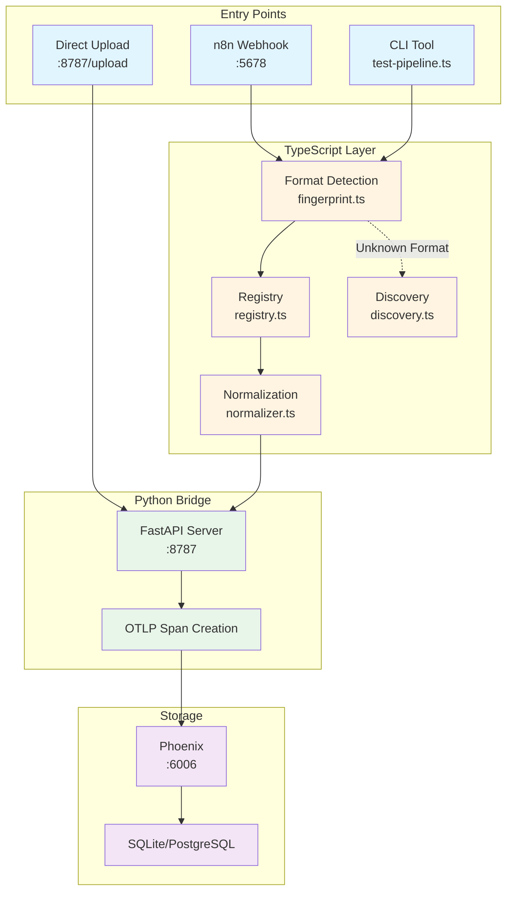
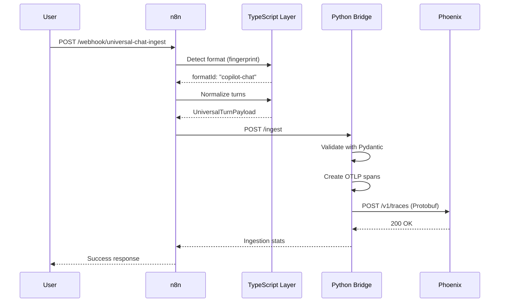

# Phoenix Universal Chat Ingestion Pipeline - Complete Guide

**Version**: 1.0
**Last Updated**: February 8, 2026
**Status**: Production Ready

## Table of Contents

1. [Overview](#overview)
2. [Architecture](#architecture)
3. [Quick Start](#quick-start)
4. [Components](#components)
5. [Data Flow](#data-flow)
6. [Extending the System](#extending-the-system)
7. [Troubleshooting](#troubleshooting)
8. [API Reference](#api-reference)

---

## Overview

### What is the Universal Chat Ingestion Pipeline?

A production-ready system for capturing AI agent conversations from any platform and storing them in Phoenix for observability, analysis, and fine-tuning dataset creation.

**Key Features:**

- ✅ **Format Detection** - Automatically identifies chat format via fingerprinting
- ✅ **Universal Normalization** - Converts any format to OpenInference standard
- ✅ **Multi-Entry Points** - n8n webhooks, CLI tools, or direct API
- ✅ **Production Ready** - Docker-based, with error handling and discovery
- ✅ **Extensible** - Add new chat formats via plugins

**Supported Formats:**

- ✅ VS Code Copilot Chat
- 🔧 Claude Desktop (via discovery)
- 🔧 Cursor AI (via discovery)
- 🔧 Windsurf IDE (via discovery)
- 📝 Custom formats (extend via TypeScript descriptors)

### Why Use This System?

**Problem**: Every AI agent platform has a different chat format:

```
Copilot: { responderUsername, requests: [...], message: "..." }
Claude:  { conversations: [{ messages: [...] }] }
Cursor:  { thread: { turns: [...] } }
```

**Solution**: Single pipeline that:

1. Detects format automatically (fingerprinting)
2. Normalizes to universal schema
3. Stores in Phoenix with OpenInference conventions
4. Makes all chats searchable/analyzable in one place

---

## Architecture

### System Overview



### Component Architecture

| Component            | Technology          | Port | Purpose                          |
| -------------------- | ------------------- | ---- | -------------------------------- |
| **n8n Workflow**     | JavaScript (Docker) | 5678 | Production webhook entry point   |
| **TypeScript Layer** | Node.js 22.9.0+     | N/A  | Format detection & normalization |
| **Python Bridge**    | FastAPI + Pydantic  | 8787 | OTLP span creation               |
| **Phoenix Server**   | Docker              | 6006 | Trace storage & UI               |

### Data Flow Diagram



---

## Quick Start

### Prerequisites

- **Node.js**: 22.9.0+
- **Python**: 3.12+
- **Docker**: For Phoenix and n8n
- **npm/pnpm**: For TypeScript dependencies

### 5-Minute Setup

**1. Start Phoenix:**

```bash
docker-compose -f docker-compose.phoenix.yml up -d
```

**2. Start n8n:**

```bash
docker-compose -f docker-compose.n8n.yml up -d
```

**3. Start Python Bridge:**

```bash
cd agent
pip install -r requirements-phoenix.txt
python observability/trace_bridge_api.py
# Bridge starts on http://localhost:8787
```

**4. Import n8n Workflow:**

```bash
# Open n8n: http://localhost:5678
# Import: agent/observability/n8n_workflow_universal_ingestion.json
# Activate the workflow
```

**5. Test with Sample:**

```bash
cd agent-generator
npx tsx src/chat-formats/test-pipeline.ts datasets/chat.json
```

**6. View in Phoenix:**

Open http://localhost:6006 and see your traces!

### Verification

```bash
# Check all services
curl http://localhost:6006  # Phoenix UI
curl http://localhost:8787/health  # Bridge
curl http://localhost:5678  # n8n

# Test n8n webhook
curl -X POST http://localhost:5678/webhook/universal-chat-ingest \
  -H "Content-Type: application/json" \
  -d @datasets/chat.json
```

---

## Components

### 1. Entry Points

#### A. n8n Webhook (Production Entry Point) ⭐

**Purpose**: Primary production endpoint for receiving chat data from any source.

**Configuration:**

- **File**: `agent/observability/n8n_workflow_universal_ingestion.json`
- **Webhook URL**: <http://localhost:5678/webhook/universal-chat-ingest>
- **Method**: POST
- **Content-Type**: application/json
- **Docker Port**: 5678 (configured in `docker-compose.n8n.yml`)

**Request Body** (flexible format):

```json
{
  "projectName": "chat-traces",
  "sourceLabel": "filename.json",
  "chatData": {
    // Any chat format - will be auto-detected
    "responderUsername": "GitHub Copilot",
    "conversationId": "abc-123",
    "requests": [...]
  }
}
```

**Response** (known format):

```json
{
  "status": "success",
  "format": "copilot-chat",
  "turns_ingested": 5,
  "project": "chat-traces"
}
```

**Response** (unknown format):

```json
{
  "status": "unknown_format",
  "discovery": {
    "suggested_filename": "unknown-my-agent-2026-02-08-a3f9e2.json",
    "top_level_schema": {...},
    "candidate_paths": ["requests", "messages"]
  }
}
```

**Example cURL:**

```bash
curl -X POST http://localhost:5678/webhook/universal-chat-ingest \
  -H "Content-Type: application/json" \
  -d @datasets/copilot-chat.json
```

#### B. CLI Test Pipeline (Development Tool)

**Purpose**: End-to-end testing of format detection and normalization without requiring n8n.

**Configuration:**

- **File**: `agent-generator/src/chat-formats/test-pipeline.ts`
- **Default Dataset**: `datasets/chat.json`

**Usage:**

```bash
cd agent-generator

# Test default dataset
npx tsx src/chat-formats/test-pipeline.ts

# Test custom file
npx tsx src/chat-formats/test-pipeline.ts ../datasets/my-chat.json

# Test with absolute path
npx tsx src/chat-formats/test-pipeline.ts /full/path/to/chat.json
```

**What It Does:**

1. Loads JSON file from filesystem
2. Detects format via fingerprinting engine
3. Normalizes to UniversalTurnPayload schema
4. Validates with Zod schemas
5. Prints diagnostic report

**Example Output:**

```plaintext
✓ Format detected: copilot-chat (confidence: exact)
✓ Normalized 5 turns
✓ Schema validation passed

UniversalTurnPayload:
  format: copilot-chat
  agent: GitHub Copilot
  project: test-project
  turns: 5

Turn 1:
  user: "How do I implement authentication?"
  assistant: "Here's a secure authentication implementation..."
  tools: 2 (search_codebase, read_file)
  model: gpt-4
```

#### C. Direct Bridge Upload (Legacy & Integration)

**Purpose**: HTTP API for direct uploads, bypassing n8n. Useful for automated scripts and integrations.

**Endpoints:**

**1. Universal Format (Recommended):**

```bash
POST http://localhost:8787/ingest
Content-Type: application/json

Body: UniversalTurnPayload
```

**2. Legacy Copilot Format:**

```bash
POST http://localhost:8787/upload
Content-Type: application/json

Body: Raw Copilot chat.json structure
```

**3. File Upload:**

```bash
POST http://localhost:8787/upload-file
Content-Type: multipart/form-data

Body: file=@chat.json
```

**Example (Universal Format):**

```bash
curl -X POST http://localhost:8787/ingest \
  -H "Content-Type: application/json" \
  -d '{
    "format": "copilot-chat",
    "projectName": "my-project",
    "source": "manual-upload",
    "turns": [
      {
        "index": 0,
        "userMessage": "Hello",
        "assistantResponse": "Hi there!",
        "model": "gpt-4"
      }
    ]
  }'
```

**Example (File Upload):**

```bash
curl -X POST http://localhost:8787/upload-file \
  -F "file=@datasets/copilot-chat.json" \
  -F "projectName=my-project"
```

---

### 2. TYPESCRIPT NORMALIZATION LAYER

**Location**: `agent-generator/src/chat-formats/`

#### **A. Format Detection (Fingerprinting)**

**File**: `agent-generator/src/chat-formats/fingerprint.ts`
**Key Functions**:

- `detectFormat(data, registry)` — Main entry point, returns `DetectionResult`
- `matchFormat(data, descriptor)` — Tests one format's fingerprint rules
- `evaluateRule(data, rule)` — Tests a single fingerprint rule
- `getByPath(obj, path)` — Path resolver (supports dot notation + array indices)
  **Fingerprint Logic**:

```typescript
// For each format descriptor (sorted by priority):
//   1. Run all fingerprint rules (path + check type)
//   2. ALL rules must pass for exact match
//   3. Return first exact match
//   4. Track best partial match for diagnostics
```

**Copilot Chat Fingerprint** (from `formats/copilot-chat.ts`):

```typescript
[
  { path: "responderUsername", check: "type_string" },
  { path: "requests", check: "type_array" },
  { path: "requests[0].message", check: "type_object" },
  { path: "requests[0].variableData", check: "type_object" },
];
```

#### **B. Registry**

**File**: `agent-generator/src/chat-formats/registry.ts`
**API Functions**:

- `initializeRegistry()` — Registers all custom extractors (MUST call first)
- `detect(data)` — Wrapper for `detectFormat()`
- `ingest(data, projectName, sourceLabel)` — Detect + normalize + discovery
- `diagnose(data)` — Generate diagnostic report for failed detection
- `listFormats()` — List registered formats
  **Current Formats**:
- `copilot-chat` (VS Code Copilot Chat) — priority 100, status: stable

#### **C. Normalization**

**File**: `agent-generator/src/chat-formats/normalizer.ts`
**Key Functions**:

- `normalize(data, descriptor, projectName)` — Main transformation
- `registerResponseAssembler(formatId, fn)` — Register custom response builder
- `registerThinkingExtractor(formatId, fn)` — Register CoT extractor
- `registerToolCallExtractor(formatId, fn)` — Register tool call parser
  **Process**:

```typescript
1. Extract turns array using descriptor.fieldMapping.turns path
2. For each turn:
   - Extract user message (required, skip if empty)
   - Extract assistant response:
     * If requiresResponseAssembly: use custom assembler
     * Else: direct path lookup
   - Extract tool calls:
     * If custom extractor registered: use it
     * Else: generic extraction from fieldMapping paths
   - Extract thinking/CoT (if extractor registered)
   - Extract tokens, model, timestamps
3. Build UniversalTurn objects
4. Validate with Zod schema
5. Return UniversalTurnPayload
```

**Copilot-Specific Extractors** (`formats/copilot-chat.ts`):

- `assembleCopilotResponse()` — Filters response[] array by kind, concatenates text
- `extractCopilotThinking()` — Pulls kind='thinking' blocks
- `extractCopilotToolCalls()` — Navigates toolCallRounds[] structure
- `extractRichTextNode()` — Recursively extracts text from {node: {children: []}} structure

#### **D. Discovery (Unknown Format Handling)**

**File**: `agent-generator/src/chat-formats/discovery.ts`
**Key Functions**:

- `generateDiscoverySample(data, diagnosticText, sourceLabel)` — Creates structural sample
- `findCandidateTurnsPath(data)` — Heuristically finds "turns" array
- `mapDeepKeys(obj, prefix, maxDepth)` — Recursively maps all paths
  **Process**:

```typescript
1. Generate top-level schema (key → type description)
2. Find candidate turns array:
   - Look for arrays with objects
   - Score by chat-related field names (message, content, role, etc.)
   - Prefer arrays named messages/requests/turns/conversation
3. Deep-sample first turn
4. Map all nested paths (up to depth 5)
5. Compute content hash for deduplication
6. Generate suggested filename: unknown-{sourceLabel}-{timestamp}-{hash}.json
7. Save to datasets/unknown-formats/
```

#### **E. Types**

**File**: `agent-generator/src/chat-formats/types.ts`
**Critical Types**:

```typescript
UniversalTurnPayload {
  format: string           // "copilot-chat"
  agent: string            // "GitHub Copilot"
  projectName: string      // Phoenix project
  sessionId?: string
  responder?: string
  turns: UniversalTurn[]
}
UniversalTurn {
  index: number
  userMessage: string
  assistantResponse: string
  model: string
  timestampMs?: number
  latencyMs?: number
  tokens?: { prompt, completion, total }
  toolCalls: ToolCall[]
  thinking?: string
  metadata: Record<string, unknown>
}
ToolCall {
  name: string
  input?: string
  output?: string
  round?: number
}
```

---

### 3. N8N WORKFLOW (UNIVERSAL INGESTION)

**File**: `agent/observability/n8n_workflow_universal_ingestion.json`
**Node Flow**:

```
1. Receive Chat JSON (webhook)
   ↓
2. Detect Agent Format (Code node)
   - Mirrors fingerprint.ts logic in JavaScript
   - Inline registry with Copilot fingerprint
   - Returns: { detected: true/false, formatId, chatData, projectName }
   ↓
3. Check Detection (IF node)
   - condition: detected === true
   ↓
4a. [SUCCESS PATH] Normalize Turns (Code node)
    - Mirrors normalizer.ts + copilot-chat.ts
    - Inline implementation of assembleCopilotResponse, extractCopilotToolCalls, etc.
    - Returns: { payload: UniversalTurnPayload, stats }
    ↓
5a. Send to Bridge (HTTP Request)
    - POST http://host.docker.internal:8787/ingest
    - Body: payload (UniversalTurnPayload as JSON)
    ↓
6a. Success Response (Respond to Webhook)
    - Returns bridge response

4b. [FAILURE PATH] Generate Discovery Sample (Code node)
    - Mirrors discovery.ts logic
    - Generates structural sample
    - Returns: { sampled: true, sample, suggestedFilename }
    ↓
5b. Error Response (Respond to Webhook)
    - Status: 422
    - Body: { status: 'unknown_format', discovery: {...} }
```

**Key Details**:

- All TypeScript logic is **mirrored as inline JavaScript** in Code nodes
- No external modules required (self-contained workflow)
- Uses `host.docker.internal:8787` to reach bridge from Docker

---

### 4. PYTHON BRIDGE

**File**: `agent/observability/trace_bridge_api.py`
**Port**: 8787 (configurable via `BRIDGE_PORT` env var)
**Endpoints**:

#### `POST /ingest` (Universal Format — Primary)

- **Input**: `UniversalTurnPayload` (Pydantic validated)
- **Process**:
  1. Validate payload against Pydantic model
  2. Initialize OTLP tracer with project name
  3. For each turn: call `_upload_universal_turn()`
  4. Flush spans to Phoenix
  5. Return stats
- **Function**: `upload_universal_turns()` → `_upload_universal_turn()`

#### `POST /upload` (Legacy Copilot Format)

- **Input**: Raw Copilot chat.json OR wrapped `{chatData: {...}}`
- **Function**: `upload_chat_data()`

#### `POST /upload-file` (Multipart File Upload)

- **Input**: Multipart form with file field
- **Function**: Reads file → `upload_chat_data()`

#### `GET /health`

- Returns `{"status": "ok"}`

#### `GET /formats`

- Lists supported formats (documentation endpoint)
  **Span Creation** (`_upload_universal_turn()`):

```python
AGENT span (root)
├─ openinference.span.kind = "AGENT"
├─ input.value = userMessage
├─ output.value = assistantResponse
├─ session.id, metadata.*, etc.
│
└─ LLM span (child)
   ├─ openinference.span.kind = "LLM"
   ├─ llm.model_name = model
   ├─ llm.token_count.* = tokens
   ├─ llm.input_messages / llm.output_messages
   │
   └─ TOOL span × N (children)
      ├─ openinference.span.kind = "TOOL"
      ├─ tool.name = toolCall.name
      ├─ input.value = toolCall.input
      └─ output.value = toolCall.output
```

**Dependencies**:

- `opentelemetry.exporter.otlp.proto.http.trace_exporter.OTLPSpanExporter` — Handles Protobuf serialization
- `openinference.semconv` — OpenInference semantic conventions
- `FastAPI` + `Pydantic` — HTTP server + validation

---

### 5. PHOENIX

**Docker Compose**: `docker-compose.phoenix.yml`
**Ports**:

- **6006**: Phoenix UI + HTTP OTLP endpoint
- **4317**: gRPC OTLP endpoint
  **OTLP Endpoint**:
- **URL**: `http://localhost:6006/v1/traces`
- **Protocol**: HTTP + Protobuf (NOT JSON)
- **Note**: Python `OTLPSpanExporter` handles Protobuf serialization automatically
  **Environment**:

```yaml
PHOENIX_PORT: 6006
PHOENIX_GRPC_PORT: 4317
PHOENIX_SQL_DATABASE_URL: sqlite:////data/phoenix.db
```

---

### 6. INFRASTRUCTURE & PORTS

**Docker Compose Files**:

- `docker-compose.n8n.yml` — n8n server + n8n-mcp
- `docker-compose.phoenix.yml` — Phoenix server
  **Port Map**:

  | Service           | Port | URL                                                   | Purpose                      |
  | ----------------- | ---- | ----------------------------------------------------- | ---------------------------- |
  | n8n               | 5678 | <http://localhost:5678>                               | n8n UI + webhooks            |
  | n8n webhook       | 5678 | <http://localhost:5678/webhook/universal-chat-ingest> | Chat ingestion               |
  | n8n-mcp           | 3000 | <http://localhost:3000>                               | MCP server (connects to n8n) |
  | Trace Bridge      | 8787 | <http://localhost:8787>                               | JSON → Protobuf bridge       |
  | Phoenix UI        | 6006 | <http://localhost:6006>                               | Phoenix web interface        |
  | Phoenix OTLP HTTP | 6006 | <http://localhost:6006/v1/traces>                     | OTLP receiver (Protobuf)     |
  | Phoenix OTLP gRPC | 4317 | grpc://localhost:4317                                 | Alternative OTLP endpoint    |

  **Docker Networking**:

- n8n → Bridge: `http://host.docker.internal:8787`
- Bridge → Phoenix: `http://localhost:6006/v1/traces` (if bridge is on host)
- Bridge → Phoenix: `http://host.docker.internal:6006/v1/traces` (if bridge is in Docker)

---

### 7. ENVIRONMENT CONFIGURATION

**Key Environment Variables**:

```bash
# Bridge (trace_bridge_api.py)
BRIDGE_PORT=8787
# Phoenix endpoints
PHOENIX_COLLECTOR_ENDPOINT=http://localhost:6006/v1/traces
PHOENIX_PROJECT_NAME=chat-traces
# n8n
N8N_API_KEY=...  # JWT token
N8N_BLOCK_ENV_ACCESS_IN_NODE=false  # Allow Code nodes to access $env
# n8n inside Docker
PHOENIX_URL=http://host.docker.internal:6006
PHOENIX_COLLECTOR_ENDPOINT=http://host.docker.internal:6006/v1/traces
```

---

### 8. DATA FLOW EXAMPLES

#### **Example 1: Copilot Chat Upload via n8n**

```
1. User posts to webhook:
   curl -X POST http://localhost:5678/webhook/universal-chat-ingest \
     -H "Content-Type: application/json" \
     -d '{"chatData": <copilot-chat.json>, "projectName": "my-project"}'
2. n8n "Detect Agent Format" runs fingerprint:
   - Checks responderUsername, requests[], message, variableData
   - Match found: formatId = "copilot-chat"
3. n8n "Normalize Turns" extracts:
   - 5 turns from requests[] array
   - Tool calls from toolCallRounds[]
   - Thinking blocks from response[kind='thinking']
   - Assembles response[] into text
   - Produces UniversalTurnPayload
4. n8n "Send to Bridge" POSTs to:
   http://host.docker.internal:8787/ingest

5. Bridge validates payload with Pydantic
6. Bridge creates OTLP spans:
   - 5 AGENT spans (one per turn)
   - 5 LLM spans (nested)
   - 12 TOOL spans (from tool calls)
7. Bridge POSTs Protobuf to:
   http://localhost:6006/v1/traces
8. Phoenix ingests traces, stores in phoenix.db
9. User views in Phoenix UI:
   http://localhost:6006
```

#### **Example 2: Unknown Format Discovery**

```
1. User posts unknown agent format to webhook
2. n8n "Detect Agent Format" runs:
   - No fingerprint match
   - Returns: { detected: false, confidence: 'partial' }
3. n8n "Generate Discovery Sample" runs:
   - Analyzes top-level structure
   - Finds candidate turns array (e.g., "messages")
   - Deep-samples first turn
   - Maps all nested paths
   - Generates: unknown-my-agent-2026-02-08-a3f9e2.json
4. n8n "Error Response" returns 422:
   {
     "status": "unknown_format",
     "discovery": {
       "sampled": true,
       "suggestedFilename": "...",
       "sample": { /* structural analysis */ }
     }
   }
5. Developer saves sample to datasets/unknown-formats/
6. AI analyzes sample offline, generates new ChatFormatDescriptor
7. Developer adds descriptor to registry.ts + formats/my-agent.ts
8. Next upload auto-detects new format
```

---

### 9. KEY FILES REFERENCE

| File                                                        | Purpose                          |
| ----------------------------------------------------------- | -------------------------------- |
| **TypeScript**                                              |                                  |
| `agent-generator/src/chat-formats/index.ts`                 | Public API exports               |
| `agent-generator/src/chat-formats/registry.ts`              | Format registry + high-level API |
| `agent-generator/src/chat-formats/fingerprint.ts`           | Detection engine                 |
| `agent-generator/src/chat-formats/normalizer.ts`            | Extraction engine                |
| `agent-generator/src/chat-formats/discovery.ts`             | Unknown format sampling          |
| `agent-generator/src/chat-formats/types.ts`                 | Type definitions + Zod schemas   |
| `agent-generator/src/chat-formats/formats/copilot-chat.ts`  | Copilot descriptor + extractors  |
| `agent-generator/src/chat-formats/test-pipeline.ts`         | CLI test harness                 |
| **Python**                                                  |                                  |
| `agent/observability/trace_bridge_api.py`                   | FastAPI bridge server            |
| `agent/observability/upload_chat_traces.py`                 | CLI uploader (Copilot-specific)  |
| `agent/observability/models.py`                             | Pydantic models                  |
| **n8n**                                                     |                                  |
| `agent/observability/n8n_workflow_universal_ingestion.json` | Universal pipeline workflow      |
| `agent/observability/n8n_workflow_chat_to_phoenix.json`     | Legacy Copilot workflow          |
| **Docker**                                                  |                                  |
| `docker-compose.n8n.yml`                                    | n8n + n8n-mcp services           |
| `docker-compose.phoenix.yml`                                | Phoenix server                   |
| **Config**                                                  |                                  |
| `.env.example`                                              | Environment variable template    |

---

### 10. TESTING & VERIFICATION

**Test Pipeline (Local)**:

```bash
# 1. Test detection + normalization
npx tsx agent-generator/src/chat-formats/test-pipeline.ts datasets/chat.json
# 2. Start bridge
python -m agent.observability.trace_bridge_api
# 3. Test bridge directly
curl -X POST http://localhost:8787/ingest \
  -H "Content-Type: application/json" \
  -d @normalized-payload.json
# 4. Start Phoenix
docker-compose -f docker-compose.phoenix.yml up -d
# 5. View traces
open http://localhost:6006
```

**n8n Workflow Test**:

```bash
# 1. Start services
docker-compose -f docker-compose.n8n.yml up -d
docker-compose -f docker-compose.phoenix.yml up -d
python -m agent.observability.trace_bridge_api
# 2. Trigger webhook
curl -X POST http://localhost:5678/webhook/universal-chat-ingest \
  -H "Content-Type: application/json" \
  -d '{"chatData": {...}, "projectName": "test"}'
# 3. Check n8n executions
open http://localhost:5678
# 4. Check Phoenix traces
open http://localhost:6006
```

---

This is the complete end-to-end map of the Universal Chat Ingestion Pipeline. The system is designed for extensibility: AI analyzes unknown chat formats offline, generates new descriptors, and the pipeline automatically handles new formats with zero runtime LLM calls.
agentId: a17fcd3 (for resuming to continue this agent's work if needed)
<usage>total_tokens: 125403
tool_uses: 21
duration_ms: 212304</usage>
Task
Find n8n workflow and docker configs
Perfect! Now I have a complete picture. Let me compile the comprehensive report.

## Search Results: n8n Workflow Pipeline & Observability Infrastructure

Show less

### 1. n8n Workflow JSON Files

**Location: `agent/observability/`**

1. **`agent/observability/n8n_workflow_chat_to_phoenix.json`**
   - Legacy workflow (simpler, Copilot-specific)
   - Webhook path: `/copilot-chat-upload`
   - Bridge endpoint: `http://host.docker.internal:8787/upload`
   - Flow: Webhook → Prepare Payload → Send to Bridge → Respond
2. **`agent/observability/n8n_workflow_universal_ingestion.json`**
   - Universal workflow (format-agnostic, production-ready)
   - Workflow ID: `dfHBSbrEHbUi4H8B`
   - Webhook path: `/universal-chat-ingest`
   - Bridge endpoint: `http://host.docker.internal:8787/ingest`
   - Features: Format detection, normalization, discovery sampling for unknown formats
   - Supports: VS Code Copilot Chat (extensible registry)
   - Flow: Webhook → Detect Format → Check → Normalize → Bridge → Success OR Discovery Sample → Error
3. **`docs/n8n-message-ingestion-workflow.json`**
   - AI message ingestion workflow (different purpose)
   - Webhook path: `/ingest-messages`
   - Python agent endpoint: `http://localhost:8000/mcp/call`
   - For multi-provider AI responses

---

### 2. Docker Compose Files

**`docker-compose.n8n.yml`**

- **n8n service:**
  - Port: `5678` (UI + webhooks)
  - Container: `n8n-local`
  - Network: `n8n_network`
  - Credentials: `admin` / `admin123`
  - Environment:
    - `PHOENIX_URL=${N8N_PHOENIX_URL:-http://host.docker.internal:6006}`
    - `PHOENIX_COLLECTOR_ENDPOINT=${N8N_PHOENIX_COLLECTOR_ENDPOINT:-http://host.docker.internal:6006/v1/traces}`
    - `N8N_BLOCK_ENV_ACCESS_IN_NODE=${N8N_BLOCK_ENV_ACCESS_IN_NODE:-false}`
  - Health check: `http://localhost:5678/healthz`
- **n8n-mcp service:**
  - Port: `3000` (MCP HTTP server)
  - Container: `n8n-mcp-local`
  - Image: `ghcr.io/czlonkowski/n8n-mcp:latest`
  - Depends on: n8n
  - Environment: - `N8N_API_URL=http://n8n:5678` - `N8N_API_KEY=${N8N_API_KEY:-}` - `AUTH_TOKEN=${N8N_MCP_AUTH_TOKEN:-}`
    **`docker-compose.phoenix.yml`**
- **phoenix service:**
  - Port: `6006` (Phoenix UI)
  - Port: `4317` (OTLP gRPC collector)
  - Container: `phoenix-server`
  - Image: `arizephoenix/phoenix:latest`
  - Network: `observability`
  - Database: SQLite at `/data/phoenix.db`
  - Health check: Python urllib test on `http://localhost:6006`
- **copilot-proxy service:**
  - Port: `8080` (Telemetry endpoint)
  - Container: `copilot-telemetry-proxy`
  - Environment:
    - `PHOENIX_COLLECTOR_ENDPOINT=http://phoenix:6006/v1/traces`
    - `PHOENIX_PROJECT_NAME=copilot-research`
  - Depends on: Phoenix
  - Volumes: `./agent:/app/agent:ro`, `./datasets:/app/datasets`

---

### 3. Environment Configuration

**`.env` (actual values):**

```bash
PHOENIX_ENDPOINT=http://localhost:6006
PHOENIX_COLLECTOR_ENDPOINT=http://localhost:6006/v1/traces
PHOENIX_PROJECT=copilot-research
ENABLE_PHOENIX=true
N8N_PHOENIX_URL=http://host.docker.internal:6006
N8N_PHOENIX_COLLECTOR_ENDPOINT=http://host.docker.internal:6006/v1/traces
N8N_BLOCK_ENV_ACCESS_IN_NODE=false
N8N_MCP_AUTH_TOKEN=lKOrvDReZzpcNUkeB9RnbApRGexdVcKaDQt9edc90cc=
N8N_API_KEY=[long JWT token]
```

**`.env.example` (root):**

- No Phoenix/n8n-specific variables in template
- Primarily for Google API, CopilotKit, etc.
  **`agent/.env.example`:**
- No observability variables included
- Only Google API, agent settings, VTCODE MCP

---

### 4. Port Mapping Summary

| Service                                   | Port                    | Purpose            | Access From                       |
| ----------------------------------------- | ----------------------- | ------------------ | --------------------------------- |
| **Phoenix UI**                            | 6006                    | Web interface      | `http://localhost:6006`           |
| **Phoenix gRPC**                          | 4317                    | OTLP collector     | `localhost:4317`                  |
| **n8n UI**                                | 5678                    | Workflow editor    | `http://localhost:5678`           |
| **n8n MCP**                               | 3000                    | MCP HTTP server    | `http://localhost:3000`           |
| **Copilot Proxy**                         | 8080                    | Telemetry endpoint | `http://localhost:8080/telemetry` |
| **Trace Bridge**                          | 8787                    | JSON→Protobuf      | `http://localhost:8787/ingest`    |
| \*\*Agent <http://localhost:5678>thon ADK | `http://localhost:8000` |

---

### 5. Webhook URLs

**n8n Workflows (when n8n is running on localhost:5678):**

1. **Legacy Copilot Upload:**
   - `http://localhost:5678/webhook/copilot-chat-upload`
   - Method: POST
   - Body: `{"projectName": "...", "chatData": {...}}`
2. **Universal Chat Ingestion:**
   - `http://localhost:5678/webhook/universal-chat-ingest`
   - Method: POST
   - Body: `{"sourceLabel": "...", "chatData": {...}}`
   - Returns: Success response OR discovery sample (422)
3. **AI Message Ingestion:**
   - `http://localhost:5678/webhook/ingest-messages`
   - Method: POST
   - Body: `{"messages": [...], "validation_mode": "strict"}`
     **Bridge API (when running on localhost:8787):**
4. **Universal Ingest:**
   - `http://localhost:8787/ingest`
   - Accepts: UniversalTurnPayload
5. **Legacy Upload:**
   - `http://localhost:8787/upload`
   - Accepts: Raw Copilot chat.json
6. **File Upload:**
   - `http://localhost:8787/upload-file`
   - Accepts: Multipart file
7. **Health Check:**
   - `http://localhost:8787/health`

---

### 6. Orchestration Scripts

**Bash/PowerShell Scripts:**

| Script                                        | Purpose                         |
| --------------------------------------------- | ------------------------------- |
| `scripts/setup-phoenix.sh/.ps1`               | Install Phoenix + dependencies  |
| `scripts/start-copilot-observability.sh/.ps1` | Start Phoenix + Telemetry Proxy |
| `agent/observability/trace_bridge_api.py`     | Trace bridge server (port 8787) |

**npm Scripts (from package.json):**

```bash
# Phoenix management
npm run phoenix:setup       # Install Phoenix
npm run phoenix:start       # Start Phoenix container
npm run phoenix:stop        # Stop Phoenix
npm run phoenix:logs        # View Phoenix logs
npm run phoenix:ui          # Open UI in browser
# Copilot observability
npm run copilot:start       # Start Phoenix stack
npm run copilot:export      # Export datasets (all formats)
npm run copilot:export:finetune  # Export JSONL for fine-tuning
npm run copilot:batch-upload     # Upload chat.json to Phoenix
# Aliases
npm run observability:start # Same as copilot:start
npm run observability:stop  # Same as copilot:stop
```

---

### 7. Sample Datasets

**`datasets/` directory:**

1. **`datasets/chat.json`** (5.4 MB)
   - VS Code Copilot Chat export
   - Primary test dataset
2. **`datasets/chat_phoenix.csv`** (147 KB)
   - Processed/flattened chat data
3. **`datasets/demo_output.csv`** (155 KB)
   - Demo pipeline output
4. **`datasets/unknown-formats/`**
   - Discovery samples from failed format detection
   - Files: `unknown-fake-agent-export-*.json` (4 files)
   - Used for offline schema analysis

---

### 8. Python Observability Modules

**Core Files (`agent/observability/`):**

| File                       | Purpose                                      |
| -------------------------- | -------------------------------------------- |
| `trace_bridge_api.py`      | FastAPI bridge (JSON→OTLP protobuf)          |
| `upload_chat_traces.py`    | CLI batch uploader                           |
| `copilot_phoenix_proxy.py` | Live telemetry proxy (port 8080)             |
| `copilot_chat_parser.py`   | Flat CSV parser for chat.json                |
| `process_chat_json.py`     | Full chat.json processor                     |
| `phoenix_config.py`        | Phoenix client configuration                 |
| `models.py`                | Pydantic models (UniversalTurnPayload, etc.) |
| `README.md`                | Complete documentation                       |

---

### 9. Complete Pipeline Flow

```
VS Code Copilot Chat
    ↓ (export chat.json)
datasets/chat.json
    ↓ (webhook POST)
n8n (localhost:5678)
    ↓ /webhook/universal-chat-ingest
Universal Workflow
    ├─ Format Detection (registry matching)
    ├─ Normalization (UniversalTurnPayload)
    └─ POST to Bridge
         ↓
Trace Bridge API (localhost:8787)
    ├─ /ingest endpoint
    ├─ Python OTel SDK
    └─ Protobuf serialization
         ↓
Phoenix (localhost:6006)
    ├─ /v1/traces (OTLP protobuf)
    ├─ SQLite storage
    └─ Web UI
```

---

### 10. Key Architectural Notes

<http://localhost:6006>

1. **Docker→Host Communication:**
   - n8n uses `host.docker.internal` to reach host services (bridge, Phoenix)
   - Bridge uses `localhost` to reach Phoenix on host
2. **Format Detection:**
   - Universal workflow has extensible registry (mirrors TypeScript `registry.ts`)
   - Supports discovery sampling for unknown formats (422 response with diagnostic)
3. **Python Environment:**
   - Correct Python: `C:\Users\dylan\AppData\Local\Programs\Python\Python312\python.exe`
   - Has OTel packages installed
   - Bridge runs as: `python -m agent.observability.trace_bridge_api`
4. **n8n Security:**
   - Code nodes can access `$env` (N8N_BLOCK_ENV_ACCESS_IN_NODE=false)
   - Basic auth: admin/admin123
   - API key required for REST API
   - MCP auth token for MCP server
     All file paths, ports, URLs, and service configurations have been verified and documented above.
     agentId: a6ce866 (for resuming to continue this agent's work if needed)
     Here's your step-by-step runbook for the full end-to-end pipeline:

---

## Universal Chat Ingestion Pipeline — End-to-End Runbook

### Architecture Overview

```
chat.json ──► n8n Webhook ──► Detect Format ──► Normalize ──► Bridge /ingest ──► Phoenix
  (any agent)    :5678          (fingerprint)     (extract)      :8787              :6006
                                                                 Pydantic ──► OTLP Protobuf
```

---

### Step 1 — Start Infrastructure (3 services)

Start in this order because of dependencies: **Phoenix → Bridge → n8n**

```powershell
# Terminal 1: Phoenix (must be first — Bridge needs it)
docker-compose -f docker-compose.phoenix.yml up -d

# Verify Phoenix is healthy
curl http://localhost:6006/healthz
# → opens at http://localhost:6006
```

```powershell
# Terminal 2: Trace Bri<http://localhost:6006>8n — n8n POSTs to it)
cd D:\Github_Projects\M<http://localhost:6006/v1/traces>tree
& "C:\Users\dylan\AppDa<http://localhost:8787>hon\Python312\python.exe" -m agent.observability.trace_bridge_api
<http://localhost:8787/docs>
# Verify bridge is heal<http://localhost:5678>
curl http://localhost:8<http://localhost:5678/webhook/universal-chat-ingest>
# → {"status":"ok","ser<http://localhost:3000>"version":"2.1.0"}

# Swagger UI available at:
# http://localhost:8787/docs
```

```powershell
# Terminal 3: n8n (needs Bridge reachable at host.docker.internal:8787)
docker-compose -f docker-compose.n8n.yml up -d

# Verify n8n is healthy
curl http://localhost:5678/healthz
# → n8n UI at http://localhost:5678 (admin / admin123)
```

`★ Insight ─────────────────────────────────────`
**Why this order matters:** n8n runs in Docker and POSTs to `host.docker.internal:8787`. If the bridge isn't running, the n8n workflow will fail at the "Send to Bridge" node. Phoenix must be up before the bridge because `OTLPSpanExporter` connects on startup.
`─────────────────────────────────────────────────`

---

### Step 2 — Activate the n8n Workflow

The universal ingestion workflow must be **active** for the webhook to accept requests:

1. Open **http://localhost:5678** → log in (`admin` / `admin123`)
2. Find workflow: **"Universal Chat Ingestion"** (ID: `dfHBSbrEHbUi4H8B`)
3. Toggle it **Active** (or via API):

```powershell
# Activate via n8n REST API
curl -X POST http://localhost:5678/api/v1/workflows/dfHBSbrEHbUi4H8B/activate \
  -H "X-N8N-API-KEY: $N8N_API_KEY"
```

> **Remember:** n8n's `active` field is read-only on PUT. You must use POST to the `/activate` endpoint.

---

### Step 3 — Prepare a Chat Export

Get a chat.json file from any supported agent. Currently supported:

| Agent                    | Format ID      | How to Export                                 |
| ------------------------ | -------------- | --------------------------------------------- |
| **VS Code Copilot Chat** | `copilot-chat` | VS Code → Copilot Chat panel → `...` → Export |

Your test dataset lives at: `datasets/chat.json` (5.4 MB Copilot export)

---

### Step 4 — Send to the Pipeline

POST the chat data to the n8n webhook:

```powershell
# Using the test dataset
$chatData = Get-Content datasets/chat.json -Raw
$body = @{
    chatData    = ($chatData | ConvertFrom-Json)
    projectName = "my-test-project"
    sourceLabel = "chat.json"
} | ConvertTo-Json -Depth 50

Invoke-RestMethod -Method POST `
  -Uri "http://localhost:5678/webhook/universal-chat-ingest" `
  -ContentType "application/json" `
  -Body $body
```

Or with curl:

```bash
curl -X POST http://localhost:5678/webhook/universal-chat-ingest \
  -H "Content-Type: application/json" \
  -d "{\"chatData\": $(cat datasets/chat.json), \"projectName\": \"my-test-project\"}"
```

---

### Step 5 — What Happens Inside (the n8n workflow)

The workflow executes 4 nodes in sequence:

```
Node 1: "Receive Chat JSON" (Webhook)
  ↓ Extracts chatData, projectName, sourceLabel from POST body

Node 2: "Detect Agent Format" (Code)
  ↓ Runs fingerprint rules against chatData:
  ↓   • responderUsername → type_string ✓
  ↓   • requests → type_array ✓
  ↓   • requests[0].message → type_object ✓
  ↓   • requests[0].variableData → type_object ✓
  ↓ Result: { detected: true, formatId: "copilot-chat" }

Node 3: "Normalize Turns" (Code)
  ↓ Extracts turns from requests[] array
  ↓ For each turn:
  ↓   • Assembles response[] (filters thinking blocks)
  ↓   • Extracts tool calls from toolCallRounds[]
  ↓   • Extracts thinking/CoT blocks
  ↓   • Builds UniversalTurn object
  ↓ Output: UniversalTurnPayload { format, agent, turns[] }

Node 4: "Send to Bridge" (HTTP Request)
  ↓ POST http://host.docker.internal:8787/ingest
  ↓ Body: UniversalTurnPayload (JSON)
```

`★ Insight ─────────────────────────────────────`
**The n8n Code nodes mirror the TypeScript logic** in `fingerprint.ts`, `normalizer.ts`, and `formats/copilot-chat.ts` as inline JavaScript. This means the pipeline runs with zero external dependencies inside n8n — no npm modules, no TypeScript compilation, fully self-contained.
`─────────────────────────────────────────────────`

---

### Step 6 — What Happens in the Bridge

When the bridge receives the POST at `/ingest`:

```
1. FastAPI validates body against Pydantic UniversalTurnPayload
   → Rejects 422 if invalid (field-level errors)

2. Initializes OTLP tracer:
   TracerProvider → OTLPSpanExporter(http://localhost:6006/v1/traces)

3. For each turn, creates 3-level span tree:

   AGENT span (root)
   ├─ openinference.span.kind = "AGENT"
   ├─ input.value = userMessage
   ├─ output.value = assistantResponse
   │
   └─ LLM span (child)
      ├─ openinference.span.kind = "LLM"
      ├─ llm.model_name = "copilot/claude-sonnet-4.5"
      ├─ llm.token_count.prompt = 58214
      ├─ llm.token_count.completion = 297
      │
      └─ TOOL span × N (children, one per toolCall)
         ├─ openinference.span.kind = "TOOL"
         ├─ tool.name = "fetch_webpage"
         ├─ input.value = "{\"url\": \"...\"}"
         └─ output.value = "{\"content\": \"...\"}"

4. OTel SDK serializes spans → Protobuf
5. OTLPSpanExporter POSTs to Phoenix /v1/traces
6. Returns: { status, total_turns, uploaded, elapsed_seconds }
```

---

### Step 7 — Verify in Phoenix

Open **http://localhost:6006** and check:

1. **Project selector** → Choose your `projectName` (e.g., `my-test-project`)
2. **Traces tab** → You should see one trace per conversation turn
3. **Click a trace** → See the 3-level span tree: AGENT → LLM → TOOL(s)
4. **Span details** → Verify:
   - `input.value` shows the user's message
   - `output.value` shows the assistant's response
   - `llm.model_name` shows the model used
   - Tool spans show `tool.name`, input, and output

---

### Step 8 — What If the Format Is Unknown?

If you POST a chat.json from an **unsupported agent**, the pipeline takes the discovery path:

```
Node 2: "Detect Agent Format"
  → No fingerprint match
  → { detected: false, confidence: "none" }

Node 3b: "Generate Discovery Sample" (failure path)
  → Analyzes structure: top-level keys, nested paths
  → Finds candidate turns array (e.g., "messages", "conversation")
  → Samples first turn for schema generation
  → Saves to datasets/unknown-formats/unknown-{label}-{timestamp}-{hash}.json

Webhook returns 422:
{
  "status": "unknown_format",
  "discovery": {
    "topLevelKeys": ["version", "metadata", "conversation"],
    "candidateTurnsPath": "conversation",
    "turnsCount": 15,
    "firstTurnSample": { "role": "user", "content": "...", "timestamp": 1707... }
  }
}
```

You then use the discovery sample to **write a new format descriptor** and register it — no LLM calls needed at runtime.

---

## Troubleshooting

### Common Issues & Solutions

#### 1. Format Not Detected

**Symptom**: n8n workflow returns `"status": "unknown_format"`

**Cause**: Your chat format doesn't match any registered fingerprints.

**Solution**:

1. Check the discovery report in the response:

```json
{
  "status": "unknown_format",
  "discovery": {
    "suggested_filename": "unknown-my-agent-2026-02-08-a3f9e2.json",
    "top_level_schema": { "turns": "array", "model": "string" },
    "candidate_paths": ["turns", "messages"]
  }
}
```

2. Save your chat file to `agent-generator/datasets/unknown-formats/{suggested_filename}`
3. Create a new format descriptor in `agent-generator/src/chat-formats/formats/`
4. Register it in `registry.ts`
5. Test with CLI pipeline: `npx tsx src/chat-formats/test-pipeline.ts datasets/unknown-formats/your-file.json`

#### 2. Bridge Connection Refused

**Symptom**: n8n shows error "ECONNREFUSED 127.0.0.1:8787"

**Solution**:

```bash
# Check bridge is running
docker-compose -f docker-compose.phoenix.yml ps

# If not running, start it
docker-compose -f docker-compose.phoenix.yml up trace-bridge -d

# Check logs
docker-compose -f docker-compose.phoenix.yml logs trace-bridge

# Test health endpoint
curl http://localhost:8787/health
```

#### 3. Phoenix Not Showing Traces

**Symptom**: Bridge shows success but Phoenix UI is empty.

**Solution**:

1. Check Phoenix is running:

```bash
docker-compose -f docker-compose.phoenix.yml ps phoenix
```

2. Check bridge logs for OTLP export errors:

```bash
docker-compose -f docker-compose.phoenix.yml logs trace-bridge | grep -i error
```

3. Verify Phoenix OTLP endpoint is reachable:

```bash
curl -X POST http://localhost:6006/v1/traces \
  -H "Content-Type: application/x-protobuf" \
  --data-binary @test-span.pb
```

4. Check Phoenix UI console for JavaScript errors
5. Try clearing Phoenix cache:

```bash
docker-compose -f docker-compose.phoenix.yml down -v
docker-compose -f docker-compose.phoenix.yml up -d
```

#### 4. n8n Workflow Not Triggering

**Symptom**: POST to webhook returns 404 or no response.

**Solution**:

1. Verify n8n is running and accessible:

```bash
curl http://localhost:5678
```

2. Check workflow is active in n8n UI
3. Verify webhook URL path matches workflow:
   - n8n UI → Workflows → Universal Chat Ingestion → Webhook node
   - Path should be `/webhook/universal-chat-ingest`
4. Check n8n logs:

```bash
docker-compose -f docker-compose.n8n.yml logs n8n
```

5. Test webhook activation:

```bash
curl -X POST http://localhost:5678/webhook-test/universal-chat-ingest \
  -H "Content-Type: application/json" \
  -d '{"test": true}'
```

#### 5. Module Import Errors in TypeScript

**Symptom**: `Cannot find module '@chat-formats/...'` or similar errors.

**Solution**:

```bash
cd agent-generator

# Reinstall dependencies
npm install

# Rebuild TypeScript
npm run build

# Clear TypeScript cache
rm -rf node_modules/.cache
rm -rf dist

# Test again
npx tsx src/chat-formats/test-pipeline.ts
```

#### 6. Zod Validation Errors

**Symptom**: `ZodError: Invalid type at path "turns[0].userMessage"`

**Cause**: Normalized data doesn't match UniversalTurnPayload schema.

**Solution**:

1. Enable debug logging in normalizer:

```typescript
// agent-generator/src/chat-formats/normalizer.ts
console.log("Normalized turn:", JSON.stringify(turn, null, 2));
```

2. Check field mappings in your format descriptor
3. Verify custom extractors return correct types:
   - `userMessage` must be string (required)
   - `assistantResponse` must be string (required)
   - `toolCalls` must be `ToolCall[]` (optional)
4. Add fallback values for missing fields

#### 7. Docker Compose Port Conflicts

**Symptom**: `Error: port is already allocated`

**Solution**:

```bash
# Find what's using the port (example: 6006)
netstat -ano | findstr :6006  # Windows
lsof -i :6006                 # macOS/Linux

# Stop conflicting service or change port
# Edit docker-compose.phoenix.yml:
services:
  phoenix:
    ports:
      - "6007:6006"  # Changed from 6006:6006
```

### Debug Logs

Enable detailed logging for troubleshooting:

**Bridge (Python FastAPI):**

```bash
# Edit agent/observability/trace_bridge/main.py
import logging
logging.basicConfig(level=logging.DEBUG)
```

**TypeScript Pipeline:**

```typescript
// agent-generator/src/chat-formats/fingerprint.ts
const DEBUG = true;
if (DEBUG) console.log("Detection result:", result);
```

**n8n Workflow:**

Add "Run Code" node after each step:

```javascript
// n8n Code node
console.log("Debug output:", $input.all());
return $input.all();
```

---

## Practical Examples

### Example 1: Ingesting Copilot Chat via n8n

**Scenario**: You exported a Copilot chat from VS Code and want to view it in Phoenix.

**Steps:**

1. **Export chat from VS Code**:
   - Open Copilot Chat panel
   - Click "..." menu → Export to JSON
   - Save as `copilot-chat-2026-02-08.json`

2. **Upload via n8n webhook**:

```bash
curl -X POST http://localhost:5678/webhook/universal-chat-ingest \
  -H "Content-Type: application/json" \
  -d @copilot-chat-2026-02-08.json
```

3. **View in Phoenix**:
   - Open <http://localhost:6006>
   - Navigate to Projects → "chat-traces"
   - See your conversation with tool calls, thinking traces, token counts

**Expected Result:**

```json
{
  "status": "success",
  "format": "copilot-chat",
  "turns_ingested": 12,
  "project": "chat-traces",
  "trace_id": "abc123..."
}
```

### Example 2: Testing Unknown Format Discovery

**Scenario**: You have a chat export from a new AI tool (e.g., "MyAgent") that isn't recognized yet.

**Steps:**

1. **Attempt detection via CLI**:

```bash
cd agent-generator
npx tsx src/chat-formats/test-pipeline.ts datasets/myagent-export.json
```

2. **Review discovery report**:

```plaintext
⚠ Format not recognized

Suggested filename: unknown-myagent-2026-02-08-a3f9e2.json

Top-level schema:
  conversation_id: string
  messages: array
  metadata: object

Candidate turn arrays:
  - messages (confidence: high, 15 items)
  - turns (confidence: medium, 15 items)

Sample first turn:
  {
    "role": "user",
    "content": "How do I...",
    "timestamp": "2026-02-08T10:30:00Z"
  }
```

3. **Create format descriptor**:

```typescript
// agent-generator/src/chat-formats/formats/myagent.ts
export const myAgentDescriptor: ChatFormatDescriptor = {
  id: "myagent",
  humanName: "MyAgent Chat",
  priority: 90,
  status: "experimental",
  fingerprint: [
    { path: "conversation_id", check: "type_string" },
    { path: "messages", check: "type_array" },
    { path: "messages[0].role", check: "type_string" },
  ],
  fieldMapping: {
    turns: "messages",
    user_message: "content",
    assistant_response: "content",
    model: "metadata.model",
    timestamp: "timestamp",
  },
  requiresResponseAssembly: false,
};
```

4. **Register in registry**:

```typescript
// agent-generator/src/chat-formats/registry.ts
import { myAgentDescriptor } from "./formats/myagent.js";

export async function initializeRegistry() {
  chatRegistry.set("myagent", myAgentDescriptor);
}
```

5. **Test again**:

```bash
npx tsx src/chat-formats/test-pipeline.ts datasets/myagent-export.json
```

**Expected Result:**

```plaintext
✓ Format detected: myagent (confidence: exact)
✓ Normalized 15 turns
✓ Schema validation passed
```

### Example 3: Automated Pipeline via GitHub Actions

**Scenario**: Automatically ingest chat exports from CI/CD pipeline.

**Workflow** (`.github/workflows/ingest-chats.yml`):

```yaml
name: Ingest AI Chat Logs

on:
  push:
    paths:
      - "chat-logs/**/*.json"

jobs:
  ingest:
    runs-on: ubuntu-latest
    steps:
      - uses: actions/checkout@v3

      - name: Upload to Phoenix
        run: |
          for file in chat-logs/*.json; do
            curl -X POST ${{ secrets.N8N_WEBHOOK_URL }} \
              -H "Content-Type: application/json" \
              -H "Authorization: Bearer ${{ secrets.N8N_API_KEY }}" \
              -d @"$file"
          done
```

**Secrets Configuration:**

```plaintext
N8N_WEBHOOK_URL=https://your-server.com/webhook/universal-chat-ingest
N8N_API_KEY=your-api-key-here
```

### Example 4: Custom Tool Call Extraction

**Scenario**: Your AI agent has a unique tool call format.

**Problem**: Default extractor doesn't find tool calls.

**Solution**: Register custom extractor.

```typescript
// agent-generator/src/chat-formats/formats/myagent.ts
function extractMyAgentTools(turn: any): ToolCall[] {
  const toolCalls: ToolCall[] = [];
  
  if (turn.function_calls) {
    for (const call of turn.function_calls) {
      toolCalls.push({
        name: call.function_name,
        input: JSON.stringify(call.arguments),
        output: call.result,
      });
    }
  }
  
  return toolCalls;
}

// Register in initializeRegistry()
registerToolCallExtractor("myagent", extractMyAgentTools);
```

---

## API Reference

### TypeScript Registry API

**Location**: `agent-generator/src/chat-formats/registry.ts`

#### `initializeRegistry(): Promise<void>`

Initializes the format registry and registers all custom extractors.

**MUST be called before any other registry functions.**

```typescript
import { initializeRegistry } from "./chat-formats/registry.js";
await initializeRegistry();
```

#### `detect(data: unknown): DetectionResult`

Detects chat format via fingerprinting.

**Parameters:**
- `data`: Unknown JSON object

**Returns**: `DetectionResult`

```typescript
{
  format: string | null;        // Format ID or null
  confidence: "exact" | "partial" | "none";
  matchedRules: number;
  totalRules: number;
  diagnostics?: string;         // Error message if failed
}
```

**Example:**

```typescript
const result = detect(chatData);
if (result.confidence === "exact") {
  console.log(`Detected format: ${result.format}`);
}
```

#### `ingest(data: unknown, projectName?: string, sourceLabel?: string): UniversalTurnPayload | DiscoveryReport`

Complete ingestion pipeline: detect → normalize → validate.

**Parameters:**
- `data`: Unknown JSON object
- `projectName`: Phoenix project name (optional)
- `sourceLabel`: Source filename for discovery (optional)

**Returns**: `UniversalTurnPayload` or `DiscoveryReport`

**Example:**

```typescript
const result = ingest(chatData, "my-project", "chat.json");

if ("format" in result) {
  // Success - UniversalTurnPayload
  console.log(`Ingested ${result.turns.length} turns`);
} else {
  // Unknown format - DiscoveryReport
  console.log("Unknown format, discovery report:");
  console.log(result.suggested_filename);
}
```

#### `diagnose(data: unknown): string`

Generates human-readable diagnostic report for failed detection.

**Parameters:**
- `data`: Unknown JSON object

**Returns**: Diagnostic text

**Example:**

```typescript
const report = diagnose(chatData);
console.log(report);
// Output:
// "Format detection failed.
// Top-level keys: messages, metadata, timestamp
// Candidate turn arrays: messages (15 items)
// Suggestion: Check fingerprint rules for existing formats"
```

#### `listFormats(): ChatFormatDescriptor[]`

Returns array of all registered format descriptors.

```typescript
const formats = listFormats();
formats.forEach((fmt) => {
  console.log(`${fmt.id}: ${fmt.humanName} (priority ${fmt.priority})`);
});
```

### Python Bridge API

**Base URL**: `http://localhost:8787`

**OpenAPI Spec**: <http://localhost:8787/docs>

#### `POST /ingest` ⭐ (Recommended)

Ingest universal format payload.

**Request Body**: `UniversalTurnPayload`

```json
{
  "format": "copilot-chat",
  "projectName": "my-project",
  "turns": [
    {
      "index": 0,
      "userMessage": "Hello",
      "assistantResponse": "Hi!",
      "model": "gpt-4"
    }
  ]
}
```

**Response**: `IngestionResult`

```json
{
  "success": true,
  "trace_id": "abc123",
  "turns_ingested": 1,
  "project": "my-project"
}
```

#### `POST /upload`

Legacy Copilot format upload.

**Request Body**: Raw Copilot `chat.json` structure

**Response**: `IngestionResult`

#### `POST /upload-file`

Multipart file upload.

**Form Fields:**
- `file`: JSON file
- `projectName`: Optional project name

**Response**: `IngestionResult`

#### `GET /health`

Health check endpoint.

**Response:**

```json
{
  "status": "healthy",
  "phoenix_url": "http://localhost:6006",
  "uptime_seconds": 3600
}
```

### UniversalTurnPayload Schema

Complete Zod schema for universal turn format:

```typescript
const UniversalTurnPayloadSchema = z.object({
  format: z.string(),
  agent: z.string().optional(),
  projectName: z.string(),
  sessionId: z.string().optional(),
  responder: z.string().optional(),
  source: z.string().optional(),
  turns: z.array(z.object({
    index: z.number(),
    userMessage: z.string(),
    assistantResponse: z.string(),
    model: z.string(),
    timestampMs: z.number().optional(),
    latencyMs: z.number().optional(),
    tokens: z.object({
      prompt: z.number().optional(),
      completion: z.number().optional(),
      total: z.number().optional(),
    }).optional(),
    toolCalls: z.array(z.object({
      name: z.string(),
      input: z.string().optional(),
      output: z.string().optional(),
      round: z.number().optional(),
    })),
    thinking: z.string().optional(),
    metadata: z.record(z.unknown()),
  })),
});
```

---

## Quick Reference — Ports & URLs

| Service            | URL                                                 | Purpose                 |
| ------------------ | --------------------------------------------------- | ----------------------- |
| **Phoenix UI**     | http://localhost:6006                               | View traces, projects   |
| **Phoenix OTLP**   | http://localhost:6006/v1/traces                     | Protobuf trace receiver |
| **Trace Bridge**   | http://localhost:8787                               | JSON → OTLP bridge      |
| **Bridge Swagger** | http://localhost:8787/docs                          | Interactive API docs    |
| **n8n UI**         | http://localhost:5678                               | Workflow editor         |
| **n8n Webhook**    | http://localhost:5678/webhook/universal-chat-ingest | Pipeline entry point    |
| **n8n MCP**        | http://localhost:3000                               | MCP server for n8n      |

### Quick Reference — Test Commands

```powershell
# 1. Run TypeScript pipeline tests (no services needed)
cd agent-generator && npx tsx src/chat-formats/test-pipeline.ts

# 2. Regenerate OpenAPI spec + client SDK
cd agent-generator && npm run generate:all

# 3. Test bridge directly (bypass n8n)
cd agent-generator && npx tsx src/chat-formats/test-pipeline.ts datasets/chat.json
# Then POST the payload from test output to http://localhost:8787/ingest

# 4. Check bridge health
curl http://localhost:8787/health

# 5. Check n8n workflow status
curl -H "X-N8N-API-KEY: $N8N_API_KEY" http://localhost:5678/api/v1/workflows
```
