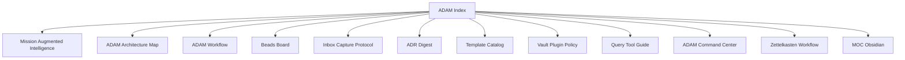

---
tags:
  - adam
  - mission
  - index
type: moc
updated: 2026-07-11
aliases:
  - Semantic Map
  - ADAM MOC
---

# ADAM Semantic Map

Controlled linking model for Project A.D.A.M. Use **hubs** for navigation, **tags** for machine filters, **wikilinks** for human context.

## Hub layer (always link here first)

| Hub                                | Role                                       | Tags                                |
| ---------------------------------- | ------------------------------------------ | ----------------------------------- |
| [[ADAM Index]]                     | Root MOC                                   | `adam`, `mission`, `index`          |
| [[Mission Augmented Intelligence]] | Product thesis (EI + cognitive support)    | `adam`, `mission`, `ei`             |
| [[ADAM Architecture Map]]          | Dual monorepo, containers, knowledge plane | `adam`, `agentic-dev`, `agent-mgmt` |
| [[ADAM Workflow]]                  | Context → Spec → Plan → Implement          | `adam`, `agentic-dev`, `workflow`   |
| [[Beads Board]]                    | Active `modme-*` digest                    | `adam`, `bead`, `issue`             |
| [[Inbox Capture Protocol]]         | Clipper → intake funnel                    | `adam`, `inbox`, `research`         |
| [[ADR Digest]]                     | Decision index                             | `adam`, `adr`, `decision`           |
| [[Template Catalog]]               | Template registry                          | `adam`, `templates`                 |
| [[Vault Plugin Policy]]            | Plugin allowlist                           | `adam`, `agent-mgmt`, `vault`       |
| [[Query Tool Guide]]               | Bases vs Smart Connections vs Dataview     | `adam`, `agent-mgmt`, `vault`       |
| [[ADAM Command Center]]            | Bases dashboards                           | `adam`, `agent-mgmt`, `dashboard`   |
| [[Zettelkasten Workflow]]          | Fleeting → permanent → MOC                 | `adam`, `zettelkasten`              |
| [[MOC Obsidian]]                   | Obsidian topic MOC + Bases                 | `adam`, `moc`, `obsidian`           |

## Tag vocabulary (OR sets for Copilot)

| Tag                    | Use for                                |
| ---------------------- | -------------------------------------- |
| `#adam`                | Any A.D.A.M hub or policy note         |
| `#mission`             | Product / EI / cognitive support       |
| `#agentic-dev`         | Building product, agents, forge/genui  |
| `#agent-mgmt`          | Worktrees, beads, orchestration, vault |
| `#adr` / `#decision`   | Architecture decision records          |
| `#bead` / `#issue`     | Issue tracking vault mirrors           |
| `#inbox` / `#research` | Curated research (not raw funnel dump) |
| `#handoff`             | Session continuity notes               |

Keep tags **flat** — prefer `agentic-dev` over deep hierarchies unless a real gap appears.

## Note type → link target

Every new note should link to **one primary hub**:

| `type` (frontmatter) | Link to                                                |
| -------------------- | ------------------------------------------------------ |
| `inbox` / clip       | [[Inbox Capture Protocol]] → bead or ADR when promoted |
| `adr`                | [[ADR Digest]]                                         |
| `bead`               | [[Beads Board]]                                        |
| `handoff`            | [[ADAM Workflow]] + active bead                        |
| `agent-brief`        | [[ADAM Architecture Map]]                              |
| `research`           | [[Inbox Capture Protocol]] or concept note             |

## Sphere mapping

| Sphere                  | Hubs                                       | Repo SoR                                |
| ----------------------- | ------------------------------------------ | --------------------------------------- |
| **Agentic Development** | Architecture, Workflow, Template Catalog   | `next-forge/`, `GenerativeUI_monorepo/` |
| **Agent Management**    | Beads Board, Workflow, Vault Plugin Policy | `.beads/`, worktrees, `docs/adam/`      |

## External SoR (not duplicated in vault)

| Artifact        | Repo path                           | Vault mirror              |
| --------------- | ----------------------------------- | ------------------------- |
| Beads JSONL     | `.beads/`                           | [[Beads Board]] digest    |
| Inbox funnel    | `GenerativeUI_monorepo/docs/inbox/` | Protocol + filtered Bases |
| next-forge ADRs | `next-forge/docs/adr/`              | [[ADR Digest]] summary    |
| C4              | `C4-Documentation/`                 | [[ADAM Architecture Map]] |

## Related

- [[copilot-project-system-prompt]]
- [[ADAM Command Center.canvas]]
