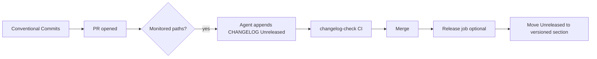

# Agent Tech Guide — Monorepo_ModMe

Canonical reference for **AI agents** and **humans** working in this repository: tooling paths, documentation workflows, changelog automation, and cross-session handoff.

| Audience | Start here |
|----------|------------|
| New agent session | `/init` in Cursor → `AGENTS.md` → this guide → `CHANGELOG.md` (Agent Update Protocol) |
| Human contributor | `/init`, `AGENTS.md`, `docs/debug-launch-guide.md`, `scripts/cursor-ai/README.md` |
| CI / cloud agent | `CHANGELOG.md` (protocol), `scripts/validate-changelog.mjs`, `.github/workflows/changelog-check.yml` |
| Local debugging | `docs/debug-launch-guide.md`, `.vscode/launch.json`, `scripts/validate-launch-json.mjs` |

---

## 1. Repository map

```
Monorepo_ModMe/
├── AGENTS.md                    # Agent entry point (commands, layout, behavior)
├── CHANGELOG.md                 # Keep a Changelog + Agent Update Protocol
├── docs/
│   ├── agent-tech-guide.md      # ← you are here
│   ├── debug-launch-guide.md    # VS Code launch.json, ports, CI validation
│   └── lean-ctx-guide.md        # lean-ctx compression modes & diagnostics
├── .vscode/
│   ├── launch.json              # Debug configs (see debug-launch-guide.md)
│   └── tasks.json               # preLaunchTask helpers for launch.json
├── GenerativeUI_monorepo/       # Main Turborepo (yarn, turbo)
├── .cursor/
│   ├── rules/                   # Always-on MDC rules (lean-ctx, PatrickJS, copilot, …)
│   ├── skills/                  # Project-scoped skills (e.g. awesome-agent-skills)
│   └── mcp.json                 # Project MCP: skills-sh, buildkite (remote)
├── .agents/skills/              # Repo skills (Cursor + Copilot compatible)
├── .github/
│   ├── copilot-instructions.md
│   ├── instructions/            # File-scoped Copilot instructions
│   ├── mcp.json                 # GitHub Copilot MCP (e.g. GitLab)
│   └── workflows/changelog-check.yml
├── .tools/
│   ├── awesome-agent-skills/    # Local skills catalog clone (README index)
│   └── skillsh-mcp/             # skills-sh MCP server build
└── scripts/
    ├── cursor-ai/setup.ps1      # Refresh rules, skills, vendor copies
    ├── launch-manifest.json     # Debug target source of truth (ports, cwds)
    ├── pre-commit-checks.mjs      # Hook + CI orchestrator
    ├── install-git-hooks.ps1    # Install .githooks/pre-commit
    ├── validate-changelog.mjs   # CI/local CHANGELOG validator
    ├── validate-cursor-skills.mjs
    └── validate-launch-json.mjs # CI/local launch.json validator
```

**Global (user machine, not in repo):**

| Path | Purpose |
|------|---------|
| `~/.agents/skills/` | Globally installed agent skills |
| `~/.cursor/mcp.json` | User-level MCP servers |
| `~/.config/lean-ctx/config.toml` | lean-ctx compression settings |

---

## 2. lean-ctx setup

This repo uses **lean-ctx** as the context compression layer (see `.cursor/rules/lean-ctx.mdc`).

### Agent expectations

- Prefer lean-ctx MCP tools (`ctx_read`, `ctx_search`, `lean-ctx -c "…"`) over raw file dumps when available.
- Use read modes intentionally: `map` for orientation, `signatures` for APIs, `full` before edits.
- If output is over-compressed, use `raw` mode or `lean-ctx doctor`.

### Diagnostics (human or agent)

```powershell
lean-ctx doctor
lean-ctx gain
lean-ctx benchmark
```

Details: [docs/lean-ctx-guide.md](./lean-ctx-guide.md).

### Bypass

```powershell
$env:LEAN_CTX_DISABLED = "1"   # session bypass
lean-ctx off                   # disable until re-enabled
```

---

## 3. skills-sh MCP

### Project config

`.cursor/mcp.json`:

```json
{
  "mcpServers": {
    "skills-sh": {
      "command": "node",
      "args": ["C:/Users/dylan/Monorepo_ModMe/.tools/skillsh-mcp/dist/index.js"]
    }
  }
}
```

Restart Cursor after changing MCP config.

### CLI (no MCP)

```powershell
$env:Path = "C:\Program Files\Git\cmd;" + $env:Path
npx skills find <query>
npx skills add <owner/repo@skill> --agent cursor -g -y
```

### Local catalog

Browse `.tools/awesome-agent-skills/README.md` for curated links. Project skill pointer: `.cursor/skills/awesome-agent-skills/SKILL.md`.

---

## 3.5 Buildkite MCP (remote)

This repo uses Buildkite's **remote** MCP server (recommended for Cursor on Windows). No local binary or Docker install is required; authentication is handled via OAuth when you first connect.

### Project config

`.cursor/mcp.json`:

```json
{
  "mcpServers": {
    "buildkite": {
      "url": "https://mcp.buildkite.com/mcp"
    }
  }
}
```

The Buildkite Cursor plugin (`.cursor/settings.json` → `plugins.buildkite.enabled`) can also install MCP + skills from the Cursor Marketplace. The project `mcp.json` entry keeps the server portable for all contributors.

### First-time connect (manual)

1. Restart Cursor after changing MCP config.
2. Open **Cursor Settings → MCP & Integrations** and enable **buildkite**.
3. On first use, authorize the Buildkite MCP application in your browser.
4. Select your **Buildkite organization** on the authorization page.

No `BUILDKITE_API_TOKEN` is required for the remote server. OAuth tokens are short-lived (12 hours; refresh tokens 7 days).

### Optional: read-only or scoped toolsets

Read-only remote server:

```json
"buildkite-readonly": {
  "url": "https://mcp.buildkite.com/mcp/readonly"
}
```

Limit toolsets via header (example: user, pipelines, builds):

```json
"buildkite-readonly-toolsets": {
  "url": "https://mcp.buildkite.com/mcp/readonly",
  "headers": {
    "X-Buildkite-Toolsets": "user,pipelines,builds"
  }
}
```

### Local MCP (CI / agents only)

Use the **local** server only for automated pipelines or pinned versions—not for interactive Cursor use. Requires `BUILDKITE_API_TOKEN` (scopes: at minimum `read_builds`, `read_pipelines`, `read_user`). See [Installing the Buildkite MCP server locally](https://buildkite.com/docs/apis/mcp-server/local/installing).

| Variable | Remote MCP | Local MCP |
|----------|------------|-----------|
| `BUILDKITE_API_TOKEN` | Not used (OAuth) | Required (`bkua_…`) |
| Org selection | OAuth authorize screen | Implicit from token |

Create API tokens: [Buildkite → Personal Settings → API Access Tokens](https://buildkite.com/user/api-access-tokens).

### Repo pipeline

Monorepo CI is defined in [`.buildkite/pipeline.yml`](../.buildkite/pipeline.yml) (Buildkite) and [`.github/workflows/ci.yml`](../.github/workflows/ci.yml) (GitHub Actions). See [buildkite-guide.md](./buildkite-guide.md) for setup and the local demo (`scripts/buildkite-demo.ps1`, `/dev/buildkite`).

### Docs

- [Types of MCP servers](https://buildkite.com/docs/apis/mcp-server#types-of-mcp-servers)
- [Configuring AI tools (remote)](https://buildkite.com/docs/apis/mcp-server/remote/configuring-ai-tools)
- [Installing locally](https://buildkite.com/docs/apis/mcp-server/local/installing)

If your organization uses an **API IP allowlist**, add Buildkite egress IPs so the remote MCP server can call your org's API.

---

## 4. Installed skills (documentation & changelog)

### Repo-local (`.agents/skills/`)

| Skill | Use when |
|-------|----------|
| `create-agentsmd` | Generate or refresh `AGENTS.md` |
| `acquire-codebase-knowledge` | Map architecture, onboarding docs |
| `quality-playbook` | Spec-traced audits, defect hunting |
| `github-actions-efficiency` | CI cost/efficiency review |
| `doublecheck` | Verify agent claims with sources |

### Global (`~/.agents/skills/`) — installed for this initiative

| Skill | Install command | Status |
|-------|-----------------|--------|
| `changelog-automation` | `npx skills add wshobson/agents@changelog-automation --agent cursor -g -y` | Installed |
| `documentation-writer` | `npx skills add github/awesome-copilot@documentation-writer --agent cursor -g -y` | Installed |
| `doc-coauthoring` | `npx skills add anthropics/skills@doc-coauthoring --agent cursor -g -y` | Installed |
| `agents-md` | `npx skills add getsentry/skills@agents-md --agent cursor -g -y` | Installed |
| `changelog-generator` | `npx skills add composiohq/awesome-claude-skills@changelog-generator --agent cursor -g -y` | Installed |
| `internal-comms` | `npx skills add anthropics/skills@internal-comms --agent cursor -g -y` | Installed |
| `mcp-builder` | `npx skills add anthropics/skills@mcp-builder --agent cursor -g -y` | Installed |
| `find-skills` | `npx skills add vercel-labs/skills@find-skills --agent cursor -g -y` | Installed |
| `awesome-agent-skills` | project pointer at `.cursor/skills/awesome-agent-skills` | Installed (Cursor) |

### Top catalog matches (not all installed)

| Skill | Installs | Best for |
|-------|----------|----------|
| `wshobson/agents@changelog-automation` | ~9.4K | Keep a Changelog, Conventional Commits, release CI |
| `composiohq/awesome-claude-skills@changelog-generator` | ~4.7K | Git history → user-facing release notes |
| `github/awesome-copilot@documentation-writer` | ~20.5K | Technical documentation |
| `github/awesome-copilot@create-agentsmd` | ~11K | AGENTS.md generation (also in repo) |
| `anthropics/skills@internal-comms` | ~48.5K | Status reports, 3P updates (install if needed) |
| `getsentry/skills@agents-md` | ~3.1K | AGENTS.md maintenance |
| `anthropics/skills@doc-coauthoring` | official | Structured co-authoring workflow |
| `akillness/oh-my-skills@changelog-maintenance` | ~191 | Ongoing changelog hygiene |
| `phuryn/release-notes` | catalog | PM-style release notes from tickets |

Refresh AI config after vendor changes:

```powershell
.\scripts\cursor-ai\setup.ps1
```

---

## 5. How to document changes

### Layered documentation model

| Layer | File | Owner | Update trigger |
|-------|------|-------|----------------|
| Agent bootstrap | `AGENTS.md` | Humans + `create-agentsmd` / `agents-md` | New commands, layout, agent rules |
| Deep tech guide | `docs/agent-tech-guide.md` | Humans + agents | Tooling/path/workflow changes |
| lean-ctx | `docs/lean-ctx-guide.md` | Agents using lean-ctx | Compression behavior changes |
| Release log | `CHANGELOG.md` | All agents + CI | Notable shipped changes |
| Package/app | nearest `README` / `docs/` | Feature owners | Feature-specific behavior |

### Agent session checklist (end of task)

1. **CHANGELOG** — If the change is notable (see protocol in `CHANGELOG.md`), append under `[Unreleased]`.
2. **AGENTS.md** — If default commands, layout, or agent behavior changed, update root `AGENTS.md`.
3. **This guide** — If paths, MCP, skills, or CI workflows changed, update `docs/agent-tech-guide.md`.
4. **Do not** commit or document `.env` values; reference variable **names** only.

### Cross-session handoff

For work spanning sessions or agents, leave:

1. A `[Unreleased]` changelog bullet describing what landed and what remains.
2. A short PR description or issue comment with: **done**, **blocked**, **verify command**.
3. Optional: run `acquire-codebase-knowledge` for large architectural changes and commit output under `docs/` (only when explicitly requested).

Use `doc-coauthoring` for long-form guides; use `documentation-writer` for API/reference style docs.

---

## 6. Changelog workflow

### Format

[Keep a Changelog](https://keepachangelog.com/) with an **Agent Update Protocol** at the top of `CHANGELOG.md`.

### Local validation

```powershell
node scripts/pre-commit-checks.mjs          # same suite as the git hook
.\scripts\install-git-hooks.ps1             # one-time: enable pre-commit hook
node scripts/validate-changelog.mjs
node scripts/validate-changelog.mjs --require-update   # after editing monitored paths
```

Pre-commit runs automatically on `git commit` after hook install (`setup.ps1` also installs hooks). CI: `.github/workflows/pre-commit-check.yml` and Buildkite step `:mag: Pre-commit checks`.

### CI

`.github/workflows/changelog-check.yml` runs on PRs that touch monitored paths:

- Validates structure and required sections
- Fails if monitored paths change without a `CHANGELOG.md` update

No secrets required.

### Recommended automation (external agents)



**Phase 1 (current):** Manual/agent append + CI validation.

**Phase 2 (optional):** Add a release workflow that:

1. Uses `changelog-automation` patterns or `git-cliff` / `conventional-changelog` to draft notes from commits.
2. Opens a PR updating `CHANGELOG.md` (agent or `release-please` / `semantic-release`).
3. On tag, publishes GitHub Release body from the versioned section.

**Phase 3 (optional):** Scheduled cloud agent job:

```yaml
# Pseudocode — not yet in repo
# - cron: weekly
# - run: agent with changelog-generator skill
# - input: git log since last tag
# - output: PR updating [Unreleased] or draft release notes
```

Skills to use by phase:

| Phase | Skill |
|-------|-------|
| Commit discipline | `changelog-automation` (Conventional Commits) |
| Draft from git | `changelog-generator` |
| User-facing polish | `documentation-writer`, `internal-comms` |
| Version bump PR | `changelog-automation` (standard-version / semantic-release refs) |

---

## 7. MCP configuration summary

| File | Servers | Notes |
|------|---------|-------|
| `.cursor/mcp.json` | `skills-sh`, `buildkite` (remote HTTP) | Skills catalog; Buildkite pipelines/builds (OAuth) |
| `.github/mcp.json` | `GitLab` (http) | Copilot / GitHub MCP integration |
| `~/.cursor/mcp.json` | User-defined | May duplicate skills-sh, context7, lean-ctx, etc. |

After editing MCP JSON, restart the host (Cursor / VS Code).

---

## 8. Gaps and limitations

| Gap | Workaround |
|-----|------------|
| No single “agent handoff” skill in catalog | Use `CHANGELOG.md` protocol + `acquire-codebase-knowledge` |
| Phase 2 release automation (git-cliff / release-please) | Not in repo; Phase 1 manual append + CI validation is active |
| No dedicated AGENTS.md CI check | Extend `validate-changelog.mjs` or add `agents-md` check later |
| `changelog-generator` flagged higher gen risk | Review output; prefer `changelog-automation` for CI templates |
| Monorepo sub-project changelogs | App-specific notes can live under `GenerativeUI_monorepo/<pkg>/CHANGELOG.md` with a bullet in root `[Unreleased]` |

---

## 9. VS Code debug / launch configs

Full detail: **[docs/debug-launch-guide.md](./debug-launch-guide.md)**.

### Onboard

Run **`/init`** in Cursor chat — initializes beads (optional), verifies debug prerequisites, and maps agent docs.

### Key files

| File | Role |
|------|------|
| `.vscode/launch.json` | Run configurations + full-stack compounds |
| `.vscode/tasks.json` | Background dev/build tasks for `preLaunchTask` |
| `scripts/launch-manifest.json` | Canonical app list, ports, required config names |
| `scripts/validate-launch-json.mjs` | Local + CI drift detection |
| `.github/workflows/launch-json-check.yml` | PR check when launch files change |

### Port map (primary apps)

| App | Launch name | Port |
|-----|-------------|------|
| vibe-web-app | Vibe Web App (Chrome) | 3000 |
| web-dashboard | Web Dashboard (Next.js) | 3001 |
| agent-server | Agent Server (FastAPI) | 8000 |

### Validate before push

```powershell
node scripts/validate-launch-json.mjs --require-manifest-sync
```

When adding an app: update **both** `launch.json` and `launch-manifest.json`, then run the validator.

---

## 10. Quick commands

```powershell
# Repo dev (main monorepo)
cd GenerativeUI_monorepo
yarn install
yarn dev

# Refresh Cursor AI assets
.\scripts\cursor-ai\setup.ps1

# Find & install a skill
npx skills find changelog
npx skills add wshobson/agents@changelog-automation --agent cursor -g -y

# Validate changelog before push
node scripts/validate-changelog.mjs --require-update

# Validate VS Code launch configs
node scripts/validate-launch-json.mjs --require-manifest-sync

# Refresh awesome-cursor-skills + global Cursor skills
.\scripts\cursor-ai\setup.ps1

# direnv (PowerShell 7+ required for auto-hook)
.\scripts\install-direnv-hook.ps1
# then in pwsh: cd <repo> && direnv allow

# Project onboarding (beads + debug + docs)
# In Cursor chat: /init
```

---

*Last updated: 2026-06-13 — `/init` command, debug-launch-guide, launch.json CI validation.*

## Continuous integration

GitHub Actions workflows under [`.github/workflows/`](../.github/workflows/):

| Workflow | Trigger | Purpose |
|----------|---------|---------|
| `ci.yml` | Push/PR to `main`, `master`, or `develop` | Secret guard (no tracked `.env`), Yarn 3 + Turbo lint/test/build in `GenerativeUI_monorepo`, PR changelog validation |
| `changelog-check.yml` | PR (monitored paths) | CHANGELOG format and required updates |
| `launch-json-check.yml` | PR/push (launch config paths) | Validates `.vscode/launch.json` against manifest |

CI uses Node 20 with Corepack for Yarn 3. Deploy workflows are not configured; add a deploy job when a hosting target is chosen.

Local parity before opening a PR:

```powershell
cd GenerativeUI_monorepo
corepack enable
yarn install
yarn lint
yarn test
yarn build
```
