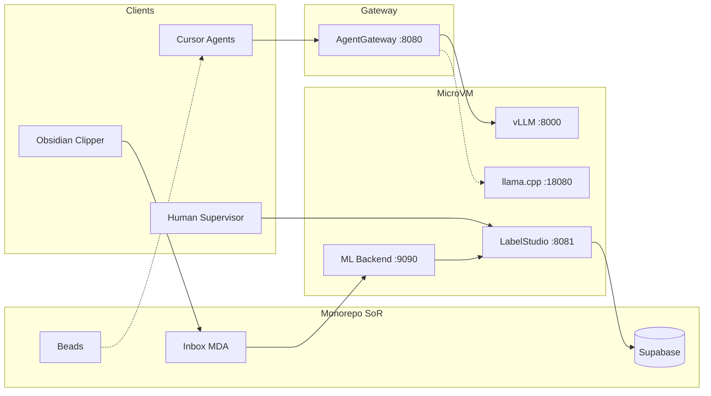

# Project Architecture Blueprint — Agent Gateway LLM + Label Studio

> Generated alignment to `agent-library/prompts/architecture-blueprint-generator.prompt.md`.
> Scope: Agent Gateway Layer 4, vLLM MicroVM, Label Studio Option C loop, Obsidian inbox.
> Date: 2026-07-12 · Detail: High-level + Implementation-Ready for Phase 0–1

## 1. Architecture Detection

| Stack | Evidence |
| --- | --- |
| Node/Yarn orchestration | Root scripts, intake, polis-router |
| Python/FastAPI agent | GenerativeUI agent-server (legacy GenUI) |
| Docker / MicroVM | `config/vllm/`, toolchain microvm plan |
| Label Studio + ML Backend | ADR-0017 |
| Obsidian clipper | `templates/obsidian-clipper/` |
| Pattern | Event-driven knowledge intake + Layered proxy (Gateway) + Bounded parallel agents (Gas City) |

## 2. Architectural Overview

ModMe separates **repo I/O** (lean-ctx MCP), **LLM/MCP fan-out** (Agent Gateway), **knowledge SoR** (inbox + Supabase), and **work SoR** (beads). Label Studio is a **visualization/control plane** over agent predictions — not a second SoR. Parallel agents follow next-forge ADR-0012 wave budgets.

Guiding principles:

1. Local-first LLM (vLLM primary, llama.cpp fallback).
2. Single-writer artifacts for contracts, routes, golden fixtures.
3. Router layering frozen by ADR-0015 (polis ≠ MDA ≠ GenUI).

## 3. Visualization (C4-style)



## 4. Core Components

| Component | Responsibility | Extension |
| --- | --- | --- |
| Agent Gateway | Terminate OpenAI/MCP; buffer; rate-limit | Route YAML + policies |
| vLLM service | Inference | Quants / tool parsers |
| Label Studio | Visualize predictions; human QA | Project label config |
| ML Backend | Predict tags via gateway + embeddings | `model.py` predict() |
| Inbox MDA | Classify/embed/promote knowledge | `mda-categorize.mjs` |
| polis-router | Citizen selection for sessions | `data/agent-citizens/*.yaml` |

## 5. Layers and Dependencies

```
Clients → Agent Gateway → vLLM
       ↘ lean-ctx (direct repo I/O)
Inbox → MDA → LS predictions → Human → Promote → Supabase
Session → polis-router → beads (work SoR)
```

Dependency rule: knowledge classification never routes through GenUI utterance routers (ADR-0015).

## 6. Data Architecture

- Inbox contract v1 frontmatter → LS task `data` + `meta.inbox_id`.
- Predictions carry `model_version` + `score`.
- Promote writes existing knowledge tables only.

## 7. Cross-Cutting

- Auth: local LS token; gateway header namespace; no cloud LLM by default.
- Resilience: vLLM → llama.cpp failover via gateway health.
- Observability: ADR-0013 session traces + agenttrace; LS benchmarks JSONL.
- Config: compose profiles `primary` / `fallback`; worktree port offsets.

## 8. Service Communication

- Sync: HTTP OpenAI `/v1/chat/completions` via gateway.
- Async: intake orchestrator → LS sync → promote job.
- Protocols: OpenAI JSON, Label Studio REST, inbox markdown.

## 9. Bounded Parallel Lifecycle

Per next-forge ADR-0012:

1. Plan serially (this blueprint + ADRs + goal-contract).
2. Execute waves (max 2 parallel starts).
3. Commit serially (docs before infra before promote scripts).

## 10. Blueprint for New Development

| Feature type | Start here | Then |
| --- | --- | --- |
| New LLM route | `routes.example.yaml` | policy YAML + smoke curl |
| New annotation field | LS label config | ML backend + inbox contract (ask first) |
| New citizen | `data/agent-citizens/` | polis-router triggers only |
| Clipper change | Existing template JSON | Vitest clipper tests |

## Pitfalls

- Do not reuse ADR numbers 0013–0015.
- Do not recreate Obsidian unique-note pack.
- Do not put Label Studio on 8080.
- Do not treat `agent-registry.json` as work SoR.

## Update cadence

Refresh this blueprint when ADR-0016 moves Proposed → Accepted or MicroVM hypervisor choice is finalized.
