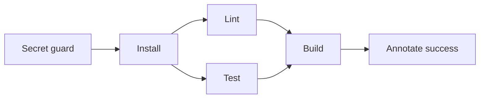

# Buildkite in Monorepo_ModMe

## What is Buildkite?

**Buildkite** is a CI/CD platform that runs **pipelines** — ordered graphs of shell commands — on **agents** (machines that execute your jobs). Unlike GitHub Actions, where workflows and runners are bundled inside GitHub, Buildkite separates:

| Piece | Role |
|-------|------|
| **Pipeline** | YAML in `.buildkite/pipeline.yml` — what to run and in what order |
| **Build** | One execution of the pipeline for a commit or PR |
| **Agent** | Worker that runs each step (Buildkite-hosted, your VM, Docker, Kubernetes, etc.) |
| **Annotations** | Rich markdown notes on a build (e.g. success banner after deploy) |

Think of it as: **GitHub triggers the build; Buildkite orchestrates and displays it; agents do the work.**

This repo already uses **GitHub Actions** (`.github/workflows/ci.yml`). Buildkite is an **optional parallel path** — useful if you want:

- Buildkite’s pipeline UI, test analytics, and flaky-test detection
- Self-hosted agents with custom hardware or network access
- The [Buildkite MCP server](https://buildkite.com/docs/apis/mcp-server) in Cursor (see `docs/agent-tech-guide.md`)

## Where it lives in this repo

```
Monorepo_ModMe/
├── .buildkite/              ← pipeline definition (repo root)
│   ├── pipeline.yml
│   ├── template.yml
│   └── scripts/
├── GenerativeUI_monorepo/   ← all CI commands run here (Yarn + Turbo)
└── .github/workflows/ci.yml ← equivalent GitHub Actions workflow
```

The pipeline targets **`GenerativeUI_monorepo/`** because that is the Turborepo application root — same as the `monorepo` job in GitHub Actions.

## Pipeline flow



1. **Secret guard** — fail if `.env` files are tracked in git
2. **Install** — `corepack` + `yarn install`
3. **Verify** (parallel) — `yarn lint` and `yarn test`
4. **Build** — `yarn build` after verify completes
5. **Annotate** — success note on the build page

## Try it without signing up

### Terminal demo

```powershell
.\scripts\buildkite-demo.ps1
```

Walks through each step with the same commands the pipeline uses (skips install if `node_modules` already exists).

### Visual demo

```bash
cd GenerativeUI_monorepo
yarn workspace @generative-ui/web-dashboard dev
```

Open [http://localhost:3000/dev/buildkite](http://localhost:3000/dev/buildkite) — interactive pipeline animation and glossary.

## Connect to Buildkite (production)

1. Create an org at [buildkite.com](https://buildkite.com).
2. **New pipeline** → connect this GitHub repository.
3. Set the pipeline upload step to:

   ```bash
   buildkite-agent pipeline upload
   ```

   Buildkite reads `.buildkite/pipeline.yml` from the checked-out commit.

4. Enable **Buildkite MCP** in Cursor (`docs/agent-tech-guide.md` §3.5) to inspect builds from the IDE.

Details: [`.buildkite/README.md`](../.buildkite/README.md).

## Skills catalog

From [skills.sh](https://skills.sh/) via `awesome-agent-skills`:

```bash
npx skills add buildkite/skills@buildkite-pipelines --agent cursor -y
npx skills add buildkite/skills@buildkite-cli --agent cursor -y
```

## Starter reference

Adapted from [buildkite/starter-pipeline-example](https://github.com/buildkite/starter-pipeline-example) — rocket placeholders replaced with real monorepo commands.
