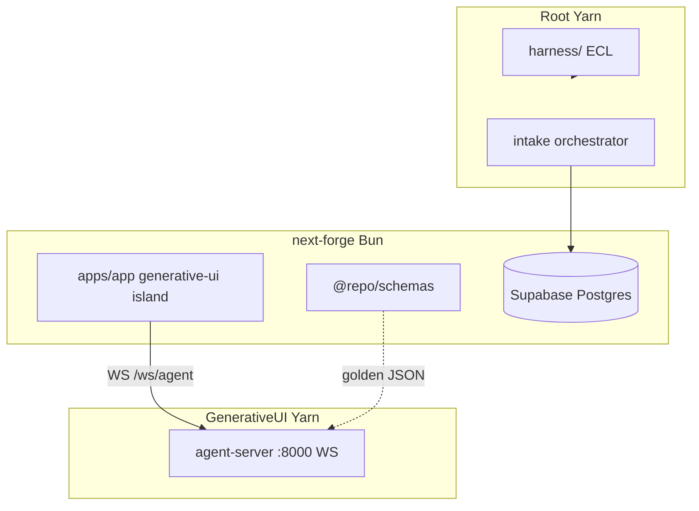

# Architecture

## System overview

ModMe is a **federated dual-monorepo**: next-forge (primary SaaS) + GenerativeUI agent-server (Python satellite) + root meta-orchestration. Integration is HTTP/WebSocket and golden schema JSON only.

Product C4 detail: [`C4-Documentation/c4-container.md`](../../C4-Documentation/c4-container.md)

## next-forge SaaS layer

- **apps/app:** Auth.js, Prisma, generative-ui client island (`use-agent-state.ts`)
- **packages/schemas:** Canonical Zod contracts + golden JSON
- **packages/database:** Prisma + Supabase alignment
- **Feature flags:** Phase 4 cutover via `@repo/feature-flags`

Evidence: `next-forge/apps/app/app/(authenticated)/generative-ui/`, ADRs in `next-forge/docs/adr/`

## agent-server (hexagonal)

Legacy stack retains Python agent runtime:

| Layer | Path |
|-------|------|
| Adapters | `apps/agent-server/src/adapters/` |
| Domain | `apps/agent-server/src/domain/` |
| WebSocket | `/ws/agent` stream |

Evidence: `GenerativeUI_monorepo/README_GENERATIVE_UI.md`, `C4-Documentation/components/c4-component-agent-server.md`

## Intake dual-store

- **Supabase pgvector:** inbox/knowledge promotion
- **GreptimeDB:** code/AST index
- Orchestrator: `scripts/intake-orchestrator.mjs`

Evidence: `docs/inbox-pipeline/README.md`, ADR-0009 inbox contract

## Migration phases

| Phase | Status | Deliverable |
|-------|--------|-------------|
| 1 Workshop | In progress | Storybook ModMe workshop |
| 2 Schemas | Done | `@repo/schemas` |
| 3 Client island | Done | generative-ui route group |
| 4 Cutover | Pending | Feature flags, web-dashboard deprecation |

Evidence: `.agents/skills/modme-generative-ui-migrate/SKILL.md`, `docs/migration/phase4-cutover.md`

## Root legacy (sunset)

- `src/` + `agent/` — original GenUI R&D; **deprecated** for new work
- Archive plan: `docs/migration/legacy-archive-plan.md`

## Evidence

- `docs/agent-index.md`
- `docs/codebase/STRUCTURE.md`
- `harness/config/environment.json`
