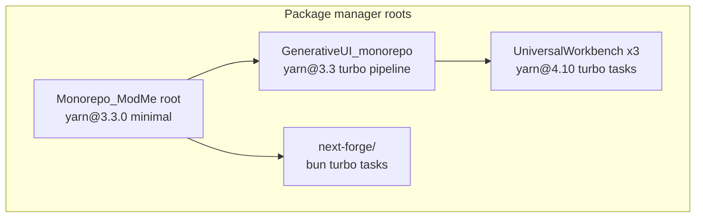

# Technology Stack

## Dual-monorepo layout (2026)

This repository hosts **multiple independent monorepos**. Do not unify lockfiles or package managers across roots.



### Dependency management scorecard

| Area            | GenerativeUI_monorepo                       | next-forge/           | UniversalWorkbench   |
| --------------- | ------------------------------------------- | --------------------- | -------------------- |
| Package manager | Yarn 3.3.0                                  | **Bun 1.3+**          | Yarn 4.10.3          |
| Lockfile        | `GenerativeUI_monorepo/yarn.lock`           | `next-forge/bun.lock` | Per-copy `yarn.lock` |
| Turbo schema    | Legacy `pipeline`                           | Modern `tasks`        | Modern `tasks`       |
| Lint/format     | ESLint + Prettier                           | Biome (Ultracite)     | Biome                |
| Test            | Jest                                        | Vitest                | Vitest               |
| TypeScript      | 4.9.3 (root)                                | 5.9+                  | 5.9+                 |
| Package naming  | `@generative-ui/*`, `@monorepo-template/*`  | `@repo/*`             | `@adaptiveworx/*`    |
| Non-JS          | `agent-server` (Poetry, outside workspaces) | —                     | —                    |

### Boundary rules

- **Bun** only in `next-forge/` — run `bun install`, `bun dev`, `bun run build`.
- **Yarn** only in `GenerativeUI_monorepo/` and nested UniversalWorkbench copies.
- **No cross-imports** between `next-forge/` and `GenerativeUI_monorepo/` except via HTTP/WebSocket or published packages.
- **UniversalWorkbench** (`UniversalWorkbench`, `-staging`, `-dev`) is read-only unless explicitly tasked.

### Port allocation

| Stack        | App           | Port |
| ------------ | ------------- | ---- |
| GenerativeUI | vibe-web-app  | 3000 |
| GenerativeUI | web-dashboard | 3001 |
| GenerativeUI | example-next  | 3002 |
| GenerativeUI | agent-server  | 8000 |
| next-forge   | app           | 3100 |
| next-forge   | web           | 3101 |
| next-forge   | api           | 3102 |
| next-forge   | docs          | 3104 |
| next-forge   | storybook     | 6106 |

Worktrees apply slot offsets via `.worktree-ports.env` (see `docs/multi-agent-worktrees.md`).

---

## Core Sections

### 1) Runtime Summary

| Area                | Value                                                     | Evidence                                                    |
| ------------------- | --------------------------------------------------------- | ----------------------------------------------------------- |
| Primary language    | TypeScript (Frontend) / Python (Backend)                  | `GenerativeUI_monorepo/README_GENERATIVE_UI.md`             |
| Runtime + version   | Node.js 18+ / Python 3.10+                                | `GenerativeUI_monorepo/README_GENERATIVE_UI.md`             |
| Package managers    | Yarn 3.3 (GenerativeUI), Bun (next-forge), Yarn 4.10 (UW) | Root and monorepo `package.json` files                      |
| Module/build system | Turborepo (`turbo.json`) per monorepo                     | `GenerativeUI_monorepo/turbo.json`, `next-forge/turbo.json` |

### 2) Production Frameworks and Dependencies

| Dependency     | Version                             | Role in system                    | Evidence                                   |
| -------------- | ----------------------------------- | --------------------------------- | ------------------------------------------ |
| Next.js        | 14 (GenerativeUI), 15+ (next-forge) | Frontend web framework            | `apps/web-dashboard`, `next-forge/apps/*`  |
| FastAPI        | —                                   | Backend API and WebSocket server  | `GenerativeUI_monorepo/apps/agent-server/` |
| CopilotKit     | —                                   | AI chat UI (GenerativeUI legacy)  | `apps/web-dashboard`                       |
| AG2 (AutoGen)  | —                                   | Multi-agent orchestration backend | `apps/agent-server`                        |
| Prisma         | —                                   | Database ORM (next-forge)         | `next-forge/packages/database`             |
| Zod / Pydantic | —                                   | Cross-language schema validation  | `packages/shared-schemas`                  |

### 3) Development Toolchain

| Tool              | Purpose                  | Scope                 |
| ----------------- | ------------------------ | --------------------- |
| ESLint + Prettier | Lint/format              | GenerativeUI_monorepo |
| Biome (Ultracite) | Lint/format              | next-forge            |
| Turborepo         | Build/task orchestration | All monorepos         |
| agenttrace        | Agent session profiling  | Root                  |
| lean-ctx          | Context management       | All agents            |

### 4) Key Commands

**GenerativeUI (legacy agent stack):**

```bash
cd GenerativeUI_monorepo
yarn install
yarn dev
yarn build
```

**next-forge (apps, docs, workshop):**

```bash
cd next-forge
bun install
bun dev
bun run build
bun dev --filter docs
bun dev --filter storybook
```

**Root orchestration:**

```bash
yarn dev:generative    # GenerativeUI turbo dev
yarn dev:forge         # next-forge turbo dev
yarn dev:forge:docs
yarn dev:forge:storybook
```

### 5) Environment and Config

- GenerativeUI: `GenerativeUI_monorepo/apps/web-dashboard/.env.local`, `apps/agent-server/.env`
- next-forge: `next-forge/packages/database/.env` (required), per-app `.env.local`
- Required env vars (GenerativeUI): `OPENAI_API_KEY`, `NEXT_PUBLIC_AGENT_SERVER_WS_URL`
- Required env vars (next-forge): `DATABASE_URL` + `DIRECT_URL` in `packages/database/.env` (Supabase local defaults in `.env.example`); `AUTH_SECRET` in app `.env.local`

### next-forge setup status

| Step                            | Status              | Notes                                             |
| ------------------------------- | ------------------- | ------------------------------------------------- |
| `bun install` + `bun run check` | Pass                | Bun 1.3+ global                                   |
| Supabase local                  | Configured          | `bun run db:start` / `db:stop`; Postgres `:54322` |
| `bun run db:push`               | After `db:start`    | Uses `packages/database/.env` local URLs          |
| Auth                            | Auth.js credentials | Replaces Clerk; dev user `dev@modme.local`        |
| Env templates                   | Committed           | `.env.example` for database + apps                |
| Storybook                       | PnP fix             | Root `run-forge-bun.ps1` hides Yarn PnP           |

Context7 decisions (2026-06-20):

- **Database:** Supabase local Postgres + Prisma (`DATABASE_URL` pooled, `DIRECT_URL` for migrations); Neon optional for cloud.
- **Auth:** Auth.js v5 credentials provider in `@repo/auth`; no Clerk for local prototyping.
- **Next.js RSC:** `error.tsx` must be `'use client'`; use `next/dynamic` only inside client boundaries for agent bundles.
- **Mintlify:** `mint dev --port 3104` (ModMe offset); install via `npm i -g mintlify`.
- **Turbo:** `dev:core` for app/web/api; `dev:workshop` for docs/storybook.

### 6) Evidence

- `GenerativeUI_monorepo/README_GENERATIVE_UI.md`
- `GenerativeUI_monorepo/package.json`
- `GenerativeUI_monorepo/turbo.json`
- `next-forge/package.json`
- `next-forge/turbo.json`
- `docs/agent-tech-guide.md`
- `.agents/skills/next-forge/SKILL.md`
- `.agents/skills/modme-generative-ui-migrate/SKILL.md`
- `package.json`
- `pyproject.toml`
- `next-forge/SETUP.md`
