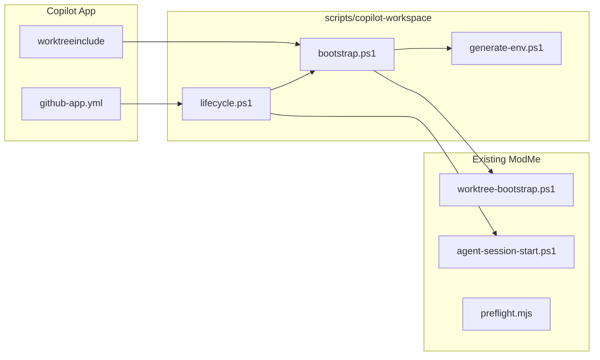

# Copilot Workspace Orchestration

Canonical guide for **GitHub Copilot App** project configuration in ModMe: `.github/github-app.yml`, `.worktreeinclude`, lifecycle scripts, and `COPILOT_*` environment bridging.

Complements:

- [`docs/multi-agent-worktrees.md`](multi-agent-worktrees.md) — Cursor + explicit Git worktrees
- [`docs/agent-terminal-orchestration.md`](agent-terminal-orchestration.md) — session envelopes, mprocs, beads
- [ADR-0012](architecture/decisions/0012-agent-gateway-mcp-routing.md) — Agent Gateway layer

---

## Architecture

| Layer               | Mechanism                                                | Who                               |
| ------------------- | -------------------------------------------------------- | --------------------------------- |
| **Copilot App**     | `.github/github-app.yml` + `.worktreeinclude`            | GitHub Copilot desktop workspaces |
| **Copilot CLI**     | `.github/hooks/hooks.json`                               | VS Code / CLI session hooks       |
| **ModMe bootstrap** | `scripts/copilot-workspace/*` → `worktree-bootstrap.ps1` | Shared with Cursor setup          |



---

## Repository files

| File                                                          | Purpose                                                                                  |
| ------------------------------------------------------------- | ---------------------------------------------------------------------------------------- |
| [`.github/github-app.yml`](../.github/github-app.yml)         | Trust config: automation, branch prefix, system-prompt includes, lifecycle + Run scripts |
| [`.worktreeinclude`](../.worktreeinclude)                     | Copy gitignored `.env`, lockfiles, `.yarn/` into new Copilot worktrees                   |
| [`scripts/copilot-workspace/`](../scripts/copilot-workspace/) | `session.create` / `session.archive` implementation                                      |
| [`.copilot/workspace.generated.env`](../.copilot/)            | Generated ModMe env (gitignored)                                                         |

---

## COPILOT\_\* environment variables

Injected by Copilot App into lifecycle and Run scripts:

| Variable                 | ModMe usage                                                 |
| ------------------------ | ----------------------------------------------------------- |
| `COPILOT_SCRIPT_TRIGGER` | `session.create` or `session.archive` — see `lifecycle.ps1` |
| `COPILOT_WORKSPACE_NAME` | `agent-session-start -TaskTitle`                            |
| `COPILOT_WORKSPACE_PATH` | Worktree root (current workspace)                           |
| `COPILOT_ROOT_PATH`      | Main repo checkout — env/lockfile source                    |
| `COPILOT_DEFAULT_BRANCH` | PR base hint; ModMe uses `dev` when unset or `main`         |
| `COPILOT_PORT`           | Port seed; mapped to `FORGE_APP_PORT` in generated env      |

Generated file `.copilot/workspace.generated.env` also includes `.worktree-ports.env` values after `worktree-allocate-ports.ps1`.

---

## Lifecycle

### session.create

1. `lifecycle.ps1` → `bootstrap.ps1`
2. `generate-env.ps1` + `Invoke-WorktreeBootstrap -SharedDeps -SkipSession` (from `scripts/lib/worktree-bootstrap.ps1`)
   - **KM soft bootstrap always runs** inside `Invoke-WorktreeBootstrap` even when `-SkipSession` (unless `-SkipKm`)
3. **Builder pipeline** — `run-builders.ps1` → SWC ensure, Vite verify, Dolt status (optional)
4. `session-start.ps1` → `yarn agent:session:start -BootstrapIntelligence -SkipBeads` (KM again, idempotent)
5. Log: `logs/copilot/workspace-lifecycle.jsonl`

### session.archive

1. `yarn preflight:fast`
2. `worktree-session-end.ps1 -SkipFinish` (close envelope, no commit)
3. Log archive event

### Manual Run scripts (from github-app.yml)

| Script               | Command                                            |
| -------------------- | -------------------------------------------------- |
| bootstrap            | `scripts/copilot-workspace/bootstrap.ps1`          |
| preflight:fast       | `yarn preflight:fast`                              |
| preflight:env        | `yarn preflight:env`                               |
| preflight:copilot    | `yarn preflight:copilot`                           |
| dev:forge:core       | `yarn dev:forge:core`                              |
| workbench            | GenerativeUI web-dashboard + agent-server commands |
| builders:ensure      | `node scripts/builders-orchestrator.mjs ensure`    |
| builders:build       | SWC transpile + Vite production build              |
| builders:vite:dev    | Vite dev server (`vibe-web-app`)                   |
| builders:dolt:status | Dolt catalog CMS eval status                       |

---

## Builder orchestration (SWC · Vite · Dolt)

Manifest: [`scripts/builders.manifest.json`](../scripts/builders.manifest.json)  
Orchestrator: [`scripts/builders-orchestrator.mjs`](../scripts/builders-orchestrator.mjs)

| Builder  | Role                                                              | Docs                                                 |
| -------- | ----------------------------------------------------------------- | ---------------------------------------------------- |
| **SWC**  | Fast transpile smoke (`@swc/cli` + `@swc/core` prebuilt binaries) | [swc.rs](https://swc.rs/#download-prebuilt-binaries) |
| **Vite** | Dev server + production build for `vibe-web-app`                  | [vitejs/vite](https://github.com/vitejs/vite)        |
| **Dolt** | Optional catalog CMS branch eval (`config/dolt/catalog/`)         | [dolthub/dolt](https://github.com/dolthub/dolt)      |

```powershell
yarn builders                    # list builders + pipelines
yarn builders:ensure             # install/verify SWC root deps
yarn builders:build              # SWC smoke + vite build
yarn builders:vite:dev           # Vite dev (uses VIBE_WEB_PORT)
yarn builders:dolt:status        # catalog eval status (optional)
yarn builders:pipeline           # copilot-session-create pipeline
yarn preflight:builders
```

Pipelines:

- `copilot-session-create` — runs on workspace bootstrap
- `preflight-builders` — CI smoke (SWC verify + build, Vite verify)
- `catalog-cms-eval` — Dolt verify + catalog status ([ADR-0010](architecture/decisions/0010-dolt-catalog-cms-evaluation.md))

---

## Trust review

On first open, Copilot App prompts to **trust** `.github/github-app.yml` before applying scripts or system-prompt includes. Review in **Project Settings → Repository configuration**.

Branch prefix: `feature/copilot/`

---

## Copilot CLI hooks

[`.github/hooks/hooks.json`](../.github/hooks/hooks.json):

- `sessionStart` / `sessionEnd` → same `lifecycle.ps1` with `COPILOT_SCRIPT_TRIGGER` set
- `preToolUse` / `postToolUse` → `scripts/resolve-lean-ctx-hook.mjs` (portable lean-ctx)

---

## Cloud agent setup

[`.github/workflows/copilot-setup-steps.yml`](../.github/workflows/copilot-setup-steps.yml) runs `generate-env.mjs`, `yarn lean-ctx:ensure`, and `yarn preflight:env` on Linux agents.

---

## Verification

```powershell
yarn preflight:copilot
yarn preflight:builders
yarn preflight:worktree
yarn docs:clipper:export --list
```

Import Obsidian templates from `templates/obsidian-clipper/*.json`.

---

## Cursor vs Copilot

|                   | Cursor Agents Window                 | Copilot App                       |
| ----------------- | ------------------------------------ | --------------------------------- |
| Config            | `.cursor/worktrees.json`             | `.github/github-app.yml`          |
| Ignored file copy | `worktree-copy-env.ps1`              | `.worktreeinclude`                |
| Bootstrap         | `setup-worktree-windows.ps1`         | `copilot-workspace/bootstrap.ps1` |
| Shared core       | `scripts/lib/worktree-bootstrap.ps1` | same                              |

Never implement feature work in the main checkout — use `.worktrees/` per [`multi-agent-worktrees.md`](multi-agent-worktrees.md).
