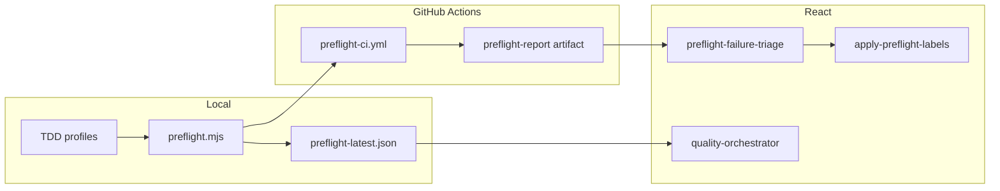

# ModMe Quality Loop

DevOps infinity loop: **TDD → preflight → CI artifact → gh-aw triage → quality orchestrator → agents**.

## Architecture



## Local workflow

1. **Env smoke:** `yarn preflight:env`
2. **Iterate:** `yarn preflight:fast` (writes `docs/devops/reports/preflight-latest.json` when using `--report` scripts)
3. **TDD phase:**
   ```powershell
   yarn preflight:tdd-red -- --test scripts/__tests__/my.test.mjs
   yarn preflight:tdd-green -- --test scripts/__tests__/my.test.mjs
   yarn preflight:tdd-refactor -- --test scripts/__tests__/my.test.mjs
   ```
4. **Full gate:** `yarn preflight` or `yarn preflight:report`
5. **Route failures:** `yarn quality:route --from docs/devops/reports/preflight-latest.json`

## CI

| Workflow | Purpose |
|----------|---------|
| `.github/workflows/preflight-ci.yml` | PR/push preflight + artifact upload |
| `.github/workflows/pre-commit-check.yml` | Delegates to `preflight:ci` via pre-commit-checks |

Artifact name: `preflight-report`  
Schema: `docs/devops/preflight-report.schema.json`

## gh-aw Copilot workflows

| Workflow | Trigger | Action |
|----------|---------|--------|
| `preflight-failure-triage.md` | Preflight CI failed | PR comment + labels |
| `pr-preflight-review.md` | PR synchronize + green | Review checklist |
| `tdd-issue-bootstrap.md` | Issue labeled `tdd` | Red-phase checklist |

Compile in WSL or CI (ADR-0010). Native Windows: skip local `gh aw compile`.

## Labels

`scripts/apply-preflight-labels.mjs`:

```powershell
node scripts/apply-preflight-labels.mjs --report docs/devops/reports/preflight-latest.json --pr 123
```

Labels: `ci:passed|ci:failed`, `failure:<class>`, `stack:forge|stack:generative`, `needs-triage`

PR path labels (`.github/labeler.yml`): `next-forge`, `generative-ui`, `preflight`

## Quality orchestrator

Manifest: `scripts/quality-orchestrator.manifest.json`  
Skills roster: `scripts/quality-skills-roster.json`

```powershell
yarn quality:route --from docs/devops/reports/preflight-latest.json
yarn quality:route --pr 123 --runtime cursor
yarn quality:route --pr 123 --runtime tmux   # WSL + agent-manager
```

Skills:
- `.agents/skills/modme-preflight/SKILL.md`
- `.agents/skills/modme-quality-orchestrator/SKILL.md`
- `.agents/skills/modme-tdd/SKILL.md`

## failureClass enum

`env | lint | unit-test | build | boundary | guard | infra`

Mapped per step in `scripts/lib/preflight-report.mjs`.

## Monorepo boundaries

- Orchestrator invokes next-forge via `scripts/lib/run-forge.mjs`
- GenerativeUI via separate yarn cwd — never merged stacks
- Reports are gitignored under `docs/devops/reports/`

## Verification checklist

1. `yarn inbox:test` — green including load-modme-env isolation
2. `yarn preflight:env` — env stage passes
3. `yarn preflight:fast --report` — reaches forge lint + test
4. `yarn preflight:forge` — check + test + build + boundaries
5. PR triggers `preflight-ci.yml` artifact
6. `yarn quality:route --from docs/devops/reports/preflight-latest.json`
