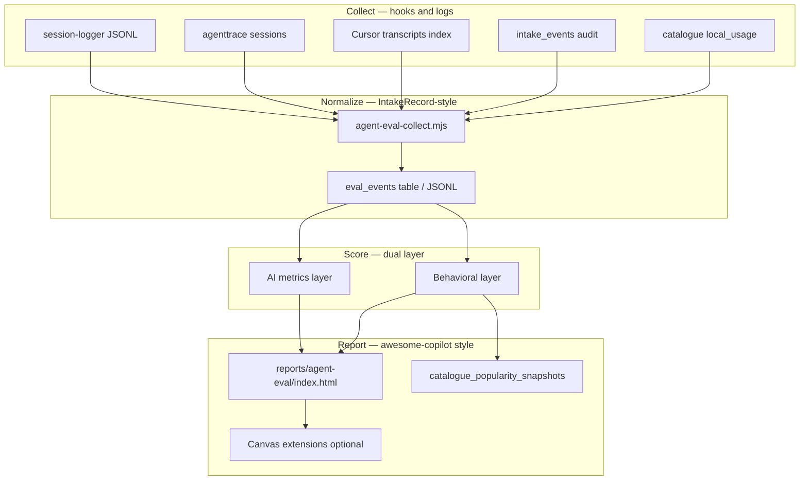

# Agent Evaluation & Behavioral Insight Pipeline

Architecture for ModMe's evaluation stack: **awesome-copilot collection patterns** (plugins, hooks, canvas reports) + **skillsh-style popularity** + **UniversalWorkbench `@behavior` metrics**, fed by `session-logger`, agenttrace, and transcript mining.

## Context analysis (System Architecture Reviewer)

| Dimension | ModMe profile |
|-----------|---------------|
| System type | AI/agent platform — multi-agent worktrees, catalogue, inbox funnel |
| Complexity | Growing (dual monorepo, Supabase pipelines, parallel agents) |
| Primary concerns | Reliability of orchestrators, behavioral consistency, observability without 3AM surprises |
| Framework focus | **Reliability** (non-deterministic agents, fallback agents), **Operational Excellence** (session logs, eval regression), **Security** (local-only logs, no secrets in eval JSON) |

### Constraints (clarified from repo)

- **Scale:** Developer-team scale; not multi-tenant SaaS yet — batch/offline eval over real-time streaming.
- **Team:** Power users on Cursor + Copilot; eval CLI must be agent-native (JSON default).
- **Budget:** Local-first (`logs/copilot/`, agenttrace, Supabase optional) before paid observability.

## Reference: awesome-copilot vs skillsh

### awesome-copilot AGENTS.md (upstream model)

Community catalogue with **six resource types** wired by CI:

| Type | Role | ModMe analogue |
|------|------|----------------|
| Agents | `.agent.md` + tools/model | `.github/agents/`, `catalogue_items` type=agent |
| Instructions | `applyTo` globs | `.github/instructions/`, `.cursor/rules/` |
| Skills | `SKILL.md` + bundled assets | `.agents/skills/`, catalogue type=skill |
| Hooks | `hooks.json` + README | `.github/hooks/session-logger`, `.cursor/hooks/` |
| Workflows | gh-aw agentic workflows | `.github/workflows/*-orchestrator.yml` |
| Plugins | `plugin.json` collections | `catalogue_collections` + awesome-copilot plugins |

**Build loop:** `npm run build` → README + marketplace.json. **External plugins:** issue-driven intake with quality gates (`/rerun-intake`, `/approve`).

ModMe should mirror **collections + manifest** (not skillsh install-only UX) and **hook-driven telemetry** (not skillsh rank-only API).

### skillsh patterns to adopt (selective)

| skillsh concept | ModMe adoption |
|-----------------|----------------|
| `popular` + timeframe | `catalogue_popularity_snapshots`, `GET /catalogue?action=popular` |
| Rank score composite | `popularity.score` = weighted(installs, skills_sh_rank, **local_usage**, **behavioral_score**) |
| Search + details + install | Already on catalogue API |

**Do not** copy skillsh as primary UX — use awesome-copilot **plugin/collection** semantics and **AgentRC measure→generate→maintain** for readiness reports.

## awesome-copilot extension & skill patterns (canvas + reports)

### Extensions (behavioral / insight canvases)

| Extension | Pattern | ModMe eval use |
|-----------|---------|----------------|
| **feedback-themes** | Signals → theme groups → impact sort → SSE `/events` + `/api/state` | Cluster session friction signals (retries, user corrections, hook failures) into themes |
| **gesture-review** | Human decision capture (approve/reject) on PR queue | Capture explicit human overrides on agent suggestions |
| **where-was-i** | Git + gh context bundle on interrupt | Resume packet after agent handoff / worktree switch |

Shared traits: `@github/copilot-sdk/extension`, in-memory + optional file persistence, JSON state for canvas rendering.

### ACReadiness workflow (report agents)

| Skill | Loop step | Output |
|-------|-----------|--------|
| `acquire-codebase-knowledge` | Discover | 7 evidence-backed docs in `docs/codebase/` |
| `acreadiness-generate-instructions` | Generate | `.github/copilot-instructions.md` + scoped `.instructions.md` |
| `ai-readiness-reporter` agent | Measure | Self-contained `reports/index.html` from AgentRC JSON |

ModMe eval pipeline **Measure** step should emit the same class of artifact: static HTML or Cursor canvas JSON, not only Supabase rows.

## Target architecture



### Layer 1 — AI metrics (agent-evaluation skill)

Standard agent eval dimensions with statistical handling (min 5–10 runs for flaky LLM behavior):

| Metric | Source | Contract |
|--------|--------|----------|
| Pass rate + CI | Behavioural test suite | `passRate >= 0.8`, confidence interval |
| Latency p95 | agenttrace | Alert if > baseline × 2 |
| Token/cost | agenttrace | Per-session anomaly |
| Tool error rate | agenttrace + transcripts | Retry loops |
| Regression | Baseline snapshot vs HEAD | Block deploy if pass rate drops >5% |

### Layer 2 — Behavioral metrics (ModMe-specific)

Map to UniversalWorkbench `@behavior DOMAIN.ENTITY.OPERATION` and catalogue `taxonomy_code`:

| Signal | Detection | Catalogue field |
|--------|-----------|-----------------|
| User correction | Same file re-edited after agent commit; prompt "no/not/finstead" | `metadata.behavioral.correction_rate` |
| Plan adherence | User said "don't edit plan"; agent edited plan file | Contract violation (critical) |
| Worktree discipline | Edits on main checkout during parallel agent work | `metadata.behavioral.boundary_violations` |
| Inbox capture | Session produced architecture decision but no inbox drop | `metadata.behavioral.capture_compliance` |
| Orchestrator health | `intake_events` failed/skipped | Pipeline reliability score |
| Session continuity | where-was-i-style context completeness | `metadata.behavioral.interrupt_recovery` |
| Human override | gesture-review-style explicit reject | `metadata.behavioral.override_rate` |

**Behavioral contracts** (must / must-not) live in `docs/evaluation/contracts/*.yaml` and are tested offline against transcript + log replay — not live LLM calls.

### Popularity composite (collections + rank)

Extend existing catalogue popularity JSON:

```json
{
  "score": 0.82,
  "sources": {
    "skills_sh_rank": null,
    "installs": 0,
    "local_usage": 0.65,
    "behavioral_score": 0.91,
    "eval_pass_rate": 0.88
  },
  "timeframe": "30d"
}
```

Weekly job: `scripts/catalogue-popularity-sync.mjs` merges agenttrace local usage + eval scores into `catalogue_popularity_snapshots`.

## CLI contract (ai-native-cli Phase 1)

New script: `scripts/agent-eval-report.mjs` — **Agent-Friendly** core:

```bash
# Default: JSON to stdout
node scripts/agent-eval-report.mjs --since=7d

# Human tables
node scripts/agent-eval-report.mjs --since=7d --human

# Preview writes
node scripts/agent-eval-report.mjs --dry-run

# Emit static report (awesome-copilot / AgentRC pattern)
node scripts/agent-eval-report.mjs --output=reports/agent-eval/index.html
```

| Exit code | Meaning |
|-----------|---------|
| 0 | Success |
| 1 | Eval run failed |
| 2 | Bad args / missing inputs |

Stdout: `{ "result": { "sessions", "metrics", "behavioral", "themes" }, ... }`  
Stderr: structured errors `{ "error": true, "code", "message", "suggestion" }`

Inputs (fail-closed if missing when required):

- `logs/copilot/session.log`, `prompts.log` (session-logger)
- Optional: agenttrace export path via `--agenttrace=`
- Optional: Supabase for `intake_events` / catalogue usage

## Phased delivery

| Phase | Deliverable | Depends on |
|-------|-------------|------------|
| **0** | `.cursorignore` negation for `.vendor/awesome-copilot-main` | Done |
| **1** | `agent-eval-collect.mjs` — themes + signals + resume packet | Done (stub contracts) |
| **2** | Contract YAML replay (git + transcript detectors) | Phase 1 |
| **3** | HTML report + acceptance state machine | [`ORCHESTRATION.md`](ORCHESTRATION.md) |
| **4** | Supabase `006_eval_pipeline.sql` + popularity sync | Migration apply |
| **5** | Canvas extension (feedback-themes clone) + optional LLM judge | Copilot SDK |

## Parallel agent orchestration

See **[`ORCHESTRATION.md`](ORCHESTRATION.md)** for role matrix, acceptance-orchestrator states, workbench verify phase, and synthesis template.

Copy **`goal-contract.template.yaml`** → `goal-contract.yaml` before eval sprint work.

## session-logger upgrades (Phase 1 prerequisite)

Current logger tracks UniversalWorkbench docs only. Extend `config.json`:

```json
{
  "trackedFiles": ["..."],
  "events": ["sessionStart", "sessionEnd", "prompt", "toolCall", "userCorrection", "hookFire"],
  "emitFields": ["agent", "worktree", "branch", "catalogue_item_id"]
}
```

Wire Cursor/Copilot hooks to call `session-logger.ps1 prompt` and new `event` action for behavioral signals.

## ADR candidates

| ADR | Decision |
|-----|----------|
| Eval storage | JSONL local + optional Supabase `eval_events` (mirror `intake_events`) |
| Report format | Static HTML primary; canvas extensions secondary |
| Behavioral source of truth | Transcript replay + session-logger, not live model judging |
| Popularity | Composite score; never rank on installs alone |

## Bounded parallel agent lifecycle

**Accepted:** [ADR-0012 — Bounded parallel agent lifecycle (Gas City pattern)](../../next-forge/docs/adr/0012-bounded-parallel-agent-lifecycle.md)

Thermo-nuclear review teams use plan → execute waves → serial commit. Wave 1 publishes `docs/workflows/reports/manifest.json` before wave-2 thermo reviewers. Runbook: [`docs/workflows/thermo-nuclear-dual-monorepo-review.md`](../workflows/thermo-nuclear-dual-monorepo-review.md).

## Related paths

- Orchestration: [`docs/evaluation/ORCHESTRATION.md`](ORCHESTRATION.md)
- Contracts: [`docs/evaluation/contracts/`](contracts/)
- Migration: [`next-forge/supabase/migrations/006_eval_pipeline.sql`](../next-forge/supabase/migrations/006_eval_pipeline.sql)
- Collect: `scripts/agent-eval-collect.mjs`
- Report: `scripts/agent-eval-report.mjs`
