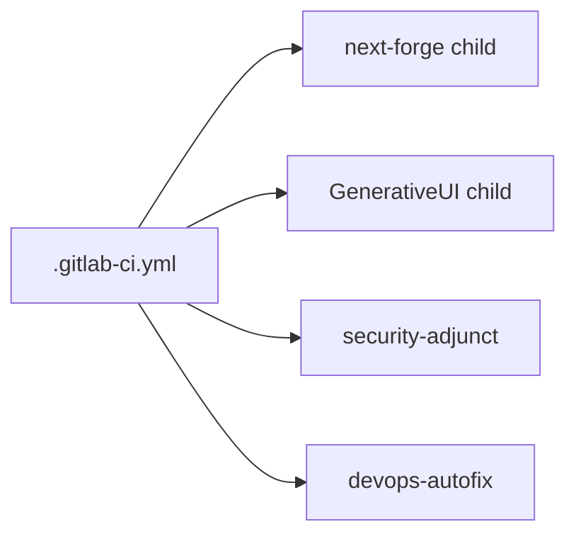

# GitLab setup (ModMe mirror + hybrid Auto DevOps)

GitHub is the **canonical** source (`Ditto190/modme-ui-01`). GitLab is an **active mirror** for Duo/MCP and adjunct CI.

## Prerequisites

- GitLab Premium/Ultimate project (mirror target)
- `glab` CLI ≥ 1.94
- GitHub repo secrets: `GITLAB_TOKEN`, `GITLAB_MIRROR_URL`

## One-time project configuration

### CI/CD — keep Auto DevOps UI off

Per [Auto DevOps docs](https://docs.gitlab.com/topics/autodevops/): a committed `.gitlab-ci.yml` **takes precedence** over the UI toggle.

1. **Settings → CI/CD → Auto DevOps** — leave **Default to Auto DevOps pipeline** **unchecked**
2. Pipelines run from [`.gitlab-ci.yml`](../.gitlab-ci.yml) (parent router + child pipelines + security adjunct)

### Merge requests (optional, GitLab MRs only)

If you use GitLab MRs on the mirror (adjunct to GitHub PRs):

| Setting                      | Location                                 | Recommendation                                                                                        |
| ---------------------------- | ---------------------------------------- | ----------------------------------------------------------------------------------------------------- |
| Pipelines must succeed       | Settings → Merge requests → Merge checks | On                                                                                                    |
| Skipped pipelines successful | Same                                     | On if using path-filtered children                                                                    |
| Auto-merge                   | Per MR → **Set to auto-merge**           | When mirror pipeline passes — [docs](https://docs.gitlab.com/user/project/merge_requests/auto_merge/) |

GitHub PRs remain the merge authority; use `gh pr create --base dev`.

### Container registry

**Settings → General → Visibility** — enable Container Registry (future deploy; not used in hybrid rollout).

### Labels

```powershell
yarn gitlab:labels:sync
```

Source: [`.gitlab/labels.yml`](../.gitlab/labels.yml). Key labels: `devops-autofix`, `stack:forge`, `stack:generative`, `agent:review`.

## Local environment

Add to root `.env` (gitignored):

```env
GITLAB_PROJECT_ID=12345678
GITLAB_TOKEN=glpat-...
GITLAB_GROUP=your-group
```

Verify:

```powershell
yarn gitlab:doctor
glab auth status
```

## Mirror sync

**Automated (recommended):** push to `dev` or `main` on GitHub → [`.github/workflows/gitlab-mirror.yml`](../.github/workflows/gitlab-mirror.yml)

**Manual:**

```powershell
git remote add gitlab https://gitlab.com/your-group/modme-ui-01.git
.\scripts\sync-gitlab-mirror.ps1 -Branch dev
```

## Pipeline architecture



- **Child pipelines** run only when paths change (`next-forge/**`, `GenerativeUI_monorepo/**`)
- **Security** — SAST, secret detection, dependency scanning (artifacts; Ultimate for MR widget)
- **Deploy/review** — disabled (`REVIEW_DISABLED`, `DAST_DISABLED`); no Kubernetes in this phase

Reference copy of upstream Auto DevOps: [`.gitlab/autodev-reference.yml`](../.gitlab/autodev-reference.yml)

## Duo autofix

On CI failure:

1. GitHub SoR issue with `devops-autofix` label
2. GitLab mirror issue with `github_sor: <url>` in description
3. Duo **Fix CI/CD Pipeline Flow** — [docs](https://docs.gitlab.com/user/duo_agent_platform/flows/foundational_flows/fix_pipeline/)
4. Template: [`.gitlab/issue_templates/DevOps_Autofix.md`](../.gitlab/issue_templates/DevOps_Autofix.md)

## GitLab Workspaces (deferred)

[Remote development workspaces](https://docs.gitlab.com/user/workspace/configuration/) require Kubernetes + GitLab Agent. Not part of hybrid CI rollout. Revisit when a cluster is available.

## Agent commands

```powershell
yarn gitlab:doctor
yarn gitlab:labels:sync
node scripts/lib/gitlab-pipeline-status.mjs
```

Skill: [`.agents/skills/gitlab-starter/SKILL.md`](../.agents/skills/gitlab-starter/SKILL.md)

## Troubleshooting

| Symptom                        | Fix                                                       |
| ------------------------------ | --------------------------------------------------------- |
| No GitLab pipeline after push  | Check GitHub `GITLAB_TOKEN` / `GITLAB_MIRROR_URL` secrets |
| Child pipeline skipped         | Path filter — only changed stack runs                     |
| SAST jobs missing              | Premium license; check `SAST_DISABLED` not set            |
| `glab` 401                     | `glab auth login` or refresh PAT                          |
| Auto DevOps buildpack conflict | Do not enable UI Auto DevOps; use parent router           |

See also: [`docs/repo-alignment.md`](repo-alignment.md)
