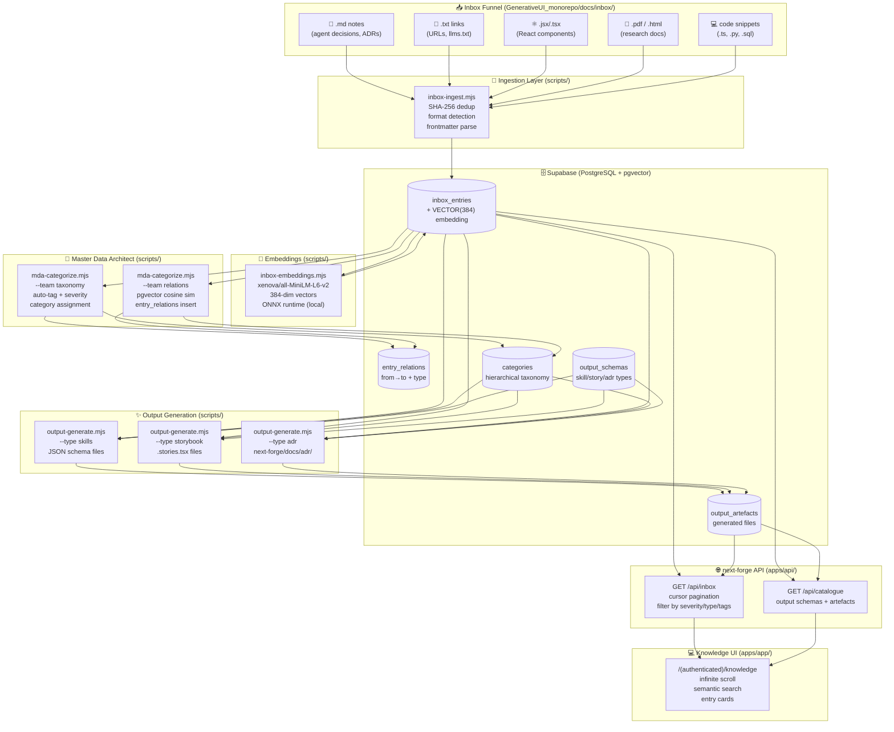
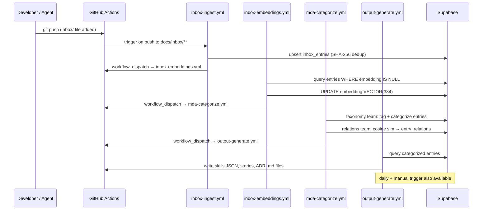
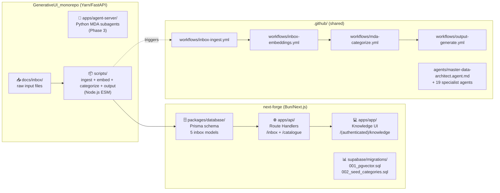
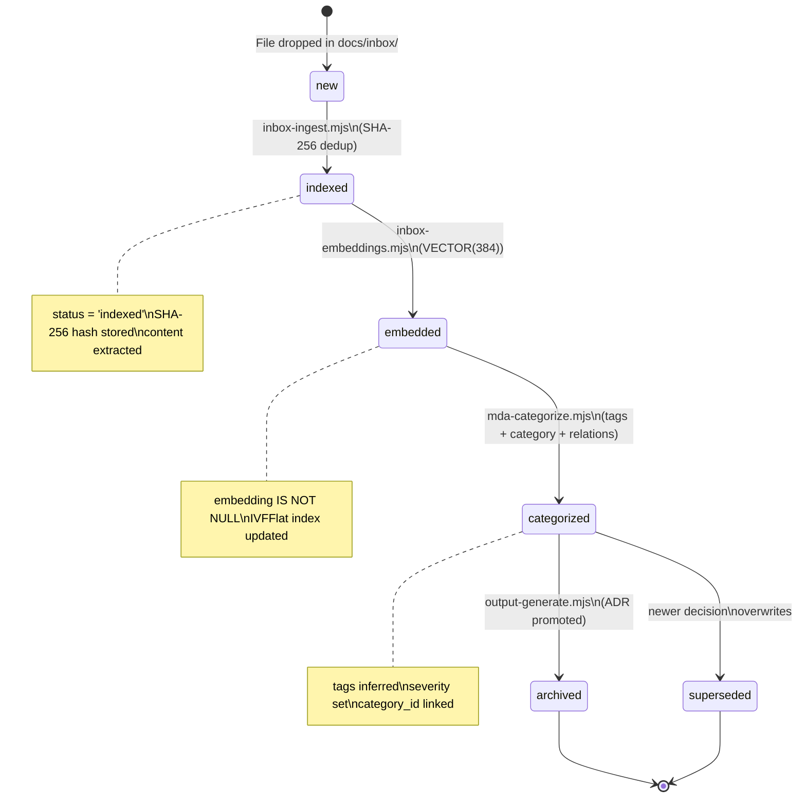
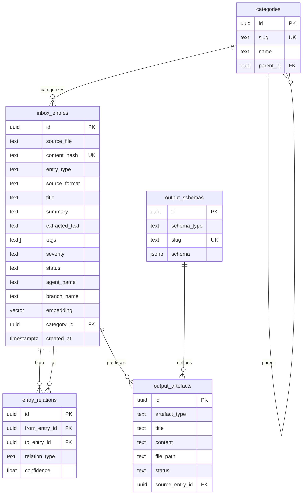

<!--
  @feature INBOX.PIPELINE.FOUNDATION
  @domain INBOX
  @entity PIPELINE
  @operation FOUNDATION
  @layer AGENT
  @dependencies [DB.SCHEMA.INBOX_ENTRIES, DB.SCHEMA.CATEGORIES, API.INBOX.LIST, API.CATALOGUE.LIST, UI.KNOWLEDGE.SEARCH]
  @implements
    - Multi-format inbox funnel (md, txt, jsx, pdf, links, snippets)
    - SHA-256 dedup via Supabase content_hash
    - pgvector semantic search (384-dim MiniLM embeddings)
    - MDA taxonomy + relation detection pipeline
    - Output generation (skills JSON, Storybook stories, ADR promotions)
  @agent copilot
  @agent_role architect
  @breadcrumb chore/agent-tooling-and-ci → pipeline/INBOX.PIPELINE.FOUNDATION/2026-06-20
  @created 2026-06-20T14:31:21+10:00
-->

# Inbox → Knowledge Pipeline

**Feature**: `INBOX.PIPELINE.FOUNDATION`  
**Status**: Phase 1 complete — schema live, scripts wired, workflows created  
**Branch**: `chore/agent-tooling-and-ci`  
**Monorepos**: next-forge (DB/API/UI) + GenerativeUI_monorepo (inbox/MDA/scripts)  

---

## Architecture Overview



---

## GitHub Actions Pipeline Chain



---

## Feature Taxonomy

All pipeline features follow the `DOMAIN.ENTITY.OPERATION` taxonomy from `UniversalWorkbench/docs/FEATURE-TAXONOMY.md`.

| Feature ID | Domain | Layer | File | Description |
|------------|--------|-------|------|-------------|
| `INBOX.ENTRY.INGEST` | INBOX | AGENT | `scripts/inbox-ingest.mjs` | SHA-256 dedup, format detection, Supabase upsert |
| `INBOX.ENTRY.EMBED` | INBOX | AGENT | `scripts/inbox-embeddings.mjs` | Generate 384-dim MiniLM vectors |
| `INBOX.ENTRY.CATEGORIZE` | INBOX | AGENT | `scripts/mda-categorize.mjs --team taxonomy` | Auto-tag, severity, category assignment |
| `INBOX.ENTRY.RELATE` | INBOX | AGENT | `scripts/mda-categorize.mjs --team relations` | Cosine similarity → `entry_relations` |
| `INBOX.ARTEFACT.GENERATE.SKILLS` | INBOX | AGENT | `scripts/output-generate.mjs --type skills` | Skill JSON schemas |
| `INBOX.ARTEFACT.GENERATE.STORYBOOK` | INBOX | AGENT | `scripts/output-generate.mjs --type storybook` | `.stories.tsx` generation |
| `INBOX.ARTEFACT.GENERATE.ADR` | INBOX | AGENT | `scripts/output-generate.mjs --type adr` | ADR promotion to `next-forge/docs/adr/` |
| `DB.SCHEMA.INBOX_ENTRIES` | DB | DB | `next-forge/packages/database/prisma/schema.prisma` | InboxEntry Prisma model |
| `DB.SCHEMA.CATEGORIES` | DB | DB | `next-forge/supabase/migrations/002_seed_categories.sql` | 19-category taxonomy tree |
| `DB.SCHEMA.PGVECTOR` | DB | DB | `next-forge/supabase/migrations/001_inbox_pipeline_pgvector.sql` | pgvector ext, IVFFlat index, `match_inbox_entries()` |
| `API.INBOX.LIST` | API | API | `next-forge/apps/api/app/inbox/route.ts` | GET with filters + cursor pagination |
| `API.CATALOGUE.LIST` | API | API | `next-forge/apps/api/app/catalogue/route.ts` | GET output schemas + artefacts |
| `UI.KNOWLEDGE.SEARCH` | UI | UI | `next-forge/apps/app/app/(authenticated)/knowledge/` | Knowledge browser with infinite scroll |
| `AGENT.MDA.ORCHESTRATE` | AGENT | AGENT | `.github/agents/master-data-architect.agent.md` | MDA orchestrator agent definition |

---

## Monorepo Split

The pipeline is intentionally split across both monorepos following each one's established patterns:



---

## Entry Lifecycle



---

## Directory Structure

```
Monorepo_ModMe/
│
├── docs/inbox-pipeline/
│   └── README.md                          ← YOU ARE HERE
│
├── GenerativeUI_monorepo/
│   └── docs/
│       └── inbox/
│           ├── README.md                  ← Inbox user guide + capture protocol
│           └── _index.json               ← Auto-updated manifest (SHA-256 + metadata)
│
├── scripts/                               ← Node.js ESM pipeline scripts
│   ├── inbox-ingest.mjs                  ← @feature INBOX.ENTRY.INGEST
│   ├── inbox-embeddings.mjs              ← @feature INBOX.ENTRY.EMBED
│   ├── mda-categorize.mjs                ← @feature INBOX.ENTRY.CATEGORIZE + RELATE
│   └── output-generate.mjs              ← @feature INBOX.ARTEFACT.GENERATE.*
│
├── .github/
│   ├── agents/
│   │   ├── master-data-architect.agent.md ← @feature AGENT.MDA.ORCHESTRATE
│   │   └── [19 specialist agents...]
│   └── workflows/
│       ├── inbox-ingest.yml              ← trigger: push to docs/inbox/**
│       ├── inbox-embeddings.yml          ← trigger: after ingest
│       ├── mda-categorize.yml            ← trigger: after embeddings
│       └── output-generate.yml          ← trigger: daily + after categorize
│
└── next-forge/
    ├── packages/database/
    │   └── prisma/schema.prisma          ← @feature DB.SCHEMA.INBOX_ENTRIES
    │       Models: InboxEntry, EntryRelation,
    │               Category, OutputSchema, OutputArtefact
    ├── supabase/migrations/
    │   ├── 001_inbox_pipeline_pgvector.sql  ← pgvector, IVFFlat, match_inbox_entries()
    │   └── 002_seed_categories.sql          ← 19 taxonomy categories
    ├── apps/api/app/
    │   ├── inbox/route.ts                ← @feature API.INBOX.LIST
    │   └── catalogue/route.ts            ← @feature API.CATALOGUE.LIST
    └── apps/app/app/(authenticated)/
        └── knowledge/
            ├── page.tsx                  ← @feature UI.KNOWLEDGE.SEARCH
            ├── components/
            │   ├── inbox-search.tsx       ← filters + infinite scroll
            │   └── entry-card.tsx         ← entry display + severity badge
            └── hooks/
                └── use-inbox-entries.ts  ← TanStack useInfiniteQuery
```

---

## Supabase Schema



---

## Required Environment Variables

| Variable | Used By | Purpose |
|----------|---------|---------|
| `NEXT_PUBLIC_SUPABASE_URL` | All scripts + Next.js | Supabase project URL |
| `SUPABASE_SERVICE_ROLE_KEY` | All scripts (write) | Service role key (NOT anon) |
| `NEXT_PUBLIC_SUPABASE_ANON_KEY` | Next.js client | Anon key for browser reads |

Set in `.env.local` (next-forge) and as GitHub Actions secrets.

---

## Running the Pipeline Manually

```bash
# 1. Ingest new inbox files
node scripts/inbox-ingest.mjs

# 2. Generate embeddings
node scripts/inbox-embeddings.mjs

# 3. Classify + relate
node scripts/mda-categorize.mjs --team taxonomy
node scripts/mda-categorize.mjs --team relations

# 4. Generate outputs
node scripts/output-generate.mjs --type skills
node scripts/output-generate.mjs --type storybook
node scripts/output-generate.mjs --type adr

# Or run full pipeline end-to-end
node scripts/inbox-ingest.mjs && \
node scripts/inbox-embeddings.mjs && \
node scripts/mda-categorize.mjs --team all && \
node scripts/output-generate.mjs --type all

# Dry-run (no writes)
node scripts/inbox-ingest.mjs --dry-run
node scripts/mda-categorize.mjs --team all --dry-run
node scripts/output-generate.mjs --type all --dry-run
```

---

## Agent Capture Protocol (Breadcrumb Trail)

All agents working in this codebase should drop inbox notes following this protocol:

```bash
# Drop a decision note (replace values)
cat > GenerativeUI_monorepo/docs/inbox/$(date -u +%Y-%m-%dT%H-%M-%S)_architecture_${AGENT_ROLE}_my-decision.md << 'EOF'
---
timestamp: $(date -u +%Y-%m-%dT%H:%M:%SZ)
agent: copilot
agent_role: architect
type: architecture
severity: high
tags: [decision, adr-candidate]
branch: chore/agent-tooling-and-ci
---

## Decision

[What was decided]

## Rationale

[Why]

## Trade-offs

[What was considered]
EOF
```

---

## Implementation History (Breadcrumb Trail)

| Git Tag | Feature ID | Phase | Date | Description |
|---------|-----------|-------|------|-------------|
| `pipeline/INBOX.PIPELINE.FOUNDATION/2026-06-20` | `INBOX.PIPELINE.FOUNDATION` | Phase 1 | 2026-06-20 | Foundation: schema, scripts, workflows, agents, UI |

### Phase 1 Completed (2026-06-20)

- ✅ 19 agents installed in `.github/agents/`
- ✅ Inbox funnel: `GenerativeUI_monorepo/docs/inbox/` with README + `_index.json`
- ✅ `scripts/inbox-ingest.mjs` — SHA-256 dedup, format detection, Supabase upsert
- ✅ `scripts/inbox-embeddings.mjs` — 384-dim MiniLM embeddings (ONNX local)
- ✅ `scripts/mda-categorize.mjs` — taxonomy + relations teams
- ✅ `scripts/output-generate.mjs` — skills, storybook, ADR generation
- ✅ 4 GitHub Actions workflows wired in chain
- ✅ Prisma schema: 5 inbox pipeline models
- ✅ Supabase migrations: pgvector, IVFFlat index, RLS policies, semantic search function
- ✅ 19 taxonomy categories seeded
- ✅ API routes: `GET /api/inbox` + `GET /api/catalogue`
- ✅ Knowledge UI: page + search + entry card + TanStack infinite scroll hook
- ✅ MDA agent definition: `master-data-architect.agent.md`
- ✅ AGENTS.md updated in 3 locations with inbox capture protocol

### Phase 2 Planned

- [ ] Python MDA subagents in `apps/agent-server/src/agents/`
- [ ] TypeScript workflows in `UniversalWorkbench/apps/agent/src/`
- [ ] `@xenova/transformers` npm install for live embeddings
- [ ] Test ingest against existing inbox files

### Phase 3 Planned

- [ ] Full MDA agent team: taxonomy lead + 4 specialist subagents
- [ ] Relation graph visualization in Knowledge UI
- [ ] Webhook trigger for cross-monorepo events

### Phase 4 Planned

- [ ] Storybook story generation from real JSX components
- [ ] Skills catalogue loader (on-demand schema reconstruction)
- [ ] GenerativeUI → next-forge migration tracking via inbox

---

## Related Docs

- [`GenerativeUI_monorepo/docs/inbox/README.md`](../../GenerativeUI_monorepo/docs/inbox/README.md) — Inbox usage guide
- [`AGENTS.md`](../../AGENTS.md) — Root agent instructions + capture protocol
- [`next-forge/AGENTS.md`](../../next-forge/AGENTS.md) — next-forge agent instructions
- [`GenerativeUI_monorepo/AGENTS.md`](../../GenerativeUI_monorepo/AGENTS.md) — GenerativeUI agent instructions
- [`.github/agents/master-data-architect.agent.md`](../../.github/agents/master-data-architect.agent.md) — MDA agent definition
- [`UniversalWorkbench/docs/FEATURE-TAXONOMY.md`](../../GenerativeUI_monorepo/UniversalWorkbench/docs/FEATURE-TAXONOMY.md) — Feature taxonomy system
- [`UniversalWorkbench/.flow/README.md`](../../GenerativeUI_monorepo/UniversalWorkbench/.flow/README.md) — Behavior + VH system
