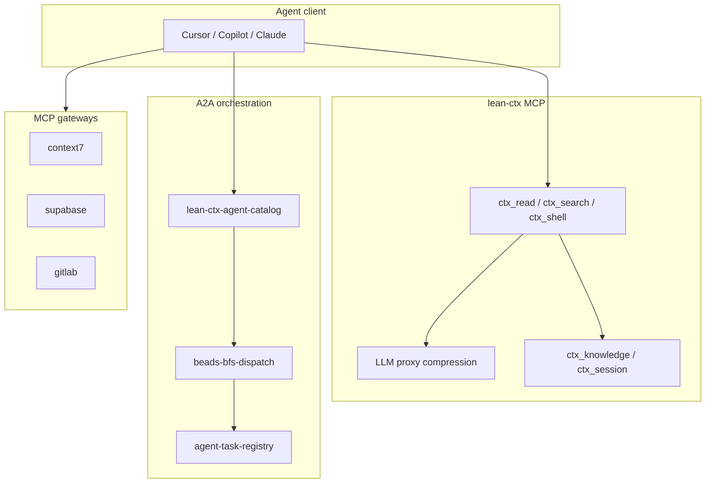

# lean-ctx proxy and protocol stack (ModMe)

ModMe uses three complementary layers for agent I/O. They are **not** interchangeable.

## Stack overview

## Layer 1: lean-ctx MCP + proxy

| Component | Role | When to use |
|-----------|------|-------------|
| **MCP tools** (`ctx_read`, `ctx_search`, `ctx_shell`) | Token-efficient repo access | Always for codebase reads/shell in ModMe |
| **Proxy** (`proxy_enabled=true` in `.lean-ctx.toml`) | Compresses LLM API traffic on the wire | Default on; does not replace MCP |
| **Knowledge** (`ctx_knowledge`, `ctx_session`) | Cross-session facts and continuity | Session start + significant decisions |

**Key lesson:** The proxy shrinks **model API** payloads. MCP tools shrink **repository** context. Use both; neither substitutes for the other.

Project config: `.lean-ctx.toml` `[proxy]` section sets upstream URLs (Anthropic, OpenAI, Gemini). Security-sensitive overrides require `yarn lean-ctx:trust`.

## Layer 2: A2A orchestration (ModMe scripts)

| Script | Role |
|--------|------|
| `scripts/lean-ctx-agent-catalog.mjs` | Seed/validate/resolve agent roles from collections + seed JSON |
| `scripts/beads-bfs-dispatch.mjs` | BFS layers over beads `ready` queue with role/path hints |
| `scripts/lib/agent-task-registry.mjs` | Dedup tasks across parallel agents |

**Key lesson:** A2A here means **agent role routing** (dev/review/test/plan/orchestrator), not the Google A2A wire protocol. Catalog `mcp_gateways` are **hints** for which external MCP server to open—not lean-ctx MCP replacements.

## Layer 3: MCP gateways (external services)

Defined in `scripts/collections/lean-ctx-agent-catalog.seed.json`:

- `context7` → library documentation
- `supabase` → schema/migrations
- `gitlab` → MR/pipeline status

**Key lesson:** Gateways are **opt-in per task**. lean-ctx MCP handles the monorepo; gateways handle external systems. Do not route repo reads through gateways.

## Decision matrix

| Need | Use | Avoid |
|------|-----|-------|
| Read/edit repo files | `ctx_read` + native Edit | Raw Read/Grep when lean-ctx MCP available |
| Run yarn/git in repo | `ctx_shell` / `lean-ctx -c` | Bare Shell (no compression) |
| Shrink Claude/GPT bills | Proxy (`proxy_enabled`) | Disabling proxy for cost (usually worse) |
| Pick agent role for beads issue | `beads:bfs` + catalog `resolve` | Hard-coded role per issue |
| Fetch Next.js docs | context7 gateway MCP | Scraping into inbox for stable APIs |
| Remember worktree policy | `ctx_knowledge remember` + `AGENTS.md` | Chat-only memory |

## CRP mode

CI sets `LEAN_CTX_CRP_MODE=tdd` in the observability lean-ctx job for terse, test-first agent output. Local default may differ; see `docs/lean-ctx/testing-strategy.md`.

## Related

- [lean-ctx-guide.md](../lean-ctx-guide.md) — agent playbook
- [testing-strategy.md](./testing-strategy.md) — bats + vitest matrix
- [data-dictionary.md](./data-dictionary.md) — config keys
